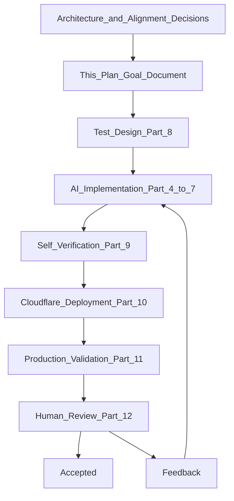
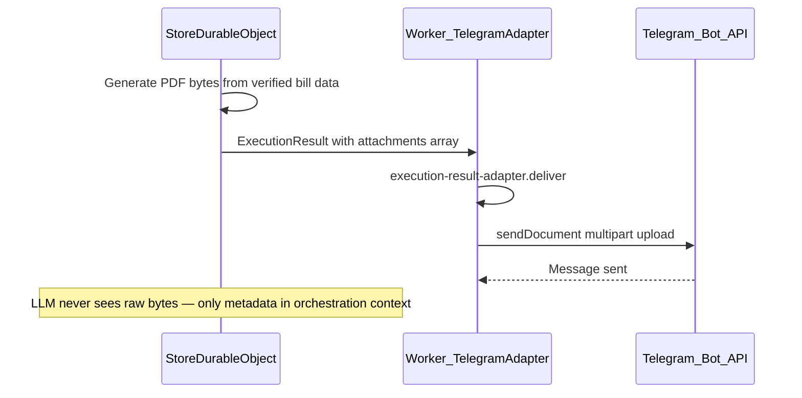
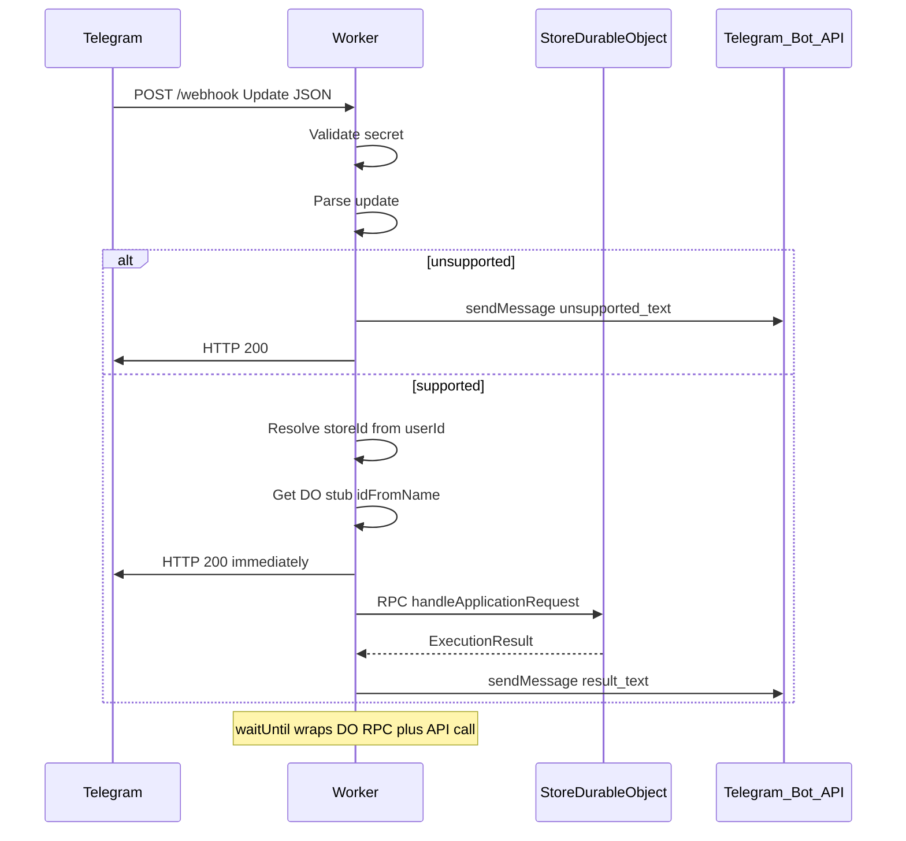

# Component 1 — Worker & Telegram Adapter Implementation Plan

**Architecture references:** [docs/system_Architecture.md](docs/system_Architecture.md) §2 (Worker & Telegram Adapter), §3 (Store DO — stub only), §6 Production-First (lines 5853–6110), Chapter 15 Engineering Methodology (lines 8717–9069), Component Acceptance Checklist (lines 6051–6064).

**Scope of this plan:** Implement the full transport boundary (Worker) and deploy a **minimal Store Durable Object stub** sufficient for end-to-end production validation. No Execution Manager, Conversation Manager, SQLite, orchestrator, or business logic in this component cycle.

**Out of scope for this component cycle (other deep modules):** correlation ID generation, Execution Ledger idempotency, conversation persistence, onboarding data collection, queue-based time scaling, Gemini, business capabilities. Attachment **delivery is fully designed and implemented** in this cycle; the stub DO simply does not emit attachments yet.

**Code organisation principle:** Deep modules — each architectural component is a self-contained folder under `src/` with its own implementation and colocated tests. No central `tests/` folder.

---

## Part 0 — How This Plan Maps to the Engineering Loop

This plan **is** the Goal Document for Component 1. The implementing agent must not derive goals independently; it implements this document.




**Stopping rules** (Chapter 15): The loop terminates only when ALL are true:

- Architectural responsibilities implemented (§2 + stub DO)
- Acceptance criteria satisfied (Part 6)
- Automated verification succeeds (Part 8–9)
- Production deployment succeeds (Part 10)
- Production end-to-end validation succeeds (Part 11)
- Human engineering review approves (Part 12)

If any condition fails → re-enter loop from implementation, using test diagnostics as feedback. Do not begin Component 2 (full Store DO) until human acceptance.

**Context management rule:** If implementation drifts, terminate the coding conversation and restart from this plan — not from chat history.

---

## Part 1 — Goal Document (Authoritative Objective)

### 1.1 Architectural objective

Build the system's **transport boundary**: receive Telegram webhooks, validate and parse them, resolve multi-tenant store identity, dispatch normalized `ApplicationRequest` objects to the correct Store Durable Object via RPC, acknowledge Telegram promptly, and deliver outbound replies via the Telegram Bot API.

The Worker remains **stateless**. All execution happens inside per-tenant Durable Objects.

### 1.2 Responsibilities (must implement)

Per [system_Architecture.md §2](docs/system_Architecture.md):

- Receive incoming Telegram webhook requests
- Validate incoming webhook requests (secret token + format)
- Parse Telegram Update objects
- Extract store identity from Telegram `from.id`
- Resolve correct Durable Object (`idFromName(storeId)`)
- Create normalized Application Request (no raw Telegram types downstream)
- Forward request to DO via RPC
- Return application response to user via Telegram Bot API (`sendMessage`, `sendDocument`)

### 1.3 Explicit non-responsibilities (must NOT implement)

- Business intent, conversation management, business rules, LLM, persistence, document generation
- Correlation ID generation (deferred to Execution Manager inside DO)
- Idempotency / Execution Ledger (deferred to DO persistence layer)
- Fetching Telegram message history (conversation history will live in SQLite later — bots cannot fetch private chat history via Bot API)
- Caching business state in Worker

### 1.4 Design decisions (locked — from alignment conversation; this plan is the source of truth)


| Decision            | Resolution                                                                                                                              |
| ------------------- | --------------------------------------------------------------------------------------------------------------------------------------- |
| Tenancy             | Multi-tenant: one Telegram user (`message.from.id`) = one store = one DO instance                                                       |
| Store ID            | `String(telegramUserId)` — deterministic `idFromName(storeId)`                                                                          |
| No allowlist        | Any Telegram user messaging the bot gets a store (lazy DO creation)                                                                     |
| Worker → DO         | Cloudflare RPC (`handleApplicationRequest`) — compat date ≥ 2024-04-03                                                                  |
| Webhook timing      | Return HTTP 200 after handoff; `ctx.waitUntil()` runs DO RPC + Telegram outbound                                                        |
| Unsupported inbound | Do NOT invoke DO; reply + 200                                                                                                           |
| `/start`            | Forward to DO; DO returns welcome message                                                                                               |
| `/new`              | Forward to DO with `conversation.resetRequested: true`; reset logic deferred to Conversation Manager — stub DO ignores reset for now    |
| Fresh DO welcome    | No automatic welcome on first message; welcome only on `/start`                                                                         |
| Correlation ID      | Not in Worker; Worker logs `update_id`, `message_id`, `store_id` for audit lookup in DO SQLite later                                    |
| Environment         | Production only on `*.workers.dev`; secrets via Wrangler                                                                                |
| Telegram library    | `@grammyjs/types` for Update/Message types; thin `fetch`-based Telegram API client in Worker (no grammY session/conversation framework) |
| Attachments         | Fully designed in `ExecutionResult`; Worker implements `sendDocument` delivery path; stub DO does not emit attachments in this cycle      |


### 1.5 User-facing copy (locked strings)


| Situation                | Message                                                         |
| ------------------------ | --------------------------------------------------------------- |
| `/start` welcome         | See Part 1.6                                                    |
| Unsupported inbound      | `I only support text conversations right now.`                  |
| Generic error            | `We're facing some problems right now. Please try again later.` |
| Stub DO (all other text) | `hi MF it's good to see you`                                    |


### 1.6 Welcome copy for `/start`

```
Welcome to your Kirana assistant.

Talk to me in plain English to run your shop — receive stock, cut bills, check inventory, manage khata, and more.

Commands:
/new — start a fresh conversation (your shop data is kept)
/start — show this message again

Just type what you need. For example: "How much sugar is left?"
```

### 1.7 Stub DO behavior (this cycle only)

- Single RPC method: `handleApplicationRequest(request) → ExecutionResult`
- If `inbound.command === "start"` → return welcome text (Part 1.6)
- All other supported requests → return `hi MF it's good to see you`
- No SQLite, no state, no reset handling yet (accept `resetRequested` in contract but no-op)
- DO class name: `StoreDurableObject` (one class, many instances)

---

## Part 2 — Repository & Code Structure (Deep Modules)

### 2.1 Organising principle

The codebase follows a **deep module** layout: each architectural component is a **holistic, self-contained folder** directly under `src/`. Opening `src/` shows the list of components built so far — not a layered tangle of `worker/`, `contracts/`, `telegram/` at the top level.

**Rules:**
- One folder per architectural component, named to match the architecture document (e.g. `worker-telegram-adapter`, `store-durable-object`)
- All implementation for that component lives inside its folder
- All tests for that component are **colocated** inside the same folder (e.g. `update-parser.test.ts` beside `update-parser.ts`) — no central `tests/` directory
- Each deep module is complete for its scope: types, logic, tests, and fixtures it needs
- Cross-component imports are explicit and minimal (see §2.3)
- When a new component is built (Execution Manager, Conversation Manager, etc.), a new folder appears under `src/` — the tree grows component by component

### 2.2 Root-level files (what lives outside `src/`)

These files exist at the project root because Cloudflare Workers and Node/TypeScript tooling require a single project entry point. They are **infrastructure**, not business components:

| File | Purpose |
|------|---------|
| `package.json` | npm project config: dependencies (`@grammyjs/types`, `wrangler`, `vitest`, `typescript`), scripts (`deploy`, `test`, `typecheck`) |
| `tsconfig.json` | TypeScript compiler settings for the whole project |
| `wrangler.toml` | Cloudflare deployment config: worker name, DO bindings, compatibility date, secrets bindings |
| `vitest.config.ts` | Test runner config: discovers `**/*.test.ts` under `src/` (colocated in each deep module) |
| `src/index.ts` | **Thin bootstrap only** — Worker `fetch` handler delegates to `worker-telegram-adapter`; exports `StoreDurableObject` for Wrangler DO registration. No logic here. |

The root is glue. All real code lives in deep modules under `src/`.

### 2.3 Full directory layout (this cycle)

```
kirana-telechat/
├── package.json
├── tsconfig.json
├── wrangler.toml
├── vitest.config.ts
│
├── src/
│   ├── index.ts                              # Thin bootstrap (see §2.2)
│   ├── env.d.ts                              # Global Env type: STORE_DO, BOT_TOKEN, WEBHOOK_SECRET
│   │
│   ├── worker-telegram-adapter/                # DEEP MODULE — Component 1 (§2 architecture)
│   │   ├── index.ts                          # Public API: handleWebhook(request, env, ctx)
│   │   │
│   │   ├── contracts/                        # Cross-boundary types (Worker → DO interface)
│   │   │   ├── application-request.ts
│   │   │   ├── execution-result.ts           # Includes full attachment types
│   │   │   └── index.ts
│   │   │
│   │   ├── telegram/                         # Telegram protocol (private to this module)
│   │   │   ├── types.ts
│   │   │   ├── command-parser.ts
│   │   │   └── command-parser.test.ts
│   │   │
│   │   ├── webhook-handler.ts
│   │   ├── webhook-handler.test.ts
│   │   ├── update-parser.ts
│   │   ├── update-parser.test.ts
│   │   ├── identity-resolver.ts
│   │   ├── identity-resolver.test.ts
│   │   ├── do-resolver.ts
│   │   ├── do-resolver.test.ts
│   │   ├── request-normalizer.ts
│   │   ├── request-normalizer.test.ts
│   │   ├── request-dispatcher.ts
│   │   ├── request-dispatcher.test.ts
│   │   ├── telegram-client.ts                # sendMessage + sendDocument (full implementation)
│   │   ├── telegram-client.test.ts
│   │   ├── execution-result-adapter.ts       # text + document delivery
│   │   ├── execution-result-adapter.test.ts
│   │   ├── observability.ts
│   │   ├── observability.test.ts
│   │   ├── constants.ts                      # User-facing strings (Part 1.5)
│   │   │
│   │   ├── fixtures/
│   │   │   └── telegram-updates.ts           # Sample Update JSON for tests
│   │   │
│   │   └── integration/
│   │       └── webhook.integration.test.ts   # Full webhook path tests (inside this module)
│   │
│   └── store-durable-object/                 # DEEP MODULE — Component 3 stub (minimal this cycle)
│       ├── index.ts                          # exports StoreDurableObject class
│       ├── store-durable-object.ts           # DurableObject class with RPC method
│       ├── handler.ts                        # Pure handler logic (testable without DO runtime)
│       ├── handler.test.ts
│       └── constants.ts                      # Welcome message (DO-owned copy)
│
└── docs/
    └── goals/
        └── component-01-worker-telegram-adapter.md
```

### 2.4 How deep modules grow over time

When later components are implemented, new folders appear as siblings:

```
src/
├── index.ts                          # Still thin — wires components together
├── worker-telegram-adapter/          # Component 1 — complete, unchanged boundary
├── store-durable-object/             # Component 3 — grows: Execution Manager, SQLite, etc.
│   ├── execution-manager/            # Sub-modules inside the DO deep module
│   ├── conversation-manager/
│   └── persistence/
├── ...future components...
```

Sub-folders **inside** a deep module (e.g. `store-durable-object/execution-manager/`) are fine — the top-level `src/` listing remains the component index.

### 2.5 Cross-module dependency rules

| Module | May import from | Must NOT import |
|--------|----------------|-----------------|
| `worker-telegram-adapter` | Its own internals; `store-durable-object` only for DO stub typing in `do-resolver` | Any future business modules |
| `store-durable-object` | `worker-telegram-adapter/contracts` only (ApplicationRequest, ExecutionResult) | `worker-telegram-adapter/telegram/`, any Telegram types |
| `src/index.ts` | `worker-telegram-adapter`, `store-durable-object` | Business logic |

**Why contracts live inside `worker-telegram-adapter`:** The transport component defines the boundary it exposes to the DO. The DO consumes that contract. This keeps the contract co-located with the component that produces `ApplicationRequest` and consumes `ExecutionResult`.

### 2.6 Test discovery

`vitest.config.ts` at root includes pattern: `src/**/*.test.ts` and `src/**/integration/*.test.ts`. Running `npm test` executes all colocated tests across all deep modules. Each module remains self-contained — tests live next to the code they verify.

### 2.7 Mapping to architecture §2 internal components

Each §2 internal component maps to a file inside `worker-telegram-adapter/`:

| Architecture component | Deep module file |
|------------------------|------------------|
| Webhook Handler | `webhook-handler.ts` |
| Update Parser | `update-parser.ts` |
| Identity Resolver | `identity-resolver.ts` |
| Durable Object Resolver | `do-resolver.ts` |
| Request Dispatcher | `request-dispatcher.ts` + `request-normalizer.ts` |
| Telegram protocol isolation | `telegram/` subfolder |
| Worker ↔ DO contract | `contracts/` subfolder |

---

## Part 3 — Shared Contracts (Worker ↔ DO)

These types live in `src/worker-telegram-adapter/contracts/` and are the **only** cross-boundary interface. `store-durable-object` imports exclusively from here. No Telegram types cross this boundary.

### 3.1 ApplicationRequest

```
ApplicationRequest {
  storeId: string                    // String(telegramUserId)

  delivery: {
    chatId: number                   // Where Worker sends replies
    replyToMessageId?: number        // Optional threading
  }

  transport: {
    source: "telegram"
    updateId: number
    messageId?: number
    userId: number
    timestamp: number              // Unix from Telegram message.date
  }

  inbound: {
    kind: "text" | "command"
    text: string
    command?: string                 // e.g. "start", "new" — when kind=command
  }

  conversation: {
    resetRequested: boolean          // true when /new command detected
  }
}
```

**Design notes:**
- No raw `Update` object crosses the boundary
- `command` is transport classification (Telegram `bot_command` entity), not business intent
- `resetRequested` is set by Worker when command name is `new`; stub DO accepts but no-ops; Conversation Manager consumes in its deep module
- Correlation ID is absent — Execution Manager adds it inside `store-durable-object` when that sub-module is built

### 3.2 ExecutionResult (complete — including attachments)

```
ExecutionResult {
  status: "ok" | "error"
  messages: OutboundMessage[]
  attachments: OutboundAttachment[]   // Always present; empty array when no attachments
}

OutboundMessage {
  type: "text"
  text: string
  parseMode?: "Markdown" | "HTML"    // Optional Telegram formatting
}

OutboundAttachment {
  type: "document"
  filename: string                   // e.g. "invoice-BILL-042.pdf"
  mimeType: string                   // e.g. "application/pdf"
  data: ArrayBuffer                  // Raw file bytes generated by DO
  caption?: string                   // Optional caption sent with document (max 1024 chars)
}
```

**Design notes:**
- `messages` and `attachments` are delivered in order: all `messages` first, then all `attachments` (Worker preserves array order within each group)
- Attachments carry **raw bytes** from DO to Worker — no R2, no URL indirection. DO generates from SQLite truth on demand; Worker uploads via Telegram `sendDocument` multipart
- `data` must be serializable over Cloudflare RPC (ArrayBuffer is supported). Practical limit: keep generated artifacts under ~10 MB for invoice PDFs; large PPTX may need a separate delivery strategy in the Analytics deep module
- `status: "error"` with empty messages/attachments → Worker sends generic error to user
- Stub DO always returns `attachments: []` — the delivery path is still built and tested

### 3.3 Attachment delivery flow (designed end-to-end)



**Regeneration principle:** Artifacts are never stored as source of truth. Each request that needs a PDF regenerates it from SQLite. The `OutboundAttachment.data` field is ephemeral transport payload, not persistent cache.

---

## Part 4 — Worker Internal Components (Logic & Design)

### 4.1 Entry point (`src/index.ts`)

**Responsibility:** Thin Cloudflare bootstrap only — no component logic.

**Logic:**
1. Import `handleWebhook` from `worker-telegram-adapter`
2. Import and re-export `StoreDurableObject` from `store-durable-object` (Wrangler requires DO class at entry)
3. If path is not `POST /webhook` → return 404
4. Delegate to `handleWebhook(request, env, ctx)`

### 4.2 Webhook Handler

**Maps to:** [§2 Webhook Handler](docs/system_Architecture.md)

**Logic:**

1. Reject non-POST requests with 405
2. Validate `X-Telegram-Bot-Api-Secret-Token` header against `env.WEBHOOK_SECRET` → 403 if mismatch (no DO invocation, no Telegram reply)
3. Parse request body as JSON; reject malformed JSON → 400
4. Generate `workerRequestId` (crypto.randomUUID()) for this transport request
5. Call update-parser
6. Branch on parse result:
  - **Unsupported:** send unsupported reply via telegram-client → return 200 immediately
  - **Supported:** call identity-resolver → do-resolver → request-dispatcher
7. request-dispatcher schedules `ctx.waitUntil(dispatchPipeline(...))` and returns 200 immediately
8. On any unexpected error before waitUntil: log + return 500 (Telegram may retry — acceptable for infrastructure failures before handoff)
9. Emit transport log at end of waitUntil pipeline (success or failure)

**Failure alignment with architecture:**

- Invalid webhook → reject, no DO (§2 Invalid Webhook Request)
- Unsupported update → ack 200, user reply, no DO (§2 Unsupported — extended: we reply, not silent ignore)
- Identity failure → reject, log, no DO (§2 Unable to Resolve Store Identity)
- DO resolution failure → 500, log (§2 DO Resolution Failure)
- DO invocation failure inside waitUntil → log, send generic error to user (§2 DO Invocation — user must not be left silent)

### 4.3 Update Parser

**Maps to:** [§2 Update Parser](docs/system_Architecture.md)

**Logic:**

1. Accept parsed JSON as Telegram `Update`
2. Extract `update_id` for logging
3. Determine update category:


| Condition                                                                   | Result                           |
| --------------------------------------------------------------------------- | -------------------------------- |
| `update.message` exists AND `message.text` exists AND `message.from` exists | **Supported** → continue parsing |
| `update.message` exists but no `text` (photo, sticker, voice, etc.)         | **Unsupported**                  |
| `update.edited_message`, `callback_query`, `inline_query`, etc.             | **Unsupported**                  |
| No recognizable message                                                     | **Unsupported**                  |


1. For supported updates, extract:
  - `updateId`, `messageId`, `chatId`, `userId`, `timestamp`, `text`
  - Pass text to command-parser to detect `bot_command` entity
2. Return discriminated union: `SupportedUpdate` or `UnsupportedUpdate` (with `updateId`, `chatId` for logging/reply)

**Important:** Use Telegram `message.entities` with `type === "bot_command"` for command detection — not regex string matching. Handle `/new@BotName` via entity offset/length per Telegram rules.

**Command classification:**

- If `bot_command` entity found → `kind: "command"`, extract command name without `@botname` suffix
- Else → `kind: "text"`

**Set `resetRequested`:** true when command name is exactly `new` (case-sensitive per Telegram command rules)

### 4.4 Identity Resolver

**Maps to:** [§2 Identity Resolver](docs/system_Architecture.md)

**Logic:**

1. Input: `SupportedUpdate` with `userId`
2. Output: `storeId = String(userId)`
3. If `userId` is missing or invalid → throw identity error (Worker rejects, no DO)

**Rationale:** One Telegram account (phone-linked) = one kirana store. Multi-device is automatic (same `userId`). Future invited users will require a mapping table inside DO — out of scope.

### 4.5 Durable Object Resolver

**Maps to:** [§2 Durable Object Resolver](docs/system_Architecture.md)

**Logic:**

1. Input: `storeId`
2. `const id = env.STORE_DO.idFromName(storeId)`
3. `const stub = env.STORE_DO.get(id)` — typed as `DurableObjectStub<StoreDurableObject>`
4. Return stub
5. Worker stores no state; does not check if DO is "new" — lazy creation is Cloudflare's responsibility on first RPC

### 4.6 Request Normalizer

**Logic:** Map `SupportedUpdate` + `storeId` → `ApplicationRequest` per Part 3.1. Pure function, no side effects.

### 4.7 Request Dispatcher

**Maps to:** [§2 Request Dispatcher](docs/system_Architecture.md)

**Logic:**

1. Build `ApplicationRequest` via request-normalizer
2. Define async `dispatchPipeline`:
  a. `const result = await stub.handleApplicationRequest(applicationRequest)`
   b. `await execution-result-adapter.deliver(result, delivery, env)`
   c. Emit success transport log
3. On catch in pipeline:
  a. Emit failure transport log with error details (server-side only)
   b. `await telegram-client.sendMessage(chatId, GENERIC_ERROR_MESSAGE)`
4. Register `ctx.waitUntil(dispatchPipeline())` — this is the "handoff succeeded" point
5. Return immediately to webhook-handler (which returns 200 to Telegram)

**Note on architecture §2 workflow:** The diagram shows synchronous flow; our async handoff is an intentional transport-layer adaptation for Telegram's 60-second webhook timeout. Business processing time scaling deferred to queue (future). Worker still fulfills "forward request and return response to Telegram" — response delivery happens inside waitUntil.

### 4.8 Telegram Client (`worker-telegram-adapter/telegram-client.ts`)

**Logic:**

**`sendMessage(chatId, text, options?)`**
- POST to `https://api.telegram.org/bot${BOT_TOKEN}/sendMessage`
- JSON body: `{ chat_id, text, parse_mode?, reply_to_message_id? }`
- Throw typed `TelegramApiError` on non-2xx response

**`sendDocument(chatId, attachment: OutboundAttachment, options?)`**
- POST to `https://api.telegram.org/bot${BOT_TOKEN}/sendDocument`
- `multipart/form-data` body:
  - `chat_id` — target chat
  - `document` — file blob from `attachment.data` with filename `attachment.filename`
  - `caption` — optional, from `attachment.caption`
- Telegram limit: 50 MB per multipart upload
- Throw `TelegramApiError` on non-2xx (e.g. 400 DOCUMENT_INVALID, 403 bot blocked)

**No inbound framework:** Do not use grammY bot middleware, sessions, or conversations.

### 4.9 Execution Result Adapter (`worker-telegram-adapter/execution-result-adapter.ts`)

**Logic:**
1. If `result.status === "error"` and both `messages` and `attachments` are empty → send generic error message; return
2. For each item in `result.messages` where `type === "text"` → `telegram-client.sendMessage`
3. For each item in `result.attachments` where `type === "document"` → `telegram-client.sendDocument`
4. Deliver in order: all messages first, then all attachments
5. If any delivery call throws → propagate to request-dispatcher catch (generic error to user)
6. Optional: if `result` has both a text message and attachments, text typically precedes the file (DO controls ordering via array contents)

**Stub DO path:** Only step 2 runs (text messages). Attachment path is implemented and unit-tested with mock bytes even though production stub never triggers it.

### 4.10 Observability (Transport Layer)

**Maps to:** [§2 Observability](docs/system_Architecture.md) — adapted per alignment.

**Every handled request emits one structured JSON log** (console.log in Workers → visible in Cloudflare dashboard/logpush):

```
{
  layer: "transport",
  workerRequestId: string,
  updateId: number,
  messageId?: number,
  chatId: number,
  storeId: string,
  durableObjectId: string,        // id.toString() from idFromName
  durationMs: number,
  resultStatus: "success" | "unsupported" | "rejected" | "error",
  inboundKind?: "text" | "command",
  errorCode?: string              // server-side only, never sent to user
}
```

**Correlation ID:** omitted at Worker layer. `updateId` is the lookup key for future DO audit tables.

---

## Part 5 — Store Durable Object Stub (`src/store-durable-object/`)

**Maps to:** [§3 Store Durable Object](docs/system_Architecture.md) — minimal shell in its own deep module.

### 5.1 Class design

```
// store-durable-object/store-durable-object.ts
class StoreDurableObject extends DurableObject {
  async handleApplicationRequest(request: ApplicationRequest): Promise<ExecutionResult>
}
```

Imports `ApplicationRequest` and `ExecutionResult` from `../worker-telegram-adapter/contracts`.

### 5.2 Logic (`handler.ts` — pure, testable)

1. Receive `ApplicationRequest`
2. If `request.inbound.kind === "command"` AND `request.inbound.command === "start"`:
   - Return `{ status: "ok", messages: [{ type: "text", text: WELCOME_MESSAGE }], attachments: [] }`
3. Otherwise:
   - Return `{ status: "ok", messages: [{ type: "text", text: STUB_GREETING }], attachments: [] }`
4. No SQLite, no constructor side effects, no `resetRequested` handling
5. Never returns attachments in this cycle — `attachments` is always `[]`

### 5.3 wrangler.toml bindings

- `STORE_DO` binding → `class_name = "StoreDurableObject"`
- Export from `src/index.ts`
- `compatibility_date` ≥ `2024-04-03`

### 5.4 How this deep module grows

When the full Store DO is built, sub-modules appear **inside** this folder — not as new top-level `src/` entries:

```
store-durable-object/
├── store-durable-object.ts       # RPC entry — delegates to Execution Manager
├── handler.ts                    # Replaced by execution-manager/
├── execution-manager/            # New sub-module
├── conversation-manager/
├── persistence/
└── ...
```

The `src/store-durable-object/` folder remains the single deep module for Component 3; it gets deeper, not duplicated.

---

## Part 6 — Acceptance Criteria

This component is **complete** when all of the following are true (from [§2 Acceptance Criteria](docs/system_Architecture.md) + alignment):


| #     | Criterion                                                                            | Verification method                             |
| ----- | ------------------------------------------------------------------------------------ | ----------------------------------------------- |
| AC-1  | Text messages parsed correctly into ApplicationRequest                               | Unit tests + production message                 |
| AC-2  | `/start` and `/new` detected via bot_command entity, not regex                       | Unit tests with entity fixtures                 |
| AC-3  | `/new` sets `conversation.resetRequested: true` in ApplicationRequest                | Unit test                                       |
| AC-4  | Same `userId` always routes to same DO (`idFromName`)                                | Unit test + production (two messages same user) |
| AC-5  | Different `userId` routes to different DO instances                                  | Production (two Telegram accounts)              |
| AC-6  | Unsupported inbound (sticker/photo) → no DO call, user gets unsupported message, 200 | Unit test + production                          |
| AC-7  | Worker is stateless — no KV, no cache, no business state                             | Code review + no storage bindings               |
| AC-8  | No business logic in Worker — only protocol translation                              | Code review                                     |
| AC-9  | Invalid webhook secret → 403, no DO                                                  | Unit/integration test                           |
| AC-10 | DO RPC failure → user gets generic error, transport log shows error                  | Simulated failure test                          |
| AC-11 | Webhook returns 200 before DO processing completes                                   | Timing observation in production                |
| AC-12 | Text message → stub reply `hi MF it's good to see you`                               | Production                                      |
| AC-13 | `/start` → welcome message                                                           | Production                                      |
| AC-14 | Structured transport logs emitted for every request                                  | Cloudflare dashboard                            |
| AC-15 | Deployed and validated on production Cloudflare + live Telegram bot                  | Part 11                                         |
| AC-16 | `sendDocument` delivery path implemented and unit-tested (mock PDF bytes)            | Unit test — stub DO does not need to emit attachments in production |
| AC-17 | Deep module structure: tests colocated in component folders, no central `tests/`   | Code review                                     |
| AC-18 | `store-durable-object` imports only from `worker-telegram-adapter/contracts`         | Code review / lint rule                         |


---

## Part 7 — Production-First Deployment (Part 10 of loop)

**Reference:** [§6 Production-First](docs/system_Architecture.md) lines 5853–5878, 5961–5971.

### 7.1 Prerequisites (human)

1. Cloudflare account (free tier acceptable for this cycle)
2. Telegram bot created via @BotFather → `BOT_TOKEN`
3. Generate `WEBHOOK_SECRET` (random string, 1–256 chars, `A-Za-z0-9_-`)

### 7.2 Wrangler configuration

- Worker name: e.g. `kirana-telechat`
- Durable Object binding for `StoreDurableObject`
- Secrets (never in source):
  - `wrangler secret put BOT_TOKEN`
  - `wrangler secret put WEBHOOK_SECRET`

### 7.3 Deploy

```
npm install
npm run deploy          # wrangler deploy
```

Record deployed URL: `https://kirana-telechat.<account>.workers.dev`

### 7.4 Register Telegram webhook

```
curl "https://api.telegram.org/bot<BOT_TOKEN>/setWebhook" \
  -d "url=https://kirana-telechat.<account>.workers.dev/webhook" \
  -d "secret_token=<WEBHOOK_SECRET>" \
  -d "allowed_updates=[\"message\"]"
```

Verify: `getWebhookInfo` shows correct URL, no errors.

### 7.5 Production validation is the primary test environment

`wrangler dev` may be used to accelerate unit-level debugging but **does not satisfy acceptance**. All AC-12 through AC-15 must pass against deployed worker.

---

## Part 8 — Test Design (Test-First Engineering)

**Reference:** Chapter 15 Test-First Engineering; [§2 Test Strategy](docs/system_Architecture.md).

Tests are designed **before** implementation. Implementer writes tests first or alongside each module.

### 8.1 Unit tests (colocated in each deep module)

All test files live beside their implementation inside `worker-telegram-adapter/` or `store-durable-object/`.

#### `worker-telegram-adapter/update-parser.test.ts`


| Test case      | Input                                                                             | Expected                               |
| -------------- | --------------------------------------------------------------------------------- | -------------------------------------- |
| text message   | `{ message: { text: "hello", from: {id:1}, chat:{id:1}, message_id:1, date:1 } }` | Supported, kind=text                   |
| /start command | message with entities `[{type:"bot_command", offset:0, length:6}]`, text `/start` | Supported, kind=command, command=start |
| /new command   | text `/new`, bot_command entity                                                   | command=new, resetRequested=true       |
| /new@BotName   | text `/new@MyBot` with entity                                                     | command=new                            |
| photo message  | message with photo, no text                                                       | Unsupported                            |
| sticker        | message with sticker                                                              | Unsupported                            |
| edited_message | update.edited_message                                                             | Unsupported                            |
| missing from   | message without from                                                              | Identity error path                    |
| callback_query | update.callback_query                                                             | Unsupported                            |


#### `worker-telegram-adapter/command-parser.test.ts`


| Test case                                 | Expected             |
| ----------------------------------------- | -------------------- |
| Extract command from entity offset/length | Correct command name |
| `/help@botname`                           | command=help         |
| Text without entities                     | Not a command        |


#### `worker-telegram-adapter/identity-resolver.test.ts`


| Test case      | Expected        |
| -------------- | --------------- |
| userId 12345   | storeId "12345" |
| missing userId | throws          |


#### `worker-telegram-adapter/request-normalizer.test.ts`


| Test case             | Expected                                   |
| --------------------- | ------------------------------------------ |
| Full supported update | Valid ApplicationRequest matching Part 3.1 |
| /new command          | resetRequested=true                        |


#### `worker-telegram-adapter/execution-result-adapter.test.ts`


| Test case                     | Expected                                      |
| ----------------------------- | --------------------------------------------- |
| Single text message           | One sendMessage call                          |
| Multiple messages             | Ordered sendMessage calls                     |
| Single document attachment    | One sendDocument call with correct filename/mimeType/bytes |
| Text then document            | sendMessage first, then sendDocument          |
| Multiple attachments          | Ordered sendDocument calls                    |
| Empty messages + error status | Generic error sent                            |
| sendDocument API failure      | Throws; caught by dispatcher                  |


#### `worker-telegram-adapter/telegram-client.test.ts`


| Test case                  | Expected                                           |
| -------------------------- | -------------------------------------------------- |
| sendMessage success        | POST to correct URL with JSON body                 |
| sendMessage API error      | Throws TelegramApiError                            |
| sendDocument multipart     | Correct FormData: chat_id, document blob, caption  |
| sendDocument oversize hint | Document > 50MB rejected before API call (optional guard) |


#### `store-durable-object/handler.test.ts`


| Test case                | Expected                              |
| ------------------------ | ------------------------------------- |
| /start command request   | Welcome text; attachments=[]              |
| Plain text request       | Stub greeting; attachments=[]             |
| /new with resetRequested | Stub greeting; attachments=[]             |


### 8.2 Integration tests (`worker-telegram-adapter/integration/webhook.integration.test.ts`)


| Test case                    | Expected                                                              |
| ---------------------------- | --------------------------------------------------------------------- |
| POST /webhook wrong secret   | 403                                                                   |
| POST /webhook valid text     | 200 immediately; DO stub response delivered (mock DO or real binding) |
| POST /webhook unsupported    | 200; unsupported message sent                                         |
| POST /webhook malformed JSON | 400                                                                   |


### 8.3 Architectural invariant checks

- `worker-telegram-adapter/contracts/` has zero imports from `telegram/` or other modules
- `store-durable-object/` imports only from `worker-telegram-adapter/contracts`
- `worker-telegram-adapter/telegram/` is never imported by `store-durable-object`
- No grammY bot instance with middleware in codebase
- No central `tests/` folder — all tests colocated under their deep module
- `src/index.ts` contains no business or transport logic (bootstrap only)

### 8.4 Production validation script (manual — Part 11)

Execute in order; record screenshots or log snippets:

1. Send plain text → receive `hi MF it's good to see you`
2. Send `/start` → receive welcome message
3. Send `/new` → receive stub greeting (reset not yet functional — expected)
4. Send sticker → receive `I only support text conversations right now.`
5. Second Telegram account → same stub greeting (proves separate DO)
6. Check Cloudflare logs for structured transport entries with updateId, storeId, durableObjectId
7. `getWebhookInfo` — no `last_error_message`

---

## Part 9 — Self-Verification Loop (Implementer Protocol)

**Reference:** Chapter 15 Self-Verification Loop, Verification Philosophy.

Each implementation iteration:

1. **Read Goal** — this plan, not chat history
2. **Implement** — one file at a time within the relevant deep module, with colocated test
3. **Run verification:**
  - `npm run typecheck` (tsc --noEmit)
  - `npm run lint` (if configured)
  - `npm test` (vitest)
4. **Collect diagnostics** — test failures, TypeScript errors, wrangler deploy errors
5. **Compare against Goal** — Part 6 acceptance criteria
6. **Revise** — fix and repeat until all green
7. **Deploy** — Part 7
8. **Production validate** — Part 8.4

The coding agent proposes; tests and production behavior decide. Never self-accept without independent evidence.

---

## Part 10 — Human Review Checklist (Part 12)

Human engineer verifies before accepting Component 1:

- [ ] Worker contains no business logic (review `worker-telegram-adapter/` modules)
- [ ] Multi-tenant routing correct (`from.id` → storeId → idFromName)
- [ ] Webhook secret validation works
- [ ] Async handoff pattern (200 before reply) works in production
- [ ] All user-facing strings match Part 1.5
- [ ] Transport logs queryable in Cloudflare dashboard
- [ ] Contracts complete including attachment types; sendDocument path unit-tested
- [ ] Deep module structure: components under `src/`, colocated tests, thin `src/index.ts`
- [ ] Stub DO responds correctly for /start and text; always returns `attachments: []`
- [ ] No SQLite, no Execution Manager, no premature scope creep
- [ ] README updated with bot @username and deployment status

---

## Part 11 — End-to-End Request Flow




---

## Part 12 — Discoveries to Carry Into Next Components

These were identified during design alignment. The Component 2+ implementer must account for them:

### 12.1 Conversation history

- **Do NOT** fetch message history from Telegram Bot API (bots cannot retrieve private chat history)
- Conversation Manager must persist every turn in SQLite inside the DO
- Worker passes only the current message in ApplicationRequest; DO/Conversation Manager owns history

### 12.2 Correlation ID

- Generated by Execution Manager when creating execution context (not Worker)
- Worker logs `updateId` as the cross-layer lookup key
- Execution Ledger (Appendix B.4) uses `updateId` for idempotency — implement in DO persistence, not Worker

### 12.3 `/new` conversation reset

- Worker sets `conversation.resetRequested: true` on ApplicationRequest
- Conversation Manager (Component 5) rotates conversation session / epoch in SQLite
- Business state and owner preferences are NOT cleared on `/new`
- No welcome on `/new` — only stub/ack response until Conversation Manager exists

### 12.4 Onboarding

- Progressive, not blocking: Configuration Capability collects shop name, GSTIN when needed
- `/start` welcome is usage education, not data collection
- Fresh DO has no special welcome on first arbitrary message — only `/start` triggers welcome

### 12.5 Artifact delivery (designed in Component 1; emitted by Billing deep module later)

- Artifacts are regenerated from SQLite truth on each request — never stored as source of truth
- Flow: Capability generates bytes in DO → `ExecutionResult.attachments[]` → Worker `sendDocument` multipart
- `OutboundAttachment` contract is complete in `worker-telegram-adapter/contracts/`
- Worker `telegram-client.sendDocument` and `execution-result-adapter` are fully implemented and tested this cycle
- LLM sees artifact metadata only, never raw PDF/PPTX bytes
- Large PPTX decks (>10 MB) may require a delivery strategy adjustment in the Analytics sub-module inside `store-durable-object/` — the contract supports it; only the byte size practical limit may need R2 for very large files

### 12.6 Time scaling (future)

- Current: `waitUntil` async handoff satisfies Telegram webhook timeout
- Future: queue between Worker handoff and long-running orchestration for LLM turns exceeding safe latency
- Worker's responsibility remains: consume webhook, hand off to DO, deliver outbound communication

### 12.7 Multi-tenant invite (future)

- Current: `storeId = userId` (1:1)
- Future: invited users map multiple `userId` → one `storeId`; Identity Resolver in Worker will need membership lookup (likely KV or D1) — not this cycle

### 12.8 Observability architecture note

- Architecture §2 lists Correlation ID in transport logs — interpreted as: available in system via `updateId` lookup, not Worker-generated. Revisit when Execution Manager lands to confirm log join strategy.

---

## Part 13 — Engineering Principles Compliance


| Principle (Chapter 15)               | How this plan complies                           |
| ------------------------------------ | ------------------------------------------------ |
| Architecture before implementation   | Plan derived from §2 + alignment decisions       |
| Goals before prompts                 | This plan is the Goal Document                   |
| Tests before code                    | Part 8 defined before Part 4 implementation      |
| Verification before confidence       | Part 9 loop with test + production gates         |
| Production before local optimisation | Part 7 + 8.4 — deploy is required for acceptance |
| Small engineering loops              | One component; stub DO only                      |
| Independent evidence                 | Tests + Cloudflare logs + live Telegram          |
| Human judgement                      | Part 10 review gate                              |


---

## Part 14 — AI Agent Implementation Order

Recommended sequence (each step ends with colocated tests passing in that deep module):

1. Scaffold root project (`package.json`, `tsconfig.json`, `wrangler.toml`, `vitest.config.ts`, thin `src/index.ts`, `src/env.d.ts`)
2. Create `src/worker-telegram-adapter/contracts/` — ApplicationRequest + ExecutionResult including full attachment types
3. Create `src/store-durable-object/` shell (`index.ts`, `constants.ts`)
4. Implement `worker-telegram-adapter/telegram/command-parser` + colocated test
5. Implement `worker-telegram-adapter/update-parser` + colocated test
6. Implement `worker-telegram-adapter/identity-resolver` + colocated test
7. Implement `worker-telegram-adapter/request-normalizer` + colocated test
8. Implement `worker-telegram-adapter/telegram-client` — sendMessage + sendDocument + colocated tests
9. Implement `worker-telegram-adapter/execution-result-adapter` — text + document delivery + colocated tests
10. Implement `worker-telegram-adapter/observability` + colocated test
11. Implement `store-durable-object/handler` + `store-durable-object.ts` + colocated tests
12. Implement `worker-telegram-adapter/do-resolver`, `request-dispatcher`, `webhook-handler` + colocated tests
13. Wire `worker-telegram-adapter/index.ts` and `src/index.ts` bootstrap
14. Run `worker-telegram-adapter/integration/webhook.integration.test.ts`
15. Deploy + production validation (Part 8.4)
16. Copy this plan to `docs/goals/component-01-worker-telegram-adapter.md`
17. Human review (Part 10)

