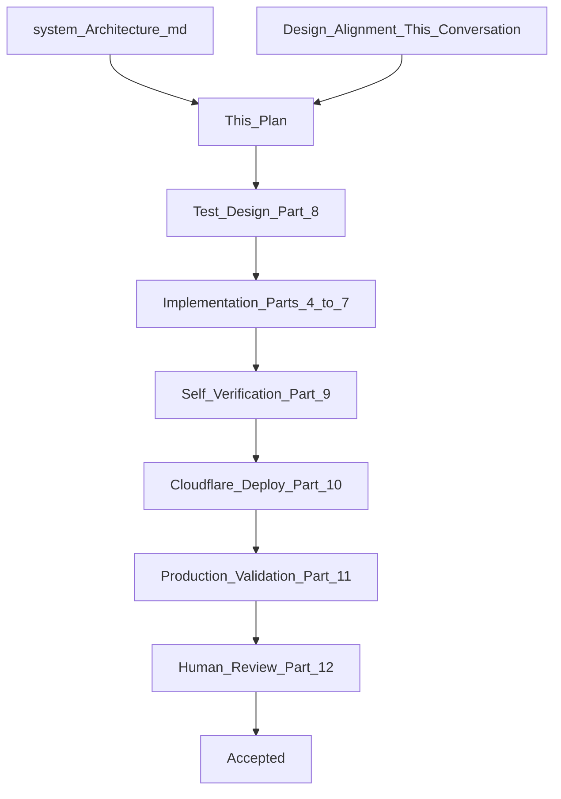
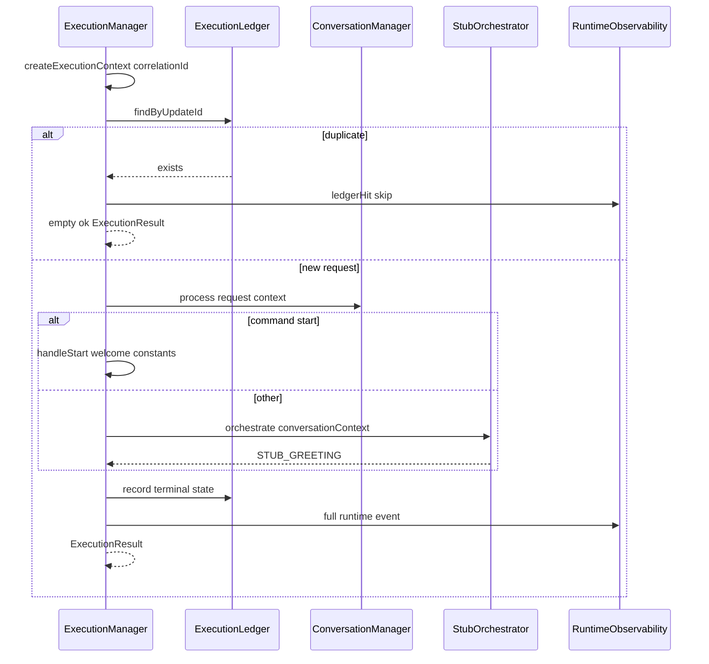
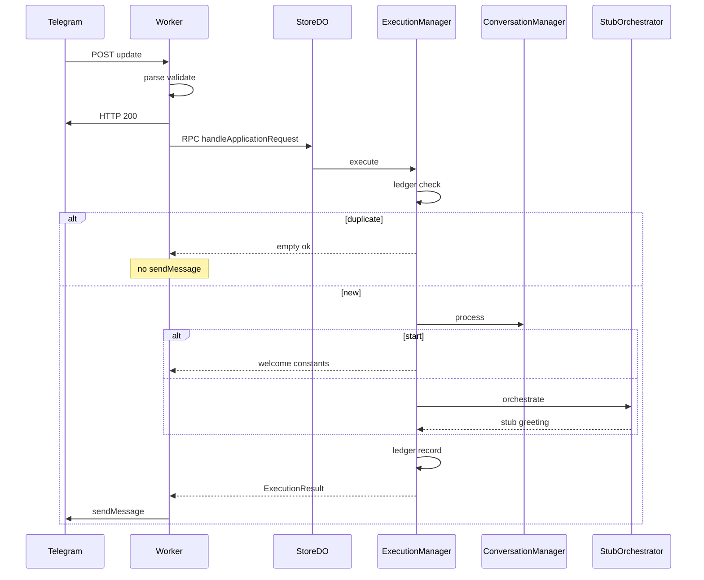

# Component 2 — DO Runtime Kernel Implementation Plan

**Architecture references:** [docs/system_Architecture.md](docs/system_Architecture.md)

- §3 Store Durable Object (lines 791–1131) — execution boundary, SQLite, failure model
- §4 Execution Manager (lines 1134–1562) — runtime kernel, lifecycle, correlation ID, failure propagation
- §5 Conversation Manager (lines 1564–1984) — minimal slice: persist turns, session reset
- §6 Global Orchestrator (lines 1986+) — **stub only** in this cycle; real Gemini in Component 3
- Chapter 12 Conversation Manager & State Reconstruction (lines 7675+) — SQLite is truth; agent context is reconstructed
- Chapter 14 Persistence & Deployment (lines 8382+) — SQLite per DO, ownership model
- Production-First principle (lines 5853–5878, 5920–6110)
- Component Acceptance Checklist (lines 6051–6064)
- Chapter 15 Engineering Methodology (lines 8717–9116)
- Appendix B.4 Idempotency (lines 9274–9336) — **adapted**: silent skip on duplicate `updateId` (see Part 1.4)

**Builds on:** [Component 1 plan](.cursor/plans/component_1_worker_plan_23e36070.plan.md) — Worker boundary unchanged; `ApplicationRequest` / `ExecutionResult` contracts extended minimally for delivery skip semantics.

**Scope:** **Scope:** Retire the Component 1 stub `handler.ts` and route all DO requests through the **DO Runtime Kernel** inside `store-durable-object/` (persistence, Execution Manager, Conversation Manager). Add `global-orchestrator/` as a new top-level deep module with a **stub** implementation invoked only for non-`/start` messages; `/start` welcome copy remains owned by `store-durable-object/constants.ts` and is not routed through the orchestrator.

**Code organisation:** Deep modules under `src/`; tests **colocated** beside the file they verify (e.g. `observability.ts` + `observability.test.ts` pattern). No `integration/` subfolder for Component 2 tests.

---

## Part 0 — Engineering Loop (Chapter 15)

This plan is the Goal Document for Component 2. The implementing agent implements **this document only** — not chat history.




**Stopping rules:** Loop terminates only when ALL are true:

- DO runtime kernel responsibilities implemented (§3 partial, §4, §5 minimal)
- Acceptance criteria satisfied (Part 6)
- Production integration tests pass against **deployed** worker
- Cloudflare deployment successful
- Production validation script executed (Part 8.4)
- Human engineering review approves (Part 10)

**Production-first:** `wrangler dev` may aid debugging; acceptance requires deployed Cloudflare + live Telegram behavior. Mocks are not authority for external behavior (Chapter 15 Production-First Testing).

**Context rule:** If implementation drifts, restart from this plan — not chat history.

---

## Part 1 — Goal Document (Authoritative Objective)

### 1.1 Architectural objective

Transform the Store Durable Object from a stateless stub into the **DO Runtime Kernel**: the per-store execution environment with SQLite persistence, request lifecycle management, conversation turn storage, session-based context loading, and a stub orchestrator slot — all validated in production before Component 3 (Gemini).

Every incoming `ApplicationRequest` from the Worker passes through:

```text
StoreDurableObject.handleApplicationRequest
        ↓
Execution Manager
        ↓
Execution Ledger check (updateId)
        ↓
Conversation Manager (persist + load active context)
        ↓
[/start branch: welcome from constants — NO orchestrator]
[all else: stub Global Orchestrator]
        ↓
Ledger record + runtime telemetry
        ↓
ExecutionResult → Worker
```

### 1.2 Responsibilities (must implement)


| Subsystem                          | Responsibility                                                                                                                          |
| ---------------------------------- | --------------------------------------------------------------------------------------------------------------------------------------- |
| **Persistence Layer**              | Drizzle + SQLite in DO; schema via `drizzle-kit generate` only; migrations in constructor `blockConcurrencyWhile`                       |
| **Execution Manager**              | Context, correlation ID, lifecycle, ledger, failure handling, runtime JSON logs                                                         |
| **Execution Ledger**               | Idempotency on `transport.updateId`; silent skip on duplicate                                                                           |
| **Conversation Manager (minimal)** | Persist every turn to SQLite; `/new` rotates session; load **active context** for agent (subset of turns)                               |
| **Stub Global Orchestrator**       | Non-`/start` messages → `STUB_GREETING`                                                                                                 |
| `**/start` path**                  | Store initialization + welcome copy from `[constants.ts](src/store-durable-object/constants.ts)`; **does not** call global-orchestrator |


### 1.3 Explicit non-responsibilities (must NOT implement)

- Gemini / Cloudflare Agents SDK
- Business capabilities (inventory, billing, khata, etc.)
- `owner_preferences` table or onboarding **processing** (Component 3)
- Agent confirmation replies (“Got it — your shop is…”)
- Worker transport changes beyond minimal `ExecutionResult` delivery-skip documentation
- New environment variables (reuse `[.dev.vars.example](.dev.vars.example)`)
- Telegram Web App forms

### 1.4 Locked design decisions (from alignment conversation)


| Decision                      | Resolution                                                                                                       |
| ----------------------------- | ---------------------------------------------------------------------------------------------------------------- |
| **First `/start`**            | Part 1.6 welcome + registration line + onboarding prompt (single message)                                        |
| **Repeat `/start`**           | Part 1.6 welcome **only** (no registration, no onboarding prompt)                                                |
| **All other messages**        | `hi MF it's good to see you` until Component 3                                                                   |
| `**/new` user reply**         | Same stub greeting; reset is internal                                                                            |
| `**/new` SQLite**             | Never delete turns; all history permanent                                                                        |
| `**/new` agent context**      | Only current session turns loaded; pre-`/new` turns excluded                                                     |
| `**/new` message in context** | Included as first turn; strip `/new` via regex (no LLM)                                                          |
| `**/new` after `/start**`     | Repeat `/start` does not re-show onboarding (store already initialized)                                          |
| **Welcome copy owner**        | `[store-durable-object/constants.ts](src/store-durable-object/constants.ts)`                                     |
| `**/start` orchestrator**     | Not invoked; Execution Manager serves welcome directly                                                           |
| **Duplicate `updateId`**      | Ledger hit → return `{ status: "ok", messages: [], attachments: [] }`; Worker sends **nothing**; no orchestrator |
| **Partial failure**           | Record failure in ledger; full runtime observability                                                             |
| **Runtime failure (user)**    | Worker generic error: `We're facing some problems right now. Please try again later.`                            |
| **Migrations**                | Drizzle Kit `npx drizzle-kit generate` — **no handwritten SQL**                                                  |
| **Preferences table**         | Deferred to Component 3                                                                                          |
| **Testing**                   | Production integration tests only; colocated in module folder; deploy before test run                            |
| **Persistence inspection**    | Cloudflare Data Studio (production); `wrangler tail` for runtime logs                                            |


### 1.5 User-facing copy (locked strings)

**Constants file:** `[src/store-durable-object/constants.ts](src/store-durable-object/constants.ts)`

#### `WELCOME_MESSAGE` (repeat `/start` — Part 1.6, unchanged)

```text
Welcome to your Kirana assistant.

Talk to me in plain English to run your shop — receive stock, cut bills, check inventory, manage khata, and more.

Commands:
/new — start a fresh conversation (your shop data is kept)
/start — show this message again

Just type what you need. For example: "How much sugar is left?"
```

#### `WELCOME_MESSAGE_FIRST_START` (first `/start` only)

`WELCOME_MESSAGE` followed by:

```text
Your Kirana store is now registered. You're all set to start.

To get started, tell me a bit about your shop — your store name, your name, and anything about GST (whether you're registered, your GSTIN if you have one, etc.). You can share it all in one message.
```

#### `STUB_GREETING` (all non-`/start` supported messages)

```text
hi MF it's good to see you
```

#### Worker-owned (unchanged)


| Situation           | Message                                                         |
| ------------------- | --------------------------------------------------------------- |
| Unsupported inbound | `I only support text conversations right now.`                  |
| Generic error       | `We're facing some problems right now. Please try again later.` |


### 1.6 `/start` behavior detail

**Telegram constraint:** First user action is always `/start` (Start button). No “gate plain text before start” logic required.

**First `/start` for a store:**

1. Constructor has already run Drizzle migrations (infrastructure).
2. Execution Manager detects `command === "start"` and `store_meta.initialized_at` is null.
3. Set `store_meta.initialized_at` (semantic store registration).
4. Return `WELCOME_MESSAGE_FIRST_START`.
5. Do **not** call `global-orchestrator`.

**Repeat `/start`:**

1. `store_meta.initialized_at` already set.
2. Return `WELCOME_MESSAGE` only.
3. Do **not** call `global-orchestrator`.

### 1.7 `/new` behavior detail

1. Worker sets `conversation.resetRequested: true` (unchanged).
2. Conversation Manager creates new `conversation_sessions` row (new session id / epoch).
3. Persist `/new` turn to SQLite (permanent audit trail).
4. Strip command text for **active context** storage:
  - `/new` alone → empty string turn (still persisted; regex-based)
  - `/new some text` → `some text`
  - Handle `/new@BotName` suffix per same rules as Worker command parser
5. Active context loader returns only turns from **current session** (including stripped `/new` turn).
6. Stub orchestrator returns `STUB_GREETING`.
7. No SQLite deletes; no preference changes.

### 1.8 Duplicate Telegram delivery (idempotency)

**Differs from Appendix B.4 “return previous result”** — production truth is **silent skip**:

```text
Incoming ApplicationRequest (updateId = N)
        ↓
Execution Manager → ledger lookup
        ↓
   Already processed?
   ├─ Yes → return { status: "ok", messages: [], attachments: [] }
   │         Worker deliver() sends nothing
   │         Runtime log: ledgerHit=true, action=skip
   └─ No  → full pipeline → record ledger → return result
```

Ledger must record: `update_id`, `correlation_id`, `terminal_status` (ok|error), `delivered` (bool), `completed_at`, optional `failure_reason` for observability.

On first failure after user was notified: ledger records error terminal state. Duplicate retry: same silent skip (already processed).

**Worker contract:** `[execution-result-adapter.ts](src/worker-telegram-adapter/execution-result-adapter.ts)` already no-ops when `status: "ok"` and both arrays empty. Document this as intentional `deliverySkip` semantics in contract comments; no generic error on empty ok result.

---

## Part 2 — Repository and Code Structure

### 2.1 Target directory layout

```text
src/
├── index.ts                              # unchanged bootstrap
├── env.d.ts
│
├── worker-telegram-adapter/              # Component 1 — minimal contract comment only
│   └── contracts/
│       └── execution-result.ts           # document empty-ok = skip delivery
│
├── store-durable-object/                 # Component 2 — grows
│   ├── index.ts
│   ├── store-durable-object.ts           # constructor migrations + RPC entry
│   ├── constants.ts                      # WELCOME_* + STUB_GREETING
│   ├── observability.ts                  # runtime JSON logs
│   ├── observability.test.ts             # optional: log shape only if pure
│   ├── production.integration.test.ts    # production tests — colocated
│   │
│   ├── persistence/
│   │   ├── schema.ts                     # Drizzle table definitions
│   │   ├── db.ts                         # drizzle(ctx.storage) factory
│   │   └── repositories/
│   │       ├── store-meta-repository.ts
│   │       ├── execution-ledger-repository.ts
│   │       ├── conversation-session-repository.ts
│   │       └── conversation-turn-repository.ts
│   │
│   ├── execution-manager/
│   │   ├── index.ts                      # execute(request) → ExecutionResult
│   │   ├── execution-context.ts
│   │   ├── lifecycle.ts
│   │   └── execution-manager.test.ts     # only if pure helpers; else prod tests cover
│   │
│   └── conversation-manager/
│       ├── index.ts                      # process(request, ctx) → ConversationContext
│       ├── session.ts                    # /new rotation, regex strip
│       ├── context-loader.ts             # load active session turns
│       └── new-command-strip.ts          # pure regex — colocated .test.ts allowed
│
├── global-orchestrator/                  # NEW deep module
│   ├── index.ts                          # public: orchestrate(context) → ExecutionResult
│   ├── stub-orchestrator.ts              # STUB_GREETING only
│   └── types.ts                          # ConversationContext type
│
drizzle/                                  # generated by drizzle-kit — NOT handwritten
├── meta/
└── *.sql

drizzle.config.ts                         # drizzle-kit config at project root
```

**Retire:** `[handler.ts](src/store-durable-object/handler.ts)`, `[handler.test.ts](src/store-durable-object/handler.test.ts)` — logic absorbed into pipeline.

### 2.2 Cross-module dependency rules


| Module                    | May import from                                                      | Must NOT import                                     |
| ------------------------- | -------------------------------------------------------------------- | --------------------------------------------------- |
| `store-durable-object`    | `worker-telegram-adapter/contracts`; `global-orchestrator`           | `worker-telegram-adapter/telegram/`, Telegram types |
| `global-orchestrator`     | own internals; `worker-telegram-adapter/contracts` (ExecutionResult) | `store-durable-object/persistence` directly         |
| `worker-telegram-adapter` | unchanged                                                            | business modules                                    |


### 2.3 Drizzle and Wrangler configuration

**Dependencies to add** (implementer runs `npm install`):

- `drizzle-orm`
- `drizzle-kit` (dev)

`**[wrangler.toml](wrangler.toml)**` additions:

```toml
[[rules]]
type = "Text"
globs = ["**/*.sql"]
fallthrough = true
```

`**drizzle.config.ts`:** Point at `src/store-durable-object/persistence/schema.ts`; output to `drizzle/`.

**Migration workflow (mandatory — terminal only):**

1. Edit `schema.ts`
2. Run `npx drizzle-kit generate`
3. Commit generated SQL under `drizzle/`
4. DO constructor runs `migrate(db, migrations)` inside `ctx.blockConcurrencyWhile()`

**Never** write raw SQL migration files by hand.

---

## Part 3 — Persistence Schema (Drizzle)

Design **complete runtime tables** for Component 2 scope. No `owner_preferences`.

### 3.1 `store_meta` (single row per DO / store)


| Column           | Type                | Purpose                   |
| ---------------- | ------------------- | ------------------------- |
| `id`             | integer PK          | always 1                  |
| `initialized_at` | text (ISO datetime) | null until first `/start` |
| `created_at`     | text                | DO first touch            |


### 3.2 `execution_ledger`


| Column            | Type           | Purpose                                      |
| ----------------- | -------------- | -------------------------------------------- |
| `update_id`       | integer PK     | Telegram `updateId`                          |
| `correlation_id`  | text           | Execution Manager UUID                       |
| `terminal_status` | text           | `ok` | `error`                               |
| `delivered`       | integer (bool) | whether Worker should have sent user message |
| `failure_reason`  | text nullable  | server-side observability                    |
| `completed_at`    | text           | ISO timestamp                                |


**Unique constraint on `update_id`.** Index for audit queries optional.

### 3.3 `conversation_sessions`


| Column       | Type           | Purpose                       |
| ------------ | -------------- | ----------------------------- |
| `id`         | text PK        | UUID                          |
| `started_at` | text           | ISO                           |
| `ended_at`   | text nullable  | set when superseded by `/new` |
| `is_active`  | integer (bool) | only one active per store     |


### 3.4 `conversation_turns`


| Column         | Type          | Purpose                                |
| -------------- | ------------- | -------------------------------------- |
| `id`           | text PK       | UUID                                   |
| `session_id`   | text FK       | → conversation_sessions                |
| `update_id`    | integer       | Telegram updateId                      |
| `role`         | text          | `user` (inbound only this cycle)       |
| `raw_text`     | text          | original inbound text                  |
| `context_text` | text          | after `/new` strip (for agent context) |
| `inbound_kind` | text          | `text` | `command`                     |
| `command`      | text nullable | e.g. `new`, `start`                    |
| `created_at`   | text          | ISO                                    |


**All turns permanent.** `/new` never deletes rows.

### 3.5 Active context loading rule

```sql
-- Conceptual: turns where session_id = active_session_id ORDER BY created_at
```

Agent context (for Component 3) receives `context_text` values from active session only. Component 2 stub orchestrator ignores context content but Conversation Manager must populate it correctly.

---

## Part 4 — Internal Component Design

### 4.1 `StoreDurableObject` class

`[store-durable-object.ts](src/store-durable-object/store-durable-object.ts)`:

```typescript
class StoreDurableObject extends DurableObject {
  constructor(ctx, env) {
    super(ctx, env);
    ctx.blockConcurrencyWhile(async () => {
      await runDrizzleMigrations(ctx.storage);
    });
  }

  async handleApplicationRequest(request: ApplicationRequest): Promise<ExecutionResult> {
    return executionManager.execute(request, this.db);
  }
}
```

### 4.2 Execution Manager

Maps to [§4 Execution Manager](docs/system_Architecture.md).

`**execute(request)` workflow:**




**Failure handling (§4 Failure Cases, §3 Failure Model):**


| Failure                     | Behavior                                               |
| --------------------------- | ------------------------------------------------------ |
| Context creation fails      | Terminal error; ledger if possible; generic user error |
| Migration/DB unavailable    | Terminal error; structured log; generic user error     |
| Conversation Manager throws | Catch; ledger `error`; propagate to Worker             |
| Stub orchestrator throws    | Catch; ledger `error`                                  |
| Any uncaught exception      | Finalize context; preserve telemetry; ledger `error`   |


**Never** leave partial ledger without terminal state when execution began.

**Correlation ID:** Generated here (not Worker). Logged with `updateId` for cross-layer join (Component 1 transport logs use `updateId`).

### 4.3 Conversation Manager (minimal)

Maps to [§5 Conversation Manager](docs/system_Architecture.md) — minimal slice only.

`**process(request, executionContext)`:**

1. If `resetRequested`: end current active session; create new session.
2. Compute `context_text`:
  - If `command === "new"`: apply `[new-command-strip.ts](src/store-durable-object/conversation-manager/new-command-strip.ts)` regex to `inbound.text`
  - Else: `context_text = inbound.text`
3. Insert `conversation_turns` row (always).
4. Load all turns for active `session_id` ordered by `created_at`.
5. Return `ConversationContext` { `activeSessionId`, `turns[]`, `storeInitialized` }.

**First session:** Created on first message if none exists (first message is always `/start`).

### 4.4 Stub Global Orchestrator

`[global-orchestrator/stub-orchestrator.ts](src/global-orchestrator/stub-orchestrator.ts)`:

```typescript
export function orchestrate(_context: ConversationContext): ExecutionResult {
  return {
    status: "ok",
    messages: [{ type: "text", text: STUB_GREETING }],
    attachments: [],
  };
}
```

Import `STUB_GREETING` from `store-durable-object/constants.ts` OR duplicate constant in orchestrator folder — **prefer single source:** export stub greeting from constants; orchestrator imports from store-durable-object/constants (document exception to “orchestrator owns copy” — stub only).

Alternative: move `STUB_GREETING` to `global-orchestrator/constants.ts` and keep welcome strings in store DO. Implementer picks one source of truth; plan prefers **welcome in store DO, stub greeting in global-orchestrator/constants.ts** to avoid circular imports.

### 4.5 `/new` regex rules (locked)


| Input `inbound.text` | `context_text` stored |
| -------------------- | --------------------- |
| `/new`               | `""`                  |
| `/new hello`         | `hello`               |
| `/new@BotName`       | `""`                  |
| `/new@BotName hello` | `hello`               |


Implementation: strip leading `/new` optional `@botname` and trim whitespace. Colocate `new-command-strip.test.ts` for this pure function only (regex logic is deterministic; production tests cover integration).

### 4.6 Runtime observability

`[store-durable-object/observability.ts](src/store-durable-object/observability.ts)` — structured JSON `console.log` per execution:

```json
{
  "layer": "runtime",
  "correlationId": "...",
  "updateId": 123,
  "storeId": "...",
  "sessionId": "...",
  "terminalStatus": "ok|error|skipped_duplicate",
  "ledgerHit": false,
  "durationMs": 42,
  "participatingComponents": ["execution-manager","conversation-manager","stub-orchestrator"],
  "failureReason": null
}
```

Join key with transport logs: `updateId`, `storeId`.

---

## Part 5 — Worker Boundary (minimal touch)

`[request-dispatcher.ts](src/worker-telegram-adapter/request-dispatcher.ts)` — no logic change required if empty-ok skips delivery.

`[execution-result.ts](src/worker-telegram-adapter/contracts/execution-result.ts)` — add JSDoc:

```typescript
/**
 * When status is "ok" and messages and attachments are both empty,
 * the Worker intentionally sends nothing (duplicate updateId / delivery skip).
 */
```

`[execution-result-adapter.ts](src/worker-telegram-adapter/execution-result-adapter.ts)` — verify no code path treats empty ok as error. Add comment referencing ledger skip.

Transport log enhancement (optional): `resultStatus: "skipped_delivery"` when DO returns empty ok — helps human reviewer.

---

## Part 6 — Acceptance Criteria


| #     | Criterion                                                          | Verification                                                         |
| ----- | ------------------------------------------------------------------ | -------------------------------------------------------------------- |
| AC-1  | Drizzle migrations apply on DO cold start                          | Deploy + Data Studio shows tables                                    |
| AC-2  | First `/start` → `WELCOME_MESSAGE_FIRST_START`                     | Production Telegram                                                  |
| AC-3  | Repeat `/start` → `WELCOME_MESSAGE` only                           | Production Telegram                                                  |
| AC-4  | Plain text → `STUB_GREETING`                                       | Production Telegram                                                  |
| AC-5  | `/new` → `STUB_GREETING`; session rotates                          | Data Studio: new session row; active context excludes pre-/new turns |
| AC-6  | `/new` turn included in new session with stripped text             | Data Studio `conversation_turns.context_text`                        |
| AC-7  | All turns persist in SQLite permanently                            | Data Studio after `/new`                                             |
| AC-8  | Duplicate `updateId` POST → 200, **no second Telegram message**    | Production integration test                                          |
| AC-9  | Execution ledger records every processed updateId                  | Data Studio                                                          |
| AC-10 | Runtime structured logs per request                                | `wrangler tail`                                                      |
| AC-11 | Failure → generic user error; ledger records error                 | Simulated failure test or forced error path                          |
| AC-12 | Correlation ID in runtime logs                                     | `wrangler tail`                                                      |
| AC-13 | `handler.ts` retired; pipeline wired                               | Code review                                                          |
| AC-14 | No `owner_preferences` table                                       | Schema review                                                        |
| AC-15 | Migrations only via `drizzle-kit generate`                         | Code review — no hand-written SQL                                    |
| AC-16 | `global-orchestrator/` exists; stub only                           | Code review                                                          |
| AC-17 | Tests colocated; production integration against deployed worker    | `npm test` after deploy                                              |
| AC-18 | Worker unchanged except contract comments / optional transport log | Code review                                                          |


---

## Part 7 — Production Deployment

Same sequence as [running.md](running.md):

1. `npx drizzle-kit generate` (after schema defined)
2. `npm run typecheck`
3. `npm run deploy`
4. Secrets unchanged (`BOT_TOKEN`, `WEBHOOK_SECRET`)
5. `npm test` (production integration)
6. Manual Telegram validation (Part 8.4)
7. Data Studio inspection (Part 8.5)

No new Wrangler secrets. Reuse `.dev.vars` variables only.

---

## Part 8 — Test Design (Production-First)

### 8.1 Philosophy

- **No mocks** for Worker, DO, Telegram, or `fetch`.
- Tests POST to **deployed** `WORKER_WEBHOOK_URL` with `WEBHOOK_SECRET` from `.dev.vars` (`[vitest.setup.ts](vitest.setup.ts)`).
- Skip gracefully when secrets absent (same pattern as `[production.integration.test.ts](src/worker-telegram-adapter/integration/production.integration.test.ts)`).
- Pure helpers (`new-command-strip`) may have colocated unit tests; behavioral truth is production.

### 8.2 Test file location

`[src/store-durable-object/production.integration.test.ts](src/store-durable-object/production.integration.test.ts)` — colocated in module root (not `integration/` subfolder).

### 8.3 Production integration test cases


| ID  | Test                            | Expected                                                                                      |
| --- | ------------------------------- | --------------------------------------------------------------------------------------------- |
| P1  | POST `/start` (unique updateId) | HTTP 200                                                                                      |
| P2  | POST plain text                 | HTTP 200                                                                                      |
| P3  | POST same updateId twice        | HTTP 200 both; second produces no delivery (verify via log `ledgerHit` / `skipped_duplicate`) |
| P4  | POST `/new`                     | HTTP 200                                                                                      |
| P5  | Wrong webhook secret            | HTTP 403                                                                                      |


**Note:** Automated tests cannot assert Telegram message text without Bot API read (bots cannot read private chat history). **Human validation** (Part 8.4) confirms copy. Tests confirm HTTP boundary + logs.

### 8.4 Manual production validation script (Part 11)

Human operator executes in order; record screenshots or log snippets:

1. **New test user** (or reset store via new Telegram account): tap Start → receive **first-start welcome** (registration + onboarding prompt).
2. Send plain text → receive `hi MF it's good to see you`.
3. Send `/start` again → receive **repeat welcome only** (no registration block).
4. Send 3 plain text messages → Data Studio shows 3+ turns in SQLite.
5. Send `/new` → receive stub greeting; Data Studio shows new `conversation_sessions` row; active session changed.
6. Send 1 message after `/new` → Data Studio: only post-/new turns in active session query.
7. `wrangler tail` → runtime JSON with `correlationId`, `updateId`, `sessionId`.
8. Replay duplicate updateId via integration test → confirm no duplicate user message in Telegram.

### 8.5 Data Studio validation

Cloudflare Dashboard → Durable Objects → `StoreDurableObject` namespace → **Data Studio** → enter DO id from transport/runtime logs.

Verify tables: `store_meta`, `execution_ledger`, `conversation_sessions`, `conversation_turns`.

---

## Part 9 — Self-Verification Loop (Implementer Protocol)

Each iteration:

1. Read this plan
2. Implement one submodule
3. `npx drizzle-kit generate` when schema changes
4. `npm run typecheck`
5. `npm run deploy`
6. `npm test`
7. Compare against Part 6 acceptance criteria
8. Revise until green

---

## Part 10 — Human Review Checklist

- [ ] First vs repeat `/start` copy correct
- [ ] Stub greeting on all non-`/start` messages
- [ ] `/new` rotates session; SQLite retains all turns
- [ ] `/new` context strip regex correct
- [ ] Duplicate updateId silent skip works
- [ ] Runtime logs complete and joinable with transport logs
- [ ] Drizzle migrations generated via kit only
- [ ] No `owner_preferences` table
- [ ] `global-orchestrator` stub only; `/start` bypasses orchestrator
- [ ] `handler.ts` removed
- [ ] Tests colocated; production integration passes
- [ ] Data Studio confirms persistence

---

## Part 11 — End-to-End Request Flow




---

## Part 12 — Carry Forward to Component 3

- Replace stub orchestrator with Cloudflare Agents SDK + Gemini
- Add `owner_preferences` table after agent memory research
- Process onboarding replies (store name, GST, etc.)
- Agent confirmation flow
- Conversation context consumed by real orchestrator
- Component 1 Part 12 discoveries still apply (no Telegram history fetch, etc.)

---

## Part 13 — Implementation Order

1. Add Drizzle deps + `drizzle.config.ts` + wrangler `[[rules]]` for `.sql`
2. Define `persistence/schema.ts`; run `drizzle-kit generate`
3. Implement `persistence/db.ts` + migration runner in DO constructor
4. Implement repositories
5. Implement `conversation-manager/` (+ `new-command-strip` + colocated test)
6. Implement `execution-manager/`
7. Implement `global-orchestrator/stub-orchestrator.ts`
8. Update `constants.ts` with `WELCOME_MESSAGE_FIRST_START`
9. Wire `store-durable-object.ts`; remove `handler.ts`
10. Implement `observability.ts`
11. Document `ExecutionResult` empty-ok semantics in Worker contracts
12. Write `production.integration.test.ts`
13. Deploy + manual validation + Data Studio
14. Human review (Part 10)

---

## Part 14 — Architecture Traceability


| Architecture concern                              | Component 2 implementation             |
| ------------------------------------------------- | -------------------------------------- |
| §3 SQLite authoritative                           | Drizzle persistence layer              |
| §3 Failure model                                  | Execution Manager catch + ledger       |
| §4 Correlation ID                                 | Execution Manager                      |
| §4 Lifecycle                                      | Execution Manager                      |
| §5 Conversation state temporary vs business truth | Turns in SQLite; no business tables    |
| Chapter 12 state reconstruction                   | Active session context loader          |
| B.4 Idempotency                                   | Execution ledger — silent skip variant |
| Production-first (5853–5878)                      | Deploy before acceptance               |
| Chapter 15 methodology                            | This plan as Goal Document             |


