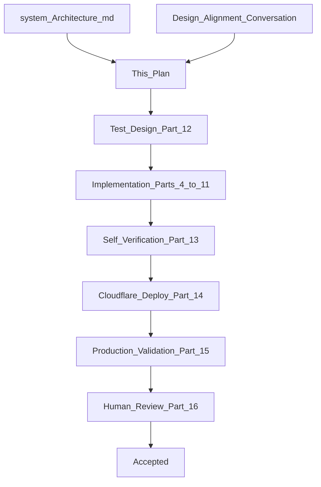
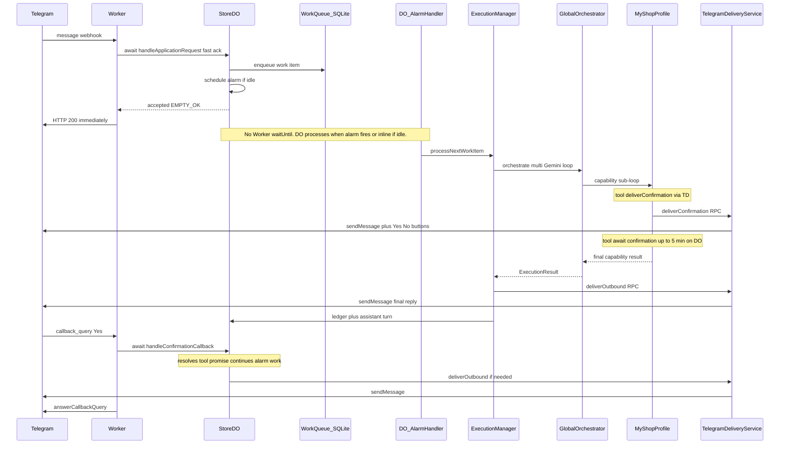
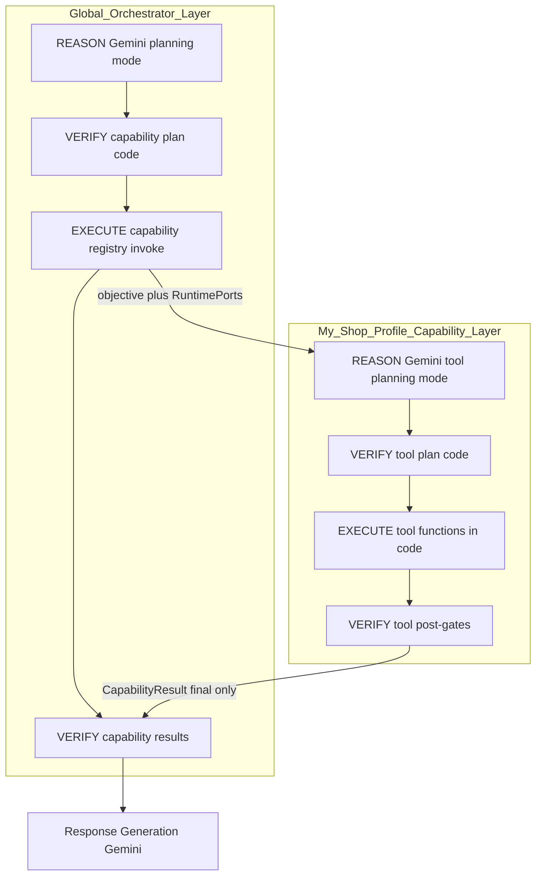
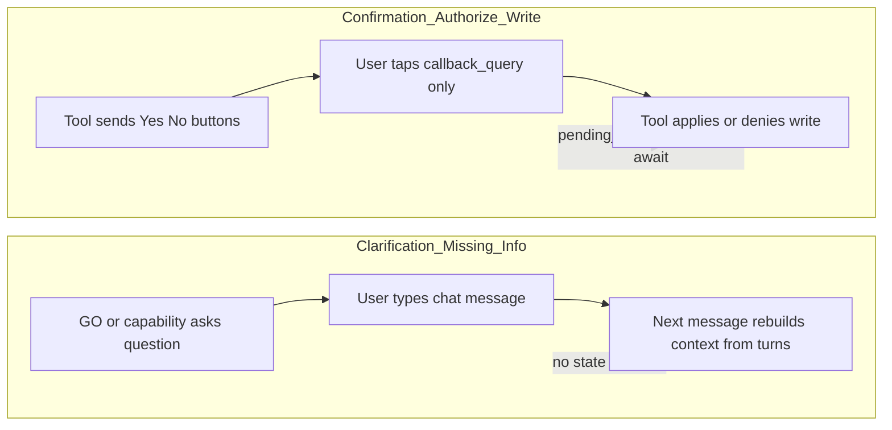
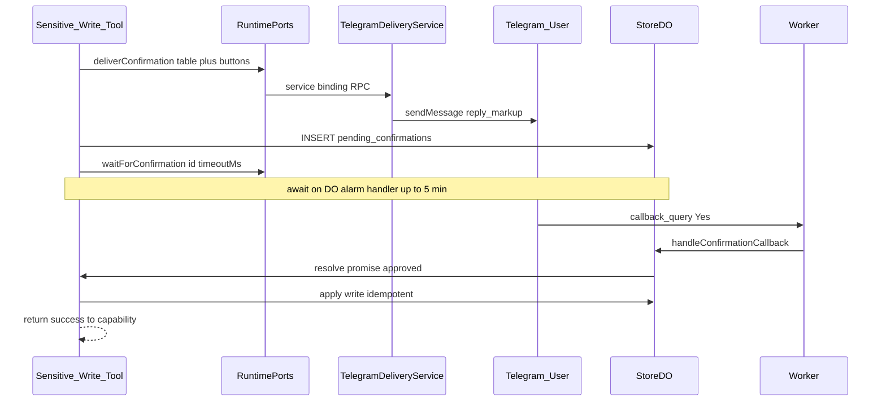
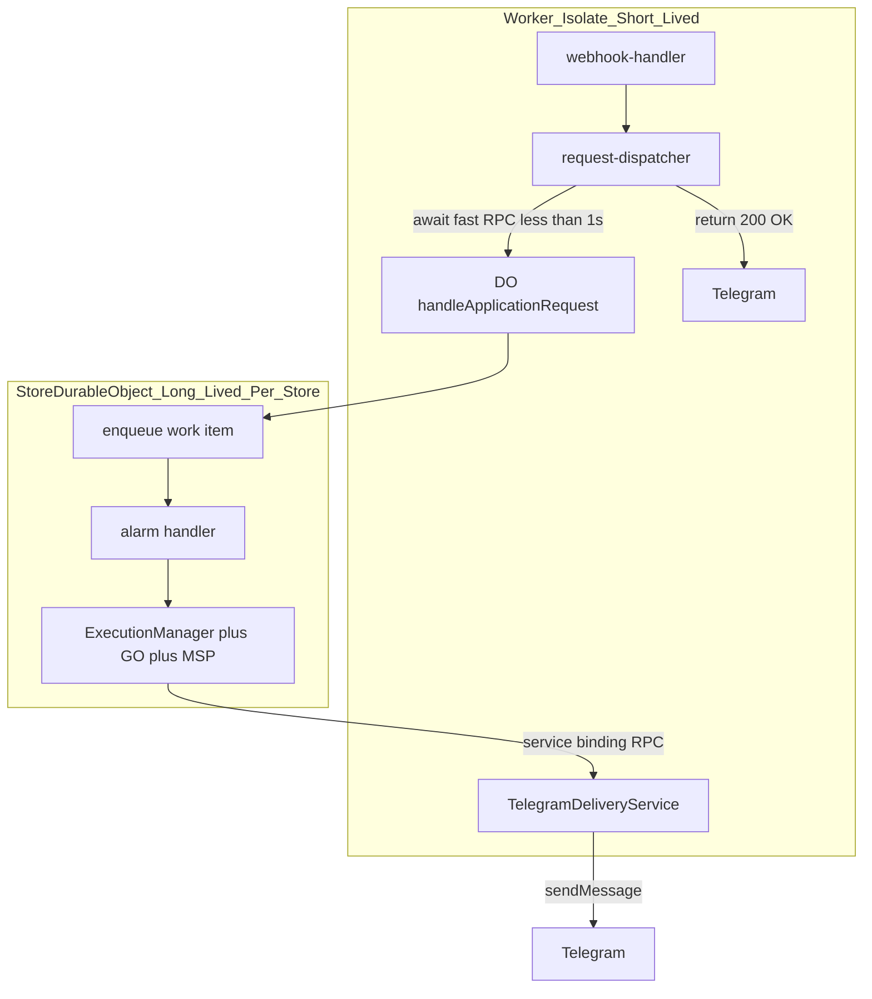
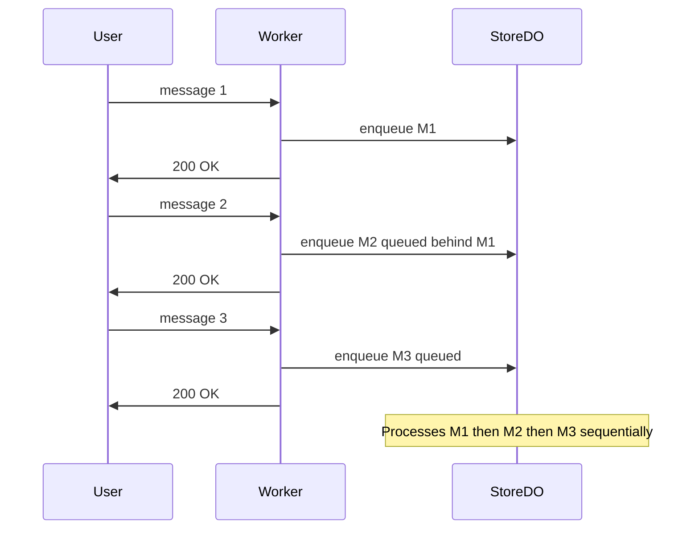
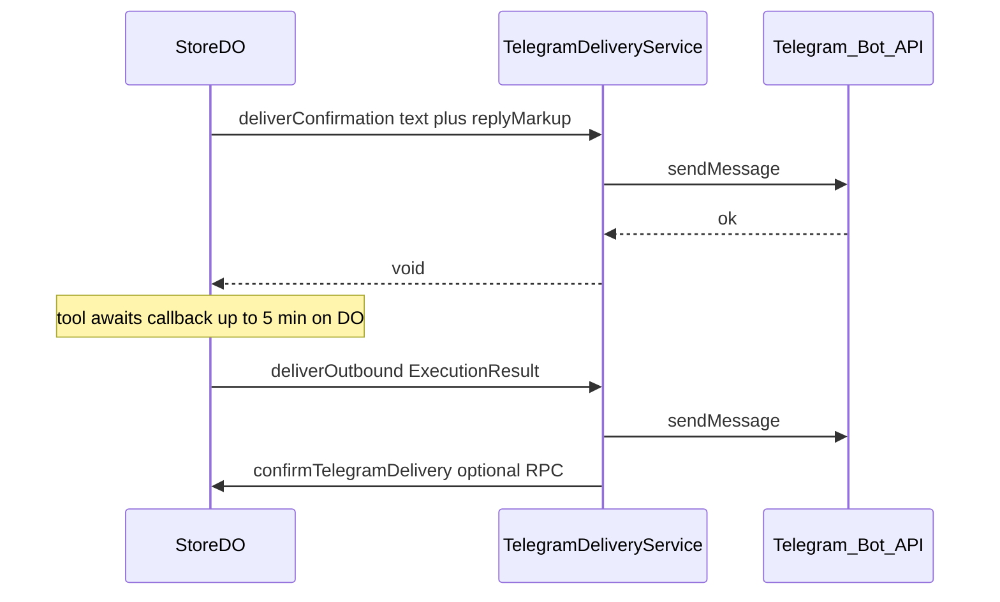
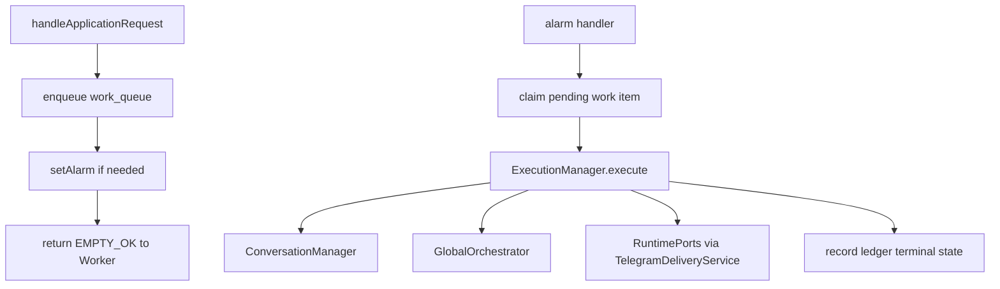

# Component 3 — Global Orchestrator (Real) + My Shop Profile Capability

**Architecture references:** [docs/system_Architecture.md](docs/system_Architecture.md)

| Topic | Section |
|-------|---------|
| Global Orchestrator purpose & constitution | §6 (lines ~1986–2978) |
| Recursive orchestration (GO ↔ Capability same abstraction) | §6.7 (lines ~3547–3589) |
| Capability delegation — GO never sees tools | §6.7–6.8, §7 |
| Plan verification (Layer 1) | §6 verification (~4210+) |
| Clarification ownership (orchestrator vs capability) | §6.8 (~3945+) |
| Conversation Manager & state reconstruction | Chapter 12 (~7675+) |
| Production-first development | lines 5853–5878, 5920–6110 |
| Component acceptance checklist | lines 6051–6064 |
| Engineering Methodology | Chapter 15 (lines 8717+) |
| Agent traceability & agent state | [docs/agent-traceability-and-agent-state.md](docs/agent-traceability-and-agent-state.md) — C3 schema groundwork; C4 full implementation |
| Runtime stack (Gemini, Agents SDK note) | §6.17 (~6110+) — **we compose without Agents SDK fibers per alignment** |

**Builds on:**

- [Component 1 plan](.cursor/plans/component_1_worker_plan_23e36070.plan.md) — Worker transport, contracts; **Part 2.9 supersedes C1 `waitUntil` handoff for long orchestration**
- [Component 2 plan](.cursor/plans/component_2_do_runtime_a07d3d0d.plan.md) — DO runtime kernel, ledger, Conversation Manager, stub orchestrator

**This document is the Goal Document for Component 3.** The implementing agent implements **this document only** — not chat history.

---

## Part 0 — Engineering Loop (Chapter 15)



**Stopping rules:** Loop terminates only when ALL are true:

- Component 3 responsibilities implemented (minimal GO loop + My Shop Profile + confirmation + checkpointing)
- Acceptance criteria satisfied (Part 15)
- Production integration tests pass against **deployed** worker
- Cloudflare deployment successful with `GEMINI_API_KEY`
- Production validation script executed (Part 15)
- Human engineering review approves (Part 16)

**Production-first:** `wrangler dev` may aid debugging; acceptance requires deployed Cloudflare + live Telegram. Mocks are not authority for Gemini or Telegram button behavior.

**Context rule:** If implementation drifts, restart from this plan — not chat history.

---

## Part 1 — Goal Document (Authoritative Objective)

### 1.1 Architectural objective

Replace the stub [`global-orchestrator/stub-orchestrator.ts`](src/global-orchestrator/stub-orchestrator.ts) with a **real Global Orchestrator** powered by **Gemini**, operating inside the existing Store Durable Object runtime kernel. Introduce the first **Business Capability**: **My Shop Profile** (business-centric name for store identity, tax/GST registration, and agent instructions).

Validate in production that:

- The **recursive control loop** works (GO plans capabilities; capability plans tools — same abstraction, different scope)
- Natural-language onboarding and preference updates persist in SQLite
- **Sensitive writes** use **tool-owned confirmation** (Yes/No inline buttons), not chat-text approval
- **Clarification** works via reconstructed conversation context — **no clarification state machine**
- Idempotency and checkpointing survive retries, callbacks, and DO lifecycle

### 1.2 End-to-end request flow (Component 3) — fast-ack Worker, long work on DO

**Key invariant:** Worker returns HTTP 200 within milliseconds. Long Gemini + confirmation work runs **on the Durable Object**, not inside Worker `waitUntil`.



### 1.2.1 Why this flow exists (problem statement)

| Problem | Root cause | Our solution |
|---------|------------|--------------|
| Multi-minute Gemini + confirmation cannot run on Worker | Worker HTTP invocation has ~**30s total wall-clock** budget (including `waitUntil` work) per [Workers limits](https://developers.cloudflare.com/workers/platform/limits/) and [docs correction PR #30871](https://github.com/cloudflare/cloudflare-docs/pull/30871) | Worker only **enqueues** on DO and returns 200 |
| `waitUntil` was wrong long-term carrier for DO pipeline | C1 used it for sub-second stub DO; C3 work is minutes | **Remove `waitUntil`** from message dispatch path |
| DO can run long work | DO RPC/alarm wall time **unlimited** (RPC) or **15 min** (alarm) per limits table | DO **alarm + work queue** runs orchestration |
| Telegram delivery should stay in Worker transport layer | Architecture §2 owns Telegram protocol | DO calls **TelegramDeliveryService** on Worker via service binding |
| Many messages must not block each other on Worker | Each webhook is independent | Worker fires fast DO RPC per event; **DO serializes** internally |

### 1.3 Responsibilities (must implement)

| Subsystem | Responsibility |
|-----------|----------------|
| **Global Orchestrator** | Multi-call Gemini loop: intent → capability plan → decision → grounded response; never calls tools; never writes preferences |
| **GO Execution Engine** | Deterministic capability invocation; plan verification before execution |
| **Capability Registry** | Register My Shop Profile; metadata for GO system prompt |
| **My Shop Profile capability** | Recursive sub-loop: objective → tool plan → verify → execute tools; owns GST validation and writes |
| **Sensitive write tools** | Send confirmation UI via runtime port; `await` user approval; timeout → treat as No |
| **Conversation Manager** | Load preferences into context; persist **assistant** turns; strip **all** bot commands from `context_text` |
| **Persistence** | `shop_profile` preferences, `pending_confirmations`, optional `orchestration_checkpoints` |
| **Worker** | Fast webhook ack; **no `waitUntil`** on message path; `callback_query` routing; **TelegramDeliveryService** entrypoint for DO-initiated sends |
| **DO work queue + alarm** | Enqueue inbound work; process sequentially via alarm handler; own long Gemini/confirmation execution |
| **TelegramDeliveryService** | Worker-side RPC target: `deliverOutbound`, `deliverConfirmation`; wraps `telegram-client` |
| **Checkpointing / idempotency** | Ledger, confirmation ids, callback_query ids, pending rows before await |

### 1.4 Explicit non-responsibilities (must NOT implement)

- Inventory, Billing, Khata, Analytics capabilities
- Faithfulness Verification Layer 3 (deferred — few business facts in C3)
- Full pending-execution state machine for draft bills
- Clarification suspend/resume state machine (conversation reconstruction is sufficient)
- Cloudflare Agents SDK (`runFiber`, `AIChatAgent`) — use `await` + SQLite checkpoints per alignment
- `gemini.bindTools()` / native tool-calling API — plans are JSON in system message
- Exposing `complete_autonomy` in onboarding or `/start`
- Worker changes beyond: fast-ack dispatch (no `waitUntil`), callback support, TelegramDeliveryService entrypoint, service binding, env secrets
- Cloudflare Queues (deferred — DO alarm + work queue satisfies C3; see Part 2.9)

---

## Part 2 — Locked Design Decisions (from alignment conversation)

### 2.1 Recursive loop — constitutional model

The architecture defines **recursive orchestration** (§6.7). Component 3 implements **both layers** of the same abstract loop:



| Phase | Global Orchestrator | My Shop Profile (capability) |
|-------|---------------------|------------------------------|
| Reason | Gemini: intent → objectives → **capability** assignments | Gemini: objective → **business operations** → **tool** + parameters |
| Plan output | JSON structured capability execution plan | JSON structured tool execution plan |
| Plan verify | Code: capability exists, deps, no dup objectives | Code: tool exists, params schema, facet rules (GST complete) |
| Execute | Execution Engine invokes capability | Capability engine invokes tool functions in code |
| Verify | Consume capability structured result | Pre/post gates per tool |
| Return | To Execution Manager | To GO — **only final state**, never mid-confirmation |

**Gemini never extracts data as a separate phase.** It **plans**. Deterministic code **executes**.

**Tools are NOT bound via `gemini.bindTools()`.** Tool definitions (name, description, parameter JSON schema, GST annotations) live in the **capability system message**. Gemini outputs a **structured plan JSON**. Executor validates parameters **before** calling `toolFn(params)`.

**Global Orchestrator never sees or calls tools.** Only capabilities (§6.7 Tool Ownership, §6 Principle 3).

### 2.2 Clarification vs confirmation (critical distinction)



| | **Clarification** | **Confirmation** |
|---|-------------------|------------------|
| **Meaning** | Missing information — ask user to provide more | Complete data — ask user to **authorize** a write |
| **User action** | Type in chat (natural language) | Tap **Yes** or **No** inline button only |
| **Telegram** | `message` | `callback_query` |
| **State machine** | **None** — Conversation Manager rebuilds full context on next message | **Tool-owned wait** — `pending_confirmations` row + in-memory promise |
| **GO involvement** | GO generates conversational question | GO **never** sees intermediate confirmation; only final tool outcome |
| **DO after reply** | RPC completes; DO may hibernate | Tool `await`s on DO; second RPC resolves promise |
| **Timeout** | N/A | User preference `confirmation_timeout_ms`, default **5 minutes** → treat as **No** |

**Clarification does NOT require suspending a workflow.** The chat history (user + assistant turns) + preferences IS the state.

### 2.3 Tool-owned confirmation flow (authoritative)



When a **sensitive write tool** needs approval:

1. Tool checks `complete_autonomy` preference (default **false** — always confirm)
2. Tool builds **deterministic display table** from extracted fields (not LLM-invented GSTIN)
3. Tool calls `RuntimePorts.deliverConfirmation({ text, inlineKeyboard })` → Telegram `sendMessage` + `reply_markup`
4. Tool persists `pending_confirmations` row **before** `await`
5. Tool `await Promise.race([waitForConfirmation(id), sleep(timeoutMs)])`
6. On **Yes**: apply write idempotently, post-verify, return success facts to capability
7. On **No** or **timeout**: return `denied` / `not_confirmed` — no write
8. Capability returns **final** result to GO; GO generates natural-language wrap via Gemini

**GO does NOT return `needs_confirmation` to Worker mid-flight.**

### 2.4 User preferences (My Shop Profile facets)

| Facet | Fields | Update rule |
|-------|--------|-------------|
| **Shop identity** | `shopName`, `ownerName` | Partial updates allowed |
| **Tax registration** | `gstRegistered` (bool), `gstin` (annotate GST in tool schemas) | **All-or-nothing** — incomplete → clarification, complete → confirmation |
| **Agent instructions** | free-form instruction strings | Partial OK |
| **confirmation_timeout_ms** | integer | Default `300000` (5 min) |
| **complete_autonomy** | boolean | Default `false`; **not advertised**; only set when user explicitly asks to skip confirmations after using the product |

**Read path:** Conversation Manager loads facets into `OrchestrationContext.ownerProfile`  
**Write path:** My Shop Profile capability tools only (validated, confirmed when sensitive)

### 2.5 Conversation context rules

| Field | Purpose |
|-------|---------|
| `raw_text` | Exact Telegram text (audit) |
| `context_text` | Semantic content for LLM — **strip ALL bot commands** (`/start`, `/new`, `/new@Bot`, any `bot_command` entity) |

**Assistant turns:** Persist after successful outbound delivery (or after confirmation message sent when part of same execution). Role `assistant` in `conversation_turns`.

Extend [`new-command-strip.ts`](src/store-durable-object/conversation-manager/new-command-strip.ts) → general `stripBotCommands.ts` for all commands.

### 2.6 Gemini and runtime limits (three different Cloudflare clocks)

**Implementation agent: read Part 2.10 before choosing APIs.**

| Limit | What it measures | Worker (webhook path) | Durable Object |
|-------|------------------|----------------------|----------------|
| **CPU time** | Active JS execution only | Default 30s CPU (configurable to 5 min via `limits.cpu_ms`) | Same — **awaiting Gemini/RPC does NOT count** |
| **HTTP / waitUntil wall time** | Total elapsed time of Worker invocation | **~30 seconds total** for HTTP-triggered Workers including all `waitUntil` tasks ([limits](https://developers.cloudflare.com/workers/platform/limits/), [PR #30871](https://github.com/cloudflare/cloudflare-docs/pull/30871)) | N/A |
| **DO RPC wall time** | While RPC call in flight | Worker is client — must not hold long | **Unlimited** while caller connected ([limits wall-time table](https://developers.cloudflare.com/workers/platform/limits/)) |
| **DO alarm wall time** | Alarm handler execution | N/A | **Up to 15 minutes** per alarm invocation |

**Implications for Component 3:**

- **Multiple Gemini calls per user message** — required and safe **on the DO** (planning, decision, respond).
- **Do NOT** hold `ctx.waitUntil(dispatchPipeline)` for minutes — Worker invocation will be cancelled.
- **Do NOT** use `void stub.handleApplicationRequest()` without `await` — stub disposed when handler returns; RPC may cancel ([RPC lifecycle](https://developers.cloudflare.com/workers/runtime-apis/rpc/lifecycle/)).
- **Do** use fast-ack DO RPC + alarm/work-queue (Part 2.9).
- **No Agents SDK** for confirmation — `await` + `Promise.race` + SQLite on DO.

### 2.7 `/start` path (unchanged ownership)

- First/repeat `/start` welcome remains in [`store-durable-object/constants.ts`](src/store-durable-object/constants.ts)
- Execution Manager handles `/start` **without** invoking Global Orchestrator (same as C2)
- First `/start` onboarding prompt is live; C3 makes **replies** to that prompt actually work via GO + My Shop Profile

### 2.8 Idempotency (summary)

| Key | Purpose |
|-----|---------|
| `transport.updateId` | Ledger — duplicate Telegram message |
| `confirmationId` (UUID) | Tie button to pending write |
| `callback_query.id` | Double-tap Yes → one write |
| `pending_confirmations` SQLite | Recover if isolate restarts during await |
| `orchestration_checkpoints` | Optional mid-GO-loop resume |
| `telegram_delivered` | Existing ledger column — no duplicate sends |

---

## Part 2.9 — Worker Handoff Upgrade: Remove `waitUntil` (AUTHORITATIVE)

This section **supersedes** Component 1's `waitUntil` async handoff for all orchestration paths. Component 1 Part 12.6 explicitly deferred long-running orchestration to a future queue/handoff pattern — **this is that upgrade**, implemented via **DO alarm + work queue** rather than Cloudflare Queues (Queues remain optional for Component 4+).

### 2.9.1 Problem statement

Component 1 introduced this pattern in [`request-dispatcher.ts`](src/worker-telegram-adapter/request-dispatcher.ts):

```typescript
ctx.waitUntil(dispatchPipeline(...));  // awaits full DO RPC + Telegram deliver
return new Response("OK", { status: 200 });
```

**Why C1 chose it (correct for C1):**

- Telegram webhooks should receive **HTTP 200 quickly** or Telegram retries ([Component 1 plan §4.7](.cursor/plans/component_1_worker_plan_23e36070.plan.md)).
- Stub DO responded in milliseconds — entire `waitUntil` pipeline finished in <1s.
- C1 Part 12.6 noted: *"queue between Worker handoff and long-running orchestration for LLM turns"* — **deferred**.

**Why C3 breaks this:**

- Global Orchestrator may run **multiple Gemini calls** per message (minutes of wall time, negligible CPU).
- Tool confirmation may **await up to 5 minutes** (`confirmation_timeout_ms` user preference).
- Worker HTTP invocation wall time is **~30 seconds total** (not CPU time) — `waitUntil` does not grant unlimited background execution after `200 OK`.

**Misconception to avoid:** Awaiting Gemini does not exhaust CPU limits. It **can** exhaust Worker **invocation wall time** if the Worker stays attached to a long DO RPC inside `waitUntil`.

### 2.9.2 What we are NOT doing (anti-patterns)

| Anti-pattern | Why it fails |
|--------------|--------------|
| `void stub.handleApplicationRequest(req)` without `await` or `waitUntil` | When Worker returns `200`, execution context ends; RPC stub disposed; in-flight RPC may cancel ([RPC lifecycle](https://developers.cloudflare.com/workers/runtime-apis/rpc/lifecycle/)) |
| `ctx.waitUntil` holding multi-minute `await stub.handleApplicationRequest()` | Worker invocation cancelled at ~30s wall; delivery and ledger may never complete |
| `void` async work after `handleApplicationRequest` returns on DO | When DO RPC handler returns, orphaned promises are not reliable ([DO lifecycle](https://developers.cloudflare.com/durable-objects/concepts/durable-object-lifecycle/)) |
| `ctx.waitUntil` on DO | **`waitUntil` has no effect in Durable Objects** ([DO State API](https://developers.cloudflare.com/durable-objects/api/state/)) |

### 2.9.3 Target architecture (fire-and-forget done correctly)



**Worker responsibilities (only):**

1. Validate webhook secret and parse update.
2. `await stub.handleApplicationRequest(request)` — must return in **<1 second** (enqueue only).
3. Return `200 OK` to Telegram.
4. **Do not call `ctx.waitUntil`** for message orchestration.
5. On `callback_query`: `await stub.handleConfirmationCallback(...)` — short RPC.
6. Expose `TelegramDeliveryService` for DO-initiated outbound messages.

**DO responsibilities:**

1. `handleApplicationRequest`: idempotency check → persist inbound → enqueue work → schedule alarm if processor idle → return `EMPTY_OK`.
2. `alarm()` (or chained processing): dequeue → full Execution Manager → GO → capability → tool confirmation await → call Worker `TelegramDeliveryService` → ledger → assistant turns.
3. `handleConfirmationCallback`: resolve confirmation promise / resume from SQLite → continue processing → deliver via Worker if needed.

**Sequential processing (user requirement):**

- Each Telegram message → separate Worker invocation → separate fast DO RPC.
- Durable Object is **single-threaded**: concurrent RPCs to the same store are **queued** by the runtime.
- If user sends 3 messages quickly, DO processes them **one after another** — no Worker-side queue needed.



### 2.9.4 DO work queue + alarm pattern (why alarm)

**Problem:** `handleApplicationRequest` must return fast, but orchestration takes minutes.

**Solution:** Persist work in SQLite; continue processing in **DO alarm handler** (up to 15 min wall time per [Workers limits](https://developers.cloudflare.com/workers/platform/limits/)).

```text
handleApplicationRequest(req):
  1. Ledger duplicate check (updateId)
  2. INSERT work_queue row { updateId, requestJson, status: pending }
  3. If no alarm scheduled: ctx.storage.setAlarm(Date.now())
  4. Return { status: "ok", messages: [], attachments: [] }  // EMPTY_OK — Worker done

alarm():
  1. While work_queue has pending rows (or confirmation resume needed):
       a. Claim next item (status → processing)
       b. Run full execution pipeline (GO, MSP, tool await)
       c. TelegramDeliveryService.deliverOutbound(...)
       d. Finalize ledger, assistant turns
       e. Mark work item completed
  2. If more pending: setAlarm(now) again
  3. Else: clear alarm
```

**Why alarm over Cloudflare Queue for C3:**

- No new infrastructure binding required.
- Work stays colocated with store SQLite (checkpointing, ledger, preferences).
- C1 Part 12.6 "queue" intent satisfied at DO level.
- Cloudflare Queues (15 min consumer wall time) remains fallback if alarm proves insufficient at scale.

**Implementation agent:** At implementation time, read [DO Alarms API](https://developers.cloudflare.com/durable-objects/api/alarms/) and verify `setAlarm` / handler signature for current `wrangler` compatibility date. Document chosen approach in code comments referencing this plan section.

### 2.9.5 DO → Worker Telegram delivery (why service binding)

**Problem:** Architecture §2 places Telegram protocol in Worker. DO must send messages during long processing without holding Worker `waitUntil`.

**Solution:** `TelegramDeliveryService` extends `WorkerEntrypoint`; DO calls it via **service binding**.



**wrangler.toml sketch (implementer fills exact syntax per current docs):**

```toml
[[services]]
binding = "TELEGRAM_DELIVERY"
service = "kirana-telechat"           # same worker
entrypoint = "TelegramDeliveryService"
```

**Why not DO calling `api.telegram.org` directly:**

- Acceptable fallback, but duplicates `telegram-client` and splits transport layer.
- Service binding keeps **one** Telegram client implementation on Worker.
- Aligns with user intent: *"DO asks Worker to send the message."*

**RuntimePorts implementation:** `deliverConfirmation` and `deliverOutbound` call `env.TELEGRAM_DELIVERY.deliver...()` — not raw fetch from DO.

### 2.9.6 Confirmation during alarm processing

Tool confirmation `await` runs **inside alarm handler** (or inside processing of a work item), not inside fast `handleApplicationRequest`:

1. Tool calls `RuntimePorts.deliverConfirmation` → Worker `TelegramDeliveryService` → Telegram buttons.
2. Tool persists `pending_confirmations` **before** `await`.
3. Tool `await waitForConfirmation(id, timeoutMs)` — DO stays non-hibernateable while alarm handler runs ([DO lifecycle](https://developers.cloudflare.com/durable-objects/concepts/durable-object-lifecycle/): request/event in progress).
4. User taps Yes → **new** Worker webhook → `handleConfirmationCallback` RPC → resolves promise **or** loads SQLite if isolate restarted.
5. Tool completes → capability → GO → `deliverOutbound` via Worker.

**Chat text "yes" is NOT confirmation** — only `callback_query` with encoded `confirmationId`.

### 2.9.7 Changes to existing files (explicit)

| File | Change |
|------|--------|
| [`request-dispatcher.ts`](src/worker-telegram-adapter/request-dispatcher.ts) | **Remove** `ctx.waitUntil`. `await stub.handleApplicationRequest()` only. Remove `deliver()` from dispatcher — delivery moves to `TelegramDeliveryService` triggered by DO. |
| [`webhook-handler.ts`](src/worker-telegram-adapter/webhook-handler.ts) | Unchanged 200-fast pattern; no `waitUntil` registration. |
| [`store-durable-object.ts`](src/store-durable-object/store-durable-object.ts) | Add `alarm()` handler; fast enqueue in `handleApplicationRequest`; add `handleConfirmationCallback`. |
| [`src/index.ts`](src/index.ts) | Export `TelegramDeliveryService` entrypoint. |
| [`wrangler.toml`](wrangler.toml) | Service binding DO → Worker entrypoint; pass `TELEGRAM_DELIVERY` + `GEMINI_API_KEY` to DO env. |
| [`execution-manager/index.ts`](src/store-durable-object/execution-manager/index.ts) | Invoked from alarm/work processor, not assuming Worker awaits result. |

### 2.9.8 Transport logging adjustment

Transport log (`layer: transport`) emits when Worker completes webhook handling (fast). Runtime log (`layer: runtime`) emits when DO finishes processing and delivery. **Do not** expect transport `durationMs` to include Gemini time — that is correct after this change.

### 2.9.9 Test impact (C1 tests should still pass)

[`production.integration.test.ts`](src/worker-telegram-adapter/integration/production.integration.test.ts) asserts **HTTP 200 only** — no change required.

Add optional test: POST webhook → 200 → `sleep(3000)` → check runtime logs for `terminalStatus: ok` (async processing completed).

Unit test: `request-dispatcher` does **not** call `ctx.waitUntil` (mock `ExecutionContext`).

---

## Part 2.10 — Cloudflare Platform Research Mandate (Implementation Agent)

**Before implementing Part 2.9**, the implementing agent **must** read current Cloudflare documentation and confirm API choices. Do not rely on this plan's summaries alone — platform limits evolve.

### 2.10.1 Required reading (URLs)

| Topic | URL | What to verify |
|-------|-----|----------------|
| Workers limits (CPU vs wall time) | https://developers.cloudflare.com/workers/platform/limits/ | HTTP invocation wall budget; DO unlimited RPC row |
| `ctx.waitUntil` | https://developers.cloudflare.com/workers/runtime-apis/context/#waituntil | No reliance on post-response extension for long work |
| Workers RPC lifecycle | https://developers.cloudflare.com/workers/runtime-apis/rpc/lifecycle/ | Stub disposal when handler ends; always `await` short RPC |
| DO lifecycle | https://developers.cloudflare.com/durable-objects/concepts/durable-object-lifecycle/ | Hibernation rules; in-flight request handling |
| DO alarms | https://developers.cloudflare.com/durable-objects/api/alarms/ | `setAlarm`, handler method, 15 min wall limit |
| DO RPC best practices | https://developers.cloudflare.com/durable-objects/best-practices/rules-of-durable-objects/ | Always await RPC |
| WorkerEntrypoint / service bindings | https://developers.cloudflare.com/workers/runtime-apis/bindings/service-bindings/ | DO → Worker `TelegramDeliveryService` |
| DO `waitUntil` (no effect) | https://developers.cloudflare.com/durable-objects/api/state/ | Do not use waitUntil on DO |

### 2.10.2 Decision checklist (document in PR / code comment)

Before merging Component 3, implementer confirms:

- [ ] Message webhook path has **zero** `ctx.waitUntil` calls for orchestration
- [ ] `handleApplicationRequest` p99 Worker-side duration < 2s (measured in production logs)
- [ ] Work queue + alarm processes items sequentially per store
- [ ] Telegram outbound from DO goes through `TelegramDeliveryService` service binding
- [ ] Confirmation `callback_query` path tested manually with real Yes/No buttons
- [ ] Artificial delay test (optional): 45s processing on DO completes and delivers despite Worker returning 200 at T+0

### 2.10.3 Alternatives considered (record why rejected)

| Alternative | Pros | Cons | C3 decision |
|-------------|------|------|-------------|
| Keep `waitUntil` + await full DO RPC | Minimal code change | Fails at ~30s Worker wall | **Rejected** |
| `void` fire-and-forget RPC | Simple | RPC cancel on stub dispose | **Rejected** |
| DO calls Telegram API directly | No service binding | Duplicates transport; breaks §2 layering | **Fallback only** |
| Cloudflare Queue → DO consumer | 15 min wall; durable | New binding; C1 deferred | **Deferred to C4+** |
| Agents SDK `runFiber` | Eviction recovery | Alignment: no Agents SDK in C3 | **Rejected for C3** |
| DO alarm + work queue | Colocated SQLite; sequential; no new service | Alarm API learning curve | **Selected** |
| WorkerEntrypoint delivery RPC | Clean §2 transport ownership | Requires service binding config | **Selected** |

### 2.10.4 Production validation for handoff upgrade

Add to Part 12.3 manual script (items 11–13):

11. Send message → receive HTTP 200 immediately (curl timing < 500ms).
12. Receive bot reply **after** 200 (async — may take 10–60s with Gemini).
13. Send 3 messages in 5 seconds → all eventually answered in order (check turn timestamps in Data Studio).
14. `wrangler tail`: transport log appears before runtime log for same `updateId`.

### 2.10.5 Cloudflare APIs used in Component 3 (explicit method map)

The implementing agent **must** verify signatures and compatibility dates against current docs before coding. This table is the **intended** API surface — not a substitute for reading documentation.

| Layer | API / method | Where used | Why |
|-------|--------------|------------|-----|
| Worker | `ExecutionContext` — **do not call** `waitUntil` for orchestration | `webhook-handler`, `request-dispatcher` | Worker invocation wall time ~30s total |
| Worker | `DurableObjectStub.handleApplicationRequest(req)` — **await** short RPC | `request-dispatcher` | Fast enqueue; stub disposed when handler ends if not awaited |
| Worker | `DurableObjectStub.handleConfirmationCallback(req)` — **await** short RPC | `callback-dispatcher` | Resolve confirmation; typically <1s |
| Worker | `WorkerEntrypoint` subclass `TelegramDeliveryService` | `telegram-delivery-service.ts` | RPC target for DO-initiated Telegram sends |
| Worker | Service binding `env.TELEGRAM_DELIVERY` on DO | `wrangler.toml` | DO → Worker RPC without HTTP round-trip |
| DO | `DurableObjectState.storage.setAlarm(timestamp)` | `alarm-scheduler.ts` | Schedule work processor when queue non-empty |
| DO | `alarm()` handler method on `StoreDurableObject` | `store-durable-object.ts` | Run long orchestration (up to 15 min wall) |
| DO | `DurableObjectState.storage` SQLite via Drizzle | `work_queue`, ledger, profile tables | Colocated persistence with store actor |
| DO | `DurableObjectState` — no `waitUntil` | — | `waitUntil` has no effect in DO |
| DO | In-flight `alarm()` / RPC keeps isolate alive during `await` | tool confirmation | Safe multi-minute `waitForConfirmation` |
| DO → Worker | `env.TELEGRAM_DELIVERY.deliverConfirmation(payload)` | `worker-delivery-port.ts` | Send Yes/No buttons via Worker transport |
| DO → Worker | `env.TELEGRAM_DELIVERY.deliverOutbound(payload)` | `worker-delivery-port.ts` | Send final reply via Worker transport |
| External | Gemini REST API (`fetch` + `GEMINI_API_KEY`) | `gemini-client.ts` | Planning/decision/response — not `bindTools()` |
| External | Telegram Bot API `sendMessage`, `answerCallbackQuery` | `telegram-client.ts` | Only from Worker isolate |

**DO class skeleton (implementer adapts to project conventions):**

```typescript
export class StoreDurableObject extends DurableObject<Env> {
  async handleApplicationRequest(req: ApplicationRequest): Promise<ExecutionResult> {
    // enqueue only — return EMPTY_OK fast
  }

  async handleConfirmationCallback(req: ConfirmationCallbackRequest): Promise<void> {
    // resolve pending confirmation
  }

  async alarm(): Promise<void> {
    // dequeue work_queue → ExecutionManager → GO → deliver via TELEGRAM_DELIVERY
  }
}
```

**Gemini research mandate:** At implementation time, read [Google AI Gemini API docs](https://ai.google.dev/gemini-api/docs) for current model id (architecture suggests Gemini 2.5 Flash), structured JSON output mode, and rate limits. Document chosen model string in `gemini-client.ts`.

---

## Part 3 — Minimal vs Full Control Loop (record for future components)

### 3.1 Same abstract loop — two scopes

```text
REASON (Gemini) → structured plan JSON
VERIFY PLAN (deterministic code)
EXECUTE (deterministic engine)
VERIFY RESULTS (gates)
RETURN EVIDENCE → parent continues
```

### 3.2 Component 3 (minimal) vs later (full)

| Piece | Component 3 | Later components |
|-------|-------------|------------------|
| GO capabilities | My Shop Profile only | Inventory, Billing, Khata, Analytics |
| GO plan verification | Basic | Full cross-capability deps |
| Faithfulness verification | Deferred | Required before factual claims |
| Clarification state machine | **None** (context reconstruction) | Same philosophy |
| Confirmation | Sensitive profile writes | Bill finalize, payments, etc. |
| Pending execution (draft bill) | **Out of scope** | Billing component |
| Checkpointing | Ledger + pending_confirmations + optional orchestration row | Per-stage everywhere |
| Gemini calls/message | Multiple (plan, decision, respond) | + faithfulness check |

---

## Part 4 — Repository & Code Structure

### 4.1 New and extended deep modules

```text
src/
├── index.ts                                    # export StoreDurableObject + TelegramDeliveryService
├── env.d.ts                                    # + GEMINI_API_KEY, TELEGRAM_DELIVERY binding on DO
│
├── worker-telegram-adapter/                    # extended
│   ├── contracts/
│   │   ├── application-request.ts
│   │   ├── confirmation-callback.ts            # NEW
│   │   ├── delivery-payload.ts                 # NEW: DO → Worker deliver contract
│   │   ├── execution-result.ts
│   │   └── index.ts
│   ├── telegram-delivery-service.ts            # NEW: WorkerEntrypoint for DO-initiated sends
│   ├── callback-parser.ts
│   ├── callback-dispatcher.ts
│   ├── request-dispatcher.ts                   # MODIFIED: remove waitUntil; fast await DO only
│   ├── telegram-client.ts                      # + reply_markup; shared by delivery service
│   ├── update-parser.ts
│   ├── webhook-handler.ts
│   └── ...
│
├── global-orchestrator/                        # REAL (stub retired)
│   ├── index.ts                                # orchestrate(ctx) → ExecutionResult
│   ├── types.ts                                # OrchestrationContext, CapabilityPlan, etc.
│   ├── gemini-client.ts                        # fetch Gemini API; structured JSON parse
│   ├── planning-mode.ts                        # intent + capability plan
│   ├── decision-mode.ts                        # continue / clarify / respond
│   ├── response-generation.ts                  # final natural language
│   ├── execution-engine/
│   │   ├── index.ts                            # executeCapabilityPlan()
│   │   └── plan-verification.ts                # Layer 1 for GO
│   └── prompts/
│       └── system-capabilities.md              # capability registry text for GO
│
├── capability-registry/
│   ├── index.ts                                # register + lookup My Shop Profile
│   └── types.ts
│
├── my-shop-profile/                            # Business Capability deep module
│   ├── index.ts                                # executeObjective(ctx) → CapabilityResult
│   ├── types.ts                                # ToolPlan, Facet types, CapabilityResult
│   ├── gemini-client.ts                        # capability-scoped Gemini calls (or shared util)
│   ├── planning-mode.ts                        # tool plan from objective
│   ├── execution-engine/
│   │   ├── index.ts                            # executeToolPlan()
│   │   └── plan-verification.ts
│   ├── tools/
│   │   ├── read-shop-profile.ts
│   │   ├── propose-shop-identity-update.ts
│   │   ├── propose-tax-registration-update.ts  # GST facet; confirmation required
│   │   └── update-instruction-preference.ts
│   ├── confirmation/
│   │   ├── format-confirmation-table.ts        # deterministic templates
│   │   └── wait-for-confirmation.ts            # promise registry + timeout
│   └── validation/
│       └── gstin.ts                            # format/checksum rules (research during impl)
│
├── store-durable-object/
│   ├── store-durable-object.ts                 # alarm() + fast enqueue + handleConfirmationCallback
│   ├── work-processor/
│   │   ├── index.ts                            # dequeue + invoke execution manager
│   │   └── alarm-scheduler.ts                  # setAlarm / clearAlarm helpers
│   ├── execution-manager/
│   │   └── index.ts                            # invoked from work-processor, not Worker-await
│   ├── conversation-manager/
│   │   ├── strip-bot-commands.ts
│   │   ├── session.ts
│   │   └── index.ts
│   ├── runtime-ports/
│   │   ├── types.ts                            # RuntimePorts → TELEGRAM_DELIVERY binding
│   │   └── worker-delivery-port.ts             # deliverConfirmation, deliverOutbound via service binding
│   ├── persistence/
│   │   ├── schema.ts                           # + shop_profile, pending_confirmations, work_queue
│   │   └── repositories/
│   │       ├── shop-profile-repository.ts
│   │       ├── pending-confirmation-repository.ts
│   │       └── work-queue-repository.ts
│   └── production.integration.test.ts
│
drizzle/                                        # generated via drizzle-kit only
```

### 4.2 Cross-module dependency rules

| Module | May import from | Must NOT import |
|--------|-----------------|-----------------|
| `global-orchestrator` | `capability-registry`, `my-shop-profile` (invoke via registry only), `worker-telegram-adapter/contracts`, own internals | `store-durable-object/persistence` directly, Telegram types |
| `my-shop-profile` | `runtime-ports` types (injected), own internals, contracts for result shapes | `global-orchestrator`, other capabilities, Telegram |
| `capability-registry` | capability modules for registration | persistence |
| `store-durable-object` | all above + persistence | `worker-telegram-adapter/telegram/` |
| `worker-telegram-adapter` | contracts, DO RPC types | business capabilities, Gemini |

### 4.3 Retire

- [`global-orchestrator/stub-orchestrator.ts`](src/global-orchestrator/stub-orchestrator.ts) — replace with real orchestrator; move or remove `STUB_GREETING` from production path (keep only for fallback error path if desired)

---

## Part 5 — Persistence Schema (Drizzle)

Edit [`src/store-durable-object/persistence/schema.ts`](src/store-durable-object/persistence/schema.ts); run `npx drizzle-kit generate` only — **no handwritten SQL**.

### 5.1 `shop_profile` (single row per store, id = 1)

| Column | Type | Notes |
|--------|------|-------|
| `id` | integer PK | always 1 |
| `shop_name` | text nullable | facet: shop identity |
| `owner_name` | text nullable | facet: shop identity |
| `gst_registered` | integer bool nullable | facet: tax — null = unknown |
| `gstin` | text nullable | facet: tax — GST annotated in tool docs |
| `instructions_json` | text | JSON array of instruction strings |
| `confirmation_timeout_ms` | integer | default 300000 |
| `complete_autonomy` | integer bool | default false |
| `updated_at` | text ISO | |

### 5.2 `work_queue` (DO internal processing queue)

| Column | Type | Notes |
|--------|------|-------|
| `update_id` | integer PK | Telegram updateId — ties to ledger |
| `request_json` | text | serialized ApplicationRequest |
| `status` | text | `pending` \| `processing` \| `completed` \| `failed` |
| `correlation_id` | text nullable | set when processing starts |
| `enqueued_at` | text ISO | |
| `started_at` | text nullable | |
| `completed_at` | text nullable | |
| `failure_reason` | text nullable | |

**Processing rule:** FIFO by `enqueued_at`. Alarm handler claims one `pending` row at a time. Same store DO processes sequentially — matches user requirement for burst messages.

### 5.3 `pending_confirmations`

| Column | Type | Notes |
|--------|------|-------|
| `id` | text PK | confirmationId UUID |
| `update_id` | integer | originating message updateId |
| `correlation_id` | text | execution correlation |
| `tool_name` | text | e.g. propose_tax_registration_update |
| `display_payload_json` | text | fields shown in confirmation table |
| `pending_write_json` | text | serialized write payload |
| `status` | text | `awaiting` \| `approved` \| `denied` \| `expired` |
| `callback_query_id` | text nullable | set when resolved |
| `created_at` | text | |
| `resolved_at` | text nullable | |

Index on `status` where awaiting (query active confirmation for store).

### 5.4 `orchestration_checkpoints` (optional but recommended)

> **Component 3 status:** table created, **not written at runtime**. Full agent trace persistence is a **Component 4 requirement** — see [docs/agent-traceability-and-agent-state.md](docs/agent-traceability-and-agent-state.md).

| Column | Type | Notes |
|--------|------|-------|
| `update_id` | integer PK | ties to ledger |
| `correlation_id` | text | |
| `stage` | text | e.g. `capability_plan_accepted` |
| `snapshot_json` | text | plan + partial results |
| `updated_at` | text | |

### 5.5 `conversation_turns` — no schema change

Use existing `role` column: `user` | `assistant`. Component 3 starts writing `assistant` rows.

---

## Part 6 — Global Orchestrator Design

### 6.1 OrchestrationContext (input)

Extends [`global-orchestrator/types.ts`](src/global-orchestrator/types.ts):

```typescript
interface OrchestrationContext {
  storeId: string;
  correlationId: string;
  activeSessionId: string;
  turns: ConversationTurn[];           // user + assistant, context_text only in LLM payload
  storeInitialized: boolean;
  ownerProfile: ShopProfileSnapshot;   // loaded by Conversation Manager
  inbound: ApplicationRequest["inbound"];
}
```

### 6.2 Control loop (minimal, multi-Gemini)

```text
1. Planning Mode (Gemini)
   - Input: OrchestrationContext + capability registry metadata
   - Output: StructuredCapabilityPlan JSON
     [{ objectiveId, objectiveDescription, capabilityId: "my_shop_profile", dependencies[] }]

2. Plan Verification (code) — Layer 1
   - capabilityId registered
   - dependencies acyclic / satisfied
   - reject → replan once (bounded) or clarify

3. Execution Engine (code)
   - For each plan step: capabilityRegistry.invoke(capabilityId, objective, ctx, runtimePorts)
   - Collect CapabilityResult (verified facts | clarificationRequest | error)

4. Decision Mode (Gemini)
   - Input: original intent + capability results
   - Output: action = respond | clarify | (continue if multi-step later)
   - Clarification: natural language question only — no SQLite clarification machine

5. Response Generation (Gemini)
   - Grounded in capability verified facts only
   - No invented shop name / GSTIN

6. Return ExecutionResult { messages, attachments: [] }
```

**Loop bounds for C3:** Max 3 Gemini calls per message (plan, decision, respond) + 1 replan retry on plan rejection. Configurable constant `MAX_GO_GEMINI_ROUNDS`.

### 6.3 Gemini client

- Secret: `env.GEMINI_API_KEY` on DO (`Env` passed into execution context)
- Model: per architecture §6.17 — **Gemini 2.5 Flash** (or current doc name; verify model id at implementation time)
- Structured output: request JSON schema for plans; parse + validate with zod or manual guards
- Errors → Execution Manager error path → generic user message

### 6.4 System prompt content (GO)

Include from registry:

- My Shop Profile capability description (business language)
- Constitutional rules: never call tools; only assign objectives to capabilities
- Clarification vs confirmation distinction at GO level (GO clarifies; capabilities confirm writes)

---

## Part 7 — My Shop Profile Capability Design

### 7.1 Capability contract

**Input:**

- `BusinessObjective` (from GO plan step)
- `OrchestrationContext`
- `RuntimePorts` (delivery + confirmation waiter)

**Output (`CapabilityResult`):**

```typescript
type CapabilityResult =
  | { status: "completed"; verifiedFacts: Record<string, unknown> }
  | { status: "clarification_needed"; reason: string; requiredInfo: string }
  | { status: "denied"; reason: "user_rejected" | "not_confirmed" | "timeout" }
  | { status: "error"; diagnostics: string };
```

Capability **never** talks to user directly except via `RuntimePorts` inside tools for confirmation UI.

### 7.2 Sub-loop (same abstraction as GO)

```text
1. Planning Mode (Gemini) → StructuredToolPlan JSON
   [{ operationId, operationDescription, toolName, parameters, rationale, dependencies[] }]
   Tools listed in system message with JSON Schema (include GST/GSTIN annotations)

2. Plan Verification (code)
   - toolName registered
   - parameters match schema
   - tax facet: if gstRegistered=true, gstin required and valid format
   - shop identity: partial fields OK

3. Execution Engine (code)
   - Invoke tool functions in dependency order
   - Each tool: pre-gates → execute → post-gates

4. Return CapabilityResult to GO
```

### 7.3 Tool catalog (Component 3)

| Tool | Mutates DB | Confirmation |
|------|------------|--------------|
| `read_shop_profile` | No | No |
| `propose_shop_identity_update` | Yes (non-sensitive fields) | No unless complete_autonomy false AND policy flags sensitive — **identity writes: confirm if any field replaces existing** (define in impl) |
| `propose_tax_registration_update` | Yes | **Always** unless complete_autonomy |
| `update_instruction_preference` | Yes | No (partial instruction facet) |

**Tax registration tool** (`propose_tax_registration_update`):

- Validates GST facet completeness before confirmation
- Formats confirmation table deterministically
- Calls `deliverConfirmation` + `await waitForConfirmation`
- On approve: single transaction write `gst_registered` + `gstin`
- On deny/timeout: return `denied` / `not_confirmed` to capability → GO

### 7.4 GST validation

Research and implement Indian GSTIN format validation (15 chars, checksum) in [`my-shop-profile/validation/gstin.ts`](src/my-shop-profile/validation/gstin.ts). Unit test with valid/invalid fixtures. Invalid → clarification request from capability (not confirmation).

---

## Part 8 — Runtime Ports & Confirmation Infrastructure

### 8.1 `RuntimePorts` interface

Runtime ports abstract outbound communication for capabilities/tools. **Implementation calls Worker `TelegramDeliveryService` via service binding** — not raw Telegram API from DO (see Part 2.9.5).

```typescript
interface RuntimePorts {
  deliverConfirmation(input: {
    confirmationId: string;
    chatId: number;
    text: string;           // deterministic table from tool
    replyMarkup: InlineKeyboardYesNo;
  }): Promise<void>;

  deliverOutbound(input: {
    chatId: number;
    result: ExecutionResult;
    replyToMessageId?: number;
  }): Promise<void>;

  waitForConfirmation(confirmationId: string, timeoutMs: number): Promise<"approved" | "denied" | "expired">;
}
```

Implemented in [`store-durable-object/runtime-ports/worker-delivery-port.ts`](src/store-durable-object/runtime-ports/worker-delivery-port.ts):

- `deliverConfirmation` → `env.TELEGRAM_DELIVERY.deliverConfirmation(...)`
- `deliverOutbound` → `env.TELEGRAM_DELIVERY.deliverOutbound(...)` → uses [`execution-result-adapter.ts`](src/worker-telegram-adapter/execution-result-adapter.ts) internally
- `waitForConfirmation`: in-memory `Map<confirmationId, Deferred>` + persist row before await
- `Promise.race` with `setTimeout(timeoutMs)` → `expired` → treat as denied
- Runs inside **alarm/work processor** — safe for multi-minute await on DO

### 8.2 `TelegramDeliveryService` (Worker entrypoint)

New file [`worker-telegram-adapter/telegram-delivery-service.ts`](src/worker-telegram-adapter/telegram-delivery-service.ts):

```typescript
export class TelegramDeliveryService extends WorkerEntrypoint<Env> {
  async deliverConfirmation(payload: DeliverConfirmationPayload): Promise<void> { ... }
  async deliverOutbound(payload: DeliverOutboundPayload): Promise<void> { ... }
}
```

Export from [`src/index.ts`](src/index.ts). Configure service binding in `wrangler.toml` so DO `env.TELEGRAM_DELIVERY` reaches this entrypoint.

**Why WorkerEntrypoint:** DO isolate calls Worker isolate via RPC; Worker owns Telegram HTTP; DO never imports `telegram-client` directly.

### 8.3 DO confirmation RPC

Add to [`store-durable-object.ts`](src/store-durable-object/store-durable-object.ts):

```typescript
async handleConfirmationCallback(request: ConfirmationCallbackRequest): Promise<void>
```

- Resolve promise in `waitForConfirmation` registry
- Update `pending_confirmations` status + `callback_query_id`
- Idempotent: if already resolved, no-op

### 8.4 In-memory + SQLite recovery

If DO restarts during await (rare):

- `pending_confirmations.status = awaiting` remains
- On callback RPC: load row, apply write if approved; resume alarm processing if work item was waiting
- On timeout: handled inside alarm handler via `Promise.race`; mark `expired` in SQLite

### 8.5 Worker callback path

1. [`update-parser.ts`](src/worker-telegram-adapter/update-parser.ts): parse `callback_query` → `ConfirmationCallback` (not `unsupported`)
2. [`callback-parser.ts`](src/worker-telegram-adapter/callback-parser.ts): extract `confirmationId` from `callback_data` (e.g. `confirm:<uuid>:yes`)
3. [`webhook-handler.ts`](src/worker-telegram-adapter/webhook-handler.ts): branch callbacks — validate secret, route to `callback-dispatcher`
4. [`callback-dispatcher.ts`](src/worker-telegram-adapter/callback-dispatcher.ts): resolve storeId from `callback_query.from.id`, RPC `handleConfirmationCallback`, `answerCallbackQuery` to Telegram (remove spinner)
5. Register webhook with `allowed_updates: ["message", "callback_query"]`

**Chat text "yes" after confirmation message:** NOT accepted for confirmation — orchestrator may clarify confusion via normal message path.

---

## Part 9 — Execution Manager & Work Processor Changes

### 9.1 Invocation model (changed from C2)

C2: Execution Manager ran **inside** `handleApplicationRequest` while Worker `waitUntil` awaited the full RPC.

C3: Execution Manager runs **inside DO alarm/work processor** after dequeue from `work_queue`.



### 9.2 Execution Manager steps (inside work processor)

Extend [`execution-manager/index.ts`](src/store-durable-object/execution-manager/index.ts):

1. Reconstruct `ApplicationRequest` from `work_queue.request_json`
2. Ledger duplicate check (updateId) — if already terminal, skip
3. Conversation Manager: persist user turn (if not done at enqueue), load context + `ownerProfile`
4. `/start` branch: welcome constants (no GO) — same as C2
5. Non-`/start`: `globalOrchestrator.orchestrate(ctx, runtimePorts, env)`
6. `RuntimePorts.deliverOutbound` via Worker service binding (not return to Worker RPC)
7. `confirmTelegramDelivery` on DO after successful outbound
8. Persist assistant turn(s)
9. Mark work_queue item `completed`; emit runtime log

### 9.3 Fast enqueue path in `handleApplicationRequest`

[`store-durable-object.ts`](src/store-durable-object/store-durable-object.ts) `handleApplicationRequest`:

1. Minimal ledger pre-check (optional: reject duplicate early)
2. Insert `work_queue` row
3. Schedule alarm if no processing in flight
4. Return `EMPTY_OK` immediately — **Worker must not wait for steps 5–8 above**

### 9.4 Ledger interaction during long execution

- Terminal ledger recorded only when work processor completes (including tool confirmation await)
- Duplicate `updateId` at enqueue: return `EMPTY_OK` or replay cached result per C2 semantics
- Duplicate `callback_query.id` — ignore second resolution
- Transport log on Worker fires at enqueue time; runtime log fires at completion

---

## Part 10 — Worker Contract Extensions

### 10.1 `request-dispatcher.ts` — remove `waitUntil` (breaking change from C1)

**Before (C1/C2):**

```typescript
ctx.waitUntil(dispatchPipeline(...));
```

**After (C3):**

```typescript
export async function dispatchToStore(
  env: Env,
  resolved: ResolvedStore,
  applicationRequest: ApplicationRequest,
  dispatchContext: DispatchContext,
): Promise<void> {
  await resolved.stub.handleApplicationRequest(applicationRequest);
  emitTransportLog({ ...dispatchContext, resultStatus: "accepted", ... });
  // NO deliver() here — DO delivers via TelegramDeliveryService when processing completes
}
```

[`webhook-handler.ts`](src/worker-telegram-adapter/webhook-handler.ts) calls `await dispatchToStore(...)` then returns `200 OK`. **No `ctx.waitUntil`.**

### 10.2 `ExecutionResult` — optional `replyMarkup`

```typescript
interface OutboundMessage {
  type: "text";
  text: string;
  parseMode?: "Markdown" | "HTML";
  replyMarkup?: InlineKeyboardMarkup;  // Yes/No for confirmation only
}
```

[`execution-result-adapter.ts`](src/worker-telegram-adapter/execution-result-adapter.ts): used by `TelegramDeliveryService.deliverOutbound` — pass `reply_markup` to `sendMessage`.

Confirmation messages sent via `TelegramDeliveryService.deliverConfirmation` — not via final `ExecutionResult` return to Worker RPC.

### 10.3 `DeliveryPayload` contracts (DO → Worker)

New file [`worker-telegram-adapter/contracts/delivery-payload.ts`](src/worker-telegram-adapter/contracts/delivery-payload.ts):

```typescript
interface DeliverConfirmationPayload {
  storeId: string;
  confirmationId: string;
  chatId: number;
  text: string;
  replyMarkup: InlineKeyboardYesNo;
  correlationId: string;
}

interface DeliverOutboundPayload {
  storeId: string;
  chatId: number;
  result: ExecutionResult;
  replyToMessageId?: number;
  correlationId: string;
}
```

`TelegramDeliveryService` methods accept these payloads. DO `worker-delivery-port.ts` constructs them from `RuntimePorts` inputs + store context.

### 10.4 `ConfirmationCallbackRequest`

New file [`worker-telegram-adapter/contracts/confirmation-callback.ts`](src/worker-telegram-adapter/contracts/confirmation-callback.ts):

```typescript
interface ConfirmationCallbackRequest {
  storeId: string;
  confirmationId: string;
  approved: boolean;
  callbackQueryId: string;  // idempotency
  transport: { updateId: number; userId: number; timestamp: number };
}
```

### 10.5 Environment & secrets

[`env.d.ts`](src/env.d.ts) + [`.dev.vars.example`](.dev.vars.example):

| Secret / binding | Where | Purpose |
|------------------|-------|---------|
| `GEMINI_API_KEY` | DO env (via `wrangler secret`) | Gemini API calls from GO and MSP |
| `BOT_TOKEN` | Worker env | Telegram HTTP from `TelegramDeliveryService` |
| `TELEGRAM_DELIVERY` | DO service binding → Worker entrypoint | DO-initiated outbound Telegram |

```bash
wrangler secret put GEMINI_API_KEY
```

**Implementer:** verify `wrangler.toml` passes `GEMINI_API_KEY` to DO binding and configures `[[services]]` for `TELEGRAM_DELIVERY` per current [service bindings docs](https://developers.cloudflare.com/workers/runtime-apis/bindings/service-bindings/).

---

## Part 11 — Conversation Manager Extensions

1. **Load shop profile** in `process()` via `shop-profile-repository`
2. **Generalize command stripping:** `stripBotCommands(text, entities)` — all `bot_command` entities removed from `context_text`; `/new` extra trim logic preserved
3. **`persistAssistantTurn(sessionId, text, updateId?)`** — role `assistant`, `raw_text` = `context_text` = text
4. Return `ownerProfile` on `ConversationContext` / pass to orchestration builder

---

## Part 12 — Test Design (Production-First)

### 12.1 Colocated unit tests

| File | Cases |
|------|-------|
| `strip-bot-commands.test.ts` | `/start`, `/new`, `/new@Bot`, plain text |
| `gstin.test.ts` | valid/invalid GSTIN |
| `format-confirmation-table.test.ts` | tax facet display |
| `global-orchestrator/plan-verification.test.ts` | reject unknown capability |
| `my-shop-profile/plan-verification.test.ts` | reject unknown tool, incomplete GST |
| `wait-for-confirmation.test.ts` | timeout → expired (mock timers) |
| `request-dispatcher.test.ts` | **does not** call `ctx.waitUntil`; awaits stub only |
| `work-queue-repository.test.ts` | FIFO claim; status transitions |
| `alarm-scheduler.test.ts` | setAlarm when pending; clear when empty |

### 12.2 Production integration tests

Extend [`production.integration.test.ts`](src/store-durable-object/production.integration.test.ts):

| ID | Test | Expected |
|----|------|----------|
| P1 | POST `/start` | 200 |
| P2 | POST plain text (unique updateId) | 200 |
| P3 | Duplicate updateId | 200; no duplicate delivery |
| P4 | POST onboarding-like text | 200 |
| P5 | Wrong webhook secret | 403 |
| P6 | POST callback_query (simulated) | 200; DO resolves (new fixture) |
| P7 | POST plain text → 200 immediately; runtime log within 60s (handoff) | async processing completes |

**Human validation required** for: Gemini reply quality, inline button UX, full GST confirmation flow (cannot assert button tap in automated test without real Telegram).

### 12.3 Manual production validation script (Part 15)

1. New Telegram user: `/start` → first-start welcome
2. Send shop details in one message → bot responds (Gemini, not stub greeting)
3. Send GST details → confirmation message with **table** + **Yes/No buttons** (not chat yes)
4. Tap **Yes** → confirmation saved; Data Studio `shop_profile` shows GSTIN
5. Ask "What is my GSTIN?" → grounded answer from SQLite
6. Tap **No** on another tax update → bot acknowledges denial (GO natural language)
7. Wait 5+ min on confirmation (or lower timeout in test store) → timeout treated as No
8. `/new` → conversation resets; **profile preserved** in Data Studio
9. `wrangler tail` → runtime logs show `global-orchestrator`, `my-shop-profile`, correlationId
10. Replay duplicate updateId → no second message
11. **Handoff:** curl webhook → HTTP 200 in <500ms; bot reply arrives later (async)
12. **Handoff:** send 3 messages in 5s → all answered in FIFO order (Data Studio turn timestamps)
13. **Handoff:** `wrangler tail` — transport log before runtime log for same `updateId`

---

## Part 13 — Self-Verification Loop

Each iteration:

1. Read this plan
2. Implement one submodule + colocated tests
3. `npx drizzle-kit generate` when schema changes
4. `npm run typecheck`
5. `npm run deploy`
6. `npm test`
7. Compare against Part 15 acceptance criteria
8. Revise until green

---

## Part 14 — Production Deployment

1. `npx drizzle-kit generate` after schema
2. `npm run typecheck`
3. `wrangler secret put GEMINI_API_KEY`
4. `npm run deploy`
5. Re-register webhook: `allowed_updates=["message","callback_query"]`
6. `npm test`
7. Manual validation Part 15 + Data Studio

---

## Part 15 — Acceptance Criteria

### 15.1 Worker handoff upgrade (Part 2.9 — must pass before GO work is considered done)

| # | Criterion | Verification |
|---|-----------|--------------|
| AC-W1 | Message webhook path has **zero** `ctx.waitUntil` for orchestration | Code review + unit test on `request-dispatcher` |
| AC-W2 | `handleApplicationRequest` returns `EMPTY_OK` in <2s; Worker returns HTTP 200 without awaiting Gemini/delivery | Production curl timing + transport logs |
| AC-W3 | DO `work_queue` + `alarm()` processes items sequentially; outbound via `TelegramDeliveryService` service binding | Code review + `wrangler tail` + manual async reply |
| AC-W4 | C1 production integration tests still pass (HTTP 200 only) | `npm test` after deploy |

### 15.2 Orchestration & My Shop Profile

| # | Criterion | Verification |
|---|-----------|--------------|
| AC-1 | Stub orchestrator retired; real Gemini GO on non-`/start` | Code review + production message |
| AC-2 | Recursive loop: GO plans capabilities; MSP plans tools | Code review + logs |
| AC-3 | No `gemini.bindTools()` | Code review |
| AC-4 | My Shop Profile persists shop identity | Data Studio |
| AC-5 | Tax registration requires Yes/No button; chat "yes" ignored for confirm | Manual Telegram |
| AC-6 | Confirmation table content deterministic from tool | Manual compare |
| AC-7 | Timeout default 5 min → treated as No | Manual or shortened pref test |
| AC-8 | `complete_autonomy` default false, not in `/start` | Code review |
| AC-9 | Assistant turns persisted | Data Studio `conversation_turns` role=assistant |
| AC-10 | Bot commands stripped from `context_text` | Unit test + Data Studio |
| AC-11 | Preferences loaded into orchestration context | Logs / test |
| AC-12 | Clarification works without state machine | Multi-turn chat manual |
| AC-13 | `callback_query` supported in Worker | Integration test + manual button |
| AC-14 | Idempotency: updateId + callback_query.id | Integration test |
| AC-15 | `pending_confirmations` + `shop_profile` + `work_queue` tables | Data Studio |
| AC-16 | Migrations via drizzle-kit only | Code review |
| AC-17 | Production integration tests pass | `npm test` after deploy |
| AC-18 | `/start` still bypasses GO | Production `/start` |

---

## Part 16 — Human Review Checklist

### 16.1 Worker handoff & Cloudflare platform

- [ ] Part 2.10 research checklist completed; PR documents API choices
- [ ] No `ctx.waitUntil` on message orchestration path
- [ ] `handleApplicationRequest` is enqueue-only; `alarm()` runs Execution Manager
- [ ] `TelegramDeliveryService` WorkerEntrypoint + service binding configured in `wrangler.toml`
- [ ] DO does not import `telegram-client` directly (transport stays on Worker)
- [ ] Transport log vs runtime log timing understood and observed in production
- [ ] Burst messages processed FIFO on DO (not parallel on Worker)

### 16.2 Orchestration & business logic

- [ ] Recursive loop matches §6.7 philosophy
- [ ] GO never imports or calls tools directly
- [ ] Tool-owned confirmation; GO sees only final capability result
- [ ] Clarification ≠ confirmation behavior correct
- [ ] No clarification state machine added
- [ ] GST facet all-or-nothing + validation
- [ ] Agent instructions facet works
- [ ] No Agents SDK dependency for confirmation
- [ ] GEMINI_API_KEY in secrets only
- [ ] Webhook allows callback_query
- [ ] Assistant turns + command stripping
- [ ] Checkpointing tables and idempotency paths reviewed
- [ ] Production manual script completed

---

## Part 17 — Carry Forward to Component 4

- **Agent traceability & agent state (required)** — see [docs/agent-traceability-and-agent-state.md](docs/agent-traceability-and-agent-state.md)
  - Component 3 defers full persistence; C4 must implement it
  - Persist ordered trace events for every run: GO capability plan, plan verification, capability execution, MSP tool plan, tool verification, each tool invocation + output, GO decision + response
  - Evolve `orchestration_checkpoints` into append-only `agent_trace_events` (or dual-write: events for audit + latest snapshot for resume)
  - One SQL timeline per `update_id` must show the complete agent loop — not inferred rows
  - Fix silent GO error swallowing: every failure writes trace event + `execution_ledger.failure_reason`
  - Acceptance: manual Telegram runs from `queries.csv` fully reconstructable from SQLite alone
- Inventory capability + registry entry
- Faithfulness verification layer
- Full multi-capability GO plans
- Pending execution state for draft bills (Billing)
- `orchestration_checkpoints` resume across DO eviction without user action (pairs with trace snapshots above)
- Expose `complete_autonomy` only when user explicitly requests
- **Cloudflare Queues** as alternative to DO-only work queue if alarm throughput becomes bottleneck (evaluate per Part 2.10.3)

---

## Part 18 — Implementation Order

**Authoritative order.** Part 2.9 (worker handoff) is a prerequisite for all long-running GO work.

```mermaid
flowchart LR
    W[1_worker_handoff] --> S[2_schema_repos]
    S --> C[3_conversation_extensions]
    C --> R[4_runtime_ports]
    R --> CB[5_worker_callback]
    CB --> MSP[6_my_shop_profile]
    MSP --> GO[7_global_orchestrator]
    GO --> EM[8_execution_manager_wire]
    EM --> T[9_tests_deploy_validate]
```



1. **Worker handoff upgrade (Part 2.9)** — remove `waitUntil`; fast-ack `handleApplicationRequest`; `work_queue` + `alarm()` + work-processor; `TelegramDeliveryService` + service binding; **research Cloudflare docs per Part 2.10 first**
2. Schema + repositories (`shop_profile`, `pending_confirmations`, `work_queue`)
3. `strip-bot-commands` + assistant turn persistence
4. Conversation Manager loads `ownerProfile`
5. `RuntimePorts` (`worker-delivery-port`) + confirmation waiter + DO `handleConfirmationCallback`
6. Worker: `callback_query` path + `reply_markup` on telegram-client + webhook `allowed_updates`
7. `capability-registry` + My Shop Profile shell
8. My Shop Profile tools + validation (GST) + confirmation flow
9. My Shop Profile sub-loop (plan → verify → execute)
10. Gemini client + GO planning/decision/response
11. GO execution engine + plan verification
12. Wire Execution Manager in work-processor; retire stub orchestrator
13. Unit tests + production integration tests
14. Deploy, secrets, webhook update, manual validation (Part 12.3 items 1–13)
15. Human review (Part 16)
