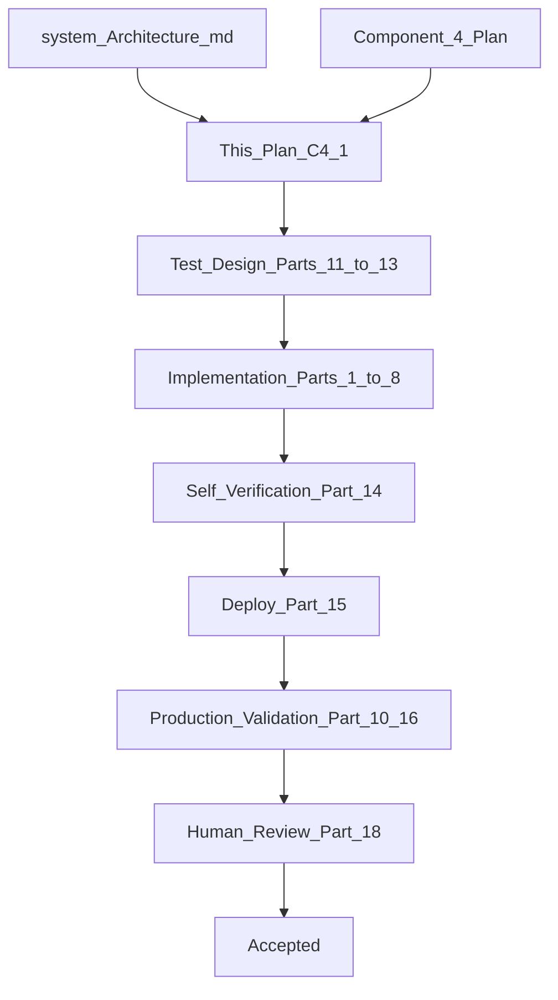

# Component 4.1 — Business Intent, Grounded Response Faithfulness, Verified Fact Registry

**This document is the Goal Document for Component 4.1.** The implementing agent implements **this document only** — not chat history.

**Builds on:** [component_4_harness_dbafc641.plan.md](.cursor/plans/component_4_harness_dbafc641.plan.md) (C4 harness — loop, execution engine, trace schema remain unchanged).

**Production evidence:** [agent trace.csv](agent%20trace.csv) — MSP read succeeded; Decision `respond` correct; faithfulness failed 3× (~26s) via extractor false positives; `businessIntent` wrongly copied from `objectives[0].objectiveDescription`.

**Architecture references:** [docs/system_Architecture.md](docs/system_Architecture.md)

| Topic | Section |
|-------|---------|
| Three Engineering Disciplines | §1 (~102–155) |
| Verification layers (Layer 3 superseded here) | §6.10 (~4223–4528) |
| Production-first development | §6.16 (~5887–5910) |
| Engineering Methodology (Chapter 15) | ~8851+ |
| Agent traceability | [docs/agent-traceability-and-agent-state.md](docs/agent-traceability-and-agent-state.md) |

**Explicit non-goals:** Inventory capability (C5), GO loop changes, `queries.csv` edits, LLM on faithfulness verification path.

---


## Part 0 — Engineering Loop (Chapter 15)

Per [system_Architecture.md Chapter 15](docs/system_Architecture.md):



### 0.1 Engineering philosophy (locked)

- **Architecture designed by humans;** coding agent implements within boundaries.
- **Production-first:** validate on deployed Cloudflare + live Telegram — not local-only ([§5887–5910](docs/system_Architecture.md)).
- **Mocks are not authority** for Gemini binding behavior on respond path — use **G4 spike** + manual ONB runs.
- **Implementing agent MUST execute** deploy, `npm test`, `wrangler tail --format pretty`, SQL — not only write test files.
- **Human reviews observable outcomes:** trace rows, Telegram message, binding verification in trace — not line-by-line code.

### 0.2 Verification philosophy

- Unit tests prove **deterministic** registry builder and binding verifier (BV-* catalog).
- Production integration proves **one real Gemini grounded-response call** (G4) and **2–3 ONB manual runs** (Part 10).
- If trace shape unclear: STOP → exploratory SQL → align → continue.

### 0.3 Three disciplines — C4.1 scope

| Discipline | C4.1 application |
|------------|------------------|
| **Context engineering** | Response step receives **Fact Catalog** (factId, catalogLabel, field, valueType) — not re-parsed NL claims |
| **Harness engineering** | Registry build (code), schema validate (code), binding verify (code), regen loop (code), delivery strip bindings |
| **Loop engineering** | Unchanged GO loop; faithfulness is post-respond gate only; clarify path skips bindings |

### 0.4 Stopping rules

Terminate only when:

- All Part 17 acceptance criteria satisfied
- BV-* unit tests green
- G4 production spike documents JSON shape
- Manual Part 10 matrix: minimum ONB-018, ONB-003, ONB-016 (clarify = no bindings)
- [agent trace.csv](agent%20trace.csv) scenario passes first-pass `FAITHFULNESS_VERIFIED`
- Knowledge-base doc created (Part 9)
- Human Part 18 sign-off

---

## Part 1 — Problems and locked fixes

| # | Issue | Root cause | C4.1 fix |
|---|--------|------------|----------|
| P1 | Wrong business intent in Decision | [`planning-mode.ts`](src/global-orchestrator/planning-mode.ts) `objectives[0].objectiveDescription` | Top-level `businessIntent` in Planning JSON |
| P2 | Faithfulness false failures + latency | NL extractor LLM + broken matcher | Grounded response + binding verifier (code only) |
| P3 | Product–quantity not verifiable as relationship | Flat `CanonicalFact` | `VerifiedFactRecord` + `factId` bindings |
| P4 | C4 production regression | [agent trace.csv](agent%20trace.csv) | Reproduce as mandatory acceptance run |

---

## Part 2 — Business intent (P1)

### 2.1 Planning JSON contract

Extend [`StructuredCapabilityPlan`](src/global-orchestrator/types.ts):

```json
{
  "businessIntent": "Owner wants to see their shop profile",
  "objectives": [ ... ]
}
```

**Verifier rules** ([`verifyCapabilityPlan`](src/global-orchestrator/execution-engine/plan-verification.ts)):

- `businessIntent` required, non-empty, trimmed length ≥ 3
- When `objectives.length > 1`: `businessIntent` must not equal any single `objectiveDescription` (string equality)
- Log `console` warning (trace optional) if `businessIntent === objectives[0].objectiveDescription` when `objectives.length === 1` (smoke signal, not hard fail)

### 2.2 Harness storage

- [`planCapabilities`](src/global-orchestrator/planning-mode.ts): `runContext.businessIntent = plan.businessIntent` — **delete** objectiveDescription fallback
- Decision fallback chain: `businessIntent` → inbound text stripped of `/new` prefix → never objective description
- Strategic replan: include prior `businessIntent` in planning context; Planning may revise with explicit new `businessIntent` in JSON

### 2.3 Decision context

[`decisionContextSlice`](src/store-durable-object/agent-state/run-context.ts): first line `Business intent: {businessIntent}` from plan field only.

---

## Part 3 — Verified Fact Registry (P3)

### 3.1 `VerifiedFactRecord`

New module: `src/global-orchestrator/verified-facts/types.ts`

```typescript
interface VerifiedFactRecord {
  factId: string;
  objectiveId: string;
  capabilityId: string;
  toolName: string;
  jsonPath: string;
  field: string;
  value: string;
  valueType: "string" | "number" | "boolean" | "json";
  identity?: { sku?: string; canonicalName?: string; entity?: string };
  catalogLabel: string;
}
```

### 3.2 factId assignment (code only)

Pattern: `{capabilityId}_{objectiveId}_{toolName}_{pathSlug}`

MSP examples:

- `my_shop_profile_fetch_shop_profile_read_shop_profile_shopName`
- `my_shop_profile_fetch_shop_profile_read_shop_profile_gstRegistered`

### 3.3 MSP registry builder

`src/global-orchestrator/verified-facts/msp-fact-registry.ts` — from [`read_shop_profile`](src/my-shop-profile/tools/read-shop-profile.ts) result keys: `shopName`, `ownerName`, `gstin`, `gstRegistered`, `instructions`.

Each record `catalogLabel` examples:

- `"Shop name (shopName): Bantu Kirana"`
- `"GST registered (gstRegistered): true"`

### 3.4 Inventory convention (documented in KB, fixture-tested pre-C5)

One record per `(sku, field)` — quantity line binds **that SKU's factId**, verifying **Maggi=5** as identity+value tuple, not bare `5`.

### 3.5 RunContext

- Replace `verifiedFactsAccumulator: CanonicalFact[]` with `verifiedFactRegistry: Map<string, VerifiedFactRecord>`
- `buildRegistryFromPhaseResult(phaseResult)` after `executePhase`
- `factCatalogForResponse()` — JSON for Response prompt: `{ factId, catalogLabel, field, valueType }`
- `factsForDecision()` — export registry values for Decision context (replaces flat canonical list)

---

## Part 4 — Grounded Response (replaces extractor)

### 4.1 Schema `GroundedResponse`

```json
{
  "lines": [
    {
      "display": "Shop name: Bantu Kirana",
      "bindings": [
        { "factId": "my_shop_profile_..._shopName", "field": "shopName", "asShown": "Bantu Kirana" }
      ]
    }
  ]
}
```

Inventory example:

```json
{
  "lines": [
    {
      "display": "Maggi packets in stock: 5",
      "bindings": [
        { "factId": "inventory_..._MAG-001_quantity", "field": "quantity", "asShown": "5" }
      ]
    }
  ]
}
```

**Rules:**

- Factual lines: `bindings.length >= 1`
- Prose lines: `bindings: []` only if prose detector finds no citeable tokens (GSTIN regex, product+number patterns)
- User delivery: `lines.map(l => l.display).join("\n")`
- Bindings never in Telegram payload

### 4.2 Binding verifier

`src/global-orchestrator/faithfulness/binding-verifier.ts`

```text
FOR each line:
  IF bindings empty AND proseDetector(display) → FAIL unbound_factual_line
  FOR each binding:
    record = registry.get(factId)
    IF NOT record → FAIL unknown_factId
    IF binding.field != record.field → FAIL field_mismatch
    IF NOT valuesMatch(asShown, record.value, record.valueType) → FAIL value_mismatch
RETURN failures[{ lineIndex, factId, field, expected, asShown, reason }]
```

**valuesMatch:** string trim/lowercase; boolean `yes`/`true`; number parse; json canonical stringify.

**Swap detection:** wrong factId for product fails on `value_mismatch` when asShown doesn't match that record's value.

### 4.3 Outcome bindings

```json
{ "display": "GST update was not applied.", "outcomeBindings": [{ "outcomeId": "deny_...", "kind": "denied" }] }
```

Built from `denied` results — not `verifiedFacts`.

### 4.4 Faithfulness gate

```text
grounded = generateGroundedResponse()  // ONE LLM, JSON
IF NOT schemaValid(grounded) → regen with schema errors (capped)
failures = verifyBindings(grounded, registry)
IF failures.empty → FAITHFULNESS_VERIFIED → deliver display concat
ELSE → regen with line diagnostics (MAX_FAITHFULNESS_REGEN)
IF exhausted → FAITHFULNESS_SAFE_FALLBACK
```

**Delete:** `extractClaims`, `findUnsupportedClaims`, `FAITHFULNESS_EXTRACT` emission, `MAX_CLAIM_EXTRACTION_RETRIES` usage.

### 4.5 Clarify path (unchanged)

[`generateResponse`](src/global-orchestrator/response-generation.ts) clarify mode: **plain NL, no GroundedResponse, no binding gate.**

### 4.6 Wire [`orchestrate()`](src/global-orchestrator/index.ts)

Respond branch: `generateGroundedResponse` + `verifyGroundedResponse` replaces `generateResponse` + `faithfulnessGate(text)`.

---

## Part 4A — Constitution Prompts (Draft for Human Review)

### 4A.1 GO Planning (add businessIntent to existing prompt)

Add to JSON output shape and thought process step 1 output:

```text
Thought process:
1. State the owner's business intent — one sentence, what outcome they want (from conversation, not tools).
2. Express as business objectives.
3. Assign capabilities.

Output JSON:
{
  "businessIntent": "string — owner outcome in plain language",
  "objectives": [ ... ]
}

businessIntent must reflect the user's message (e.g. "fetch my business profile"), NOT repeat a single objectiveDescription verbatim when multiple objectives exist.
```

### 4A.2 GO Grounded Response (replaces plain RESPOND_SYSTEM_PROMPT)

```text
You are the Response component of the Global Orchestrator.

Output valid JSON only:
{
  "lines": [
    {
      "display": "natural language line for the owner",
      "bindings": [
        { "factId": "from Fact Catalog only", "field": "field name", "asShown": "value as shown in display" }
      ],
      "outcomeBindings": [{ "outcomeId": "from Outcome Catalog", "kind": "denied" }]
    }
  ]
}

Rules:
1. Add lines one at a time in order — each line is one thought.
2. Every factual statement needs bindings citing factId from the Fact Catalog.
3. factId identifies product/entity identity — for inventory, cite the SKU's quantity factId even if display says "Maggi".
4. field must match the catalog entry's field.
5. asShown must match how that value appears in display (e.g. "Yes" for booleans).
6. Do not invent factIds. Do not cite product A's factId while stating product B's quantity.
7. Prose-only lines (greetings) may have empty bindings only when they state no facts.
8. For denied writes, use outcomeBindings instead of fact bindings.

Fact Catalog:
{fact_catalog_json}

Outcome Catalog:
{outcome_catalog_json}

Verified context also includes owner instructions and user message.
```

### 4A.3 GO Response Clarify (unchanged plain text)

Keep existing clarify constitution from C4 — no JSON, no bindings.

---

## Part 5 — Trace and observability

| Stage | Change |
|-------|--------|
| `CAPABILITY_PLAN` | `parsed.businessIntent` in trace |
| `RESPONSE_GENERATED` | `parsed` = full `GroundedResponse` JSON |
| `FAITHFULNESS_VERIFIED` | `{ lineCount, bindingCount }` |
| `FAITHFULNESS_FAILED` | `{ lineIndex, factId, field, expected, asShown, reason, attempt }` |
| `FAITHFULNESS_EXTRACT` | **Stop emitting**; remove from TraceStage union |

Update [`sql/agent-trace.sql`](sql/agent-trace.sql) — examples for grounded response payload; filter `FAITHFULNESS_EXTRACT` deprecated.

---

## Part 6 — Constants

| Constant | C4.1 action |
|----------|-------------|
| `MAX_FAITHFULNESS_REGEN` | Keep (default 2); regen on binding/schema fail only |
| `MAX_CLAIM_EXTRACTION_RETRIES` | **Remove** or deprecate unused |
| `FAITHFULNESS_SAFE_FALLBACK` | Keep |
| `GEMINI_MODEL` | `gemini-3.6-flash` — no substitution |

Add `MAX_GROUNDED_RESPONSE_SCHEMA_RETRIES` (default 2) for invalid JSON shape before binding verify — harness retry, not faithfulness regen.

---

## Part 7 — Implementation order

1. Types: `businessIntent`, `VerifiedFactRecord`, `GroundedResponse`, `LineBinding`
2. MSP fact registry + RunContext integration
3. Planning prompt + verifier + remove objectiveDescription fallback
4. Grounded response module + schema validator + constitution 4A.2
5. Binding verifier + faithfulness gate refactor
6. Remove extractor, fact-matcher, claim-schema extractor path
7. Unit tests BV-* + INV-* fixtures
8. G4 Gemini spike
9. Trace, SQL, architecture doc, KB doc
10. Production validation Part 10 + 16

---

## Part 8 — Files to create / modify

| Action | Path |
|--------|------|
| Create | `src/global-orchestrator/verified-facts/types.ts` |
| Create | `src/global-orchestrator/verified-facts/msp-fact-registry.ts` |
| Create | `src/global-orchestrator/verified-facts/registry-builder.ts` |
| Create | `src/global-orchestrator/grounded-response/types.ts` |
| Create | `src/global-orchestrator/grounded-response/generate.ts` |
| Create | `src/global-orchestrator/grounded-response/schema.ts` |
| Create | `src/global-orchestrator/faithfulness/binding-verifier.ts` |
| Create | `src/global-orchestrator/faithfulness/values-match.ts` |
| Create | `src/global-orchestrator/faithfulness/prose-detector.ts` |
| Create | `docs/verified-facts-and-grounded-response.md` |
| Modify | `src/global-orchestrator/planning-mode.ts` |
| Modify | `src/global-orchestrator/response-generation.ts` (clarify only or split) |
| Modify | `src/global-orchestrator/faithfulness/index.ts` |
| Modify | `src/store-durable-object/agent-state/run-context.ts` |
| Modify | `src/global-orchestrator/execution-engine/plan-verification.ts` |
| Modify | `src/global-orchestrator/types.ts` |
| Modify | `src/global-orchestrator/index.ts` |
| Delete | `src/global-orchestrator/faithfulness/fact-matcher.ts` |
| Delete | `src/global-orchestrator/faithfulness/claim-schema.ts` (or keep schema.ts renamed for GroundedResponse only) |
| Update | `docs/system_Architecture.md` Layer 3 |
| Update | `docs/agent-traceability-and-agent-state.md` |

---

## Part 9 — Knowledge-base document (required deliverable)

**Create:** [docs/verified-facts-and-grounded-response.md](docs/verified-facts-and-grounded-response.md)

This is the **authoritative contract for future capability/tool authors**. Sections:

### 9.1 Purpose

Why grounded response replaced NL claim extraction (P2 regression, no NL→NL verification).

### 9.2 Tool author checklist

When designing a new tool or capability, ensure:

1. **Tool returns structured `verifiedFacts`** — flat or nested; every citeable field must be machine-addressable via `jsonPath`.
2. **Register a fact builder** — add capability-specific walker in `verified-facts/{capability}-fact-registry.ts`.
3. **One `VerifiedFactRecord` per citeable atomic fact** — for inventory: per `(sku, field)` not one blob.
4. **catalogLabel must disambiguate identity** — include SKU/canonical name so Response LLM picks correct `factId`.
5. **identity.sku / identity.canonicalName** for multi-entity domains.
6. **valueType** must be set correctly for `valuesMatch`.
7. **Do not put non-truth in verifiedFacts** — `denied`, `clarification_needed` go to Outcome Catalog.
8. **Test fixtures** — add BV/INV unit fixtures when adding capability.

### 9.3 jsonPath conventions

- Scalar: `shopName`, `gstin`
- Array item: `items[sku=MAG-001].quantity`
- Nested: `customer.balance.current`

### 9.4 What requires re-engineering after C4.1

| Component | Re-engineer? |
|-----------|--------------|
| MSP tools | Register builder only — tool output shape OK |
| Inventory (C5) | New registry walker + INV fixtures |
| Billing line items | Per-line-item fact records |
| Faithfulness module | **Replaced** — no extractor |
| C4 plan Part 8 | Superseded by C4.1 |
| `accumulateVerifiedFacts` flat mapping | **Removed** |

### 9.5 Response generator responsibilities (single LLM call)

- Publish bindings at write time — not post-hoc extraction.
- `factId` = identity anchor; `asShown` = value check.

### 9.6 Verifier responsibilities (code only)

- Schema validate → binding verify → regen → fallback.
- No LLM on verify path.

---

## Part 10 — MSP Profile Test Matrix (production manual + trace)

Linked to [queries.csv](queries.csv). **Do not edit queries.csv.** Implementing agent runs these after deploy.

### 10.1 shop_identity facet

| ONB ID | Query (summary) | Path | C4.1 faithfulness expectation |
|--------|-------------------|------|------------------------------|
| [ONB-003](queries.csv) | What is my shop name? | read → respond | Grounded lines bind `shopName` factId; first-pass VERIFIED |
| [ONB-004](queries.csv) | Partial identity write | write + confirm | Post-confirm respond binds updated `shopName` |
| [ONB-006](queries.csv) | Change shop name | confirm flow | After apply, respond binds new name |
| [ONB-007](queries.csv) | Deny rename | denied outcome | `outcomeBindings` or prose-only denial line; no false fact binds |
| [ONB-026](queries.csv) | Tell me about my shop | read multi-field | Multiple lines, each with correct factId per field |

### 10.2 tax_registration facet

| ONB ID | Query (summary) | C4.1 expectation |
|--------|-----------------|------------------|
| [ONB-018](queries.csv) | What is my GSTIN? | **Mandatory regression** — reproduces [agent trace.csv](agent%20trace.csv); `gstin` binding; first-pass VERIFIED; no `FAITHFULNESS_EXTRACT` |
| [ONB-010](queries.csv) | GST register + confirm | Post-confirm respond binds `gstin` + `gstRegistered` |
| [ONB-016](queries.csv) | GST registered, no GSTIN | **Clarify path** — no grounded response gate |
| [ONB-017](queries.csv) | Deny tax update | Outcome binding or denial prose |
| [ONB-011](queries.csv) | Invalid GSTIN | Clarify or harness retry — no faithfulness on clarify |

### 10.3 instructions facet

| ONB ID | Query (summary) | C4.1 expectation |
|--------|-----------------|------------------|
| [ONB-022](queries.csv) | What instructions have I given? | `instructions` field binding; json valueType |
| [ONB-019](queries.csv) | Reply in Hindi | Write path; respond may acknowledge — bind only stated facts |

### 10.4 business intent checks (cross-cutting)

| Scenario | Verify in trace |
|----------|-----------------|
| `/new fetch my business profile` | Decision `Business intent:` ≈ user fetch intent, NOT long objectiveDescription |
| [ONB-024](queries.csv) multi-facet | `businessIntent` spans facets; not equal to single objective |

### 10.5 Per-run checklist (each manual run)

1. `npm run deploy`
2. Send message (Telegram or webhook)
3. `wrangler tail --format pretty` — note `correlation_id`
4. Run `sql/agent-trace.sql` for `update_id`
5. Confirm: `CAPABILITY_PLAN.parsed.businessIntent` present
6. Confirm: no `FAITHFULNESS_EXTRACT` events on respond path
7. Confirm: `FAITHFULNESS_VERIFIED` on first or second attempt (not 3× fail)
8. Telegram message has no `factId` or JSON
9. Compare DB `verify_in_db` column from queries.csv

**Minimum manual set for C4.1 sign-off:** ONB-018 + ONB-016 + ONB-007 (respond + clarify + deny).

---

## Part 11 — Test design (production-first)

### 11.1 Environment ([vitest.setup.ts](vitest.setup.ts))

| Variable | Required | Purpose |
|----------|----------|---------|
| `GEMINI_API_KEY` | G4 | Grounded response spike |
| `WORKER_WEBHOOK_URL` | P* | Integration |
| `WEBHOOK_SECRET` | P* | Webhook auth |

### 11.2 Unit tests (deterministic — no network)

| File | Purpose |
|------|---------|
| `verified-facts/msp-fact-registry.test.ts` | Registry IDs, catalogLabels, all 5 MSP fields |
| `faithfulness/binding-verifier.test.ts` | Full BV-* catalog (Part 12) |
| `faithfulness/values-match.test.ts` | Boolean Yes/true, numbers, json |
| `faithfulness/prose-detector.test.ts` | GSTIN pattern, unbound detection |
| `grounded-response/schema.test.ts` | Invalid JSON shapes rejected |
| `execution-engine/plan-verification.test.ts` | Missing `businessIntent` rejected |

### 11.3 Production integration

| ID | Test | Verify |
|----|------|--------|
| C4.1-G4 | Real Gemini `generateGroundedResponse` with fixture catalog | Valid JSON; bindings pass verifier; trace shape documented |
| C4.1-P1 | POST ONB-018 equivalent webhook | 200; trace has `FAITHFULNESS_VERIFIED`; no EXTRACT |
| C4.1-P2 | Replay ONB-018 updateId | No duplicate delivery |

### 11.4 Simple LLM call for loop validation (G4 spike procedure)

**Purpose:** Confirm Gemini returns valid `GroundedResponse` with real API before full deploy loop.

```bash
# Implementer: fixture fact catalog in test file, call generateGroundedResponse
# against GEMINI_API_KEY with user message "fetch my business profile"
# Assert: parsed.lines.length >= 1
# Assert: every binding.factId in fixture catalog
# Assert: verifyBindings returns []
```

Document result in KB doc appendix and `agent-traceability` doc.

---

## Part 12 — Binding verifier test catalog (BV-*)

**All deterministic — no mocks for matcher logic.**

| ID | Input | Expected |
|----|-------|----------|
| BV-01 | Valid MSP shopName binding | PASS |
| BV-02 | Valid gstin binding | PASS |
| BV-03 | gstRegistered `asShown: "Yes"`, fact `"true"` | PASS (boolean norm) |
| BV-04 | `asShown: "Bantu Kirana"`, fact `"Other Shop"` | FAIL value_mismatch |
| BV-05 | Unknown factId | FAIL unknown_factId |
| BV-06 | `field: "name"`, record.field `shopName` | FAIL field_mismatch |
| BV-07 | Factual line, empty bindings, contains GSTIN | FAIL unbound_factual_line |
| BV-08 | Prose "Hello!" empty bindings | PASS |
| BV-09 | instructions json array binding | PASS json valueType |
| BV-10 | outcomeBinding valid denied id | PASS |
| BV-11 | outcomeBinding unknown id | FAIL |

### Inventory fixtures (INV-*) — synthetic registry, pre-C5

| ID | Scenario | Expected |
|----|----------|----------|
| INV-01 | Maggi line binds `MAG-001_quantity`, asShown `5`, fact value `5` | PASS |
| INV-02 | Maggi display, binds `ATTA_quantity` asShown `5`, atta fact `26` | FAIL value_mismatch |
| INV-03 | Maggi display "26", binds `MAG-001_quantity` asShown `26`, fact `5` | FAIL value_mismatch |
| INV-04 | Two lines, correct factIds each | PASS |
| INV-05 | Same factId twice, consistent values | PASS |

---

## Part 13 — Gemini spike G4 (mandatory)

Before production sign-off:

1. `source .dev.vars`
2. Call `generateGroundedResponse` with production constitution 4A.2
3. Fixture catalog mimicking MSP read (5 facts)
4. User prompt: `fetch my business profile`
5. Record: raw JSON, `usageMetadata`, duration
6. Run `verifyBindings` — must PASS on first attempt for fixture-aligned response
7. Add `src/integration/grounded-response-production.integration.test.ts` (skip if no `GEMINI_API_KEY`)
8. Document in KB appendix

---

## Part 14 — Self-verification loop

Each iteration:

1. Read this plan
2. Implement one Part 7 step
3. `npm run typecheck`
4. `npm test` (BV-* must pass)
5. `npm run deploy` if respond/faithfulness touched
6. `wrangler tail --format pretty`
7. Manual ONB from Part 10 if binding/trace touched
8. Compare Part 17 acceptance
9. Revise until green

---

## Part 15 — Per-ONB expected trace (C4.1 updates)

| ID | Expected stages (respond path) | C4.1 delta vs C4 |
|----|-------------------------------|------------------|
| ONB-018 | PLAN (with businessIntent) → … → DECISION respond → RESPONSE_GENERATED (parsed GroundedResponse) → **FAITHFULNESS_VERIFIED** (no EXTRACT) | First-pass verify |
| ONB-016 | … → DECISION clarify → RESPONSE (plain) | No FAITHFULNESS_* |
| ONB-017 | … → denied → DECISION respond → outcomeBindings or safe prose | No fact binds on denial |
| ONB-010 | … → FAITHFULNESS_VERIFIED with gstin binding | Post-confirm facts |

---

## Part 16 — Production deployment

1. `npm run typecheck`
2. `npm test`
3. `npm run deploy`
4. G4 spike green
5. Manual Part 10 minimum trio
6. Re-run [agent trace.csv](agent%20trace.csv) scenario — document before/after trace diff
7. Part 18 human review

---

## Part 17 — Acceptance criteria

### 17.1 Business intent

| AC | Criterion | Verification |
|----|-----------|----------------|
| AC-1 | `businessIntent` in Planning JSON + trace | SQL/trace |
| AC-2 | Decision context uses plan `businessIntent`, not objectiveDescription | Trace DECISION invocation |
| AC-3 | Verifier rejects plan without `businessIntent` | Unit test |

### 17.2 Grounded response faithfulness

| AC | Criterion | Verification |
|----|-----------|----------------|
| AC-4 | No `go_faithfulness_extract` / `FAITHFULNESS_EXTRACT` on respond path | Trace |
| AC-5 | ONB-018 / agent trace scenario: first-pass `FAITHFULNESS_VERIFIED` | Manual + trace |
| AC-6 | User message = display lines only | Telegram inspect |
| AC-7 | INV-02, INV-03 swap tests fail in unit tests | BV test run |
| AC-8 | Regen cap + safe fallback still work | Induced binding fail test |
| AC-9 | Clarify path skips binding gate | ONB-016 manual |

### 17.3 Registry + docs

| AC | Criterion | Verification |
|----|-----------|----------------|
| AC-10 | MSP registry emits 5 citeable facts per read | Unit test |
| AC-11 | KB doc exists with tool author checklist | File present |
| AC-12 | `system_Architecture.md` Layer 3 updated | Doc review |

### 17.4 Production

| AC | Criterion | Verification |
|----|-----------|----------------|
| AC-13 | G4 integration test passes with API key | npm test |
| AC-14 | Deploy succeeds | CLI |
| AC-15 | Faithfulness phase < 10s for simple read (no 3× extract loop) | Tail timestamps |

---

## Part 18 — Human review checklist

### 18.1 Architecture

- [ ] Business intent separate from objectives in Planning trace
- [ ] No NL claim extractor on respond path
- [ ] Binding verifier is code-only
- [ ] factId encodes product identity for inventory convention

### 18.2 Observability

- [ ] Trace shows `GroundedResponse` parsed JSON
- [ ] Binding failures show `lineIndex`, `factId`, `expected`, `asShown`
- [ ] [agent trace.csv](agent%20trace.csv) scenario improved (before/after)

### 18.3 MSP profile matrix

- [ ] ONB-018 passed first-pass faithfulness
- [ ] ONB-016 clarify has no faithfulness loop
- [ ] ONB-007 deny handled without false fact binds

### 18.4 Knowledge base

- [ ] [docs/verified-facts-and-grounded-response.md](docs/verified-facts-and-grounded-response.md) reviewed
- [ ] Future inventory author knows registry + catalogLabel rules

### 18.5 Prompts

- [ ] Part 4A.1 and 4A.2 constitutions approved

---

## Part 19 — Carry forward

- C5 Inventory: implement `inventory-fact-registry.ts` per KB doc
- Optional: code-render bound values into display (stronger than asShown check)
- C4 plan Part 8 header: mark superseded by C4.1

---

## Appendix A — C4 regression post-mortem (why C4.1 exists)

**Symptom:** [agent trace.csv](agent%20trace.csv) steps 11–18 — 3× `FAITHFULNESS_EXTRACT` + `FAITHFULNESS_FAILED` + regen (~26s).

**Cause:** Extractor used `attribute: "name"` vs fact `shop_name`; `gstRegistered: "Yes"` vs fact `"true"`. Matcher keyed aliases wrong direction. Response was correct; verifier rejected it.

**Lesson:** Never verify NL with NL. Grounded response publishes citations at generation time; code verifies against tool-sourced registry.

**businessIntent bug:** [`planning-mode.ts`](src/global-orchestrator/planning-mode.ts) lines 63–65 — fixed by explicit Planning field.
