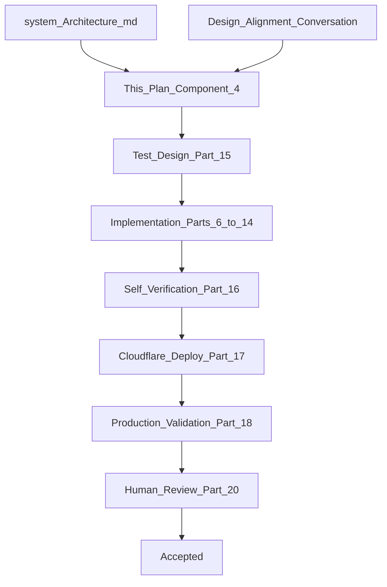

# Component 4 — Orchestration Harness Completion: Agent Traceability, Full GO Loop, Faithfulness

**This document is the Goal Document for Component 4.** The implementing agent implements **this document only** — not chat history.

**Architecture references:** [docs/system_Architecture.md](docs/system_Architecture.md)


| Topic                                                      | Section                                                                                  |
| ---------------------------------------------------------- | ---------------------------------------------------------------------------------------- |
| Global Orchestrator loop, Decision Mode, Execution Engine  | §6.4 (~~2625–2753), loop stages (~~3104–3383)                                            |
| Orchestration Constitution                                 | §6.5 (~2790+)                                                                            |
| Recursive orchestration (GO ↔ Capability same abstraction) | §6.7 (~3547–3619)                                                                        |
| Clarification strategy                                     | §6.9 (~3956+)                                                                            |
| Verification layers (Plan / Business / Faithfulness)       | §6.10 (~4223–4528)                                                                       |
| Observability layers                                       | §6.13                                                                                    |
| Agent state                                                | §6.18 (~6384–6460)                                                                       |
| Production-first development                               | §6.16 (~~5887–5910), Runtime Acceptance (~~5833–5861)                                    |
| Component acceptance checklist                             | (~6085–6098)                                                                             |
| Engineering Methodology                                    | Chapter 15 (~8851+)                                                                      |
| Agent traceability spec                                    | [docs/agent-traceability-and-agent-state.md](docs/agent-traceability-and-agent-state.md) |


**Builds on:**

- [Component 1 plan](.cursor/plans/component_1_worker_plan_23e36070.plan.md) — Worker transport, contracts
- [Component 2 plan](.cursor/plans/component_2_do_runtime_a07d3d0d.plan.md) — DO runtime kernel, ledger, Conversation Manager, fast-ack / alarm / no `waitUntil`
- [Component 3 plan](.cursor/plans/component_3_go_profile_d6b06d48.plan.md) — Real GO, My Shop Profile, confirmation, TelegramDeliveryService

**Glossary:**


| Term             | Meaning                                                                                                                                    |
| ---------------- | ------------------------------------------------------------------------------------------------------------------------------------------ |
| **MSP**          | **My Shop Profile** — the `my_shop_profile` business capability (shop identity, GST/tax, agent instructions). Only capability in C4 scope. |
| **GO**           | Global Orchestrator                                                                                                                        |
| **BC**           | Business Capability (MSP in C4)                                                                                                            |
| **L1 / L2 / L3** | In-memory RunContext / SQLite `agent_trace_events` / optional `orchestration_checkpoints` snapshot                                         |


**Explicit non-goals (deferred):** Inventory capability (C5), multi-capability group planning, Cloudflare Queues, DO eviction resume/checkpoint recovery, `queries.csv` edits, `complete_autonomy` UX exposure (tool exists when user explicitly asks).

---

## Part 0 — Engineering Loop (Chapter 15)

Per [system_Architecture.md Chapter 15](docs/system_Architecture.md#chapter-15--engineering-methodology):




### 0.1 Engineering philosophy (locked)

From Chapter 15 and alignment conversation:

- **Architecture is designed by humans;** the coding agent implements within explicit boundaries.
- **The coding agent is not the architect.** It is an implementation engineer inside the engineering loop.
- **Production-first:** every component validated on deployed Cloudflare + live Telegram — not a local prototype patched later ([§5887–5910](docs/system_Architecture.md)).
- **Mocks are not authority** for Gemini, Telegram, or DO behavior ([Production-First Testing](docs/system_Architecture.md#production-first-testing)).
- **Success = independent verification:** automated tests, SQLite state, `wrangler tail --format pretty`, manual Telegram — not code generation confidence.
- **Human engineer reviews observable outcomes:** trace rows, ledger, `shop_profile`, tail logs, bot UX — **not** line-by-line code review.
- **The implementing agent MUST execute validation** (deploy, test, tail, SQL queries) — not only write test files.

### 0.2 Verification philosophy

From Chapter 15 §Verification Philosophy:

- The implementation agent is never the sole judge of correctness.
- Failure diagnostics from tests/SQL/tail become structured feedback for the next iteration.
- If SQLite trace shape is unclear during implementation: **STOP**, run exploratory queries on deployed store, ask human for sample output, align schema, then continue.

### 0.3 Stopping rules

Loop terminates only when ALL are true:

- Every Part 19 acceptance criterion satisfied
- Production integration tests pass against **deployed** worker
- `wrangler deploy` successful with `GEMINI_API_KEY`
- Manual validation: 2–3 runs from existing [queries.csv](queries.csv) fully reconstructable from SQLite via rewritten [sql/agent-trace.sql](sql/agent-trace.sql)
- Human engineering review approves (Part 20)
- Temporary debug scripts removed or clearly marked DEBUG ONLY

**Context rule:** If implementation drifts, restart from this plan — not chat history.

---

## Part 1 — Goal Document (Authoritative Objective)

### 1.1 Architectural objective

Complete the **orchestration harness** that Component 3 started. C3 proved the vertical slice (real Gemini GO + MSP + tool-owned confirmation). C4 makes the harness **architecturally complete, auditable, and production-observable** — without adding new business capabilities.

Validate in production that:

- The **full GO strategic loop** works: plan → verify → **execute complete plan interaction** → decide → (`replan` | `clarify` | `respond`) → faithfulness (respond path only) → deliver
- **Execution engine** runs the **entire plan as one interaction** (dependency-aware); it **never** invokes Decision Mode
- **Decision Mode** runs **once** after the full execution phase — judges whether **business intent** is met
- **Agent trace events** persist every harness step with full LLM invocation context + output + tokens + reasoning (trace-only)
- **Faithfulness verification** gates factual responses (hybrid: schema-validated claim extraction + deterministic matching)
- **BC parameter grounding** reduces hallucinated tool parameters before execution
- **Profile change history** audits post-confirmation applied writes
- Engineers reconstruct any run from SQLite alone — `wrangler tail` optional for harness steps

### 1.2 What Component 4 is NOT


| Not in C4                                  | Deferred to                                             |
| ------------------------------------------ | ------------------------------------------------------- |
| Inventory, Billing, Khata capabilities     | C5 / C6                                                 |
| Multi-capability DAG group planning UI     | Later                                                   |
| Cloudflare Queues                          | Post-harness                                            |
| DO eviction resume from checkpoints        | Post-harness                                            |
| Editing `queries.csv`                      | Full capability query matrix conversation               |
| Exposing `complete_autonomy` in onboarding | User must ask explicitly; tool path exists in MSP tools |


### 1.3 Transport (unchanged from C3)

Worker fast-ack → DO `work_queue` + `alarm` → Execution Manager → GO → MSP → `TelegramDeliveryService`. No `ctx.waitUntil` on message path. See [Component 2 plan](.cursor/plans/component_2_do_runtime_a07d3d0d.plan.md) and C3 Part 2.9.

---

## Part 2 — Locked Architectural Decisions

These are **not open to interpretation**. Implement exactly.

### 2.1 Harness ≠ reasoning engine

The Global Orchestrator is a **harness**, not a monolithic LLM agent ([agent-traceability-and-agent-state.md](docs/agent-traceability-and-agent-state.md)):


|             | ReAct / tool-calling agent | Harness (this system)                                           |
| ----------- | -------------------------- | --------------------------------------------------------------- |
| Loop owner  | LLM decides next phase     | **TypeScript code** enforces REASON → VERIFY → EXECUTE → DECIDE |
| LLM output  | Actions + observations     | **Artifacts only:** plan JSON, decision JSON, response text     |
| Correctness | Probabilistic chain        | **Deterministic gates** between phases                          |


**Most of the Global Orchestrator constitution (§6.5) is enforced by code**, not repeated in system prompts. System prompts carry only the **minimal slice** needed for that step's artifact.

### 2.2 Two replan mechanisms — never conflate


| Mechanism            | Trigger                                                       | Decision Mode? | Who decides                                   | Goal optimized                     |
| -------------------- | ------------------------------------------------------------- | -------------- | --------------------------------------------- | ---------------------------------- |
| **Harness retry**    | Plan structurally invalid (GO Layer 1 or BC tool-plan verify) | **No**         | Deterministic verifier → Planning immediately | Fix the **plan artifact**          |
| **Strategic replan** | Business objectives not satisfied after execution phase       | **Yes**        | Decision Mode → Planning                      | Fix **intent → objective** mapping |


**Why harness retry bypasses Decision Mode:** the verifier answers a deterministic question ("is this plan structurally executable?"). Decision Mode answers a strategic question ("given verified evidence, what next?"). Different question, different owner.

Both must emit trace events: `PLAN_VERIFICATION_FAILED` / `TOOL_PLAN_VERIFICATION_FAILED` with structured diagnostics.

### 2.3 Loop ownership — no nested strategic loops


| Layer        | Strategic loop?                                     | Harness retry (pre-execution only)?                   |
| ------------ | --------------------------------------------------- | ----------------------------------------------------- |
| **GO**       | Yes — `replan` / `clarify` / `respond` only (**no `continue`**) | Yes — GO plan verify fail                             |
| **BC (MSP)** | **No** — single shot per GO invocation              | Yes — tool-plan verify fail, parameter grounding fail |


**Why BC has no strategic loop:** GO and BC both replanning would address overlapping pain points (O(n²) agent loops). GO owns business-intent strategy; BC owns executing **one plan artifact** for one objective invocation.

**BC post-tool / post-operation failure:** return `CapabilityResult` to GO → **strategic replan**. **No BC harness retry** after tool execution.

**Capabilities are typed subroutines, not nested ReAct agents.**

### 2.3a Execution engine — complete plan interaction; never Decision (locked)

The execution plan is **one multi-capability interaction** for this turn. The execution engine runs that **entire interaction** before any strategic judgment.

| Rule | Detail |
|------|--------|
| **Owner** | Deterministic code only (`executePhase`) — no LLM, no Decision Mode, no Planning |
| **Scope** | All runnable objectives on the current plan version until fixpoint |
| **When Decision runs** | **Once**, after `executePhase` returns the full result map |
| **No `continue`** | There is no "execute one objective → Decision → execute more on same plan." Partial completion is not a Decision branch — either the plan modeled all needed work, or Decision chooses `replan` for a new plan version |
| **Independents** | If objective A returns `clarification_needed` and B does not depend on A, B still runs in the same phase |
| **Dependents** | Objectives whose dependencies are blocked are skipped; all outcomes go to Decision together |

This invariant shapes execution-engine design: dependency graph, per-objective status machine, trace per step — but **no** calls into `decideNextAction` or any Gemini step.

### 2.4 Recursive skeleton (same abstraction, different scope)

Both GO and BC follow:

```text
REASON (Gemini artifact)
  → VERIFY PLAN (code)
  → EXECUTE (code dispatch)
  → VERIFY RESULTS (code / tool gates)
  → RETURN EVIDENCE (to parent)
```

Only **scope** differs: GO assigns objectives to capabilities; BC assigns operations to tools.

### 2.5 Three verification questions (§6.10)


| Layer                               | Question                                      | Owner                  | When                                       |
| ----------------------------------- | --------------------------------------------- | ---------------------- | ------------------------------------------ |
| **Layer 1 — Plan verification**     | Is the execution plan valid?                  | GO code                | Before execution                           |
| **Layer 2 — Business verification** | Did the business operation execute correctly? | BC / tools             | During/after tool execution                |
| **Layer 3 — Faithfulness**          | Does NL response match verified facts?        | GO faithfulness module | After response generation, before delivery |


**GO execution engine does NOT perform Layer 2.** It collects `CapabilityResult` and traces step completion.

### 2.6 Clarification vs confirmation vs verified facts

Carry forward C3 Part 2.2–2.3 ([component_3 plan](.cursor/plans/component_3_go_profile_d6b06d48.plan.md)):


|                            | **Clarification**                         | **Confirmation**                                  |
| -------------------------- | ----------------------------------------- | ------------------------------------------------- |
| **Meaning**                | Missing information                       | Authorize a complete write                        |
| **User action**            | Type in chat                              | Tap **Yes/No** `callback_query` only              |
| **State machine**          | **None** — conversation turns are memory  | `pending_confirmations` + in-memory promise on DO |
| **GO sees mid-flight UI?** | N/A (GO generates final clarify question) | **No** — only final tool outcome                  |
| **Chat text "yes"**        | Valid user input                          | **NOT** confirmation                              |
| **Run ends when**          | Clarify message delivered                 | Tool resolves (same work item)                    |


| Outcome                | Is business truth? | Shape                                                                                                   |
| ---------------------- | ------------------ | ------------------------------------------------------------------------------------------------------- |
| `clarification_needed` | No                 | `{ status, reason, requiredInfo }` — internal; user sees NL via Response Mode                           |
| `denied`               | No                 | `{ status: "denied", reason: "user_rejected" | "timeout" | "not_confirmed" }` — **not** `verifiedFacts` |
| `completed`            | Yes                | `{ status: "completed", verifiedFacts }` — reflects SQLite business state                               |


- **Empty parameters:** tool throws `clarification:`* → MSP `mapToolError` → `clarification_needed`
- **No post-clarification re-confirm in GO:** tools own write authorization at confirmation time (§6.9 philosophy)

### 2.7 Agent state vs conversation state


|                         | **Conversation state**                    | **Agent state**                                           |
| ----------------------- | ----------------------------------------- | --------------------------------------------------------- |
| **Audience**            | Shop owner                                | Engineers / harness stages in same run                    |
| **Persistence**         | `conversation_turns`                      | `agent_trace_events` (L2)                                 |
| **Updated when**        | User turn at start; assistant turn at end | After every harness transition                            |
| **Contains**            | User + final assistant NL                 | Plans, verifications, LLM I/O, decisions, replan versions |
| **Mid-loop pollution**  | **Never** plans/decisions                 | Full agency graph                                         |
| **Used for replanning** | Background dialogue only                  | **Required:** plan artifact + results at each version     |


**Per Telegram `message` event:** new `correlation_id`, new L1 RunContext, append L2 events, terminal → L1 discarded.

**Two sequential Telegram messages = two agent runs.** Continuity via `conversation_turns` only.

**After clarification delivered:** run terminal, L1 cleared. Next message = fresh agency. **No resume machinery.**

**Confirmation exception:** same `update_id` / work item stays alive while tool `await`s callback.

### 2.8 Memory tiers


| Tier   | Storage                          | C4 role                                                                  |
| ------ | -------------------------------- | ------------------------------------------------------------------------ |
| **L1** | In-memory `RunContext`           | Authoritative during run; context engineering reads from here            |
| **L2** | `agent_trace_events` append-only | Audit source of truth                                                    |
| **L3** | `orchestration_checkpoints`      | Optional latest snapshot per strategic round — **audit only, no resume** |


SQLite is authoritative ([Caching Philosophy](docs/system_Architecture.md#caching-philosophy)). L1 is performance.

### 2.9 No shared Gemini thread (authoritative meaning)

**This does NOT mean:** one single `user` message that is a formatted string with all artifacts stuffed in.

**This DOES mean:**

1. **We do not share the whole agent state** with every LLM call.
2. **Each harness step engineers a subset** of agency into that step's API `contents` array.
3. **Within one step**, `contents` may be a **multi-turn message array** — alternating what goes **into** the API vs what came **out** of prior turns **within that step's engineered context**:
  - **User role** = input/task for that API interaction (what we send as the task)
  - **Model role** = output/artifact from a prior turn in that same engineered slice (when a follow-up turn in the same call chain is needed)
4. **Across harness steps:** each step is a **separate API invocation** with its own `system_instruction` and engineered `contents`. Output artifact from step N becomes **input (user message)** in step N+1 only if the harness explicitly demands it — not via a global shared Gemini session.
5. **Reasoning/thinking blocks** from the API → **trace only (L2)**, never into the next step's `contents`.

```text
WRONG: one Gemini session accumulating entire agent tree in contents[]
RIGHT: Step A API call → artifact → stored in L1/L2
       Step B API call → contents[] includes artifact as user turn if needed
       (subset of agency only — not full trace tree)
```

### 2.10 BC re-invoke context (when GO strategic replans)

When GO replans and calls MSP again for a related objective, **BC planning** receives:

- New **business objective** from GO
- **Prior tool plan JSON artifact** (what was attempted)
- **Prior execution results** — capability results / verified facts / denied / clarification outcomes from that invocation (so the reasoning engine knows what happened and what to do differently)

BC does **not** receive: full GO trace tree, other capabilities' internals.

### 2.11a Strategic replan — Planning context (after Decision = `replan`)

**Same Planning constitution (Part 4A.1) — no extra system "replan rules".** The engineered user `contents` carry evidence; the model re-runs the thought process: intent → objectives → capability mapping.

Strategic replan Planning context includes:

- Full conversation turns (always)
- **Business intent** (the true goal — what the owner is trying to accomplish)
- Prior capability plan JSON (objectives already mapped to capabilities — artifact, not re-derived by Decision)
- All objective results from the completed execution phase (completed, clarification, denied, skipped)
- Verified facts from completed objectives
- **Prior Decision artifact** — `action`, `rationale`, `clarificationFocus` (why intent was not met; why replan was chosen)
- Prior replan version summaries from L1/trace (`planVersion` v1 → v2 → …)

**Does NOT include:** verifier diagnostics (those are harness retry only — §2.11b).

### 2.11b Harness retry — Planning context (plan verify fail)

**Same Planning constitution (Part 4A.1).** Triggered when Layer 1 plan verification fails — **Decision Mode is never entered.**

Engineered user `contents` add:

- Verifier diagnostics (structured: unknown capability, bad dependency, etc.)
- The invalid plan attempt (optional)

**Does NOT include:** Decision rationale — no strategic judgment occurred yet.

### 2.12 Agent state versioning (harness responsibility — not LLM)

The LLM produces artifacts; the **harness** assigns versions and appends trace rows. The model does not manage `seq` or `planVersion`.

| Harness boundary | Harness action | Version |
|------------------|----------------|---------|
| Run start | `CONTEXT_ASSEMBLED`; `planVersion = 1` | `seq++` |
| After Planning | Store plan in L1; trace `CAPABILITY_PLAN` | current `planVersion` |
| After plan verify | `PLAN_VERIFIED` or `PLAN_VERIFICATION_FAILED` | same `planVersion` |
| Harness retry replan | New plan artifact before verify passes | same `planVersion` until execution starts |
| **Execution phase** | Run **complete plan interaction**; per objective `CAPABILITY_INVOKED` → children → `CAPABILITY_STEP_COMPLETED` | same `planVersion` |
| After Decision | `DECISION` with `{ action, rationale, planVersion }` | same `planVersion` |
| Strategic replan | `planVersion++`; new `CAPABILITY_PLAN` row — **append-only, never overwrite** | monotonic |
| Response / faithfulness | `RESPONSE_GENERATED`, `FAITHFULNESS_*` | tied to `planVersion` |

**L1 RunContext:** live snapshot for context engineering during the run. **L2 `agent_trace_events`:** append-only audit (`seq`, `planVersion` on payloads, `parent_event_id` for nesting).

### 2.13 Trace vs history vs logs


| Artifact                      | Purpose                                    |
| ----------------------------- | ------------------------------------------ |
| `agent_trace_events`          | Harness agency graph, LLM I/O, errors      |
| `shop_profile_history`        | Post-confirmation **applied** writes only  |
| Structured `console.log` JSON | `wrangler tail` / Cloudflare Observability |


Every caught error: L2 trace event + explicit structured log + `execution_ledger.failure_reason` when terminal.

**Trace ≠ application logs** — both required. Transport log before runtime log for same `update_id` (C3 validation carry-forward).

---

## Part 2A — Three Engineering Dimensions

### Context engineering

**What:** For each Gemini API call, which subset of state is serialized into `system_instruction` + `contents`.

**Why separate from agent state:** Agent state (L1/L2) is the full tree. Each LLM call gets only what that step needs. Dumping everything degrades accuracy and breaks phase boundaries.

**C4 deliverable:** Part 4 contracts + Part 4A constitution prompts + context builder functions (natural-language spec in Part 3).

### Harness engineering

**What:** All TypeScript around the LLM — phase transitions, verifiers, execution engine, trace writes, ports, error handling, constants.

**Why:** Business correctness compounds via gates; code owns the loop.

**C4 deliverable:** Parts 5–7, 9–11, RunContext, trace repository.

### Loop engineering

**What:** GO strategic loop: plan → verify → **one complete execution interaction** → Decision (`replan` | `clarify` | `respond`) → response/faithfulness. BC single-pass subroutine. **No `continue`.** Execution engine never calls Decision.

**Why:** Generic ReAct prompts fail; our loops are domain-specific harness implementations.

**C4 deliverable:** Part 3 NL specifications.

---

## Part 2B — Component 3 Baseline vs Component 4 Target


| Area                      | C3 today                                    | C4 target                                                      |
| ------------------------- | ------------------------------------------- | -------------------------------------------------------------- |
| `orchestrate()`           | One-shot: plan → execute → decide → respond | Full strategic loop: replan \| clarify \| respond              |
| `decideNextAction` inputs | `capabilityResults` + user message only     | Intent, plan artifact, all results, facts, prior Decision, replan history |
| `DecisionAction` type     | `respond` \| `clarify` only                 | `replan` \| `clarify` \| `respond` (**no `continue`**)         |
| Clarification path        | Early return bypasses Decision              | Execution phase completes → Decision → clarify → Response Mode |
| Denied path               | Hardcoded string in `orchestrate.ts`        | Response Mode grounded on `denied` status                      |
| `MAX_GO_GEMINI_ROUNDS`    | Misused for plan-verify retry               | Strategic loop cap only; split `MAX_GO_PLAN_VERIFY_RETRIES`    |
| Agent trace               | Table exists; not written at runtime        | Every harness step → L2                                        |
| Faithfulness              | Absent                                      | Hybrid Layer 3 on respond path                                 |
| Parameter grounding       | Absent                                      | Pre-tool deterministic checks                                  |
| Profile history           | Absent                                      | Post-confirm applied writes                                    |
| GO errors                 | Silent `catch`                              | Trace + log + ledger                                           |
| `sql/agent-trace.sql`     | Inferred placeholder rows                   | Persisted events only                                          |


Reference: [src/global-orchestrator/index.ts](src/global-orchestrator/index.ts), [docs/agent-traceability-and-agent-state.md](docs/agent-traceability-and-agent-state.md).

---

## Part 2C — Known Limitations (document, do not fix in C4)


| Scenario                                    | C4 behavior                                                               | Future          |
| ------------------------------------------- | ------------------------------------------------------------------------- | --------------- |
| DO isolate during `waitForConfirmation`     | `pending_confirmations` in SQLite; in-memory promise lost; user may retry | Queues + resume |
| DO isolate mid-run (non-confirmation)       | Fail gracefully; ledger `failure_reason`                                  | Queues retry    |
| Confirmation UI not in `conversation_turns` | Optional improvement — not blocking C4                                    | C4+ if needed   |


---

## Part 3 — Loop Engineering (Natural-Language Specifications)

### 3.0 Execution engine — one complete plan interaction (locked)

The execution plan models **one collaboration interaction** between business capabilities for this turn. The execution engine's job is to **run that entire interaction to completion** (within dependency rules) — not to pause for strategic judgment mid-plan.

**Invariants:**

- The execution engine is **deterministic code**. It **never** calls Decision Mode, Planning, or any LLM.
- It **never** invokes Decision after a single objective finishes.
- It runs until **no more runnable objectives** remain on this plan version (fixpoint: all `pending` objectives are either executed, blocked, or skipped).
- Only then does control return to the harness for **one** Decision Mode call.

**Within the single execution phase:**

- Independent objectives still run even if a sibling returns `clarification_needed`.
- Dependent objectives are skipped when a dependency is blocked.
- All results (completed, clarification, denied, error, skipped) are collected and passed to Decision **together**.

There is **no `continue` action** because there is no "partial plan execution then decide then execute more on same plan." If the plan needed more work, that work should have been modeled in the plan and run in this phase — or Decision chooses `replan` for a new plan version.

### 3.1 GO strategic loop — full algorithm

```text
FUNCTION orchestrate(ctx, ports, db, runContext):

  runContext.strategicRound = 0

  WHILE NOT terminal AND runContext.strategicRound < MAX_GO_GEMINI_ROUNDS:

    runContext.strategicRound += 1
    TRACE(CONTEXT_ASSEMBLED)  // first round only if not already traced

    // --- PLANNING (same constitution for initial, replan, harness retry) ---
    plan = CALL planCapabilities(ctx, runContext.planningContextSlice())
    TRACE(LLM_INVOCATION go_plan + CAPABILITY_PLAN artifact)

    harnessAttempt = 0
    WHILE harnessAttempt < MAX_GO_PLAN_VERIFY_RETRIES:
      verification = verifyCapabilityPlan(plan)
      IF verification.valid:
        TRACE(PLAN_VERIFIED)
        BREAK
      TRACE(PLAN_VERIFICATION_FAILED, verification.diagnostics)
      harnessAttempt += 1
      plan = CALL planCapabilities(ctx, runContext.harnessRetryContextSlice(verification))
      TRACE(LLM_INVOCATION go_plan retry)

    IF NOT verification.valid:
      RETURN terminalSafeOutcome(...)

    // --- EXECUTION PHASE: complete plan interaction (NO Decision inside) ---
    phaseResult = executionEngine.executePhase(plan, ctx, ports, db, runContext)
    // Runs ALL runnable objectives until fixpoint; see §3.0, §3.3

    // --- DECISION: once, after full execution phase ---
    decision = CALL decideNextAction(ctx, runContext.decisionContextSlice(phaseResult))
    TRACE(LLM_INVOCATION go_decision + DECISION artifact)

    IF decision.action == "replan":
      runContext.recordReplanVersion(plan, phaseResult)
      CONTINUE WHILE loop

    IF decision.action == "clarify":
      text = CALL generateResponse(..., mode=CLARIFY)
      TRACE(LLM_INVOCATION go_response clarify)
      RETURN deliver(text)

    IF decision.action == "respond":
      text = CALL generateResponse(..., mode=RESPOND)
      TRACE(LLM_INVOCATION go_response)
      text = faithfulnessGate(text, runContext.verifiedFactsFlat(), runContext)
      RETURN deliver(text)

  TRACE(ORCHESTRATION_ERROR, reason=strategic_cap_exceeded)
  RETURN terminalSafeOutcome(GENERIC_ORCHESTRATION_ERROR)
```

**Faithfulness applies only on `respond` path.** Clarify path uses Response Mode NL only — must not invent business facts in the question text.

### 3.2 BC subroutine (MSP) — full algorithm

```text
FUNCTION executeMyShopProfile(objective, ctx, ports, db, runContext, parentEventId):

  priorPlan = runContext.getBcPriorPlan(objective)
  priorResults = runContext.getBcPriorResults(objective)

  harnessAttempt = 0
  WHILE harnessAttempt < MAX_BC_TOOL_PLAN_VERIFY_RETRIES:
    plan = CALL planTools(ctx, objective, priorPlan, priorResults)
    TRACE(LLM_INVOCATION bc_plan, parent=parentEventId)
    verification = verifyToolPlan(plan)
    IF verification.valid:
      TRACE(TOOL_PLAN_VERIFIED, parent=parentEventId)
      BREAK
    TRACE(TOOL_PLAN_VERIFICATION_FAILED, diagnostics, parent=parentEventId)
    harnessAttempt += 1
    plan = CALL planTools(..., verification.diagnostics)

  IF NOT verification.valid:
    RETURN clarification_needed from verification.reason

  facts = {}
  FOR EACH op IN sortByDependencies(plan.operations):
    grounding = parameterGroundingCheck(objective.description, op)
    IF grounding.fail:
      IF canHarnessRetry:
        retry planTools with grounding diagnostic
      ELSE:
        RETURN clarification_needed(grounding.userMessage)
      TRACE(PARAMETER_GROUNDING_FAILED)

    TRY:
      result = executeTool(op, ...)
      MERGE facts
      TRACE(TOOL_EXECUTED)
    CATCH:
      RETURN mapToolError(error)

  RETURN { status: completed, verifiedFacts: facts }
```

**Post-tool:** no return to planTools — GO handles strategic replan.

### 3.3 Execution engine — dependency scheduler

```text
FUNCTION executePhase(plan, ctx, ports, db, runContext):
  // Deterministic only. NO Decision. NO LLM.
  // Run complete plan interaction until no pending runnable objectives remain.

  changed = true
  WHILE changed:
    changed = false
    FOR EACH objective IN plan.objectives IN STABLE ORDER:
      IF status != pending: CONTINUE to next objective
      IF any dependency has status IN {pending, running, clarification_needed, denied, error}:
        SET status = skipped_blocked
        changed = true
        CONTINUE
      SET status = running
      parentId = TRACE(CAPABILITY_INVOKED)
      result = invokeCapability(...)   // BC subroutine; may take minutes (confirmation await)
      UPDATE status from result
      TRACE(CAPABILITY_STEP_COMPLETED)
      changed = true

  RETURN ExecutionPhaseResult { all objective statuses and CapabilityResults }
  // Harness passes this ONCE to Decision Mode — never per-objective
```

### 3.4 Ten-objective DAG walkthrough

```text
O1,O2,O3 independent | O4→O1, O5→O2, O6→O3 | O7→O4, O8→O5, O9→O6 | O10→O9

O1→clarification_needed, O2→completed, O3→completed
→ run O2,O3; skip O4 (O1 blocked); O5,O6 if deps met; O7–O10 blocked
→ Decision sees full map → clarify → Response Mode one NL message
→ terminal; L1 cleared
```

### 3.5 MSP two-objective test (AC-5)

Plan: `read_shop_profile` + `update_instruction_preference` as independent objectives. **Both run inside one execution phase** without any Decision between them. **Single Decision** after the full interaction → `respond` or `clarify` → faithfulness on respond path.

### 3.7 Decision actions (exactly three — no `continue`)

| Action | When | Next harness step |
|--------|------|-------------------|
| **`replan`** | Business **intent** not satisfied; need new plan | `planVersion++`; Planning (§2.11a context) → verify → executePhase again |
| **`clarify`** | Missing info; cannot proceed safely | Response Mode (clarify); **terminal** run |
| **`respond`** | Intent satisfied or terminal acknowledgment (e.g. denial) | Response Mode → faithfulness → deliver; **terminal** |

**There is no `continue`:** the execution engine already ran the full plan interaction. Decision does not resume partial execution on the same plan.

### 3.6 Strategic replan scenario

Decision `replan` → Planning (§2.11a: intent + prior plan + results + **prior Decision rationale**) → verify → **full** executePhase → Decision again. BC re-invoke receives prior tool plan + prior results (§2.10).

---

## Part 4 — Context Engineering Contracts

Each LLM step: **minimal constitutional `system_instruction`** + engineered `contents` (may be multi-turn within step — see §2.9). The LLM does not manage versioning; the harness does (§2.12).

| Step | System prompt | Engineered contents | Excludes |
|------|---------------|---------------------|----------|
| **GO Planning (initial)** | Part 4A.1 | Full conversation; profile; inbound; `storeInitialized` | BC tool plans; full trace tree |
| **GO Planning (strategic replan)** | **Same 4A.1** | §2.11a: conversation + **business intent** + prior plan + all results + facts + **prior Decision rationale** + replan history | Verifier diagnostics |
| **GO Planning (harness retry)** | **Same 4A.1** | §2.11b: conversation + verifier diagnostics + invalid plan attempt | Decision artifact |
| **GO Decision** | Part 4A.2 | **Business intent**; **plan artifact** (objectives+capabilities — already reasoned); plan verify outcome; **all** objective results; verified facts; prior Decision/replan history | Raw tool I/O; re-deriving objectives |
| **GO Response (respond)** | Part 4A.3 | Verified facts; denied statuses; owner instructions | Plans |
| **GO Response (clarify)** | Part 4A.4 | Aggregated `clarification_needed`; optional completed acks | Raw JSON diagnostics |
| **GO Faithfulness extract** | Part 4A.5 | Response text only | Conversation |
| **BC Planning (first invoke)** | Part 4A.6 | Objective; inbound; profile | GO internals |
| **BC Planning (re-invoke)** | **Same 4A.6** | §2.10: objective + prior tool plan + prior results | Full GO trace |

Extend [types.ts](src/global-orchestrator/types.ts): `DecisionAction` = `replan` | `clarify` | `respond` (**no `continue`**).

---

## Part 4A — Constitution Prompts (Draft for Human Review)

**Most §6.5 constitution is code-enforced.** These prompts define the **minimal LLM boundary** — the **thought process** for that step, not expert instruction lists. The LLM's job is runtime collaboration between capabilities; code owns verify, execute, loop order, and versioning.

### 4A.1 GO Planning (initial + strategic replan + harness retry — identical system prompt)

```text
You are the Planning component of the Global Orchestrator for a Kirana shop assistant.

Your job: from the shop owner's conversation and business context, produce a JSON execution plan.

Thought process (one reasoning flow — may be a single response):
1. Understand the owner's business intent — what outcome do they want?
2. Express that intent as one or more business objectives (outcomes, not tools or implementation).
3. Assign each objective to exactly one registered capability. Stop at the capability boundary.

You do NOT call tools. You do NOT execute operations. You ONLY output the plan JSON.

Registered capabilities (reference — code enforces validity):
{capability_descriptions_from_registry}

Output JSON shape:
{
  "objectives": [
    {
      "objectiveId": "string",
      "objectiveDescription": "string",
      "capabilityId": "my_shop_profile",
      "dependencies": ["other_objective_id_if_needed"]
    }
  ]
}

On replan or retry, use the evidence in the conversation context (prior plan, results, decisions, or verifier feedback) to revise intent, objectives, or assignments. Do not invent business facts.

Output valid JSON only.
```

### 4A.2 GO Decision

```text
You are the Decision component of the Global Orchestrator.

Your job: judge whether the owner's business intent has been fulfilled given the evidence from ONE completed execution interaction.

You receive:
- The business intent (what the owner wants)
- The execution plan artifact (objectives already assigned to capabilities — do NOT re-plan objectives here)
- The outcome of every objective after the full execution phase (completed, clarification needed, denied, skipped)
- Verified business facts from completed objectives

Ask: Does this evidence satisfy the business intent?

Choose exactly one action:
- replan: intent not met; strategy or objectives must change (explain rationale — Planning will use it)
- clarify: required information missing; owner must answer in chat (explain what is missing)
- respond: intent met, or only acknowledgment needed (e.g. user denied a write)

Output JSON:
{
  "action": "replan" | "clarify" | "respond",
  "rationale": "why this action — especially for replan: what gap remains vs business intent",
  "clarificationFocus": "optional; if clarify: what to ask the owner"
}

You do NOT execute capabilities. You do NOT invent business facts. There is no "continue" — execution already completed for this plan.
Output valid JSON only.
```

### 4A.3 GO Response (respond mode)

```text
You are the Response component of the Global Orchestrator.

Your only job: write a natural-language message to the shop owner grounded in the verified facts and status outcomes provided.

Do NOT invent shop name, GSTIN, or business data. Follow owner instruction preferences. Be concise.
Output plain text only.
```

### 4A.4 GO Response (clarify mode)

```text
You are the Response component of the Global Orchestrator.

Your only job: ask the shop owner for missing information in clear natural language.

Combine all clarification needs into ONE message. Use tables or bullets when helpful.
Do NOT expose internal JSON or error codes. Do NOT invent business values.
Output plain text only.
```

### 4A.5 GO Faithfulness — claim extractor

```text
You are the Faithfulness Extractor.

Extract factual claims from the assistant response as JSON:
{
  "claims": [
    { "text": "...", "entity": "shop|...", "attribute": "gstin|...", "value": "..." }
  ]
}
If no factual claims, return { "claims": [] }.
Use only these schema keys. Output valid JSON only.
```

### 4A.6 BC Planning (MSP — identical for first invoke and re-invoke)

```text
You are the Planning component of the My Shop Profile capability.

Your job: from a business objective assigned by the Global Orchestrator, produce a JSON tool execution plan.

Thought process:
1. Understand the business objective — what outcome must this capability achieve?
2. Determine which business operations are needed (read, propose update, instruction change, etc.).
3. Map operations to tools and parameters. Order by dependencies. Stop at the tool boundary.

You do NOT execute tools. You ONLY output the plan JSON.

Available tools (reference — code enforces):
- read_shop_profile: {}
- propose_shop_identity_update: { shopName?, ownerName? }
- propose_tax_registration_update: { gstRegistered, gstin? }
- update_instruction_preference: { instruction, mode?: "append"|"replace" }

Output JSON: { "operations": [{ operationId, operationDescription, toolName, parameters, dependencies }] }

On re-invoke, use prior tool plan and prior results in context to revise — what was attempted and what happened.

Output valid JSON only.
```

---

## Part 5 — Harness Engineering

### 5.1 Files to create or modify


| Area                           | Files                                                                                                                                                                                                |
| ------------------------------ | ---------------------------------------------------------------------------------------------------------------------------------------------------------------------------------------------------- |
| RunContext L1                  | `src/store-durable-object/agent-state/run-context.ts`                                                                                                                                                |
| Trace L2                       | `src/store-durable-object/persistence/repositories/agent-trace-repository.ts`                                                                                                                        |
| Schema                         | [schema.ts](src/store-durable-object/persistence/schema.ts)                                                                                                                                          |
| GO loop                        | [index.ts](src/global-orchestrator/index.ts)                                                                                                                                                         |
| Decision / Planning / Response | [decision-mode.ts](src/global-orchestrator/decision-mode.ts), [planning-mode.ts](src/global-orchestrator/planning-mode.ts), [response-generation.ts](src/global-orchestrator/response-generation.ts) |
| Execution engine               | [execution-engine/index.ts](src/global-orchestrator/execution-engine/index.ts), new `dependency-scheduler.ts`                                                                                        |
| Faithfulness                   | `src/global-orchestrator/faithfulness/*`                                                                                                                                                             |
| Gemini                         | [gemini-client.ts](src/global-orchestrator/gemini-client.ts)                                                                                                                                         |
| MSP                            | [index.ts](src/my-shop-profile/index.ts), `parameter-grounding.ts`                                                                                                                                   |
| Profile history helper         | shared helper called from tools after `updateShopProfile`                                                                                                                                            |
| Constants                      | [constants.ts](src/global-orchestrator/constants.ts)                                                                                                                                                 |
| Types                          | [types.ts](src/global-orchestrator/types.ts)                                                                                                                                                         |
| Execution Manager              | [execution-manager/index.ts](src/store-durable-object/execution-manager/index.ts) — create/discard RunContext                                                                                        |
| SQL                            | [sql/agent-trace.sql](sql/agent-trace.sql)                                                                                                                                                           |
| Docs                           | [agent-traceability-and-agent-state.md](docs/agent-traceability-and-agent-state.md), `docs/scenarios-for-query-matrix.md`                                                                            |


**Unchanged from C3:** Worker fast-ack, work queue, alarm, `TelegramDeliveryService`, confirmation registry, idempotency on `update_id` and `callback_query.id`.

### 5.2 RunContext L1 — fields and methods

```text
FIELDS:
  correlationId, updateId, storeId
  strategicRound: number
  planVersion: number
  currentPlan: StructuredCapabilityPlan | null
  objectiveStates: Map<objectiveId, { status, result? }>
  replanHistory: Array<{ planVersion, plan, phaseResult, decision? }>
  bcInvocationState: Map<objectiveId, { priorToolPlan?, priorResults? }>
  verifiedFactsAccumulator: CanonicalFact[]
  nextSeq: number

METHODS:
  planningContextSlice() → for Planning LLM (§2.11, Part 4)
  harnessRetryContextSlice(verification) → adds verifier diagnostics only
  decisionContextSlice(phaseResult) → business intent, plan artifact, all results, facts, prior Decision history (Part 4)
  clarifyContextSlice(phaseResult) → aggregate clarification_needed
  respondContextSlice(phaseResult) → facts + denied statuses
  recordReplanVersion(plan, phaseResult)
  storeBcInvocation(objectiveId, toolPlan, result)
  appendTrace(stage, payload, parentEventId?) → write L1 cursor + INSERT L2
  discard() → after terminal delivery (NOT during confirmation await)

LIFECYCLE:
  CREATE in ExecutionManager before orchestrate()
  DISCARD after assistant delivered OR terminal error
  PERSIST L2 on every appendTrace — read L1 during run for context engineering
```

### 5.3 Layer 1 plan verification (extend existing)

[plan-verification.ts](src/global-orchestrator/execution-engine/plan-verification.ts): non-empty objectives; unique ids; known capabilities; valid dependencies; no cycles if detectable. Emit diagnostics array for trace.

### 5.4 GO error handling

On uncaught error in `orchestrate()`:

1. `appendTrace(ORCHESTRATION_ERROR, { message, stack })`
2. `console.log(JSON.stringify({ layer: "runtime", action: "orchestration_error", correlationId, updateId, storeId, error, stack }))`
3. `execution_ledger.failure_reason`
4. User sees `GENERIC_ORCHESTRATION_ERROR` only at outer boundary

### 5.5 Execution plan JSON (unchanged LLM shape)

```json
{ "objectives": [{ "objectiveId", "objectiveDescription", "capabilityId", "dependencies": [] }] }
```

Harness metadata per objective in L1: `pending|running|completed|clarification_needed|denied|error|skipped_blocked`.

### 5.6 Grouped LLM calls

Planning may keep one Gemini call for intent+objectives+capabilities (C3). Agent state still records `CAPABILITY_PLAN` at boundary.

### 5.7 Reasoning stored for prompt versioning

Trace `output.reasoning` enables comparing model thinking across prompt changes — never fed to next harness step (§2.9).

---

## Part 6 — Agent Traceability

### 6.1 `agent_trace_events` schema


| Column            | Type          | Purpose                                                       |
| ----------------- | ------------- | ------------------------------------------------------------- |
| `event_id`        | text PK       | UUID                                                          |
| `update_id`       | integer       | Telegram update / work item                                   |
| `correlation_id`  | text          | Born at work claim                                            |
| `seq`             | integer       | Monotonic within run (v1, v2, …)                              |
| `parent_event_id` | text nullable | MSP children under GO `CAPABILITY_INVOKED`                    |
| `layer`           | text          | `go` | `capability` | `verify` | `faithfulness` | `transport` |
| `component`       | text          | `global_orchestrator`, `my_shop_profile`, etc.                |
| `stage`           | text          | See §6.3                                                      |
| `payload_json`    | text          | Structured payload §6.2                                       |
| `created_at`      | text          | ISO timestamp                                                 |


**Replan versions:** append new rows — never overwrite prior events.

### 6.2 Trace payload — LLM_INVOCATION

**Not hash-only snapshots.** Full invocation context per API call:

```text
payload:
  step: go_plan | go_decision | go_response | go_faithfulness_extract | bc_plan
  model: GEMINI_MODEL constant
  invocation:
    systemInstruction: string
    contents: array   // exact messages array sent to API (user/model turns — §2.9)
  output:
    content: string
    reasoning: string optional  // thinking blocks — trace only
    parsed: object optional
  usage:
    promptTokenCount, candidatesTokenCount, totalTokenCount, cost — each optional (.get if absent)
  durationMs: number
  error: string optional
```

If model returns unexpected tool-call-shaped content despite JSON mode, store raw in `output.content`.

**Verifier events:** `{ diagnostics: string[] }`

**Tool events:** `{ toolName, parameters, resultSummary }` — no secrets

### 6.3 Complete stage catalog


| Stage                           | Layer        | When                                          |
| ------------------------------- | ------------ | --------------------------------------------- |
| `CONTEXT_ASSEMBLED`             | go           | RunContext created                            |
| `CAPABILITY_PLAN`               | go           | Plan artifact stored                          |
| `PLAN_VERIFIED`                 | verify       | GO plan accepted                              |
| `PLAN_VERIFICATION_FAILED`      | verify       | GO plan rejected                              |
| `CAPABILITY_INVOKED`            | go           | Before BC entry — **parent for MSP children** |
| `CAPABILITY_STEP_COMPLETED`     | go           | Per objective after BC returns                |
| `TOOL_PLAN`                     | capability   | BC plan artifact                              |
| `TOOL_PLAN_VERIFIED`            | verify       | BC plan accepted                              |
| `TOOL_PLAN_VERIFICATION_FAILED` | verify       | BC plan rejected                              |
| `PARAMETER_GROUNDING_FAILED`    | verify       | Pre-tool grounding                            |
| `TOOL_EXECUTED`                 | capability   | After tool returns                            |
| `CONFIRMATION_REQUESTED`        | capability   | Tool sent buttons                             |
| `CONFIRMATION_RESOLVED`         | capability   | Callback resolved                             |
| `DECISION`                      | go           | Decision artifact                             |
| `RESPONSE_GENERATED`            | go           | Response text before/after faithfulness       |
| `FAITHFULNESS_EXTRACT`          | faithfulness | Claim JSON                                    |
| `FAITHFULNESS_VERIFIED`         | faithfulness | Passed                                        |
| `FAITHFULNESS_FAILED`           | faithfulness | Failed attempt                                |
| `ORCHESTRATION_ERROR`           | go           | Uncaught error                                |


### 6.4 LangSmith mapping


| LangSmith   | This system                    |
| ----------- | ------------------------------ |
| Run         | `update_id` + `correlation_id` |
| Span        | One `agent_trace_events` row   |
| Parent span | `CAPABILITY_INVOKED`           |
| Child spans | MSP tool stages                |
| Run tree    | `seq` + `parent_event_id`      |


### 6.5 Observability layer mapping (§6.13 / §6.18)


| Layer                      | Trace content                                         |
| -------------------------- | ----------------------------------------------------- |
| L1 Request lifecycle       | `update_id`, `correlation_id`, ledger terminal status |
| L2 Orchestration decisions | Plans, decisions, replan versions                     |
| L3 Capability execution    | Tool plans, tool I/O summaries, confirmation          |
| L4 Verification            | Plan verify, grounding, faithfulness                  |
| L5 Runtime infra           | Token usage, duration, model id                       |


### 6.6 Rewrite `sql/agent-trace.sql`

- **Remove all inferred placeholder rows** (current lines ~79–122 are wrong for C4)
- Primary: `SELECT * FROM agent_trace_events WHERE update_id = ? ORDER BY seq`
- JOIN: `work_queue`, `execution_ledger`, `conversation_turns`, `pending_confirmations`, `shop_profile_history`
- Human may delete old file before implementation to avoid confusion

### 6.7 L3 optional dual-write

After each strategic round completes, optional upsert `orchestration_checkpoints` with latest stage + summary — **audit only, no resume logic**.

### 6.8 Debug scripts (temporary)

`scripts/debug-dump-trace.ts` — deploy, trigger message, dump rows. **Remove before Part 20 sign-off.**

---

## Part 7 — Execution Engine

Modify [executeCapabilityPlan](src/global-orchestrator/execution-engine/index.ts) → `executePhase`:

1. **One complete plan interaction per invocation** — run all runnable objectives until fixpoint (§3.0, §3.3)
2. Build dependency graph from `objective.dependencies`
3. **Sequential execution** acceptable for C4 (parallel optional later)
4. Per-objective status machine; skip dependents when dependency blocked
5. Emit `CAPABILITY_INVOKED` then `CAPABILITY_STEP_COMPLETED` per objective
6. Return `ExecutionPhaseResult` map to harness
7. **Never call Decision Mode, Planning, or any LLM** — execution engine is purely deterministic

**After `executePhase` returns:** harness calls Decision Mode **once** with the full result map. There is no `continue` path and no second `executePhase` on the same plan version unless Decision chose `replan` (new plan → new execution phase).

---

## Part 8 — Faithfulness Verification (Layer 3)

Per §6.10: **after response generation, before Telegram delivery.** Never re-execute business operations.

### 8.1 Architecture failure modes (must detect)


| Mode                            | Example                                      |
| ------------------------------- | -------------------------------------------- |
| Unsupported facts               | GSTIN in response not in verified facts      |
| Incorrect attribute association | "26 Maggi" when facts say Maggi=5, Coffee=26 |
| Hallucinated generalisation     | "All bills done" when one bill finalized     |
| Unsupported inference           | Conclusions beyond deterministic evidence    |


### 8.2 Pipeline (natural language)

```text
FUNCTION faithfulnessGate(responseText, canonicalFacts, runContext):

  FOR attempt IN 1..MAX_CLAIM_EXTRACTION_RETRIES:
    claimsJson = LLM extract (constitution 4A.5)
    TRACE(FAITHFULNESS_EXTRACT)
    IF schemaValid(claimsJson):
      BREAK
    feed schema errors back to extractor contents as next user turn in same step OR new invocation

  FOR regen IN 1..MAX_FAITHFULNESS_REGEN:
    unsupported = deterministicMatcher(claimsJson.claims, canonicalFacts)
    IF unsupported.empty:
      TRACE(FAITHFULNESS_VERIFIED)
      RETURN responseText

    TRACE(FAITHFULNESS_FAILED, unsupported)
    responseText = regenerateResponse(with diagnostics listing unsupported claims)
    // re-extract claims for new text

  RETURN SAFE_FALLBACK_MESSAGE  // e.g. "I completed your request but cannot summarize details right now. Please check your profile or try again."
```

### 8.3 Canonical fact normalization (MSP)

```text
FOR EACH completed CapabilityResult:
  FOR EACH key in verifiedFacts:
    MAP to canonical entry:
      shop.shop_name ← shopName
      shop.owner_name ← ownerName
      shop.gstin ← gstin
      shop.gst_registered ← gstRegistered
      shop.instructions ← instructions array
      source = my_shop_profile
```

### 8.4 Deterministic matcher

```text
FOR EACH claim IN claims:
  IF claim.entity/attribute not in alias map: FAIL claim
  IF normalize(claim.value) != normalize(fact.value) for matched attribute: FAIL claim
  IF claim references entity with no fact row: FAIL claim
RETURN list of unsupported claims
```

**Spike decision:** If normalization insufficient for C4, document in implementation notes — prefer deterministic match; LLM-as-judge only as last resort with human approval.

### 8.5 Denied status

Response may acknowledge denial in NL. Matcher checks **factual claims about business state** only — not "you declined" meta-statements.

---

## Part 9 — BC Parameter Grounding

Module: `src/my-shop-profile/parameter-grounding.ts`

**Order:** structural `verifyToolPlan` → **parameter grounding** → tool internal preconditions (GSTIN format in tool).


| Tool                              | Rules                                                       |
| --------------------------------- | ----------------------------------------------------------- |
| `propose_tax_registration_update` | If `gstRegistered: true`, `gstin` required                  |
| `propose_shop_identity_update`    | ≥1 field; substring match if objective mentions name        |
| `update_instruction_preference`   | `instruction` non-empty; substring if objective quotes text |


**Maggi/inventory pattern (future):** if token in `objectiveDescription`, must appear in relevant parameter — document for C6.

**On fail:** harness retry with diagnostic (counts `MAX_BC_TOOL_PLAN_VERIFY_RETRIES`) → then `clarification_needed`.

### 9.1 Tool error mapping ([mapToolError](src/my-shop-profile/index.ts))


| Throw / error     | CapabilityResult                 |
| ----------------- | -------------------------------- |
| `clarification:*` | `clarification_needed`           |
| `user_rejected`   | `denied`, reason `user_rejected` |
| `timeout`         | `denied`, reason `timeout`       |
| other             | `error`                          |


### 9.2 Confirmation tool flow ([propose-tax-registration-update.ts](src/my-shop-profile/tools/propose-tax-registration-update.ts))

1. Precondition checks → throw `clarification:*`
2. If `completeAutonomy` → write directly, return facts
3. Else: `persistPendingConfirmation` **before** `waitForConfirmation`
4. `deliverConfirmation` with deterministic table (not LLM-invented GSTIN)
5. Approve → `updateShopProfile` → facts + `shop_profile_history`
6. Deny/timeout → throw → `denied` — **not** `verifiedFacts`

---

## Part 10 — Profile Change History

Table `shop_profile_history`: one row **per field changed** on applied write.


| Column                        | Purpose                                                              |
| ----------------------------- | -------------------------------------------------------------------- |
| `id`                          | PK                                                                   |
| `update_id`, `correlation_id` | Provenance                                                           |
| `field`                       | `shop_name`, `owner_name`, `gstin`, `gst_registered`, `instructions` |
| `old_value`, `new_value`      | nullable old                                                         |
| `applied_at`                  | timestamp                                                            |


**Write when:** `updateShopProfile` succeeds after confirmation (or `completeAutonomy` direct write).

**Do NOT write when:** denied, clarification, read-only tools, failed proposals.

**Instruction updates without confirmation:** still append history on successful `update_instruction_preference` apply.

---

## Part 11 — Constants ([constants.ts](src/global-orchestrator/constants.ts))

Each constant **must have a block comment** stating purpose and what it does **NOT** cap.


| Constant                          | Purpose                                                                                   | Does NOT cap                    |
| --------------------------------- | ----------------------------------------------------------------------------------------- | ------------------------------- |
| `GEMINI_MODEL`                    | Model id for all production Gemini calls (`gemini-3.6-flash`)                             | —                               |
| `MAX_GO_PLAN_VERIFY_RETRIES`      | Harness retries when GO capability **plan verification** fails structurally               | Strategic replan rounds         |
| `MAX_BC_TOOL_PLAN_VERIFY_RETRIES` | Harness retries when BC **tool plan verification** or parameter grounding triggers replan | GO strategic loop               |
| `MAX_GO_GEMINI_ROUNDS`            | **Strategic** GO cycles: plan→execute→decide including replan                             | Harness verify retries          |
| `MAX_FAITHFULNESS_REGEN`          | Response regeneration after unsupported claims                                            | Claim extraction schema retries |
| `MAX_CLAIM_EXTRACTION_RETRIES`    | Schema correction when faithfulness extractor JSON invalid                                | Faithfulness regen              |
| `GENERIC_ORCHESTRATION_ERROR`     | User-facing terminal error string                                                         | —                               |


**C3 migration:** [orchestrate()](src/global-orchestrator/index.ts) currently misuses `MAX_GO_GEMINI_ROUNDS` for plan-verify retry — split on implementation.

**Suggested initial values:** 2, 2, 4, 2, 2 respectively for retry/regen caps (tune from trace observation).

### 11.1 Implementer warning — GEMINI_MODEL

```text
⚠️ Use GEMINI_MODEL from constants.ts (gemini-3.6-flash).
Do NOT substitute gemini-2.5-flash or other models based on assumptions.
If uncertain, run Part 12 curl spike against live API with .dev.vars GEMINI_API_KEY.
```

---

## Part 12 — Gemini API Research Spike (Mandatory)

**Implementing agent executes at runtime before faithfulness/trace finalization:**

1. `source .dev.vars` or export `GEMINI_API_KEY`
2. Curl `POST .../v1beta/models/gemini-3.6-flash:generateContent`:
  - JSON mode (`responseMimeType: application/json`) — match current client
  - Thinking enabled (per 3.6 flash docs at implementation time)
  - Thinking disabled
3. Record: `candidates[].content.parts[]`, `usageMetadata`, any thinking/reasoning fields
4. Update [gemini-client.ts](src/global-orchestrator/gemini-client.ts) to return `{ result, usage?, reasoning?, raw? }`
5. Store `contents` array exactly as sent in trace `invocation.contents`
6. Add test G3 in [gemini-production.integration.test.ts](src/integration/gemini-production.integration.test.ts)
7. Document findings in [agent-traceability-and-agent-state.md](docs/agent-traceability-and-agent-state.md) appendix

**Example curl skeleton (implementer fills key):**

```bash
curl "https://generativelanguage.googleapis.com/v1beta/models/gemini-3.6-flash:generateContent?key=$GEMINI_API_KEY" \
  -H "Content-Type: application/json" \
  -d '{"system_instruction":{"parts":[{"text":"Reply JSON only"}]},"contents":[{"role":"user","parts":[{"text":"{}"}]}],"generationConfig":{"responseMimeType":"application/json"}}'
```

---

## Part 13 — Implementation Order

1. Schema + `drizzle-kit generate`
2. Gemini spike (Part 12)
3. RunContext + agent-trace-repository + wire Execution Manager
4. Constants split + comments
5. Gemini client metadata
6. Execution engine `executePhase`
7. GO full loop + types extension
8. MSP harness retry + grounding + trace
9. Faithfulness module
10. Profile history in tools
11. Rewrite `sql/agent-trace.sql`
12. Tests + deploy + manual validation
13. Update `docs/agent-traceability-and-agent-state.md`
14. Create `docs/scenarios-for-query-matrix.md`
15. Remove debug scripts

---

## Part 14 — Test Design (Production-First)

**Rule:** Mocks are not authority. Implementing agent **runs** deploy, `npm test`, `wrangler tail --format pretty`, SQL queries — not only authors test files.

### 14.1 Environment (`.dev.vars` via [vitest.setup.ts](vitest.setup.ts))


| Variable             | Required         | Purpose                      |
| -------------------- | ---------------- | ---------------------------- |
| `GEMINI_API_KEY`     | Yes for G* tests | Gemini API                   |
| `WORKER_WEBHOOK_URL` | Yes for P* tests | Deployed worker webhook      |
| `WEBHOOK_SECRET`     | Yes for P* tests | Webhook auth                 |
| `TEST_CHAT_ID`       | Optional         | Telegram chat for live sends |


### 14.2 Unit tests (deterministic, no network)


| File                                            | Cases                                                                     |
| ----------------------------------------------- | ------------------------------------------------------------------------- |
| `execution-engine/dependency-scheduler.test.ts` | Skip blocked deps; independents when sibling clarifies; O1/O2/O3 scenario |
| `execution-engine/plan-verification.test.ts`    | Extend existing                                                           |
| `my-shop-profile/parameter-grounding.test.ts`   | GSTIN; name substring; instruction                                        |
| `faithfulness/claim-schema.test.ts`             | Invalid keys rejected                                                     |
| `faithfulness/fact-matcher.test.ts`             | Unsupported + attribute mismatch                                          |
| `agent-trace-repository.test.ts`                | seq monotonic; parent nesting                                             |
| `global-orchestrator/constants.test.ts`         | All constants exist; distinct purposes                                    |


### 14.3 Production integration tests


| ID    | Test                              | Verify                                      |
| ----- | --------------------------------- | ------------------------------------------- |
| C4-P1 | POST plain text unique `updateId` | HTTP 200 < 2s                               |
| C4-P2 | Replay same `updateId`            | No duplicate delivery                       |
| C4-P3 | Profile read query                | 200; poll `execution_ledger` for completion |
| C4-G1 | Model text                        | Existing G1                                 |
| C4-G2 | Model JSON                        | Existing G2                                 |
| C4-G3 | Usage metadata                    | After spike                                 |


**After each run:** `wrangler tail --format pretty` filter `correlation_id` — confirm `layer`, `correlationId`, errors explicit.

### 14.4 Manual validation (implementer executes)

**Prerequisites:** `npm run deploy`, `GEMINI_API_KEY`, webhook `allowed_updates=["message","callback_query"]`.


| Run | queries.csv ID     | Exercises                                                 |
| --- | ------------------ | --------------------------------------------------------- |
| 1   | ONB-010 or ONB-018 | GST confirm + read; trace tree; `shop_profile_history`    |
| 2   | ONB-016 or ONB-011 | Clarification / invalid GSTIN                             |
| 3   | ONB-017            | Denied confirmation; `denied` in trace; profile unchanged |


**Per-run checklist:**

1. Send via Telegram or curl webhook (real payload shape)
2. Note `update_id` from tail or `work_queue`
3. Complete confirmation callback if needed
4. Run rewritten `sql/agent-trace.sql` in D1/SQLite
5. Timeline: `CONTEXT_ASSEMBLED` → `CAPABILITY_PLAN` → `PLAN_VERIFIED` → MSP children → `DECISION` → response LLM → `FAITHFULNESS_*` → assistant turn
6. Zero inferred placeholders
7. `payload_json.invocation` complete for ≥1 GO plan step
8. `shop_profile_history` row on apply run only
9. Deny run: no history row; `denied` in trace
10. Tail shows structured error if failure injected (AC-11)

**If SQL output unexpected:** STOP → share rows with human → align → continue.

### 14.5 `docs/scenarios-for-query-matrix.md` (create, do not edit queries.csv)

Bullets for future full matrix:

- Multi-objective: independent clarification + completed sibling → aggregated clarify
- Strategic replan: read then update in two GO rounds
- Faithfulness regen on verbose response
- Parameter grounding harness retry chain
- Profile history across sequential updates
- Multi-capability (post-C6)
- Ten-objective DAG stress

---

## Part 15 — Self-Verification Loop

Each iteration:

1. Read this plan
2. Implement one Part 13 step
3. `drizzle-kit generate` if schema changed
4. `npm run typecheck`
5. `npm run deploy`
6. `npm test`
7. `wrangler tail --format pretty`
8. Manual step if trace/GO/faithfulness touched
9. Compare Part 19 acceptance
10. Revise until green

---

## Part 16 — Production Deployment

1. `drizzle-kit generate` + deploy migrations
2. `npm run typecheck`
3. `wrangler secret put GEMINI_API_KEY`
4. `npm run deploy`
5. Verify `TELEGRAM_DELIVERY` service binding
6. `npm test`
7. Manual Part 14.4 (2–3 runs)
8. Part 20 human review

---

## Part 17 — Per-ONB Expected Trace Highlights


| ID      | Expected trace stages                                                                            | DB checks                                  |
| ------- | ------------------------------------------------------------------------------------------------ | ------------------------------------------ |
| ONB-010 | PLAN → MSP TOOL_PLAN → CONFIRMATION_* → TOOL_EXECUTED → DECISION respond → FAITHFULNESS_VERIFIED | `shop_profile` GST; `shop_profile_history` |
| ONB-016 | PLAN → clarification_needed → DECISION clarify → RESPONSE (no faithfulness matcher on pure ask)  | `gstin` unchanged                          |
| ONB-011 | TOOL_PLAN or grounding fail → clarify or harness retry traces                                    | `gstin` unchanged                          |
| ONB-017 | CONFIRMATION_RESOLVED denied → DECISION respond                                                  | profile unchanged; no history              |
| ONB-018 | read path → respond → faithfulness on factual GSTIN claim                                        | answer matches `shop_profile.gstin`        |


---

## Part 18 — Update agent-traceability doc

Update [docs/agent-traceability-and-agent-state.md](docs/agent-traceability-and-agent-state.md):

- C4 status: trace written at runtime
- Payload shape §6.2 of this plan
- Remove "C4 gap" language where implemented
- Gemini spike appendix
- Link to rewritten `sql/agent-trace.sql`

---

## Part 19 — Acceptance Criteria

### 19.1 Harness loop


| #    | Criterion                                                                                 | Verification            |
| ---- | ----------------------------------------------------------------------------------------- | ----------------------- |
| AC-1 | Strategic loop: replan, clarify, respond (**no continue**)                                | Trace decision branches |
| AC-2 | Harness retry ≠ strategic replan; no DECISION between PLAN_VERIFICATION_FAILED and replan | Trace ordering          |
| AC-3 | `MAX_GO_GEMINI_ROUNDS` caps strategic only                                                | Constant + trace        |
| AC-4 | Decision only after execution phase                                                       | Trace ordering          |
| AC-5 | Execution engine runs **full plan interaction**; independents when sibling clarifies; **never** calls Decision mid-phase | Unit test + trace |
| AC-5b | No `continue` in `DecisionAction` or orchestrate loop | Code review |


### 19.2 Traceability


| #     | Criterion                                             | Verification         |
| ----- | ----------------------------------------------------- | -------------------- |
| AC-6  | Every transition → `agent_trace_events` monotonic seq | SQL                  |
| AC-7  | MSP nested under `CAPABILITY_INVOKED`                 | `parent_event_id`    |
| AC-8  | Full `invocation` + `output` + usage when present     | `payload_json`       |
| AC-9  | Reasoning trace-only                                  | Code + trace inspect |
| AC-10 | `sql/agent-trace.sql` zero placeholders               | 2–3 update_ids       |
| AC-11 | Errors: trace + log + ledger                          | Induced failure      |


### 19.3 Faithfulness


| #     | Criterion                        | Verification          |
| ----- | -------------------------------- | --------------------- |
| AC-12 | After response, before delivery  | Stage order           |
| AC-13 | Claim schema loop                | Unit test             |
| AC-14 | Regen cap + fallback             | Trace                 |
| AC-15 | No business re-execution on fail | `shop_profile` stable |


### 19.4 BC + profile


| #     | Criterion                                            | Verification |
| ----- | ---------------------------------------------------- | ------------ |
| AC-16 | BC harness retry traced                              | SQL          |
| AC-17 | Parameter grounding                                  | Unit test    |
| AC-18 | BC re-invoke: objective + prior plan + prior results | Trace        |
| AC-19 | `denied` not in `verifiedFacts`                      | Type + trace |
| AC-20 | History post-confirm only                            | SQL          |
| AC-21 | Clarify via Response Mode NL                         | Manual       |


### 19.5 Production


| #     | Criterion                     | Verification |
| ----- | ----------------------------- | ------------ |
| AC-22 | Deploy succeeds               | CLI          |
| AC-23 | Integration tests pass        | npm test     |
| AC-24 | 2–3 queries.csv manual + SQL  | Part 14.4    |
| AC-25 | `gemini-3.6-flash` everywhere | G1 + review  |


### 19.6 Constitution prompts


| #     | Criterion                                                                     | Verification     |
| ----- | ----------------------------------------------------------------------------- | ---------------- |
| AC-26 | Part 4A prompts implemented in source; replan uses same Planning constitution | Code review      |
| AC-27 | Human engineer reviewed Part 4A prompts                                       | Part 20 sign-off |


---

## Part 20 — Human Review Checklist

### 20.1 Architecture

- [ ] Context / harness / loop engineering boundaries clear
- [ ] No shared Gemini thread model (§2.9) implemented correctly — `contents[]` per step
- [ ] Execution engine completes full plan interaction before Decision (no Decision between objectives)
- [ ] No `continue` action — Decision is `replan` | `clarify` | `respond` only
- [ ] Strategic replan Planning context includes Decision rationale (§2.11a); harness retry uses verifier only (§2.11b)
- [ ] Clarification terminal; confirmation await same work item
- [ ] Faithfulness respond-path only
- [ ] L1/L2/L3 correct; no resume

### 20.2 Observability

- [ ] SQL reconstructs full run
- [ ] Tail shows errors on failure
- [ ] Trace payloads usable for prompt iteration (reasoning stored)

### 20.3 Prompts

- [ ] Part 4A constitutions match human approval
- [ ] Replan does not add extra system rules — context carries evidence

### 20.4 Non-goals

- [ ] No new capabilities; queries.csv untouched; no queues; no resume; debug scripts removed

---

## Part 21 — Carry Forward to Component 5+

- Inventory capability
- Multi-capability DAG at GO
- Full query matrix from scenarios doc
- Queues + DO isolate retry
- Checkpoint resume
- `complete_autonomy` when user asks
- Expanded faithfulness normalization per domain
- Optional: confirmation UI in `conversation_turns`

---

## Appendix A — Clarification Walkthrough

**User:** "Yes I am GST registered" (no GSTIN)

```text
GO plan → MSP → propose_tax_registration_update({ gstRegistered: true })
Tool: throw clarification:gstin_required
MSP → clarification_needed
Execution phase completes (dependents skipped)
Decision → clarify
Response Mode → NL question for GSTIN
Terminal; L1 cleared; assistant turn saved
```

**Next user message (new update_id):** fresh run; conversation turns carry Q&A; GO plans from full conversation.

## Appendix B — Confirmation Deny Walkthrough

```text
Valid GSTIN → confirmation UI → user No
Tool throw user_rejected → MSP { status: denied, reason: user_rejected }
Decision → respond
Response Mode acknowledges denial (no invented "saved" facts)
shop_profile + history unchanged
```

## Appendix C — C3 Clarification vs Confirmation (carry-forward)

See [Component 3 plan Part 2.2–2.3](.cursor/plans/component_3_go_profile_d6b06d48.plan.md). Chat "yes" is not confirmation. GO never sees mid-confirmation UI.

## Appendix D — Verified facts insufficient for replan alone

Replanning compares **planned objectives** to **execution results**. Trace must persist plan artifact at each version — not only downstream facts ([§6.18](docs/system_Architecture.md)).

## Appendix E — Gap audit coverage index

This plan revision explicitly addresses alignment-conversation items:

- A1–A4 plan defects (tables fixed; BC context includes plan + results per human edit)
- B1–B10 foundational frameworks (Parts 2, 2A, 2.9, 4A)
- C1–C15 loop/execution (Part 3, 7)
- D1–D7 context engineering (Part 4, 4A, §2.11)
- E1–E10 clarification/confirmation (§2.6, Appendix C, Part 9.2)
- F1–F11 trace/RunContext (Part 6, 5.1)
- G1–G9 faithfulness (Part 8)
- H1–H6 BC grounding (Part 9)
- I1–I4 profile history (Part 10)
- J1–J3 constants (Part 11)
- K1–K4 Gemini spike (Part 12)
- L1–L8 testing (Part 14)
- M C3 before/after (Part 2B)
- N references/deferred (Part 2C, 21)
- O NL implementation flows (Part 3, 8.2)

---

