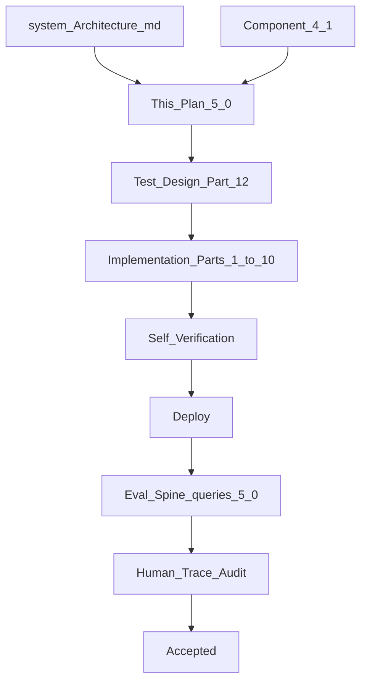
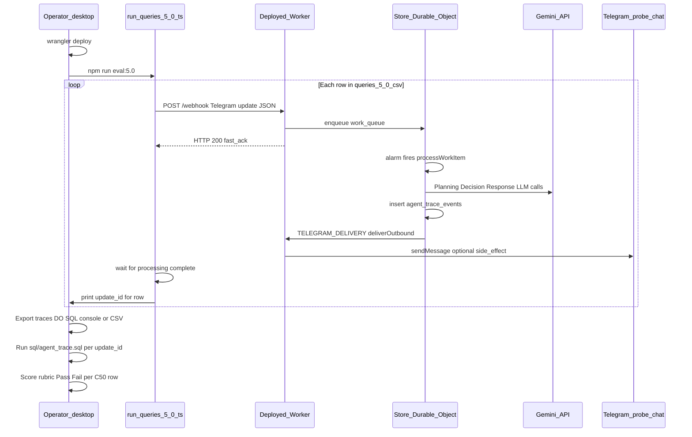

# Component 5.0 — Platform, GO Gaps, Evaluation Spine

**This document is the Goal Document for Component 5.0.** The implementing agent implements **this document only** — not chat history.

**Builds on:** [component_4.1_fixes_c4706af8.plan.md](.cursor/plans/component_4.1_fixes_c4706af8.plan.md) (harness loop, grounded response, verified facts — unchanged structure).

**Architecture references:** [docs/system_Architecture.md](docs/system_Architecture.md)

| Topic | Section |
|-------|---------|
| BC architecture, artifact not a BC | Ch 7 (~6590+), §7.1 |
| Verification layers | §6.10 (~4311+) |
| Orchestration constitution | §6.5 (~2878+) |
| Production-first / acceptance | §6.15–16, Ch 15 (~8981+) |
| Attachment delivery | Ch 13–14 (~8959) |
| Agent traceability | [docs/agent-traceability-and-agent-state.md](docs/agent-traceability-and-agent-state.md) |

**Production evidence (failures driving 5.0):** [explain your capabilities.csv](explain%20your%20capabilities.csv), [update inventory edge case.csv](update%20inventory%20edge%20case.csv)

**Explicit non-goals:** Inventory/Billing/Khata/Analytics tool implementation (5.1–5.4), artifact generator templates (5.5), system-understanding capability (README note only), `queries.csv` edits (use new `queries-5.0.csv`).

---

## Part 0 — Engineering philosophy

- **Correctness over code elegance.** Acceptance is trace-observable behavior, not line-by-line review.
- **Constitution over instructions.** Prompts define role boundaries; situational if-then rule lists are forbidden. Context slices carry runtime truth.
- **Implementation freedom.** This plan specifies *what must happen at runtime* and *how to verify it*. File layout, class naming inside the blueprint, and minor refactors are left to the implementing agent unless locked below. **Exception:** eval spine transport (Part 9.3–9.8) is fully locked — not open to implementing-agent interpretation.
- **Production-first** per Ch 15: deploy, run tests, inspect traces — not local-only confidence.



---

## Part 1 — Problem statement

| # | Problem | Evidence | 5.0 fix |
|---|---------|----------|---------|
| P1 | Scattered capability knowledge — registry, plan verifier, faithfulness builder duplicated | [`capability-registry/index.ts`](src/capability-registry/index.ts) vs [`plan-verification.ts`](src/global-orchestrator/execution-engine/plan-verification.ts) `KNOWN_CAPABILITIES` | Single registry platform |
| P2 | Wrong-domain objective on real capability returns `clarification_needed` (asks user for SKUs) | [update inventory edge case.csv](update%20inventory%20edge%20case.csv) step 9–11 | `not_supported` at BC harness; Decision replans |
| P3 | Decision lacks system truth — cannot distinguish ask-user vs explain-state | Trace B Decision → `clarify` | Context slices + `ask_user` rename |
| P4 | Response invents capabilities from shop profile facts | [explain your capabilities.csv](explain%20your%20capabilities.csv) step 10–11 | Response receives Decision artifact + execution summary; constitutional boundary |
| P5 | Unimplemented capabilities invisible to planner/executor | ONB-027 expectation | Register all caps; executor `unavailable` stub |
| P6 | MSP harness not reusable for 5.1–5.4 | [`my-shop-profile/index.ts`](src/my-shop-profile/index.ts) inline loop | Capability blueprint class |
| P7 | No eval spine for 5.x | Only [`queries.csv`](queries.csv) onboarding | `queries-5.0.csv` + rubric + trace audit process |
| P8 | PDF delivery path untested end-to-end | GO always `attachments: []` | Worker-only integration test |

---

## Part 2 — Locked architectural decisions

These are **not open to interpretation**.

### 2.1 Capability taxonomy

| ID | Kind | Handler in 5.0 |
|----|------|----------------|
| `user_profile` | system | Full implementation (renamed from `my_shop_profile`) |
| `inventory` | business | Stub → `unavailable` |
| `billing` | business | Stub → `unavailable` |
| `khata` | business | Stub → `unavailable` |
| `analytics` | business | Stub → `unavailable` |

MSP rename is **mechanical**: capability ID, trace `component` name, folder rename (`my-shop-profile` → `user-profile`), imports, tests, docs. **SQLite schema unchanged** (no `my_shop_profile` column names).

### 2.2 Status model (three layers)

```text
Layer 1 — GO plan verification
  capabilityId NOT in registry → REJECT plan (harness retry, diagnostic: unknown capability)
  (Planner hallucinated an ID that does not exist)

Layer 2 — Executor
  capabilityId IN registry, handler is unimplemented stub → unavailable
  (Valid capability, not built yet)

Layer 3 — Capability harness
  Valid handler, objective outside domain (e.g. empty tool plan after retries) → not_supported
  (Wrong capability assignment — loop should replan)

Tool throws clarification:* → clarification_needed (owner must supply info)
User denies confirmation → denied
Infrastructure failure → error
```

**`clarification_needed` is only for tools that need owner input** — never for empty tool plans or out-of-domain objectives.

### 2.3 Decision actions

Rename `clarify` → **`ask_user`** in Decision JSON (`action: "ask_user"`).

| Action | Meaning |
|--------|---------|
| `replan` | Evidence shows plan/assignment must change (e.g. `not_supported`, wrong capability) |
| `ask_user` | Owner must supply missing business information (`clarification_needed` from a tool) |
| `respond` | Terminal — Response Generator explains outcome (success, denial, unavailable, exhausted replan) |

Replan cap = existing [`MAX_GO_GEMINI_ROUNDS`](src/global-orchestrator/constants.ts) (4). No separate limit.

### 2.4 Planner capability descriptions

- **Variant B (intent triggers)** — locked text in Part 3.2.
- **No implementation status in planner prompt.** Unimplemented caps appear in registry list; executor handles `unavailable`.
- Optional spike: if Trace B / ONB-027 still mis-route after implementation, compare Variant A in planning-only traces before changing text.

### 2.5 Response generation

- All response modes remain **LLM-generated natural language** — no deterministic templates.
- Grounded response bindings unchanged for shop facts (`verifiedFacts`).
- Response user prompt must include **full Decision artifact** + **execution summary** (see Part 5).
- Meta/system questions ("what can you do?") — **not implemented in 5.0**. Document future `system_understanding` capability in README eval section.

### 2.6 PDF spike scope

**Worker-only** integration test: minimal PDF bytes → `sendDocument`. No GO, no DO, no orchestrator. Proves transport path from [component_1_worker_plan](.cursor/plans/component_1_worker_plan_23e36070.plan.md) Part 3.3.

Artifact storage for 5.5 (not 5.0): ephemeral bytes during run → `ExecutionResult.attachments` → Worker; templates in deployed code; regenerate from SQLite; not persisted in SQLite. R2 only if needed later.

---

## Part 3 — Registry platform

### 3.1 Single source of truth

Replace scattered hardcoding in [`capability-registry/index.ts`](src/capability-registry/index.ts) and [`plan-verification.ts`](src/global-orchestrator/execution-engine/plan-verification.ts).

Each registry entry:

- `id` — exact string used in Planning JSON `capabilityId`
- `kind` — `system` | `business`
- `description` — planner prompt text (Part 3.2)
- `handler` — `CapabilityHandler` or stub
- `implemented` — boolean (internal; drives stub vs real handler)
- `faithfulnessBuilder` — hook imported from per-capability module
- `toolSurface` — optional list of tool names (for Decision/Response context — what this capability can actually do)

Exported functions (names flexible):

- `getRegisteredCapabilityIds()` — for plan verifier
- `getCapabilityDescriptionsForPlanning()` — injected into Planning system prompt
- `getCapabilityContextForDecision()` — registry summary for Decision slice
- `invokeCapability(id, ...)` — dispatch

Plan verifier reads IDs **only from registry** — no duplicate `KNOWN_CAPABILITIES` set.

### 3.2 Locked planner descriptions (Variant B)

```text
- user_profile (system): Use when the owner talks about their shop name, owner name, GSTIN, tax registration, or how the bot should reply (language, tone, instructions). Do not use for product stock, sales bills, customer credit, or business reports.

- inventory (business): Use when the owner mentions receiving stock, adding a product/SKU, checking how much of something is left, or low stock. Do not use for creating bills, customer balances, shop GST setup, or sales summaries.

- billing (business): Use when the owner wants to make, edit, or finalize a bill/invoice for a sale — line items, totals, GST breakdown, payment type. Do not use for stock receipt without billing, credit ledger entries alone, or shop profile changes.

- khata (business): Use when the owner records credit (udhar), takes a payment, or asks a customer's outstanding balance. Do not use for inventory quantities, bill creation, or shop configuration.

- analytics (business): Use when the owner asks for today's sales, closing the day, weekly analysis, top-selling items, or GST collected — read-only summaries. Do not use for any write operation (stock, bills, credit, profile).
```

### 3.3 Stub executor

Unimplemented capabilities return:

```typescript
{ status: "unavailable", capabilityId: "inventory", reason: "not_implemented" }
```

Exact shape is implementing-agent choice; must be traceable and appear in Decision/Response context slices.

---

## Part 4 — Capability blueprint (shared harness)

### 4.1 Pattern

One **Capability** blueprint (class or factory — implementing agent chooses) parameterized by:

- `id`, `kind`
- `toolPlannerSystemPrompt`
- `tools` registry (name → executor)
- `verifyToolPlan`, `parameterGroundingCheck` (can be shared utilities)
- `faithfulnessBuilder`

`user_profile` is the first instance. Stubs for inventory/billing/khata/analytics have no inner planner — executor returns `unavailable` immediately.

### 4.2 `user_profile` harness behavior change

When tool plan verification exhausts retries with empty operations → return **`not_supported`** (not `clarification_needed`).

Current bug location: [`my-shop-profile/index.ts`](src/my-shop-profile/index.ts) lines 215–221.

### 4.3 Type extensions

Extend [`CapabilityResult`](src/my-shop-profile/types.ts) (move to shared types when renaming):

```typescript
| { status: "not_supported"; reason: string }
| { status: "unavailable"; capabilityId: string; reason: string }
```

Extend [`ObjectiveStatus`](src/store-durable-object/agent-state/run-context.ts) and [`dependency-scheduler.ts`](src/global-orchestrator/execution-engine/dependency-scheduler.ts) mapping for new statuses. `not_supported` and `unavailable` should **block dependent objectives** (same as `error`).

### 4.4 Faithfulness

- Per-capability builder modules (e.g. `user-profile-fact-registry.ts`, renamed from `msp-fact-registry.ts`).
- Central [`registry-builder.ts`](src/global-orchestrator/verified-facts/registry-builder.ts) imports from registry — no capability `if` branches long-term.

---

## Part 5 — Context engineering (core 5.0 work)

**Principle:** Assumption is removed by giving each LLM step enough runtime truth — not by adding situational prompt rules.

### 5.1 Planning context slice

Existing [`planningContextSlice`](src/store-durable-object/agent-state/run-context.ts) — ensure replan mode includes prior Decision rationale and full phase results (already partially there). No change to harness retry path.

Planning system prompt: constitution rewrite (Part 6.1). Capability list from registry only.

### 5.2 Decision context slice

Extend [`decisionContextSlice`](src/store-durable-object/agent-state/run-context.ts) to include:

1. **Capability registry summary** — id, kind, one-line domain (from registry, not re-parsed NL)
2. **`user_profile` tool surface** — available tools list (so Decision can see inventory intent on user_profile cannot be fulfilled by read_shop_profile alone)
3. **Per-objective result with full CapabilityResult** — including `not_supported`, `unavailable`, `clarification_needed` with distinct semantics visible in JSON
4. Existing: businessIntent, plan artifact, verified facts, prior decisions, replan history

Decision does **not** need implementation flags in prompt if `unavailable` results are explicit in phase results.

### 5.3 Response context slices

**Respond path** — extend [`respondContextSlice`](src/store-durable-object/agent-state/run-context.ts):

```text
Decision: <full Decision JSON — action, rationale, askUserFocus if any>
Business intent: <from plan>
Execution summary: <per-objective: capabilityId, status, result summary>
Verified facts: <existing>
Denied outcomes: <existing>
User message: <existing>
Owner instructions: <existing>
```

**Ask-user path** — extend [`clarifyContextSlice`](src/store-durable-object/agent-state/run-context.ts) (rename to `askUserContextSlice`):

- Include Decision artifact (why `ask_user` was chosen)
- Only include objectives with `clarification_needed` — never `not_supported` or `unavailable`

Wire in [`orchestrate()`](src/global-orchestrator/index.ts): pass `decision` object into response generators.

### 5.4 Constitutional prompt rewrites (behavior, not recipes)

| Component | Constitution (what to enforce) | Remove (situational instructions) |
|-----------|----------------------------------|-------------------------------------|
| Planning | Role: produce plan JSON; assign objectives to registered capabilities by domain; do not call tools | Hardcoded `capabilityId: "my_shop_profile"` example; numbered thought-process recipe as primary guidance |
| Decision | Role: judge loop flow from evidence; distinguish ask-user vs tell-owner; reason only from provided execution evidence | `respond: intent met, e.g. user denied` style examples; word "clarify" |
| Response (grounded) | Role: NL for owner; cite Fact Catalog for shop facts; do not state outcomes beyond execution evidence and Decision rationale | Binding rules that remain are schema-necessary only |
| Response (ask_user) | Role: ask owner for missing information in one message | "Your only job: ask for missing information" as sole framing — add boundary: never ask when execution shows unsupported/unavailable |

Implementing agent drafts exact prompt text; human reviews trace behavior not wording.

---

## Part 6 — Expected runtime walkthroughs (acceptance narratives)

These are **what must happen** — use as trace audit scripts.

### Walkthrough W1 — Trace B corrected: "Can you update my inventory?"

| Step | Expected |
|------|----------|
| Plan v1 | Intent: update inventory. Objective → `user_profile` (planner guess) |
| Execute `user_profile` | Tool plan empty after retries → **`not_supported`** |
| Decision v1 | **`replan`** — rationale references wrong capability / unsupported objective |
| Plan v2 | Objective → `inventory` |
| Execute `inventory` | Stub → **`unavailable`** |
| Decision v2 | **`respond`** |
| Response | NL: inventory not available yet; does **not** ask for SKU/quantity; no shop_profile writes |
| Trace | `CAPABILITY_STEP_COMPLETED` shows `not_supported` then `unavailable`; no `ask_user` |

### Walkthrough W2 — ONB-027: "How much sugar is left?"

| Path | Expected terminal |
|------|-------------------|
| Planner assigns `inventory` directly | `unavailable` → `respond` → polite inventory-not-ready message |
| Planner assigns `user_profile` first | `not_supported` → `replan` → `inventory` → `unavailable` → `respond` |
| Both | No `shop_profile` writes; no `ask_user` for stock quantity |

### Walkthrough W3 — Hallucinated capability ID

| Step | Expected |
|------|----------|
| Planner outputs `capabilityId: "stock_management"` (not in registry) | Plan verify **fails** → harness retry with diagnostic |
| After retries exhausted | Safe terminal outcome (existing pattern in orchestrate) |
| Never reaches executor | — |

### Walkthrough W4 — Legitimate ask_user (ONB-016 style)

| Step | Expected |
|------|----------|
| Tax objective on `user_profile` | Tool throws `clarification:gstin_required` |
| Result | `clarification_needed` |
| Decision | **`ask_user`** |
| Response | Asks for GSTIN — does not claim capability unavailable |

### Walkthrough W5 — Trace A deferred (README + context only)

| Step | Expected in 5.0 |
|------|-----------------|
| Meta question "What are your capabilities?" | May still plan `user_profile` read — acceptable |
| Response | Must **not** invent system capabilities beyond execution evidence; constitutional boundary |
| README | Note future `system_understanding` system capability |

---

## Part 7 — Rename checklist (`my_shop_profile` → `user_profile`)

Implementing agent executes mechanically:

- [`src/my-shop-profile/`](src/my-shop-profile/) → `src/user-profile/`
- [`capability-registry/index.ts`](src/capability-registry/index.ts) ID
- [`plan-verification.ts`](src/global-orchestrator/execution-engine/plan-verification.ts) — remove duplicate set, use registry
- Trace `component` field: `user_profile`
- [`registry-builder.ts`](src/global-orchestrator/verified-facts/registry-builder.ts), fact ID prefix: `user_profile_...`
- All tests referencing `my_shop_profile`
- [`docs/verified-facts-and-grounded-response.md`](docs/verified-facts-and-grounded-response.md), [`docs/agent-traceability-and-agent-state.md`](docs/agent-traceability-and-agent-state.md)
- **Do not edit** [`queries.csv`](queries.csv) — historical onboarding matrix

---

## Part 8 — PDF spike (Worker only)

**File:** e.g. `src/worker-telegram-adapter/integration/send-document.integration.test.ts`

**Scope:**
- Construct minimal valid PDF bytes (hardcoded or `pdf-lib` — agent choice)
- Call [`telegram-client.sendDocument`](src/worker-telegram-adapter/telegram-client.ts) against real Bot API **only when** `BOT_TOKEN` + `TEST_CHAT_ID` in `.dev.vars` (same skip pattern as [production.integration.test.ts](src/worker-telegram-adapter/integration/production.integration.test.ts))
- Assert HTTP success from Telegram API
- No DO, no GO, no trace stages (deferred to 5.5)

**Research note for 5.5 plan (document in README, not implement):**
- Invoice PDFs: HTML template in repo → Cloudflare Browser Rendering (`@cloudflare/puppeteer`) preferred over pdf-lib for layout fidelity
- Telegram `sendDocument` limit: **50 MB**
- DO→Worker RPC: **32 MiB** serialized; use `ReadableStream` if larger
- Ephemeral attachment bytes during run — not SQLite

---

## Part 9 — Evaluation spine

### 9.1 New file: `queries-5.0.csv`

Columns mirror [`queries.csv`](queries.csv). Minimum rows:

| ID | Query | Expected trace outcome |
|----|-------|------------------------|
| C50-001 | Can you update my inventory? | W1 — replan + unavailable + respond, no ask_user |
| C50-002 | How much sugar is left? | W2 — unavailable + respond, no profile writes |
| C50-003 | What is my shop name? | `user_profile` read + grounded respond (regression) |
| C50-004 | Yes I am GST registered (no GSTIN) | W4 — ask_user path still works |
| C50-005 | What are your current capabilities? | W5 — no invented capabilities in response |

### 9.2 Rubric dimensions (human-scored from traces)

Score each C50 row Pass/Fail by inspecting `agent_trace_events` via [`sql/agent-trace.sql`](sql/agent-trace.sql):

1. **Routing** — correct capability assignment or self-correct via replan
2. **Status honesty** — `not_supported` / `unavailable` / `clarification_needed` used correctly
3. **Decision action** — `replan` / `ask_user` / `respond` matches walkthrough
4. **Response grounding** — no claims beyond execution evidence
5. **No wrong writes** — `shop_profile` unchanged on out-of-scope queries
6. **Registry single source** — plan verify rejects unknown IDs

No LLM-as-judge. Traces are evidence.

### 9.3 Locked decision — eval runs through deployed Worker webhook + Store Durable Object

**This is not open to the implementing agent.** The 5.0 eval spine uses the **same production path** that produced [explain your capabilities.csv](explain%20your%20capabilities.csv) and [update inventory edge case.csv](update%20inventory%20edge%20case.csv). No local `orchestrate()` harness. No mocked Gemini. No alternate SQLite driver for tests.

#### 9.3.1 What we are evaluating

The eval spine proves **observable orchestration behavior** — the full agency loop with persisted trace evidence:

- Planning → plan verify → execution phase → Decision → Response / faithfulness
- Status model (`not_supported`, `unavailable`, `ask_user`, etc.)
- Context engineering slices visible in trace LLM payloads
- Self-correction via replan (W1, W2)

Scores come from **human inspection of `agent_trace_events`**, not HTTP status codes, not code review, not LLM-as-judge.

#### 9.3.2 Why this path — codebase constraints

Research against the current codebase shows a **local `orchestrate()` harness cannot produce valid eval evidence** without architectural changes we explicitly reject for 5.0:

| Constraint | Source | Implication |
|------------|--------|-------------|
| `StoreDatabase` is `drizzle-orm/durable-sqlite` bound to `DurableObjectStorage` | [`db.ts`](src/store-durable-object/persistence/db.ts) | No Node `better-sqlite3` path exists; SQLite lives inside the DO |
| `RunContext` persists traces via `insertTraceEvent` → `agent_trace_events` | [`run-context.ts`](src/store-durable-object/agent-state/run-context.ts), [`agent-trace-repository.ts`](src/store-durable-object/persistence/repositories/agent-trace-repository.ts) | Mock or absent DB = no trace rows = hollow rubric |
| `orchestrate()` is only called from `processWorkItem` inside the DO | [`execution-manager/index.ts`](src/store-durable-object/execution-manager/index.ts) | Importing GO alone skips work queue, alarm, conversation manager, ledger |
| `RuntimePorts` uses `TELEGRAM_DELIVERY` service binding | [`worker-delivery-port.ts`](src/store-durable-object/runtime-ports/worker-delivery-port.ts) | Full path requires deployed Worker + bindings |
| No `@cloudflare/vitest-pool-workers` in project | [`package.json`](package.json) | Local in-process DO testing is not infrastructure we have today |
| C2–C4 plans: production-first; `wrangler dev` ≠ acceptance | Component 2–4 plans, Ch 15 | Deployed Cloudflare is the authoritative runtime |

**Rejected alternatives (do not implement for 5.0 eval):**

1. **Local `import { orchestrate }` + Vitest** — bypasses DO SQLite; traces do not persist unless we add a parallel DB layer (pollutes runtime with test-only code).
2. **Mocked `StoreDatabase`** — eval spine cannot audit real harness steps.
3. **Mocked Gemini** — human decision: **real Gemini only**; matches [`gemini-production.integration.test.ts`](src/integration/gemini-production.integration.test.ts) philosophy.
4. **`@cloudflare/vitest-pool-workers`** — valid future CI option; out of 5.0 scope (new infrastructure).

#### 9.3.3 Why this path — Cloudflare / DO reality

| Cloudflare fact | Eval implication |
|-----------------|------------------|
| Each store = one Durable Object = one colocated SQLite | Traces for a shop live in that DO's `agent_trace_events`; there is no separate D1 database for agent state |
| DO processes work via `work_queue` + `alarm` after Worker fast-ack | Eval script must account for **async** completion (webhook returns 200 before GO finishes) |
| Real `GEMINI_API_KEY` on deployed Worker | Eval uses production secrets, not `.dev.vars` in Node (unless Worker secrets mirror local) |
| One DO serializes requests per store | C50 queries run **sequentially** per test store; each row needs a **unique `update_id`** |
| Telegram `sendDocument` limit 50 MB; RPC ~32 MiB | Irrelevant for 5.0 eval (no PDF in eval queries) |

#### 9.3.4 End-to-end eval flow (locked)



**Step-by-step (operator workflow):**

1. **Deploy** — `wrangler deploy` with `GEMINI_API_KEY` set on the Worker (Ch 15 production-first).
2. **Configure script env** — same secrets as existing integration tests: `WORKER_WEBHOOK_URL`, `WEBHOOK_SECRET` in `.dev.vars` (see [production.integration.test.ts](src/worker-telegram-adapter/integration/production.integration.test.ts)).
3. **Run eval script** — `scripts/eval/run-queries-5.0.ts` (or `npm run eval:5.0` package script):
   - Read [`queries-5.0.csv`](queries-5.0.csv)
   - For each row: build Telegram update using existing fixtures ([`telegram-updates.ts`](src/worker-telegram-adapter/fixtures/telegram-updates.ts)), **unique `update_id`** (e.g. `Date.now()` + row offset)
   - POST to webhook with `X-Telegram-Bot-Api-Secret-Token`
   - **Wait** for async DO processing (implementing agent chooses wait strategy — see 9.3.5)
   - **Print** `update_id` (and `correlation_id` if available from logs) for human trace export
4. **Export traces** — operator uses existing workflow (DO SQL console / CSV export — same method used for `explain your capabilities.csv`). **No new DO admin RPC in 5.0** — human SQL export is sufficient.
5. **Audit** — run [`sql/agent-trace.sql`](sql/agent-trace.sql) per `update_id`; score against walkthroughs W1–W5 and rubric §9.2.
6. **Sign-off** — human marks Pass/Fail per C50 row; implementation is accepted only when required rows pass.

#### 9.3.5 Async wait strategy (implementing agent chooses mechanism, not whether to wait)

The webhook **always fast-acks** before GO completes ([Component 2 plan](.cursor/plans/component_2_do_runtime_a07d3d0d.plan.md)). The script **must wait** after each POST. Acceptable mechanisms (pick one, document in README):

- Fixed delay per query (e.g. 20–45s depending on replan depth)
- Poll `wrangler tail --format pretty` for `WORK_COMPLETED` or terminal log containing the `update_id`
- Sleep + retry trace export until `agent_trace_events` row count &gt; 0 (if operator automates export later)

**Not acceptable:** assuming HTTP 200 means GO finished. Existing integration tests already document this limitation ([`production.integration.test.ts`](src/store-durable-object/production.integration.test.ts) header).

#### 9.3.6 Telegram delivery — side effect, not eval spine

Messages **will** be delivered to Telegram when `BOT_TOKEN` and chat ID are configured (probe chat pattern from [`test-identities.ts`](src/worker-telegram-adapter/fixtures/test-identities.js)). This is:

- **Not** manual Telegram testing (operator does not read chat during rubric)
- **Not** the eval evidence source (traces are)
- **Acceptable** transport side effect — same as existing production integration probes

Do **not** add eval-only `SKIP_DELIVERY` flags or noop `RuntimePorts` for eval — that would diverge from the production path we are auditing.

#### 9.3.7 What the eval script delivers (implementing agent scope)

**Must implement:**

- [`scripts/eval/run-queries-5.0.ts`](scripts/eval/run-queries-5.0.ts) — reads CSV, POSTs fixtures, waits, prints `update_id` list
- `npm run eval:5.0` (or equivalent) in [`package.json`](package.json)
- Skip gracefully when `WORKER_WEBHOOK_URL` / `WEBHOOK_SECRET` absent (same pattern as integration tests)
- README section documenting operator workflow (Part 9.8)

**Must not implement:**

- Local `orchestrate()` test harness
- Mocked Gemini or mocked DB for C50 rubric
- DO admin RPC for trace export (deferred)
- Changes to production runtime solely for eval convenience

#### 9.3.8 Relationship to other test layers

| Layer | Purpose | Gemini | DO | Traces | 5.0 role |
|-------|---------|--------|-----|--------|----------|
| Unit tests (REG, STAT, CTX) | Deterministic gates | No | No | No | Required — fast feedback |
| `gemini-production.integration.test.ts` | API smoke | Real | No | No | Unchanged |
| PDF-01 Worker test | `sendDocument` transport | No | No | No | Required — Worker only |
| **Eval spine (C50)** | **Full loop rubric** | **Real** | **Yes** | **Yes** | **Primary 5.0 acceptance** |
| Manual Telegram smoke | UX sanity | Real | Yes | Yes | Separate; optional after C50 pass |

### 9.4 README section (operator documentation)

Add **Component 5.0 evaluation** subsection to README:

- Locked eval path: deployed webhook → DO → trace export (this Part 9.3)
- Prerequisites: deploy, `.dev.vars` secrets, `npm run eval:5.0`
- How to export traces and run `sql/agent-trace.sql`
- Rubric dimensions (§9.2) with walkthrough references (Part 6)
- Known gap: meta/system capability questions → future `system_understanding` capability
- PDF spike status (Worker-only); 5.5 artifact plan pointer
- Explicit note: **eval ≠ manual Telegram chat testing**

---

## Part 10 — Test design

### 10.1 Unit tests (deterministic — must pass)

| ID | Target |
|----|--------|
| REG-01 | Registry exports all 5 IDs; plan verifier rejects unknown ID |
| REG-02 | Stub invoke returns `unavailable` for inventory/billing/khata/analytics |
| STAT-01 | Empty tool plan → `not_supported` (not `clarification_needed`) |
| STAT-02 | `dependency-scheduler` maps `not_supported` / `unavailable` to blocking statuses |
| CTX-01 | `decisionContextSlice` includes registry + tool surface |
| CTX-02 | `respondContextSlice` includes Decision JSON when provided |
| DEC-01 | Decision schema accepts `ask_user` action |
| RENAME-01 | factId prefix `user_profile_` in registry builder tests |

### 10.2 Integration tests

| ID | Target |
|----|--------|
| PDF-01 | Worker `sendDocument` integration (Part 8) |
| EVAL-01 | `scripts/eval/run-queries-5.0.ts` posts all C50 rows to deployed webhook; skips gracefully without secrets |

**Explicitly rejected for 5.0:** GO-01 local `orchestrate()` harness with mocked Gemini — see Part 9.3.2.

### 10.3 Production validation (Ch 15)

1. `npm test` green (unit + PDF-01 + EVAL-01 skip-or-run)
2. `wrangler deploy` with `GEMINI_API_KEY`
3. `npm run eval:5.0` — all C50 rows posted to deployed webhook
4. Export traces; `sql/agent-trace.sql` reconstructs full run per printed `update_id`
5. Human rubric Pass on C50-001, C50-002, C50-004 (minimum); sign-off against walkthroughs W1–W4
6. Optional separate: manual Telegram smoke — not required for 5.0 acceptance

---

## Part 11 — Trace / SQL updates

- New trace stages if needed: document `not_supported` / `unavailable` in `CAPABILITY_STEP_COMPLETED` payload
- Update [`sql/agent-trace.sql`](sql/agent-trace.sql) if new stages added
- Update [`docs/agent-traceability-and-agent-state.md`](docs/agent-traceability-and-agent-state.md) for new statuses and `ask_user`

---

## Part 12 — Acceptance criteria (stop only when all true)

- [ ] All 5 capabilities registered; plan verifier uses registry only
- [ ] `user_profile` rename complete; existing ONB tests still pass if re-run (queries.csv unchanged)
- [ ] W1 walkthrough passes (Trace B scenario)
- [ ] W2 walkthrough passes (ONB-027 scenario)
- [ ] W3 — unknown capability rejected at plan verify
- [ ] W4 — ONB-016 ask_user path still works
- [ ] W5 — Response does not invent system capabilities (Trace A improved; full fix deferred to README)
- [ ] Decision action is `ask_user` not `clarify` in JSON and traces
- [ ] Response receives Decision artifact on respond path
- [ ] Capability blueprint exists; `user_profile` uses it
- [ ] PDF-01 Worker integration test exists (skips gracefully without secrets)
- [ ] `queries-5.0.csv` + `scripts/eval/run-queries-5.0.ts` + README eval section exist
- [ ] Eval spine uses deployed webhook → DO only (no local orchestrate harness)
- [ ] Unit tests REG/STAT/CTX/DEC green; EVAL-01 script skips gracefully without secrets
- [ ] Production deploy + `npm run eval:5.0` + human trace rubric Pass on C50-001, C50-002, C50-004

---

## Part 13 — Carry forward to 5.1+

- 5.1 Inventory: replace stub with real Capability instance (tools + faithfulness)
- 5.5 Artifact generator: HTML templates, Browser Rendering, `ARTIFACT_GENERATED` / `ARTIFACT_DELIVERED` trace stages
- System-understanding capability for meta questions
- `artifactsEnabled` shop preference (decision only — not 5.0)
