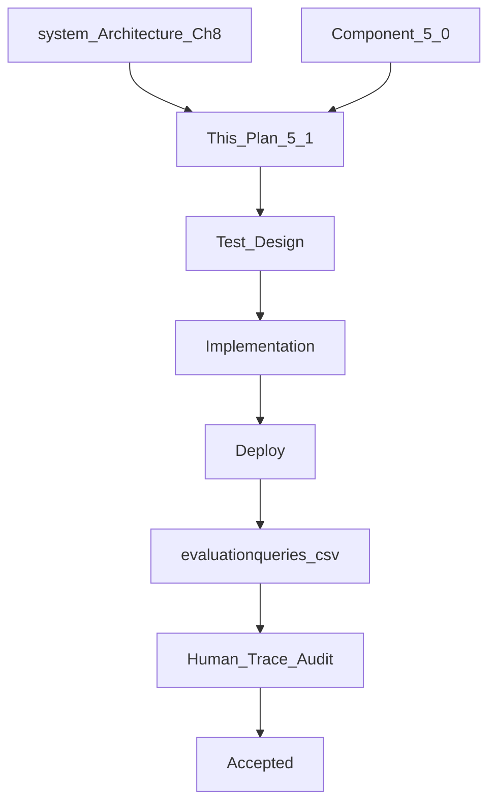

# Component 5.1 — Inventory Business Capability

**This document is the Goal Document for Component 5.1.** The implementing agent implements **this document only** — not chat history.

**Builds on:** [component_5.0_platform_8825a24c.plan.md](.cursor/plans/component_5.0_platform_8825a24c.plan.md) (registry, Capability blueprint, status model, Decision/Response context slices, eval spine).

**Architecture references:** [docs/system_Architecture.md](docs/system_Architecture.md) Ch 7 (Business Capability), Ch 8 (Inventory tools and verification gates), §6.9 (clarification vs confirmation), §6.10 (verification layers), §6.18 / agent-state docs (L1 vs L2); [docs/Problem_Statement.md](docs/Problem_Statement.md) §2–4; [docs/verified-facts-and-grounded-response.md](docs/verified-facts-and-grounded-response.md).

**Explicit non-goals:** Billing draft/finalize (5.2), Khata (5.3), Analytics (5.4), PDF/PPTX templates (5.5), system-understanding meta capability, editing historical `[queries.csv](queries.csv)`.

---

## Part 0 — Engineering philosophy

- **Correctness over code elegance.** Acceptance is what traces and SQLite show — not style review.
- **Code and constitution over prompt recipes.** Plan verification and tool gates enforce invariants. The BC tool-planner prompt states role and tool purposes. It does **not** contain situational instructions such as “always call query_inventory before update_inventory.”
- **Agent state vs context engineering (locked distinction).**
  - **Agent state** is what the harness knows about this run: L1 in-memory structures for the current BC invocation (including the map of tool results), and L2 persisted `agent_trace_events` (and related audit rows). Prerequisite checks (“was `query_inventory` called? what did it return?”) and SKU resolution for write tools live in **agent state**.
  - **Context engineering** is only the **subset** of agent state serialized into a particular LLM call’s prompts. Context engineering is not a storage layer and is not where register/update/allocate look up prior tool outputs.
- **Implementation freedom.** File layout under `src/inventory/`, repository naming, and minor helpers are agent choice unless locked below.
- **What is locked (not free):** the four tool ids and purposes; search behavior (exact-first; fuzzy only for clarification options); parameter-grounding field lists; plan-verify dependency rules; confirmation policy; refusal contract; schema field set; eval transport (deployed webhook → Store Durable Object).
- **Production-first:** deploy → run evaluation rows → export traces → human Pass/Fail.




---

## Part 0.1 — Mean / Do not mean (global)


| Mean                                                                                               | Do not mean                                                                                               |
| -------------------------------------------------------------------------------------------------- | --------------------------------------------------------------------------------------------------------- |
| Tool id `query_inventory` (architecture name: Query Inventory)                                     | A second tool named `read_inventory`, or free-text “query the DB” in prompts as a substitute for the tool |
| `register_inventory` creates a **new** SKU only                                                    | The same tool also increases stock on an existing SKU                                                     |
| `update_inventory` increases/changes an **existing** SKU only                                      | `update_inventory` creates a product when exact search finds nothing                                      |
| SKU for update/allocate comes from `**query_inventory` result in agent state**                     | The LLM invents or supplies `sku` as the source of truth                                                  |
| Exact search decides identity for writes                                                           | Fuzzy/similar hits can be treated as “the” product for update/allocate/register                           |
| Fuzzy/similar search runs in **code** after exact returns zero, only to list clarification options | An LLM plan parameter `match_mode: fuzzy` that chooses how to search                                      |
| Clarification options come from deterministic inventory search                                     | The LLM invents example product names at clarification time                                               |
| LLM may emit a `dependencies` array so the execution engine can order ops                          | We trust the LLM alone; or we teach “call X before Y” as a prompt recipe                                  |
| Plan verification rejects missing required prerequisites and triggers harness replan               | Soft runtime fallback “if somehow missing → error” after accepting an invalid plan                        |
| `refusalMessage` on `completed` goes into Decision/Response context                                | Refusal text is put into `verifiedFacts` / Fact Catalog                                                   |


---

## Part 1 — Problem statement


| #   | Problem                                                                 | Evidence today                                                                                                                  | 5.1 fix                                                                           |
| --- | ----------------------------------------------------------------------- | ------------------------------------------------------------------------------------------------------------------------------- | --------------------------------------------------------------------------------- |
| P1  | Inventory is an `unavailable` stub                                      | `[capability-registry/index.ts](src/capability-registry/index.ts)`                                                              | Real Capability blueprint instance with four tools                                |
| P2  | No inventory SQLite domain                                              | `[schema.ts](src/store-durable-object/persistence/schema.ts)`                                                                   | Products, aliases, movements, reservations                                        |
| P3  | No real inventory tools                                                 | Ch 8 unimplemented                                                                                                              | `query_inventory`, `register_inventory`, `update_inventory`, `allocate_inventory` |
| P4  | Bogus INV fixtures / `read_inventory` name                              | `[user-profile-fact-registry.ts](src/global-orchestrator/verified-facts/user-profile-fact-registry.ts)`, binding-verifier INV-* | Scrap; real inventory fact registry                                               |
| P5  | Blueprint does not give later tools prior tool results from agent state | `[capability-blueprint.ts](src/capability-registry/capability-blueprint.ts)`                                                    | L1 tool-result map passed into subsequent `executeTool` calls                     |
| P6  | Write identity and prerequisites under-specified                        | Conversation + Ch 8                                                                                                             | Exact-first search; code-enforced deps; SKU from agent state                      |
| P7  | Eval still expects inventory unavailable for some C50 rows              | `[queries-5.0.csv](queries-5.0.csv)`                                                                                            | `evaluationqueries.csv` with real inventory expectations                          |


---

## Part 2 — Locked architectural decisions

### 2.1 Four tools (exact ids)


| Tool id              | Purpose                                                                                                                                                                                                                                                                                          |
| -------------------- | ------------------------------------------------------------------------------------------------------------------------------------------------------------------------------------------------------------------------------------------------------------------------------------------------ |
| `query_inventory`    | Read-only. Exact product lookup by full product name (and exact alias). Low-stock scan across all SKUs. Optional lookup by SKU only when that SKU already came from agent state (never invented by the LLM as identity for a write). Never confirms. Never modifies stock.                       |
| `register_inventory` | **Create a new SKU only.** Increases store inventory by introducing a product that did not exist. Requires a prior `query_inventory` in the same BC tool plan whose **exact** search returned **zero** matches.                                                                                  |
| `update_inventory`   | **Change an existing SKU only** (increase quantity; optionally update cost/sell/reorder). Never creates. Never decreases quantity. Requires a prior `query_inventory` in the same plan whose **exact** search returned **exactly one** match. Uses that match’s `sku` from agent state.          |
| `allocate_inventory` | Reserve / commit / release buffer for billing. Does not sell and does not permanently reduce `quantity_on_hand` on reserve. Product must already exist. Requires a prior `query_inventory` in the same plan that resolved **exactly one** SKU via exact match; uses that `sku` from agent state. |


Billing (Component 5.2) is the only path that permanently **decreases** `quantity_on_hand` for a sale. Inventory tools never write a negative receive/update quantity; negative quantity on register/update returns `completed` with `refusalMessage` (see 2.4).

### 2.2 Confirmation vs clarification


| Kind              | When                                                                                                                                           | Mechanism                                                                                                             |
| ----------------- | ---------------------------------------------------------------------------------------------------------------------------------------------- | --------------------------------------------------------------------------------------------------------------------- |
| **Confirmation**  | Any **write** that will change SQLite inventory or reservation state (`register_inventory`, `update_inventory`, mutating `allocate_inventory`) | Yes/No Telegram `callback_query` via existing `pending_confirmations` path (same pattern as user_profile write tools) |
| **Clarification** | Identity ambiguous or missing; required fields missing; GST slab/HSN missing on create                                                         | Tool returns `clarification_needed` → GO Decision chooses `ask_user` → natural-language question to owner             |
| **Reads**         | `query_inventory` alone                                                                                                                        | Never confirmation                                                                                                    |


`shop_profile.completeAutonomy === true` skips confirmation for inventory writes (same shop-wide flag used by user_profile).

### 2.3 Plan verification vs tool business rules

**Layer A — Plan verification (deterministic code, harness retry if invalid):**

1. Every operation’s `toolName` is one of the four known inventory tools.
2. Parameter **types** and **required fields** for that tool’s intended use are present and well-typed.
3. **Selective parameter grounding** (Part 2.6): for listed stringifiable fields, the planned value must appear as a substring of the **business objective description** string (`objectiveDescription.toLowerCase().includes(String(value).toLowerCase())`), same idea as GSTIN substring checks in user_profile — not fuzzy semantics.
4. **Mutex parameter groups** for `query_inventory` (e.g. low-stock scan cannot be combined with a product-name lookup in the same operation).
5. **Required prerequisite tool ops (code-owned):**
  - If the plan contains `register_inventory`, it must also contain a `query_inventory` operation that will run **before** it (via `dependencies` / topological order).
  - If the plan contains `update_inventory`, it must also contain a prior `query_inventory`.
  - If the plan contains `allocate_inventory`, it must also contain a prior `query_inventory`.
6. If a required prerequisite `query_inventory` operation is **absent** from the plan: plan verification **fails** with an explicit diagnostic such as: *"`query_inventory` is a required dependency of `update_inventory`"*. The BC harness retries planning with that diagnostic. The plan must become two (or more) tool operations. Do **not** accept the plan and later invent a soft runtime error for “missing query.”

**Layer B — Tool business rules (run only after a valid plan; do not fail plan verification):**

- Exact match count branching (0 / 1 / many) before writes.
- Negative or zero quantity on register/update → `completed` + `refusalMessage`.
- Post-write SQLite verify failure → `error`, abort, no fake verified facts.
- Insufficient available stock on allocate → structured failure/refusal for Response context.

**About the LLM `dependencies` field:**

- The structured tool plan may include `dependencies: string[]` on each operation (same schema as today).
- The execution engine uses dependencies to **order** operations even if the JSON array order is wrong.
- Plan verification **enforces** that required prerequisites exist and are orderable.
- The BC planner **prompt must not** teach “always put query_inventory before update.” Enforcement is constitution + verifier + execution order.

### 2.4 Completed with refusal (locked contract)

Extend `[CapabilityResult](src/capability-registry/types.ts)`:

```typescript
| {
    status: "completed";
    verifiedFacts: Record<string, unknown>;
    refusalMessage?: string; // natural language for Decision/Response only — NEVER Fact Catalog
  }
```

- Grounded response bindings use **only** `verifiedFacts`.
- `refusalMessage` must appear in `CAPABILITY_STEP_COMPLETED` / execution summary so Response can explain without inventing stock changes.
- Blueprint must not `Object.assign` refusal text into `verifiedFacts`.

### 2.5 Search behavior (exact-first; fuzzy only for clarification options)

**There is no LLM parameter that chooses fuzzy vs exact search.** Do not expose `match_mode`, `fuzzy`, or similar flags for the planner to set.

**What `query_inventory` does for product identity (product name supplied):**

1. Run **exact** search only:
  - Normalized equality on `product_name`, **or**
  - Exact equality on an alias string.
  - Example: exact `"Maggi 5-pack"` must **not** match `"Maggi 1-pack"`.
2. Put exact results in a clearly labeled part of the tool return, e.g.:
  - `exactMatchCount: number`
  - `exactMatches: Array<{ sku, product_name, quantity_on_hand, ... }>`
3. Branch for **write/allocate consumers** (register / update / allocate read this from agent state):
  - `**exactMatchCount === 1**` → that SKU is identity.
  - `**exactMatchCount > 1**` → write/allocate tools raise `clarification_needed` (list the exact matches as options).
  - `exactMatchCount === 0` → query inventory tool will contain resuls from fuzzy search as exact match results were zero, it will check if zero bfore retuning and also retun the results of fuzzy match. fuzzy mathes are not returned as verified facts but as calrifications. this at clarification the executor stopps naturally(see the global orchestrator executor engine) and the next tool is not called because it depends on the write tool as mentioned in th execution plan, iif in case te llm does not provide the dependency, even in that case we just know that the exact match were zero, so we just forward the same clarification as the tools return message. key is used by writ/allocate tool to raise clarification. in normal flow if a use aska foa  inventory with some product name, if the exact product name does not match, the query inventory will return the same fuzzy mathes as probabl mathes a tools do **not** treat any similar product as identity. They raise `clarification_needed`. For that clarification payload only, **code** may run an **internal fuzzy/similar search** and attach `similarCandidates[]` so the owner sees “I found no exact match; closest products are …”.
4. **Fuzzy/similar candidates never become the SKU for update, allocate, or register.** They are options for the human owner only. The LLM must not invent candidate examples.

**Low-stock scan:** a separate parameter group on `query_inventory` (e.g. `low_stock: true`) that lists SKUs where `quantity_on_hand < reorder_level`. Mutex: cannot combine with product-name lookup in the same operation.

**Lookup by SKU:** allowed only when the SKU string already exists in agent state from a prior exact resolution in this run — not when the LLM invents a SKU id to “skip” search.

### 2.6 Selective parameter grounding (locked field lists)

At plan verification, for each operation, after type checks, apply substring grounding **only** to these fields when present:

`**register_inventory`:**

- `product_name`
- `quantity` (string form of the number, e.g. `"50"`, must appear in the objective text)
- `cost_price`
- `sell_price`
- `hsn_code`
- `gst_rate` (string form, e.g. `"12"`)

`**update_inventory`:**

- Same as register for every field the plan is actually updating: `product_name` (identity string used to drive the prior exact search), `quantity`, `cost_price`, `sell_price`, `hsn_code`, `gst_rate` when present in parameters.

`**allocate_inventory`:**

- `quantity` (string form must appear in the objective).
- If the plan includes a natural-language product name parameter used only to drive the prior `query_inventory`, that name string is grounded against the objective. `**sku` is not an LLM-grounded identity field** — SKU comes from agent state after exact match.

**Do not substring-ground:** `item_type`, `unit`, `reorder_level` when system-defaulted, `aliases`, system-generated `sku`, `draft_bill_id`, `idempotency_key`, `low_stock`, booleans, operation enums (`reserve`/`commit`/`release`).

### 2.7 Stock direction rules

> **Superseded by Component 5.3** — sale stock decreases use `commit_bill_sale` after billing finalize, not billing itself.

- `register_inventory` / `update_inventory`: quantity change must be **> 0**. Otherwise return `completed` with `refusalMessage` telling the owner that stock reduction is done by creating a bill (possibly a dummy bill with notes in Component 5.2). No SQLite write.
- No delete-stock / write-down inventory tool in 5.1.
- `allocate_inventory`: manages **reserved** quantity. Available = `quantity_on_hand - sum(active reservations)`.

### 2.8 Reorder default (Option A)

On **new SKU** via `register_inventory`, if the owner did not supply `reorder_level`:

`reorder_level = max(1, floor(initial_quantity * 0.2))`

The defaulted value is a citeable verified fact. The Response must tell the owner that this default was applied so later low-stock answers are understandable.

### 2.9 GST / HSN on create

Required on `**register_inventory**`. Allowed GST rate values in clarification natural language: **0, 5, 12, 18** (percent). Missing slab or HSN → `clarification_needed` listing slabs in `requiredInfo` (not Fact Catalog).

### 2.10 Scrap prior inventory test scaffolding

Delete or rewrite:

- `buildInventoryFixtureRecords` and any tool name `read_inventory`
- INV-* unit tests that assume bogus shapes

Replace with fixtures using the four real tool ids and real `factId` patterns.

---

## Part 3 — Persistence (locked schema)

SQLite tables in Durable Object storage (Drizzle in `[schema.ts](src/store-durable-object/persistence/schema.ts)`). Exact SQL column types are agent choice; **fields below are locked**.

### 3.1 `inventory_products`

- `sku` — primary key; system-generated slug from product name + numeric suffix; shown on confirmation before commit
- `product_name` — canonical natural-language name (full string used for exact match)
- `item_type` — `packaged` | `loose`
- `unit` — `packet` | `kg` | `g` | `litre` | `ml` | `dozen` | `piece`
- `quantity_on_hand` — denormalized cache of current stock
- `cost_price`, `sell_price` — INR per native unit
- `hsn_code`, `gst_rate` — `gst_rate` in {0, 5, 12, 18}
- `reorder_level`
- `is_active`, `created_at`, `updated_at`

### 3.2 `inventory_product_aliases`

- `sku` (FK), `alias` (normalized), unique `(sku, alias)`

### 3.3 `inventory_movements` (audit ledger — required)

Bank-style transaction history:

- `id`, `sku`
- `movement_type` — `receive` | `reserve` | `commit` | `release` (receive covers create-initial and update-increase)
- `quantity_delta`, `balance_before`, `balance_after`
- `reference_type`, `reference_id`
- `update_id`, `correlation_id`, `created_at`

**Invariant:** every change to `quantity_on_hand` or to reservation state that affects available stock is accompanied by a movement row in the **same SQLite transaction**. Updating the cache without a movement row is a bug.

### 3.4 `inventory_reservations`

- `id`, `sku`, `quantity`
- `draft_bill_id` — string; may be opaque until Billing 5.2
- `status` — `reserved` | `committed` | `released`
- `idempotency_key`, `created_at`, `resolved_at`

### 3.5 Write verification pattern (every mutating tool)

Before returning success from `register_inventory`, `update_inventory`, or a mutating `allocate_inventory`:

1. **Read** current SQLite state (quantity_on_hand, reservations as needed) into memory.
2. **Trace** that pre-state in agent state / `TOOL_EXECUTED` (or a dedicated pre-write trace payload).
3. **Apply** the mutation and insert the movement row in **one** transaction (after confirmation unless `completeAutonomy`).
4. **Re-read** SQLite.
5. **Compare** re-read values to the expected post-state computed from memory.
6. On mismatch → abort / return `error`; do not return verified facts claiming success.
7. On match → return verified facts built from the verified SQLite state.

This is the Ch 8 “before / after verification gate” made concrete. It applies to **create** and **update** equally.

---

## Part 4 — Blueprint: agent state for chained tools

Modify `[capability-blueprint.ts](src/capability-registry/capability-blueprint.ts)` so every capability (including inventory) can chain tools correctly.

### 4.1 What to implement

1. During one BC invocation, keep an **L1 agent-state map**: `operationId → structured tool output` (and/or toolName → latest output as needed).
2. Pass that map (or an equivalent prior-results object) into each `executeTool` call so `update_inventory` / `allocate_inventory` / `register_inventory` can read the prior `query_inventory` result **from agent state**, not from the LLM prompt.
3. Persist enough of each tool output into L2 traces (`TOOL_EXECUTED` payload must include structured summary sufficient to audit exactMatchCount, sku chosen, refusal, clarification).
4. If a tool returns/throws clarification mid-chain → stop remaining operations; return `clarification_needed` via existing `mapToolError` patterns.
5. Aggregate `verifiedFacts` and optional `refusalMessage` into the final `CapabilityResult` without putting refusal into the Fact Catalog.
6. If a tool returns completed+refusal, **stop** the chain (do not run a later write after a refusal).

### 4.2 What this is not

- This is **not** “context engineering stuffing prior JSON into Gemini for parameter fill.”
- This is **not** auto-filling empty LLM parameters from prior tools at plan time.
- user_profile single-tool plans continue to work unchanged.

---

## Part 5 — Tool contracts (full behavior)

### 5.1 `query_inventory`

**Purpose:** Read inventory truth. Never writes. Never confirms.

**Product-name lookup (identity path used by register/update/allocate):**

1. Require a product name string in parameters (grounded against the objective when used for identity).
2. Run **exact** search only (Part 2.5).
3. Return structured payload including at least:
  - `exactMatchCount`
  - `exactMatches` (array; may be empty)
4. Do **not** ask the LLM whether to fuzzy-search.
5. Do **not**, inside this tool alone, promote fuzzy candidates into `exactMatches`.

**When a later write tool needs clarification options after exact zero:** that write tool (or a shared helper it calls) may run internal similar search and attach `similarCandidates` into the **clarification** payload. 

**Low-stock:**

- Parameters: e.g. `{ low_stock: true }` only (mutex with product-name lookup).
- Return list of SKUs with `quantity_on_hand < reorder_level`.
- Status `completed` with per-SKU verified facts.

**Standalone owner question “how much X?” with exact zero:**

- Return `completed` with a clear not-found structured result (`exactMatchCount: 0`). Response says the product is not in inventory. Do **not** say “shall I add it?”
- Optionally include `similarCandidates` in the completed payload for Response to mention as soft options only if product policy wants that; **still do not** invent a quantity. Prefer clarification with options when the owner clearly intended a product that might be misspelled — implementing agent may use `clarification_needed` with similar candidates when exact is 0 and similar candidates exist, as long as no quantity is claimed for a fuzzy hit.

**Many exact matches:** `clarification_needed` with those exact rows as options (LLM does not invent options).

### 5.2 `register_inventory` (create only)

**Purpose:** Introduce a **new** product into the store. Not for adding stock to an existing SKU.

**Plan verification requirements:**

- Prior `query_inventory` operation present and ordered before this op (Part 2.3).
- Types + selective grounding (Part 2.6).
- Required create fields present: `product_name`, `item_type`, `unit`, `quantity` (>0 at tool layer), `cost_price`, `sell_price`, `hsn_code`, `gst_rate`. `reorder_level` optional (default Option A). Aliases optional.

**At execution (before any SQLite write):**

1. Load the structured result of the prerequisite `query_inventory` from **agent state (L1)**.
2. If that tool was not executed → invariant violation (should be unreachable if plan verification worked); return `error`.
3. Inspect `exactMatchCount` from that result:
  - **If `exactMatchCount >= 1`:** this tool raises `**clarification_needed`**. Do not create a duplicate. Message explains a product with this exact name (or listed matches) already exists; owner must use a distinct full product name for a new SKU, or use `update_inventory` to add stock.
  - **If `exactMatchCount === 0`:** proceed to create path. For clarification on missing fields only, code may attach `similarCandidates` from internal fuzzy search so the owner sees near-matches while still creating only when they confirm a true new product — but create still requires exact-empty identity. Prefer: create proceeds only when exact was empty and required fields are present; similar candidates are for “are you sure you did not mean one of these?” only when you choose to clarify instead of create. **Locked default:** exact empty + all required fields present → create (after confirmation). Exact empty + missing required fields → `clarification_needed` (list GST slabs if GST missing; may include similarCandidates).
4. Generate system `sku` (slug + suffix). Do not take SKU identity from the LLM.
5. Confirmation table (unless `completeAutonomy`): sku, product_name, item_type, unit, quantity, prices, HSN, GST%, reorder (including default), aliases.
6. On Yes: transactional write — product row + aliases + movement `receive` with balance_before/after — then post-read verify (Part 3.5).
7. Return verified facts (quantity, name, sku, reorder including default flag/value as designed by fact builder).

**Negative or zero quantity:** `completed` + `refusalMessage` (use billing to reduce); no write.

**Partial fields:** not allowed on create — missing → `clarification_needed`.

### 5.3 `update_inventory` (existing SKU only)

**Purpose:** Increase quantity and/or update cost/sell/reorder on an **existing** SKU. Owner says natural-language product names; this tool does **not** receive SKU from the LLM as source of truth.

**Plan verification requirements:**

- Prior `query_inventory` present and ordered before this op.
- Types + selective grounding (Part 2.6) for fields being updated.

**At execution (before any SQLite write):**

1. Load the prerequisite `query_inventory` result from **agent state (L1)**.
2. Branch on `exactMatchCount`:
  - `**=== 1`:** take `sku` and `product_name` from that single `exactMatches[0]`. Proceed to update path.
  - `**=== 0`:** raise `**clarification_needed`**; put `similarCandidates` in the clarification payload so the owner sees close products. **Do not** call register. **Do not** update any SKU from a fuzzy hit.
  - `**> 1`:** raise `**clarification_needed`** listing the exact matches as options (no LLM examples).
3. **Update path (exact one match):**
  - Read current `quantity_on_hand` (and fields to change) from SQLite into memory; trace pre-state.
  - Validate quantity delta > 0 if quantity is being increased; else refusal as in 2.7.
  - Confirmation (unless autonomy) showing sku, name, before qty, delta, after qty, any price changes.
  - On Yes: transaction — update product row + movement `receive` (or a dedicated `receive` delta) with balance_before/after — post-read verify.
  - Return verified facts from verified SQLite state.

**What update must not do:** create a SKU; decrease stock; use fuzzy candidates as identity; invent sku.

### 5.4 `allocate_inventory`

**Purpose:** Reserve / commit / release inventory buffer for billing workflows. Assumes the product already exists.

**Parameters (LLM-planned):** `quantity` (>0), `operation` (`reserve` | `commit` | `release`), `draft_bill_id`, `idempotency_key`. Product identity is **not** an LLM `sku` — resolve via prior `query_inventory` exact match in agent state (same as update).

**Plan verification:** prior `query_inventory` required; grounding on `quantity` (Part 2.6).

**At execution:**

1. Load prior `query_inventory` from agent state.
2. Identity branch identical to update: need **exactly one** exact match; else `clarification_needed` (with similarCandidates if exact was 0).
3. Compute available = on_hand − active reservations.
4. `reserve`: if quantity > available → structured failure/refusal; else create reservation + movement; on_hand unchanged.
5. `commit` / `release`: idempotent on `idempotency_key`; update reservation status + movements per rules.
6. Confirmation on mutating allocate ops unless `completeAutonomy`.
7. Pre/post verify and trace like other writes where state changes.

**5.1 acceptance for allocate:** unit tests + targeted traces (W8). Full oversell with real bills is Component 5.2. Still implement allocate fully so Billing can use it later.

### 5.5 Movement ownership (note for Component 5.2)


| Change                                 | Allowed origin                                  |
| -------------------------------------- | ----------------------------------------------- |
| Increase `quantity_on_hand`            | `register_inventory` or `update_inventory` only |
| Decrease `quantity_on_hand` for a sale | Billing finalize only (5.2)                     |
| Reservation buffer                     | `allocate_inventory` only                       |


Billing may **read** inventory tables for available stock (accepted encapsulation tradeoff; document in README). Billing must not insert positive inventory movements.

---

## Part 6 — Capability module and registry wiring

1. Implement Inventory Capability with `createCapabilityExecutor` (mirror `[user-profile/index.ts](src/user-profile/index.ts)`).
2. In `[capability-registry/index.ts](src/capability-registry/index.ts)`: set inventory `implemented: true`, real handler, `toolSurface` = the four tool ids, register `faithfulnessBuilder`.
3. Decision context must list inventory tools (same pattern as user_profile tool surface listing).
4. BC tool-planner system prompt: list the four tools and what each is for (create vs update vs allocate vs read). State that identity comes from exact `query_inventory` results. **Do not** add situational “always call X before Y” recipes — verifier enforces prerequisites.
5. Inventory `verifyToolPlan` implements Part 2.3 and 2.6 in code.
6. Inventory `parameterGroundingCheck` implements the locked field lists (or fold grounding into verifyToolPlan — either is fine if tests prove both type and substring rules fire at plan-verify / pre-execute harness layer, not as silent tool success).

---

## Part 7 — Faithfulness

Create `[src/global-orchestrator/verified-facts/inventory-fact-registry.ts](src/global-orchestrator/verified-facts/inventory-fact-registry.ts)`:

- One `VerifiedFactRecord` per citeable `(sku, field)`.
- `catalogLabel` includes product name + sku.
- `identity.sku` and `identity.canonicalName`.
- Wire through `resolveFaithfulnessBuilder("inventory")`.
- Update [docs/verified-facts-and-grounded-response.md](docs/verified-facts-and-grounded-response.md) for the four tool names.
- Scrap bogus INV / `read_inventory` fixtures; add new BV unit tests against real shapes.
- `refusalMessage` never becomes a Fact Catalog entry.

---

## Part 8 — Expected runtime walkthroughs (acceptance narratives)

### W1 — Register new Maggi (create)


| Step                                | Expected                                                          |
| ----------------------------------- | ----------------------------------------------------------------- |
| GO assigns objective to `inventory` |                                                                   |
| BC plan                             | `query_inventory` then `register_inventory` (deps/order enforced) |
| `query_inventory`                   | exactMatchCount = 0                                               |
| `register_inventory`                | confirmation → Yes → product + movement                           |
| Response                            | Grounded facts; if reorder defaulted, say so                      |
| Trace                               | Two TOOL_EXECUTED; no shop_profile writes                         |


### W2 — Update existing Maggi (receive more stock)


| Step               | Expected                                                                         |
| ------------------ | -------------------------------------------------------------------------------- |
| BC plan            | `query_inventory` then `update_inventory`                                        |
| `query_inventory`  | exactMatchCount = 1; exactMatches[0].sku present                                 |
| `update_inventory` | reads sku from agent state; SQLite pre-read → confirm → write → post-read verify |
| DB                 | quantity increased; movement row; on_hand matches                                |
| Response           | Grounded new quantity                                                            |


### W3 — Exact miss on update → clarify with similar options


| Step               | Expected                                                           |
| ------------------ | ------------------------------------------------------------------ |
| `query_inventory`  | exactMatchCount = 0                                                |
| `update_inventory` | clarification_needed; similarCandidates from internal fuzzy search |
| Decision           | `ask_user`                                                         |
| Response           | Lists similar options; does not update any SKU                     |
| DB                 | unchanged                                                          |


### W4 — Ambiguous exact / many products (“atta” after two exact names collide or fuzzy clarify path)


| Step                              | Expected                                     |
| --------------------------------- | -------------------------------------------- |
| Identity not unique               | clarification_needed with code-built options |
| Decision                          | `ask_user`                                   |
| No quantity claimed for wrong SKU |                                              |


### W5 — Not found stock question (“how much sugar?” empty)


| Step              | Expected                                 |
| ----------------- | ---------------------------------------- |
| `query_inventory` | exactMatchCount = 0; completed not-found |
| Response          | Not in inventory; no “shall I add it?”   |
| DB                | no writes                                |


### W6 — Low stock


| Step                             | Expected                |
| -------------------------------- | ----------------------- |
| `query_inventory` with low_stock | lists on_hand < reorder |
| Response                         | Grounded per-SKU facts  |


### W7 — Reduce via update/register refused


| Step                                    | Expected                                |
| --------------------------------------- | --------------------------------------- |
| Negative quantity on update or register | completed + refusalMessage              |
| Response                                | Explains use billing; no decrease facts |
| DB                                      | unchanged                               |


### W8 — Plan missing `query_inventory` before update


| Step            | Expected                                                  |
| --------------- | --------------------------------------------------------- |
| Plan verify     | Fail with required-dependency diagnostic                  |
| Harness         | Replans until `query_inventory` + write tool both present |
| No silent write |                                                           |


### W9 — Register when exact already finds product


| Step                 | Expected                                         |
| -------------------- | ------------------------------------------------ |
| exactMatchCount >= 1 | `register_inventory` raises clarification_needed |
| No duplicate create  |                                                  |


### W10 — Allocate after exact identity


| Step                                    | Expected                                                    |
| --------------------------------------- | ----------------------------------------------------------- |
| query exact 1 → allocate reserve 3 of 5 | reservation row; available 2; on_hand still 5               |
| exact 0 → allocate                      | clarification_needed (similarCandidates ok); no reservation |


---

## Part 9 — Evaluation spine

### 9.1 Rename and expand

- Rename `[queries-5.0.csv](queries-5.0.csv)` → `**evaluationqueries.csv**` (keep C50 rows; update inventory-related expected outcomes away from `unavailable` where 5.1 makes them real).
- Point eval script + `package.json` script at the new file (`eval` / `eval:5.1` naming is agent choice).
- **Transport locked:** deployed Worker webhook → Store Durable Object → full `orchestrate()` (same as 5.0 Part 9.3). No local capability-only harness for acceptance.

### 9.2 Minimum new rows (C51-*)


| ID          | Scenario                                       | Expected walkthrough         |
| ----------- | ---------------------------------------------- | ---------------------------- |
| C51-001     | How much sugar is left? (empty)                | W5                           |
| C51-002     | Register new Maggi with cost/MRP/GST/HSN       | W1                           |
| C51-003     | How much Maggi left? after C51-002             | Grounded qty                 |
| C51-004     | 50 more Maggi came in (existing)               | W2 update                    |
| C51-005     | what's running out?                            | W6                           |
| C51-006     | reduce Maggi by 5                              | W7 refusal                   |
| C51-007     | update a misspelled/unknown name               | W3 clarify + similar options |
| C51-008     | how much atta? with two seeded atta SKUs       | W4 ask_user                  |
| C50-001/002 | Update expectations for real inventory routing | not unavailable stub         |


### 9.3 Rubric (human, from traces + DB)

1. Routing to `inventory` (or replan into it)
2. Plan includes `query_inventory` before register/update/allocate
3. SKU for update/allocate comes from agent-state exact match, not LLM invention
4. Exact empty never upgrades fuzzy candidate to a write
5. Status honesty (clarification / completed+refusal / denied)
6. Response grounding; refusals not in Fact Catalog
7. Movement ledger row for every successful stock increase
8. No shop_profile mutation on inventory-only runs
9. Confirmation only on writes

---

## Part 10 — Test design

### 10.1 Unit (must pass)


| ID          | Target                                                                                        |
| ----------- | --------------------------------------------------------------------------------------------- |
| INV-PLAN-01 | update/register/allocate without `query_inventory` → plan verify fail + dependency diagnostic |
| INV-PLAN-02 | low_stock combined with product name → mutex fail                                             |
| INV-PLAN-03 | grounding fails when quantity/price/HSN/GST/product_name not substring of objective           |
| INV-Q-01    | exact: Maggi 5-pack does not match Maggi 1-pack                                               |
| INV-Q-02    | exact 0 does not put fuzzy hits into exactMatches                                             |
| INV-R-01    | register with exact>=1 → clarification_needed; no create                                      |
| INV-R-02    | register exact 0 → create + movement balance verify                                           |
| INV-U-01    | update exact 1 → uses sku from agent state; pre/post verify                                   |
| INV-U-02    | update exact 0 → clarification with similarCandidates; DB unchanged                           |
| INV-U-03    | negative qty → completed + refusalMessage                                                     |
| INV-A-01    | allocate exact 1 reserve: available drops, on_hand same                                       |
| INV-A-02    | allocate exact 0 → clarification; no reservation                                              |
| INV-A-03    | idempotent allocate key                                                                       |
| INV-F-01    | fact registry per sku field; refusal not in catalog                                           |
| BP-01       | blueprint L1 map: second tool sees first tool’s structured output                             |


### 10.2 Production validation

1. `npm test` green
2. `wrangler deploy`
3. Run eval against `evaluationqueries.csv`
4. Export traces; run `[sql/agent-trace.sql](sql/agent-trace.sql)` per `update_id`
5. Human Pass on W1, W2, W5, W7 minimum; W3 and W10 when seeded
6. Optional Telegram smoke for Yes/No confirmation UX

---

## Part 11 — Trace and docs

- `TOOL_EXECUTED` payloads must include enough structure to audit: exactMatchCount, sku used, similarCandidates present-or-not, refusalMessage, pre/post quantities.
- Document inventory movement types, four tools, refusal contract, and agent-state prerequisite pattern in [docs/agent-traceability-and-agent-state.md](docs/agent-traceability-and-agent-state.md).
- README: Component 5.1 eval subsection; Billing decreases stock in 5.2; allocate is reserve buffer; exact-first search; fuzzy only for clarification options.

---

## Part 12 — Acceptance criteria (stop only when all true)

- [ ] Inventory registry entry implemented; stub gone
- [ ] Four tools live with locked ids and purposes (register create-only; update existing-only)
- [ ] Schema: products, aliases, movements, reservations
- [ ] Plan verify enforces `query_inventory` prerequisite for register/update/allocate with explicit diagnostics and replan
- [ ] Update/allocate SKU resolved from agent-state exact match, never from LLM-invented sku
- [ ] Exact-first search; no LLM fuzzy mode parameter; fuzzy only for clarification options
- [ ] Selective parameter grounding locked fields at plan-verify layer
- [ ] Writes confirm (unless completeAutonomy); reads never confirm
- [ ] Write path: SQLite pre-read → mutate+movement → post-read verify; traced
- [ ] Walkthroughs W1, W2, W5, W7 pass in production traces
- [ ] W3 and W10 pass when data seeded
- [ ] Faithfulness builder registered; old `read_inventory` / INV scaffolding removed
- [ ] Blueprint L1 prior-tool agent state works
- [ ] `evaluationqueries.csv` + eval script updated; C51 rows posted via webhook→DO
- [ ] Human rubric Pass on required rows; movement audit rows exist for successful receives/updates

---

## Part 13 — Carry forward

- **5.2 Billing:** draft/finalize; permanent negative movements; use allocate + available stock; oversell end-to-end
- **5.5:** invoice PDF from verified bill data
- Do not use user_profile instructions to auto-resolve “atta”; clarify with options instead

