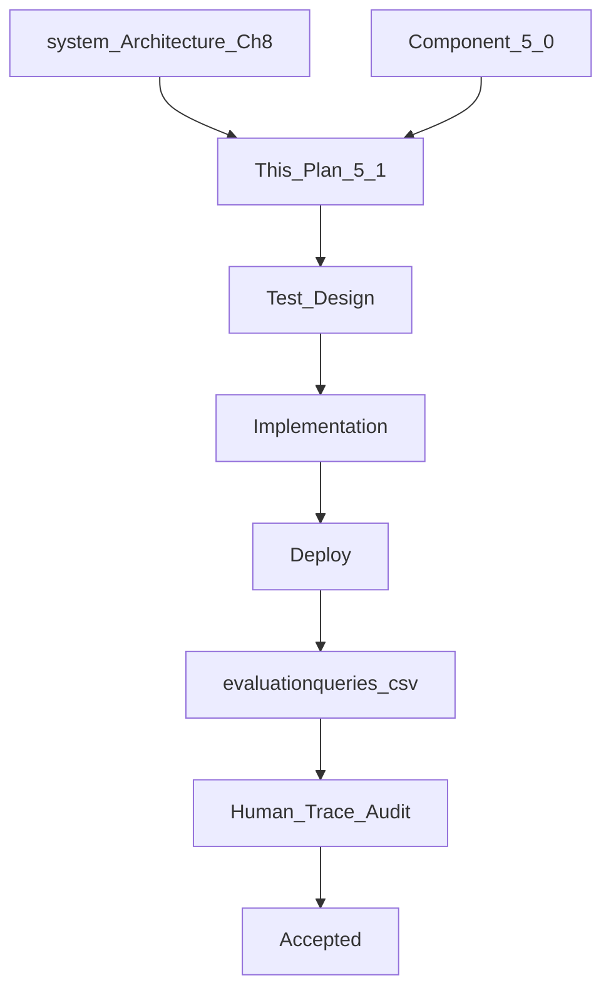

# Component 5.1 — Inventory Business Capability

**This document is the Goal Document for Component 5.1.** The implementing agent implements **this document only** — not chat history.

**Builds on:** [component_5.0_platform_8825a24c.plan.md](.cursor/plans/component_5.0_platform_8825a24c.plan.md) (registry, Capability blueprint, status model, Decision/Response context, eval spine).

**Architecture references:** [docs/system_Architecture.md](docs/system_Architecture.md) Ch 7 (~6590+), Ch 8 (~6980–7275), §6.9 clarification/confirmation, §6.10 verification; [docs/Problem_Statement.md](docs/Problem_Statement.md) §2–4; [docs/verified-facts-and-grounded-response.md](docs/verified-facts-and-grounded-response.md).

**Explicit non-goals:** Billing draft/finalize (5.2), Khata (5.3), Analytics (5.4), PDF/PPTX templates (5.5), system-understanding meta capability, editing historical `queries.csv`.

---

## Part 0 — Engineering philosophy

- **Correctness over code elegance.** Acceptance is trace-observable behavior + SQLite truth, not style review.
- **Runtime truth over prompt recipes.** Plan verification and tool gates enforce invariants; prompts state role and tool purpose only.
- **Implementation freedom.** File layout under `src/inventory/`, repository naming, and minor refactors are agent choice unless locked below. **Locked:** tool names, schema fields, plan-vs-tool check split, confirmation policy, refusal contract, eval transport (webhook → DO).
- **Production-first:** deploy → run eval rows → export traces → human Pass/Fail.



---

## Part 1 — Problem statement

| # | Problem | Evidence | 5.1 fix |
|---|---------|----------|---------|
| P1 | Inventory is stub → `unavailable` | Registry entry in [`capability-registry/index.ts`](src/capability-registry/index.ts) | Real Capability blueprint instance |
| P2 | No inventory SQLite domain | [`schema.ts`](src/store-durable-object/persistence/schema.ts) has only shop_profile | Products + aliases + movements + reservations |
| P3 | No register/query/allocate tools | Ch 8 tools undefined in code | Three tools with architecture names |
| P4 | Bogus INV fixtures / `read_inventory` naming | [`user-profile-fact-registry.ts`](src/global-orchestrator/verified-facts/user-profile-fact-registry.ts), binding-verifier INV-* | Scrap; real `inventory-fact-registry` + new BV fixtures |
| P5 | Blueprint cannot chain query→register on prior tool output | [`capability-blueprint.ts`](src/capability-registry/capability-blueprint.ts) `executeTool` has no prior-step context | In-objective tool execution context |
| P6 | LLM-owned `dependencies` insufficient for inventory rules | user_profile prompt asks LLM for deps; verifier ignores prerequisites | Code-owned prerequisite + mutex verification |
| P7 | ONB-027 / C50 inventory rows expect unavailable | [`queries-5.0.csv`](queries-5.0.csv) | Real stock answers; eval file renamed and expanded |

---

## Part 2 — Locked architectural decisions

These are **not open to interpretation**.

### 2.1 Tool surface (architecture names)

| Tool | Purpose |
|------|---------|
| `query_inventory` | Read-only: exact/fuzzy product lookup, low-stock scan, not-found facts |
| `register_inventory` | Only path that **increases** stock (new SKU or receive on existing) |
| `allocate_inventory` | Reserve / commit / release buffer for billing; **does not sell** |

Billing (5.2) is the only path that **decreases** stock. Inventory tools never write negative quantity deltas except via allocate status transitions that do not reduce `on_hand` until Billing commits (see Part 5.4).

### 2.2 Confirmation vs clarification

| Kind | When | Mechanism |
|------|------|-----------|
| **Confirmation** | Any **write** (register apply; allocate mutations that change reservation state) | Yes/No `callback_query` via existing `pending_confirmations` path; reuse user_profile pattern |
| **Clarification** | Ambiguous product, missing required fields, GST slab choice | Tool returns `clarification_needed` → GO Decision `ask_user` |
| **Reads** | Query | Never confirm |

`shop_profile.completeAutonomy === true` skips confirmation for inventory writes (same shop-wide flag).

### 2.3 Plan verification vs tool business rules

**Plan verification (code, harness retry):**

- Known tool names only
- Parameter types / required fields for the chosen mode
- **Mutex parameter groups** (invalid combos reject the plan)
- **Prerequisite rule (code-owned, not LLM-owned):** every `register_inventory` op in a plan must be preceded by a `query_inventory` op in the **same** plan (exact match mode). LLM may still emit a `dependencies` field for schema compatibility; verifier **ignores LLM dependency claims** and enforces our rule instead.

**Tool layer (no plan-verify fail → no replan loop for business rules):**

- Negative / zero receive quantity → **`completed` with `refusalMessage`** (not verified fact)
- Exact-query found matches during register path → `clarification_needed`
- Allocate insufficient available → tool structured failure / refusal for Response context
- Post-write SQLite verify fail → `error` (abort; no partial commit)

### 2.4 Completed with refusal (locked contract)

Extend [`CapabilityResult`](src/capability-registry/types.ts):

```typescript
| {
    status: "completed";
    verifiedFacts: Record<string, unknown>;
    refusalMessage?: string; // NL for Decision/Response context only — NEVER Fact Catalog
  }
```

- Grounded response binds **only** `verifiedFacts`.
- `refusalMessage` must appear in `CAPABILITY_STEP_COMPLETED` / execution summary slices so Response can explain without inventing stock changes.
- Blueprint must **not** `Object.assign` refusal text into `verifiedFacts`.

### 2.5 Search modes (one query tool)

| Mode | Params | Behavior |
|------|--------|----------|
| `exact` | `product_name` (full string) | Normalized equality on `product_name` **or** exact alias equality. "Maggi 5-pack" must not match "Maggi 1-pack". |
| `fuzzy` | `search_text` | Token/keyword/alias similarity → 0 / 1 / many |
| `low_stock` | `low_stock: true` | All SKUs where `quantity_on_hand < reorder_level` |
| `by_sku` | `sku` | Exact SKU primary key lookup |

Mutex: `low_stock` cannot combine with `sku` / `search_text` / `product_name`. Register's prerequisite query **must** use `exact`.

### 2.6 Stock direction rules

- Register: quantity delta **must be > 0**; otherwise completed + refusal NL telling owner to create a bill (dummy bill / notes in 5.2).
- No delete-stock / write-down tool in 5.1.
- Allocate: manages **reserved** quantity; available = `on_hand - sum(active reservations)`.

### 2.7 Reorder default (Option A)

If owner does not supply `reorder_level` on new SKU register:  
`reorder_level = max(1, floor(initial_quantity * 0.2))`.  
Defaulted value is a citeable verified fact; Response must tell the owner the default was applied.

### 2.8 GST / HSN

Required on **new SKU** register. Allowed GST slabs in clarification NL: **0, 5, 12, 18** (percent). Missing slab/HSN → `clarification_needed` listing slabs in `requiredInfo` (not Fact Catalog).

### 2.9 Scrap prior inventory test scaffolding

Delete / rewrite:

- `buildInventoryFixtureRecords` and tool name `read_inventory`
- INV-* tests that assume bogus shapes

Replace with fixtures using real tool names and real `factId` patterns.

---

## Part 3 — Persistence (locked schema)

SQLite tables in DO storage (Drizzle in [`schema.ts`](src/store-durable-object/persistence/schema.ts)). Exact column types agent choice; **fields locked**:

### 3.1 `inventory_products`

- `sku` (PK, system-generated slug from product name + numeric suffix; confirmed at write)
- `product_name` (canonical NL name — constant full string for exact match)
- `item_type` (`packaged` | `loose`)
- `unit` (`packet` | `kg` | `g` | `litre` | `ml` | `dozen` | `piece`)
- `quantity_on_hand` (number; denormalized cache)
- `cost_price`, `sell_price` (INR per native unit)
- `hsn_code`, `gst_rate` (0|5|12|18)
- `reorder_level`
- `is_active`, `created_at`, `updated_at`

### 3.2 `inventory_product_aliases`

- `sku` FK, `alias` (normalized), unique `(sku, alias)`

### 3.3 `inventory_movements` (audit source of truth)

Bank-style ledger — **required**:

- `id`, `sku`, `movement_type` (`receive` | `reserve` | `commit` | `release`)
- `quantity_delta`, `balance_before`, `balance_after`
- `reference_type`, `reference_id`
- `update_id`, `correlation_id`, `created_at`

**Invariant:** every change to `quantity_on_hand` or reservation that affects available stock is accompanied by a movement row in the **same SQLite transaction**. Cache without movement = bug.

### 3.4 `inventory_reservations`

- `id`, `sku`, `quantity`, `draft_bill_id` (string; may be opaque until 5.2)
- `status` (`reserved` | `committed` | `released`)
- `idempotency_key`, `created_at`, `resolved_at`

### 3.5 Write verify pattern (all mutating tools)

1. Read current state (on_hand, reservations) into memory; trace it.
2. Apply mutation + movement in one transaction.
3. Re-read SQLite; compare to expected `balance_after`.
4. Mismatch → abort / `error`; do not return verified facts.

---

## Part 4 — Blueprint platform extension (required for 5.1)

Modify [`capability-blueprint.ts`](src/capability-registry/capability-blueprint.ts) so **all** capabilities can chain tools:

1. Maintain `Map<operationId, toolOutput>` (and/or ordered list) during the execution loop.
2. Pass **prior tool outputs in this objective** into `executeTool` (extend `ToolExecutor` signature).
3. Trace each tool output (not only keys) in `TOOL_EXECUTED` payload for audit.
4. If a tool throws `clarification:*` mid-chain → stop remaining ops; return `clarification_needed` (existing `mapToolError`).
5. Aggregate `verifiedFacts` and optional `refusalMessage` into final `CapabilityResult` without polluting Fact Catalog.
6. If any tool returns refusal and later tools were planned, **stop** after refusal (do not register after a negative-qty refusal).

user_profile continues to work (single-tool plans unchanged).

---

## Part 5 — Tool contracts

### 5.1 `query_inventory`

**Modes:** exact | fuzzy | low_stock | by_sku (Part 2.5).

**Outcomes:**

| Result | Capability status | Facts |
|--------|-------------------|-------|
| 0 matches (fuzzy/exact/by_sku) | `completed` | Structured empty / not-found payload (citeable “not in inventory” fields as designed by fact builder — **no** “did you mean add it?”) |
| 1 match | `completed` | Per-SKU quantity (+ reorder/unit as needed) |
| Many matches | `clarification_needed` | Candidates in `requiredInfo` NL |
| low_stock list | `completed` | One fact record per low SKU |

Never modifies inventory. Never confirms.

### 5.2 `register_inventory`

**Prerequisite:** same-plan `query_inventory` with `exact` on the full `product_name`.

**At execution (code):**

1. Load prerequisite query output from in-objective context.
2. If query missing → should already have failed plan verify; if somehow missing → `error`.
3. If query returned **one or more** matches → `clarification_needed` (do not write). Owner’s next message carries clearer objective (“new SKU Maggi 5-pack, not the 1-pack”).
4. If query returned **zero** matches → create new SKU path (all required fields).
5. If objective is receive on **known** sku and planner passes `sku` after exact/by_sku identity is clear: allow quantity increase on that SKU (still requires query-before-register in plan; query exact/by_sku must identify that SKU).

**New SKU required fields:** `product_name`, `item_type`, `unit`, `quantity` (>0), `cost_price`, `sell_price`, `hsn_code`, `gst_rate`; `reorder_level` optional (default Option A); aliases optional.

**Partial fields:** not allowed — missing → `clarification_needed`.

**Confirmation:** always for register writes (new SKU and receive), unless `completeAutonomy`. Confirmation table shows SKU, name, type, unit, qty, prices, HSN, GST%, reorder, aliases.

**Post-confirm:** movement `receive` + verify; return verified facts including quantity and defaulted reorder if any.

**Negative quantity:** `completed` + `refusalMessage` (guide to billing); no DB write.

### 5.3 `allocate_inventory`

**Operations:** `reserve` | `commit` | `release`.

**Params:** `sku`, `quantity` (>0), `operation`, `draft_bill_id`, `idempotency_key`.

**Rules (Ch 8):**

- Product must exist; quantity available for reserve; never negative available.
- Draft must not permanently reduce `on_hand` on reserve (reservation row only).
- Commit / release update reservation status + movements; idempotent on `idempotency_key`.
- Confirmation on mutating allocate ops unless `completeAutonomy`.

**5.1 eval:** unit + targeted trace tests for allocate. Full oversell with real bills is **5.2**; still implement the tool fully so Billing can call it later via GO objectives / table reads.

### 5.4 Movement ownership (cross-component note for 5.2)

| Delta direction | Allowed origin |
|-----------------|----------------|
| Positive `on_hand` | Inventory `register_inventory` only |
| Negative `on_hand` | Billing finalize only (5.2) |
| Reserve buffer | Inventory `allocate_inventory` |

Billing may **read** inventory tables for available stock (accepted encapsulation tradeoff, documented in README). Billing must not insert positive inventory movements.

---

## Part 6 — Capability module + registry wiring

1. Create Inventory Capability via `createCapabilityExecutor` (mirror [`user-profile/index.ts`](src/user-profile/index.ts)).
2. Replace stub in [`capability-registry/index.ts`](src/capability-registry/index.ts): `implemented: true`, handler, `toolSurface`, `faithfulnessBuilder`.
3. Update Decision context tool surface to include inventory tools (same helper that lists user_profile tools).
4. Inner planner prompt: list three tools + modes/mutex/purpose; instruct register plans to include exact query first; **do not** teach LLM to invent dependency graphs — code enforces prerequisites.
5. Parameter grounding: product name tokens from objective must appear in relevant params (MSP Maggi pattern).

---

## Part 7 — Faithfulness

Create [`src/global-orchestrator/verified-facts/inventory-fact-registry.ts`](src/global-orchestrator/verified-facts/inventory-fact-registry.ts):

- One `VerifiedFactRecord` per citeable `(sku, field)` (quantity, reorder_level, sell_price, … as returned).
- `catalogLabel` includes product name + sku.
- `identity.sku` + `identity.canonicalName`.
- Wire through `resolveFaithfulnessBuilder("inventory")`.
- Update [docs/verified-facts-and-grounded-response.md](docs/verified-facts-and-grounded-response.md) tool checklist for inventory tool names.
- Scrap bogus INV fixtures; add new unit BV tests against real shapes.

---

## Part 8 — Expected runtime walkthroughs (acceptance narratives)

### W1 — Receive new Maggi (happy path)

| Step | Expected |
|------|----------|
| GO plan | Objective → `inventory` |
| BC plan | `query_inventory` exact → `register_inventory` |
| Query | 0 matches |
| Register | Confirmation table (unless autonomy) → Yes |
| DB | Product row + receive movement; on_hand verified |
| Response | Grounded facts (qty, name); if reorder defaulted, say so |
| Trace | TOOL_PLAN_VERIFIED, TOOL_EXECUTED×2, confirmation events, no shop_profile writes |

### W2 — Ambiguous fuzzy query (“how much atta?”)

| Step | Expected |
|------|----------|
| Query fuzzy | ≥2 matches → `clarification_needed` |
| Decision | `ask_user` |
| Response | Lists candidates in NL; no quantity claims for wrong SKU |
| Next message | Owner picks → new run → single SKU facts |

### W3 — Not found (“how much sugar is left?” empty DB)

| Step | Expected |
|------|----------|
| Query | 0 matches → `completed` |
| Response | You do not have this in inventory; **no** “shall I add it?” |
| DB | No writes |

### W4 — Low stock

| Step | Expected |
|------|----------|
| Query `low_stock: true` | Lists SKUs with on_hand &lt; reorder |
| Response | Grounded per-SKU facts |

### W5 — Reduce via register refused

| Step | Expected |
|------|----------|
| Register with negative qty | `completed` + `refusalMessage` |
| Decision | `respond` |
| Response | Explains use billing / dummy bill; **no** quantity decrease facts |
| DB | Unchanged |

### W6 — Register without query in plan

| Step | Expected |
|------|----------|
| Plan verify | Fail → harness retry diagnostic |
| After retries | `not_supported` or clarification per blueprint empty/invalid rules — **no** silent write |

### W7 — Exact match collision on register

| Step | Expected |
|------|----------|
| Exact query finds existing “Maggi 1-pack” while registering same full name | `clarification_needed` |
| No receive/create until owner clarifies new distinct product_name |

### W8 — Allocate reserve (unit / targeted)

| Step | Expected |
|------|----------|
| Reserve 3 of 5 | Reservation row; available = 2; on_hand still 5 |
| Trace | movement reserve + verify |
| Oversell reserve | Tool refusal / error; no reservation |

---

## Part 9 — Evaluation spine

### 9.1 Rename + expand

- Rename [`queries-5.0.csv`](queries-5.0.csv) → **`evaluationqueries.csv`** (keep C50 rows; update expected outcomes for inventory rows that were `unavailable`).
- Point [`scripts/eval/run-queries-5.0.ts`](scripts/eval/run-queries-5.0.ts) (or rename script) + `package.json` script (`eval` / `eval:5.1`) at the new file.
- **Transport locked:** deployed Worker webhook → Store DO → full `orchestrate()` (same as 5.0 Part 9.3). No local capability-only harness for acceptance.

### 9.2 Minimum new rows (C51-*)

| ID | Query / sequence | Expected |
|----|------------------|----------|
| C51-001 | How much sugar is left? (empty) | W3 not-found; no profile writes |
| C51-002 | 50 packets Maggi 70g came in, cost 12, MRP 14, GST 12%, HSN … | W1 register + confirm + facts |
| C51-003 | how much Maggi left? | Grounded qty after C51-002 |
| C51-004 | what's running out? | W4 low stock (after reorder default) |
| C51-005 | reduce Maggi by 5 / write down stock | W5 refusal via billing guidance |
| C51-006 | how much atta? (seed two atta SKUs first) | W2 ask_user |
| C50-001/002 | Update expectations: real inventory path, not unavailable |

### 9.3 Rubric (human, from traces + DB)

1. Routing → `inventory` (or replan into it)
2. Plan includes query before register when writing
3. Status honesty (clarification / completed+refusal / denied)
4. Response grounding — no invented qty; refusals not Fact Catalog
5. Movement ledger present for every successful write
6. No shop_profile mutation on inventory-only runs
7. Confirmation only on writes

---

## Part 10 — Test design

### 10.1 Unit (must pass)

| ID | Target |
|----|--------|
| INV-PLAN-01 | register without query → plan verify fail |
| INV-PLAN-02 | low_stock + sku mutex fail |
| INV-Q-01 | exact vs fuzzy: 5-pack does not exact-match 1-pack |
| INV-Q-02 | fuzzy many → clarification shape |
| INV-R-01 | negative qty → completed + refusalMessage; DB unchanged |
| INV-R-02 | receive movement balance_before/after verify |
| INV-R-03 | reorder default Option A |
| INV-A-01 | reserve reduces available not on_hand |
| INV-A-02 | idempotent allocate key |
| INV-F-01 | fact registry per sku field; no refusal in catalog |
| BP-01 | blueprint passes prior tool output to next executeTool |

### 10.2 Production validation

1. `npm test` green
2. `wrangler deploy`
3. Run eval against `evaluationqueries.csv`
4. Export traces; `sql/agent-trace.sql` per `update_id`
5. Human Pass on W1, W3, W5 minimum; W2 if two atta SKUs seeded
6. Optional Telegram smoke for confirmation Yes/No UX

---

## Part 11 — Trace / docs

- Ensure `TOOL_EXECUTED` payloads include enough structured output for register prerequisite audit.
- Document inventory movement types and refusal contract in [docs/agent-traceability-and-agent-state.md](docs/agent-traceability-and-agent-state.md).
- README: Component 5.1 eval subsection; note Billing decreases stock in 5.2; allocate is reserve buffer.

---

## Part 12 — Acceptance criteria (stop only when all true)

- [ ] Inventory registry entry implemented; stub gone
- [ ] Three tools live with locked names and mutex/prerequisite verification
- [ ] Schema: products, aliases, movements, reservations
- [ ] Writes confirm (unless completeAutonomy); reads never confirm
- [ ] Walkthroughs W1, W3, W5 pass in production traces
- [ ] W2 pass when multi-atta seeded
- [ ] Allocate reserve/commit/release unit-proven (W8)
- [ ] Faithfulness builder registered; old INV/`read_inventory` scaffolding removed
- [ ] Blueprint in-objective prior-tool context works
- [ ] `evaluationqueries.csv` + eval script path updated; C51 rows posted via webhook→DO
- [ ] Human rubric Pass on required rows; movement audit rows exist for successful receives

---

## Part 13 — Carry forward

- **5.2 Billing:** draft/finalize; negative movements; call allocate + read available; oversell guard end-to-end
- **5.5:** invoice PDF from verified bill data
- Prefer exact `product_name` constants after clarification; do not use profile instructions to auto-resolve “atta”
