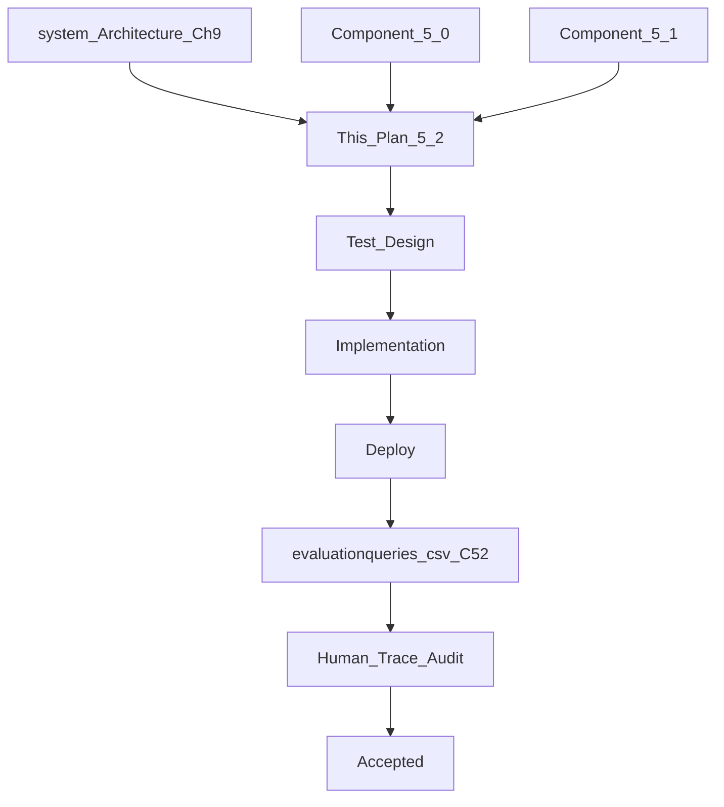

# Component 5.2 — Billing Business Capability

**This document is the Goal Document for Component 5.2.** The implementing agent implements **this document only** — not chat history.

**Builds on:** [component_5.0_platform_8825a24c.plan.md](.cursor/plans/component_5.0_platform_8825a24c.plan.md) (registry, Capability blueprint, Decision/Response context slices, eval spine); [component_5.1_inventory_f83e3e32.plan.md](.cursor/plans/component_5.1_inventory_f83e3e32.plan.md) (inventory schema, exact-first search, `refusalMessage`, allocate semantics).

**Architecture references:** [docs/system_Architecture.md](docs/system_Architecture.md) Ch 7 (BC pattern), Ch 9 (Billing tools), §12 Pending Execution State, B.2 oversell; [docs/Problem_Statement.md](docs/Problem_Statement.md) §3–4; [docs/verified-facts-and-grounded-response.md](docs/verified-facts-and-grounded-response.md).

**Explicit non-goals:** Full Khata BC (5.3), Analytics (5.4), production PDF library polish beyond HTML mapping (5.5 may refine), standalone Khata payments/balance queries, Card payment mode, IGST/inter-state GST, finalize idempotency keys (execution ledger at DO gate is sufficient).

---

## Part 0 — Engineering philosophy

- **Correctness over code elegance.** Acceptance is what traces + SQLite show — not style review.
- **Code and constitution over prompt recipes.** Plan verification and tool gates enforce invariants. BC tool-planner prompt states role and tool purposes. It does **not** teach situational recipes like "always call show_draft before add_item."
- **Pre-loop deterministic logic before the harness `for` loop.** Billing extends the Capability blueprint pattern: **before** iterating LLM-planned tool steps, run code-owned resolvers (draft focus, event-log projection, operation/state-machine guards). The LLM never supplies `bill_id` as source of truth.
- **Agent state vs context engineering (same as 5.1).** L1 tool-result map is per BC invocation only. Draft truth lives in **SQLite event log**, not conversation memory. Artifact bytes never enter agent state or LLM context slices.
- **Cross-BC calls are repository/util only.** Billing reads inventory tables and writes inventory decrement + khata ledger entries via shared repositories — **not** via GO objectives and **not** via LLM inventory tool plans.
- **Implementation freedom.** File layout under `src/billing/`, repository naming, helper extraction — agent choice unless locked below.
- **Production-first:** deploy → run `evaluationqueries.csv` C52 rows → export traces → human Pass/Fail.



---

## Part 0.1 — Mean / Do not mean (global)

| Mean | Do not mean |
|------|-------------|
| `manage_draft_bill` owns draft lifecycle via **append-only draft events** | A single mutable `drafts` row with no audit trail |
| Draft focus = **last-edited open draft** when owner continues without naming another | Exposing `bill_id` in Telegram or requiring owner to know UUIDs |
| `finalize_bill` is the **only** path that decrements `quantity_on_hand` for a sale | Inventory `allocate_inventory` commit decreases on_hand |
| `allocate_inventory` = owner holds stock aside ("keep packet #3 for Ramesh") | Auto-reserve on draft line add; billing touching reservation rows on finalize |
| Available to sell = `on_hand − sum(active reservations)` | Selling reserved stock without owner releasing hold first |
| Oversell / insufficient sellable → `completed` + `refusalMessage` | `error` or `denied` for business refusal |
| Below-cost → **warning on finalize confirmation table**, not block | Refuse below-cost sales |
| Khata write on finalize when `payment_method = khata` | Separate GO objective to Khata for normal credit-on-bill |
| LLM Billing planner sees **only billing tools** | LLM plans `query_inventory` inside Billing BC |
| Artifact in `ExecutionResult.attachments` | Artifact bytes in agent state or grounded-response bindings |
| Cancel draft → confirmation → **hard delete** draft rows + `DRAFT_CANCELLED` trace | Silent delete; soft-cancel without confirmation |
| Execution dedup via existing `execution_ledger` | Billing-specific finalize idempotency keys |
| Money stored as **integer paise** everywhere billing touches amounts | Mixed rupee floats across inventory vs billing |
| `inventory_reservations.draft_bill_id` is **independent** of billing `bill_id` | Coupling allocate holds to billing draft ids |
| Drafts persist across `/new` (SQLite); not conversation-scoped | Draft state cleared when conversation resets |
| Billing inserts **negative** inventory movements only on finalize | Billing inserting positive `receive` movements |
| Finalize/cancel use existing `pending_confirmations` Yes/No path | New ad-hoc confirmation mechanism |

---

## Part 1 — Problem statement

| # | Problem | Evidence today | 5.2 fix |
|---|---------|----------------|---------|
| P1 | Billing is `unavailable` stub | [`capability-registry/index.ts`](src/capability-registry/index.ts) | Real Capability blueprint with three tools |
| P2 | No billing SQLite domain | [`schema.ts`](src/store-durable-object/persistence/schema.ts) | Draft events, finalized bills, lines, minimal khata ledger |
| P3 | No draft persistence across messages | Architecture §12 Pending Execution State deferred | Event-sourced draft + draft focus resolver |
| P4 | Inventory decrease path missing | 5.1 refuses decrease; points to billing | `finalize_bill` writes negative inventory movement |
| P5 | Credit-on-bill not modeled | Problem Statement §3 khata examples | Minimal khata ledger write on khata finalize |
| P6 | GO `attachments: []` always | [`global-orchestrator/index.ts`](src/global-orchestrator/index.ts) `deliver()` | Billing finalize returns attachment bytes; wire through orchestrate → ExecutionResult |
| P7 | Allocate semantics unclear in planner | [`inventory/index.ts`](src/inventory/index.ts) prompt | Amend inventory + GO billing/inventory descriptions |

---

## Part 2 — Locked architectural decisions

### 2.1 Three tools (exact ids)

| Tool id | Purpose |
|---------|---------|
| `manage_draft_bill` | Single tool, **operation** enum. Append draft events; implicit load-audit preflight every call; return projected draft as verified facts. **No confirmation** except `cancel_draft`. |
| `finalize_bill` | Validate draft complete → availability check → confirmation table (unless `completeAutonomy`) → single SQLite txn: finalized bill + inventory decrement + khata if credit → render invoice artifact → attachments. |
| `query_bill` | Read finalized bills (`list_recent`, `get_by_id` internal); `list_open_drafts`. Never mutates. |

### 2.2 `manage_draft_bill` operations (kirana verbs)

Locked operation ids (implementing agent may add helpers; ids are not free):

| Operation | Owner intent |
|-----------|--------------|
| `start_bill` | New open draft; optional customer/notes in same op |
| `set_customer` | Set/update customer name |
| `set_notes` | Freeform bill notes (dummy/loose-pack scenario) |
| `add_item` | Product name + quantity; snapshots sell_price/hsn/gst from inventory |
| `remove_item` | Drop line by product name or line ref |
| `change_item_quantity` | "make it 6 Maggi" |
| `set_payment_method` | `cash` \| `upi` \| `khata` |
| `set_payment_reference` | Optional UPI ref (UTR / UPI ID / mobile) |
| `show_draft` | Read-only projection (no mutating event, or explicit no-op) |
| `list_open_drafts` | All `status=open` drafts with human labels |
| `cancel_draft` | Confirmation flow → hard delete on Yes |

**Draft field order:** Any sequence allowed during drafting. **Finalize** requires: customer, ≥1 line, payment_method. Missing → `clarification_needed`.

**Payment modes:** `cash`, `upi`, `khata` only. Card out of scope.

### 2.3 Draft focus resolver (Policy A — locked)

**Never** put `bill_id` in owner-facing text or require UUID in GO objective.

#### 2.3.1 Two-layer `draft_target` (GO + BC)

| Layer | Who sets it | Values | Purpose |
|-------|-----------|--------|---------|
| **GO Planning** | Planning JSON on billing objective (optional metadata field `draftTarget`) | `implicit_latest` (default) \| `new` \| `by_customer` \| `ambiguous` | Strategic intent from conversation — e.g. owner said "new bill", "Priya's bill", "the other draft" |
| **BC tool plan** | `manage_draft_bill` / `finalize_bill` parameters (optional `draft_target`) | Same enum | Operational mirror; must not contradict GO metadata when both present |

**Resolution precedence (code):** BC tool param if present → else GO objective `draftTarget` → else `implicit_latest`.

**GO Planning constitution (billing):** When assigning a `billing` objective, classify draft intent from conversation. Do **not** emit `bill_id`. Default `implicit_latest` when owner continues an in-progress bill. Set `new` when owner clearly starts a fresh bill. Set `by_customer` when owner names a customer/context for a non-latest open draft. Set `ambiguous` when owner references another draft among 2+ open drafts without enough discriminant — Billing resolver will `clarification_needed` with human labels.

**GO Planning context slice:** Extend [`planningContextSlice`](src/store-durable-object/agent-state/run-context.ts) (or equivalent assembly) with **open drafts summary** from SQLite: count, per-draft human label (customer, line count, last edited relative time). No UUIDs in text shown to owner-facing prompts; internal JSON may include `bill_id` for downstream code if needed.

**BC planner context slice:** Same open-draft summary injected into Billing `planTools` user content (counts + human labels).

#### 2.3.2 Resolver algorithm (runs in code)

At start of each `manage_draft_bill` / `finalize_bill` call (pre-loop, before harness step execution):

1. Read effective `draft_target` (precedence above).
2. `new` / `start_bill` → generate new `bill_id`.
3. `by_customer` → unique open draft matching `customer_name`; if 0 or >1 → `clarification_needed` with code-built options (customer + line summary + last edited — never UUID).
4. `ambiguous` → `clarification_needed` listing open drafts (same human labels).
5. `implicit_latest` → open draft with max `last_event_at`; if none and op needs existing draft → clarify.
6. **2+ open drafts + weak signal (`implicit_latest`):** still use **last-edited** (Policy A); owner corrects in NL → next turn GO sets `by_customer`.

Internal traces may log `bill_id`. DO sequential processing makes `last_event_at` ordering well-defined.

### 2.4 Event-sourced draft (Pending Execution State)

- **Append-only** `billing_draft_events` per `bill_id`.
- **Projection** rebuilt on every tool call: customer, lines, payment, notes, totals (informational), `last_event_at`.
- **Invariant:** `add_item` without prior `start_bill` event for resolved `bill_id` → hard stop (`clarification_needed` or `error` with diagnostic "bill not created").
- Draft mutations do **not** touch `quantity_on_hand`, finalized bills, or khata.

**Why no confirmation on draft:** non-committing staging (architecture §12); reversible by further draft ops.

### 2.5 Inventory interaction (locked — overrides Ch 9 "Billing requests allocation")

> **Superseded by Component 5.3** — billing no longer decrements stock; Inventory `commit_bill_sale` runs as a separate GO objective after finalize. Billing may still read inventory for oversell checks.

| Action | Who |
|--------|-----|
| Read product price/HSN/GST | Billing code via [`inventory-repository`](src/store-durable-object/persistence/repositories/inventory-repository.ts) + exact search ([`product-search.ts`](src/inventory/search/product-search.ts)) |
| Check sellable qty at finalize | `available = quantity_on_hand − getActiveReservedQuantity(sku)` per line |
| Decrement `quantity_on_hand` | **Only** `finalize_bill` — negative `inventory_movements` row, same txn |
| Touch `inventory_reservations` on finalize | **Never** |
| LLM inventory tools in Billing BC | **Never** |

**Oversell refusal:** `completed` + `refusalMessage` from formatter including: `sku`, `productName`, `quantityOnHand`, `reservedQuantity`, `availableQuantity`, `requestedQuantity`. Put structured fields in `verifiedFacts` for optional binding; message string for Response.

**Allocate (5.1):** Separate owner workflow — "keep aside." Amend [`inventory/index.ts`](src/inventory/index.ts) `TOOL_SYSTEM_PROMPT` and GO `LOCKED_DESCRIPTIONS.inventory` in [`capability-registry/index.ts`](src/capability-registry/index.ts) to state allocate = physical hold for a customer, **not** billing draft, **not** auto on add_item.

**`draft_bill_id` on reservations vs billing `bill_id`:** **Independent id spaces.** `allocate_inventory.draft_bill_id` is an opaque hold reference chosen by the inventory tool plan — it is **not** required to equal a billing `bill_id`. Billing finalize never reads or updates reservation rows. Availability math simply subtracts all active reservations for the SKU.

**No positive inventory movements from Billing:** Billing may only insert **sale** (negative delta) movements on finalize. Never insert `receive` or positive deltas (5.1 movement ownership).

### 2.6 Khata minimal ledger (5.3-extensible)

> **Superseded by Component 5.3** — khata ledger writes are owned by the Khata BC (`record_credit_from_bill`), not billing finalize.

Billing writes khata **like inventory** — repository call inside `finalize_bill` txn when `payment_method = khata`.

**Scope (locked):** Khata ledger in 5.2 records **credit extended on bills** (`credit_sale`) and will later record **repayments** (`payment` in 5.3). It is **not** a full customer purchase history — only udhar balance mechanics.

**Customer linkage on khata finalize:**

1. `bill.customer_name` → resolve or create row in `khata_customers` (normalized name match).
2. Append `khata_ledger_entries` with `entry_type = credit_sale`, `amount_paise = grand_total_paise`, `reference_type = bill`, `reference_id = bill_id`, `balance_after_paise` computed from prior entries.

Standalone "put ₹500 on Ramesh's credit" without a bill remains **5.3** (Khata BC).

**Design for migration, not lazy stub:**

- `khata_customers` — `id`, `canonical_name`, `normalized_name`, `created_at`
- `khata_ledger_entries` — append-only: `id`, `customer_id`, `entry_type` (`credit_sale` \| `payment` reserved for 5.3), `amount_paise`, `reference_type` (`bill`), `reference_id` (`bill_id`), `balance_after_paise`, `notes`, `update_id`, `correlation_id`, `created_at`

5.3 adds payment entries, balance queries, ambiguity rules — **no breaking rename** of these tables.

### 2.7 GST and totals (deterministic code catalog)

- Line snapshot at `add_item`: `sell_price`, `hsn_code`, `gst_rate` from inventory row (owner cannot override via draft).
- Per line: `taxable = qty × sell_price`; `gst = round_paise(taxable × rate / 100)`; `cgst = round_paise(gst / 2)`; `sgst = round_paise(gst / 2)` (intra-state only).
- Bill totals = sum of rounded line amounts.
- GST rates on lines come from inventory snapshot: **{0, 5, 12, 18}** percent only (5.1 invariant).
- Implement `round_paise(n) => Math.round(n * 100) / 100` using **integer paise** internally for all billing/khata amounts.

### 2.7.1 Money units (locked)

- **All billing and khata monetary fields are integer paise** in SQLite (`sell_price_paise`, `cost_price_paise` on snapshots, totals, ledger amounts).
- Inventory [`costPrice` / `sellPrice`](src/store-durable-object/persistence/schema.ts) are **already integer paise** — treat them as paise when snapshotting to bill lines and when comparing below-cost (`cost_price_paise > sell_price_paise`).
- Display in confirmation tables / invoice: format paise → ₹ with two decimals in formatters only.

### 2.8 Finalize confirmation

- Reuse existing **Telegram Yes/No** path: [`pending_confirmations`](src/store-durable-object/persistence/schema.ts) + [`worker-delivery-port`](src/store-durable-object/runtime-ports/worker-delivery-port.ts) — same pattern as inventory [`format-confirmation-table`](src/inventory/confirmation/format-confirmation-table.ts). Implement `formatFinalizeConfirmationTable` and `formatCancelDraftConfirmationTable` under `src/billing/confirmation/`.
- Markdown table: lines, qty, rate, taxable, CGST, SGST, total, customer, payment, notes.
- **Below-cost lines:** per affected SKU, prominent row: `**SELLING BELOW COST — cost ₹X, sell ₹Y**` (all caps in table text).
- `completeAutonomy` skips confirmation (and warnings).
- On Yes: one SQLite transaction — finalized bill + lines + inventory movements + khata entry if khata + mark draft closed/deleted — then **post-read verify** (§2.8.1).

#### 2.8.1 Post-commit verify on finalize (5.1 pattern)

After finalize txn, before returning verified facts:

1. Re-read each affected SKU `quantity_on_hand` — must equal expected post-sale values.
2. Re-read `billing_bills` + line totals — must match computed paise totals.
3. If khata: re-read `balance_after_paise` for customer — must match ledger append.
4. On mismatch → return `error`; do not claim success or emit bill facts.

Same pattern for inventory decrement as 5.1 Part 3.5 (movement row + balance check).

### 2.9 Cancel draft confirmation

- Reuse `pending_confirmations` Yes/No (§2.8).
- Show draft summary table (not artifact) via `formatCancelDraftConfirmationTable`.
- Yes → hard delete: `billing_draft_events` + `billing_drafts` header for that `bill_id`; append agent trace `DRAFT_CANCELLED` with summary payload (audit without keeping draft rows).
- No → draft unchanged.

### 2.10 Artifact delivery

- `generateArtifact` on `finalize_bill` defaults **true** when shop preference allows (§2.10.1).
- v1: HTML invoice template in repo; map fields per **§2.10.2** from finalized bill + [`shop_profile`](src/store-durable-object/persistence/schema.ts).
- Dev fallback: include rendered HTML in NL response **and** attach same bytes as `text/html` or `application/pdf` stub if PDF lib not ready — locked minimum: **attachment bytes returned** on finalize success path.
- Wire: see **§2.10.3** — extend types and `orchestrate()` deliver path.
- **Never** put artifact content in Fact Catalog or LLM context.

#### 2.10.1 `artifactsEnabled` shop preference

- Add `artifactsEnabled` boolean on [`shop_profile`](src/store-durable-object/persistence/schema.ts) (default **true**), per 5.0 research decision.
- Effective generate = `finalize_bill.generateArtifact !== false` **and** `shop_profile.artifactsEnabled !== false`.
- When disabled: skip attachment bytes; still return finalized bill verified facts.

#### 2.10.2 Invoice HTML field mapping (locked)

| Template region | Source |
|-----------------|--------|
| Shop name | `shop_profile.shop_name` |
| Shop GSTIN | `shop_profile.gstin` (if registered) |
| Bill number | `bill_id` (internal; may show short form in HTML, not in Telegram NL) |
| Bill date | `finalized_at` |
| Customer | `billing_bills.customer_name` |
| Notes | `billing_bills.notes` |
| Line table columns | `#`, product name, HSN, qty + unit, rate, taxable, CGST, SGST, line total |
| Line row data | `billing_bill_lines` denormalized at finalize |
| Subtotal | `subtotal_paise` |
| CGST total | `cgst_total_paise` |
| SGST total | `sgst_total_paise` |
| Grand total | `grand_total_paise` |
| Payment method | `payment_method` |
| Payment reference | `payment_reference` if present |

Dev fallback: render same HTML into NL text when attachment MIME is `text/html`.

#### 2.10.3 Attachment propagation shape (locked)

Extend [`CapabilityResult`](src/capability-registry/types.ts) completed branch:

```typescript
attachments?: Array<{ filename: string; mimeType: string; bytes: Uint8Array }>;
```

Flow:

1. `finalize_bill` tool returns attachment array on tool step result.
2. Billing `executeCapability` aggregates into `CapabilityResult.attachments` when status `completed`.
3. [`orchestrate()`](src/global-orchestrator/index.ts) after execution phase: merge all capability `attachments` into terminal `ExecutionResult.attachments` (concatenate if multiple — billing should produce at most one invoice).
4. [`execution-result-adapter.ts`](src/worker-telegram-adapter/execution-result-adapter.ts) `sendDocument` — already exists; no Worker change unless MIME handling needed.

### 2.11 Idempotency

**Out of scope for Billing code.** [`execution_ledger`](src/store-durable-object/persistence/schema.ts) dedupes `update_id` before GO runs ([`execution-manager`](src/store-durable-object/execution-manager/index.ts)). Document in README; no `finalize` idempotency_key table in 5.2.

### 2.12 `refusalMessage` contract (same as 5.1)

Extend usage: oversell and similar business refusals use `completed` + `refusalMessage`; never Fact Catalog.

### 2.13 Plan verification vs tool business rules

**Layer A — Plan verification:**

- `toolName` ∈ known billing tools.
- `manage_draft_bill` has valid `operation` enum.
- `finalize_bill` must not appear in same plan as draft ops that mutate (mutex: finalize is separate invocation — single-op plan or verify rejects mixing).
- Selective parameter grounding (Part 2.14).
- `draft_target` / GO `draftTarget` enum valid when present.

**Layer B — Tool business rules (after valid plan):**

- Draft focus resolution (GO + BC precedence §2.3.1), event-log invariants, inventory exact match on `add_item`, finalize completeness, availability, below-cost flagging, khata customer resolve-or-create.

**No LLM prerequisite** for `show_draft` before `add_item` — implicit preflight in tool code.

### 2.14 Selective parameter grounding (locked field lists)

Substring of `objective.description` (same pattern as [`parameter-grounding.ts`](src/inventory/parameter-grounding.ts)):

**`manage_draft_bill`:** `customer_name`, `product_name`, `quantity`, `payment_method`, `notes`, `payment_reference` when present.

**`finalize_bill`:** optional `generateArtifact` boolean — do not ground.

**Do not ground:** `bill_id`, `draft_target`, `operation`, system-generated ids, line internal refs.

### 2.15 Default payment

If owner omitted payment at finalize: use `user_profile` default payment preference if persisted (extend shop profile or instructions — agent picks least invasive); else `clarification_needed`.

### 2.16 Dummy bill / loose-pack workflow (locked)

When owner sells from an opened pack to multiple people (5.1 refusal path: "create a bill, possibly dummy bill with notes"):

1. `start_bill` with `customer_name` = shop name from `shop_profile.shop_name`, or literal **"Shop"** / **"Godown"** if unset (agent documents chosen default in README).
2. `add_item` for the pack SKU + total quantity being written off.
3. `set_notes` with freeform breakdown ("250g each to four customers…").
4. `finalize_bill` as normal — decrements inventory; notes appear on confirmation table and invoice.

This is **in scope for 5.2**, not README-only.

### 2.17 Draft verified facts after each op (locked)

Every successful `manage_draft_bill` mutating op returns **verified facts** sufficient for Response to narrate current draft state: `customer_name`, `payment_method`, `notes`, per-line `product_name` + `quantity` + snapshotted `sell_price_paise`, informational draft subtotal. Same contract as 5.1 draft-stage fact emission.

### 2.18 Line edit rules

- `change_item_quantity` updates qty only — **does not** re-snapshot sell_price/HSN/GST from inventory (line snapshot frozen at `add_item`).
- `remove_item` with duplicate SKU lines: `clarification_needed` listing line numbers / quantities — code-built options, not LLM invention.

### 2.19 Persistence across `/new`

Open drafts live in SQLite and **survive** `/new` conversation reset (Problem Statement: business state durable). Draft focus resolver still uses `last_event_at` across sessions.

### 2.20 Billing BC tool-planner prompt (constitution)

Mirror [`inventory/index.ts`](src/inventory/index.ts) `TOOL_SYSTEM_PROMPT` depth. Locked content:

- Role: plan JSON for billing tools only — `manage_draft_bill`, `finalize_bill`, `query_bill`.
- List operations (§2.2) and purposes; state that product identity for `add_item` is resolved in **tool code** via inventory exact search — planner passes `product_name` string only.
- **Never** plan inventory tools; **never** pass `bill_id` as identity.
- `draft_target` enum allowed on tool params; default implicit_latest.
- `finalize_bill` is a separate single-op plan — do not mix with mutating draft ops in one plan (verifier enforces).
- Do **not** teach "always show_draft before add_item" — code preflight handles load.

### 2.21 Harness `not_supported`

When billing tool plan verification exhausts retries with empty operations → return **`not_supported`** (Capability blueprint pattern from 5.0) — not `clarification_needed`.

---

## Part 3 — Persistence (locked schema)

Add Drizzle tables in [`schema.ts`](src/store-durable-object/persistence/schema.ts) + migration. Column types agent choice; **fields locked**.

### 3.1 `billing_drafts` (header / index)

- `bill_id` (PK)
- `status` — `open` \| `finalized` \| `cancelled` (cancelled may be deleted — status for brief transition or trace-only)
- `customer_name` — denormalized cache from projection
- `last_event_at`
- `created_at`, `finalized_at` nullable

### 3.2 `billing_draft_events` (append-only audit)

- `id`, `bill_id` (FK)
- `event_type` — `bill_started`, `customer_set`, `notes_set`, `item_added`, `item_removed`, `item_qty_changed`, `payment_method_set`, `payment_reference_set`, ...
- `payload_json`
- `update_id`, `correlation_id`, `created_at`

### 3.3 `billing_bills` (finalized)

- `bill_id` (PK)
- `customer_name`, `notes`
- `payment_method`, `payment_reference` nullable
- `subtotal_paise`, `cgst_total_paise`, `sgst_total_paise`, `grand_total_paise`
- `finalized_at`, `update_id`, `correlation_id`

### 3.4 `billing_bill_lines`

- `id`, `bill_id` (FK), `line_no`
- `sku`, `product_name`, `quantity`, `unit`
- `sell_price_paise`, `hsn_code`, `gst_rate`
- line tax fields (taxable, cgst, sgst, line_total) denormalized at finalize

### 3.5 Khata tables (§2.6)

### 3.6 Inventory movement on finalize

> **Superseded by Component 5.3** — sale movements are written by Inventory `commit_bill_sale`, not billing finalize.

- `movement_type` = **`sale`** (new enum value); `reference_type` = `billing`, `reference_id` = `bill_id`.
- Invariant: `quantity_delta` negative; `balance_after = balance_before − qty`.
- Document choice in README; do not reuse `allocate_inventory` `commit` type.

### 3.7 Shop profile extensions

- `artifactsEnabled` boolean, default `true` (§2.10.1).
- Optional `defaultPaymentMethod` (`cash` \| `upi` \| `khata`) for §2.15 — agent choice of column vs `instructions_json` if tests prove behavior.

---

## Part 4 — Pre-loop harness extension (critical)

Mirror [`createCapabilityExecutor`](src/capability-registry/capability-blueprint.ts) but Billing `executeTool` **or** a thin wrapper **before** the `for (const step of ordered)` loop:

```text
for each step in ordered:
  IF step.toolName in (manage_draft_bill, finalize_bill):
    resolvedBillId = draftFocusResolver(db, step.parameters, objective)
    projectedDraft = loadDraftProjection(db, resolvedBillId)  // may be null
    validateOperationAgainstStateMachine(step, projectedDraft)
  executeTool(step, ..., resolvedBillId, projectedDraft)
```

**This is the "statistical logic before the for-loop"** — deterministic guards so the LLM loop cannot apply `add_item` to a non-existent bill or wrong bill without code catching it.

L1 `priorResults` still used if multi-step billing plan in one invocation (rare); draft truth always from SQLite replay, not L1 alone.

---

## Part 5 — Tool contracts (summary)

### 5.1 `manage_draft_bill`

1. Resolve `bill_id` via draft focus resolver.
2. Replay events → projection.
3. Validate operation vs state machine.
4. For `add_item` / `change_item_quantity` / `remove_item`: internal exact product search (reuse inventory search helpers); 0 → clarify with `similarCandidates`; >1 exact → clarify; 1 → proceed.
5. Append event; update `billing_drafts.last_event_at`.
6. Re-project; compute draft totals (informational); return **verified facts** (customer, lines summary, payment if set, notes) for Response.

### 5.2 `finalize_bill`

1. Resolve `bill_id` (implicit_latest or explicit target).
2. Replay; validate completeness (customer, lines, payment).
3. Per line: availability check; build refusal formatter if any line fails.
4. Detect below-cost lines for confirmation table.
5. Confirmation (unless autonomy).
6. Single txn: insert `billing_bills` + lines; decrement inventory; khata `credit_sale` if khata; remove/close draft data.
7. Render artifact; return verified facts + attachment descriptor in tool result structure that GO can lift to `ExecutionResult.attachments`.

### 5.3 `query_bill`

- `list_open_drafts`, `get_finalized` (by bill_id internal), `list_recent_finalized` (default 5).
- Read-only; completed with verified facts.

---

## Part 6 — Capability module and registry wiring

1. Implement `src/billing/` with `createCapabilityExecutor` (mirror [`inventory/index.ts`](src/inventory/index.ts)).
2. Replace billing stub in [`capability-registry/index.ts`](src/capability-registry/index.ts): `implemented: true`, handler, `toolSurface` = three tool ids, `faithfulnessBuilder`.
3. **Decision context:** ensure [`decisionContextSlice`](src/store-durable-object/agent-state/run-context.ts) lists billing `toolSurface` when billing objectives run (same pattern as 5.1 inventory — registry `toolSurface` on entry).
4. **Planning context:** open drafts summary in GO planning slice (§2.3.1).
5. Add `billing-fact-registry.ts` under verified-facts; wire `resolveFaithfulnessBuilder("billing")`; `catalogLabel` includes customer + product name + bill context where applicable.
6. Amend inventory GO description + inventory `TOOL_SYSTEM_PROMPT` for allocate semantics (§2.5).
7. Extend `CapabilityResult` + GO `orchestrate` deliver path for attachments (§2.10.3).
8. GO Planning prompt constitution update for billing `draftTarget` metadata (§2.3.1).

---

## Part 7 — Faithfulness

- Per-line facts: `(bill_id, line_no, field)` or `(sku, field)` for draft-stage line snapshots.
- Bill-level totals only after finalize.
- `refusalMessage` never in Fact Catalog.
- Update [docs/verified-facts-and-grounded-response.md](docs/verified-facts-and-grounded-response.md).

---

## Part 8 — Acceptance narratives (two walkthroughs only)

### W1 — Multi-turn bill, edit, finalize with artifact

| Step | Expected |
|------|----------|
| Owner: "Bill for Ramesh: 2kg sugar, 4 Maggi, UPI" | GO → `billing`; plan `start_bill` + `add_item`(s) + `set_payment_method` |
| Draft events appended; no inventory change | Trace shows `manage_draft_bill` ops; verified facts describe draft |
| Owner: "drop Maggi, make sugar 3kg" | `remove_item` + `change_item_quantity` on **last-edited** draft |
| Owner: "finalize" | `finalize_bill` → confirmation table → Yes |
| SQLite | `billing_bills` row; sugar/Maggi lines correct; inventory decremented |
| Telegram | NL summary + invoice attachment |
| Trace | No inventory BC invocation; no `bill_id` in owner message |

### W2 — Oversell with active reservation → refusal

| Setup | 10 Maggi on hand; `allocate_inventory` reserve 8 for "hold for evening customer" via inventory BC |
| Owner | Finalize bill for 5 Maggi (last-edited draft) |
| Available | 10 − 8 = 2 < 5 |
| Result | `completed` + `refusalMessage` with on_hand=10, reserved=8, available=2, requested=5 |
| SQLite | No finalized bill; on_hand still 10; reservation unchanged |
| Response | Explains hold reduces sellable stock; does not claim sale completed |

---

## Part 9 — Evaluation spine

### 9.1 Add C52 rows to [`evaluationqueries.csv`](evaluationqueries.csv)

| ID | Scenario | Walkthrough |
|----|----------|-------------|
| C52-001 | Multi-item bill + edit + finalize | W1 |
| C52-002 | Finalize when available < qty (with reservation) | W2 |
| C52-003 | Bill on khata for customer | Finalize → `khata_ledger_entries` credit_sale |
| C52-004 | Below-cost line | Finalize confirmation shows BELOW COST warning; still completes on Yes |
| C52-005 | Cancel draft | Confirmation → draft rows deleted; `DRAFT_CANCELLED` trace |
| C52-006 | Two open drafts; "add 2 Maggi" without name | Applies to last-edited (Policy A) |
| C52-007 | Dummy bill: opened pack write-off with notes | §2.16 — shop customer + notes on finalized bill |
| C52-008 | Owner says "Priya's bill" with 2+ open drafts | `by_customer` or clarify; not last-edited |

Transport: deployed webhook → DO (same as 5.0/5.1). **No** local orchestrate harness for acceptance.

### 9.2 Human rubric (from traces + DB)

1. Routing to `billing`
2. Draft events for mutations; no premature inventory decrement
3. Finalize-only stock decrease; movement row per SKU sold
4. Reservation reduces available; finalize does not mutate reservation rows
5. `refusalMessage` on oversell; not in Fact Catalog
6. Khata entry on khata payment finalize
7. Attachment present on successful finalize (when `generateArtifact` true)
8. No `bill_id` exposed to owner
9. Cancel requires confirmation; hard delete after Yes
10. Dummy bill notes on finalized bill + invoice (C52-007)
11. GO planning slice includes open drafts summary when drafts exist
12. Post-finalize SQLite verify before success facts

---

## Part 10 — Test design

### 10.1 Unit (must pass)

| ID | Target |
|----|--------|
| BILL-RESOLVE-01 | implicit_latest picks max `last_event_at` open draft |
| BILL-RESOLVE-02 | by_customer unique match; ambiguous → clarify payload |
| BILL-EVENT-01 | add_item without start_bill → rejected |
| BILL-GST-01 | per-line paise rounding + CGST/SGST split |
| BILL-AVAIL-01 | available = on_hand − reserved; refusal formatter fields |
| BILL-FIN-01 | finalize txn writes bill + movement; draft removed |
| BILL-KHATA-01 | khata finalize creates ledger entry + customer row |
| BILL-CANCEL-01 | cancel after No → draft intact; after Yes → deleted |
| BILL-GROUND-01 | grounding fails when product_name not in objective |
| BILL-BELOW-01 | below-cost flagged in confirmation payload |
| BILL-DUMMY-01 | dummy bill shop customer + notes persisted on finalize |
| BILL-ATTACH-01 | CapabilityResult.attachments → ExecutionResult.attachments merge |
| BILL-VERIFY-01 | finalize post-read mismatch → error not success |
| BILL-ARTIFACT-01 | artifactsEnabled false → no attachment bytes |
| BILL-RESOLVE-03 | ambiguous draft_target → clarification with human labels |

### 10.2 Production validation

1. `npm test` green
2. `wrangler deploy`
3. Run C52 rows via eval script
4. Export traces; [`sql/agent-trace.sql`](sql/agent-trace.sql) per `update_id`
5. Human Pass on W1 and W2 minimum

---

## Part 11 — Trace and docs

- `TOOL_EXECUTED` payloads: `bill_id` (internal), `operation`, `preDraftSummary`, `postDraftSummary`, refusal structured fields, attachment filename/mime (not bytes).
- Document billing event model, draft focus Policy A, finalize inventory ownership, khata minimal ledger in [docs/agent-traceability-and-agent-state.md](docs/agent-traceability-and-agent-state.md).
- README: Component 5.2 eval subsection; allocate vs billing boundary; below-cost warning policy.

---

## Part 12 — Acceptance criteria (stop only when all true)

- [ ] Billing registry entry implemented; stub gone
- [ ] Three tools with locked ids and operation enums
- [ ] Draft event log + focus resolver (Policy A)
- [ ] Pre-loop resolver/state-machine before harness tool iteration
- [ ] Finalize-only inventory decrement; reservations untouched on finalize
- [ ] Minimal khata tables + credit_sale on khata finalize
- [ ] Finalize confirmation with below-cost warnings; cancel confirmation with hard delete
- [ ] Artifact bytes on ExecutionResult.attachments path end-to-end
- [ ] Inventory allocate prompt amended (GO + BC)
- [ ] Faithfulness builder registered
- [ ] W1 and W2 pass in production traces
- [ ] C52 eval rows + human rubric Pass
- [ ] GO `draftTarget` + open-drafts planning slice; Decision lists billing toolSurface
- [ ] `artifactsEnabled` shop preference; invoice field mapping §2.10.2
- [ ] Finalize post-commit verify; confirmation via `pending_confirmations`
- [ ] Dummy bill workflow §2.16 + C52-007

---

## Part 13 — Carry forward

- **5.3 Khata:** full BC, standalone credit/payment, balance queries, customer ambiguity — migrate on existing ledger tables
- **5.5:** production PDF template polish (HTML mapping locked in §2.10.2)
