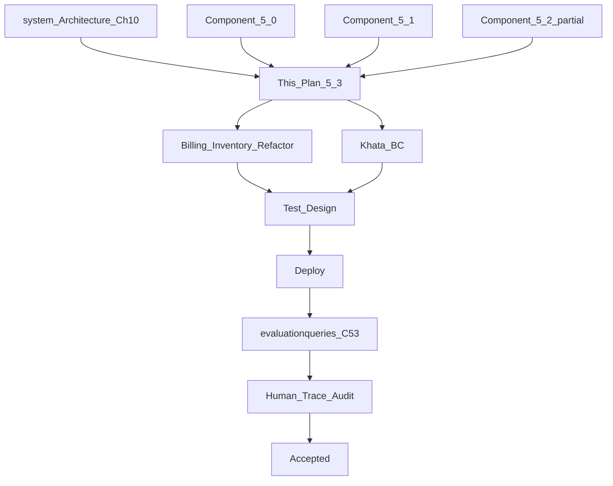
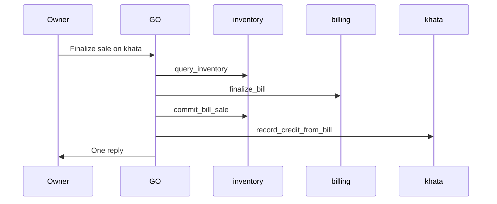

# Component 5.3 — Khata Business Capability & Sale Collaboration

**This document is the Goal Document for Component 5.3.** The implementing agent implements **this document only** — not chat history.

**Builds on:** [component_5.0_platform_8825a24c.plan.md](.cursor/plans/component_5.0_platform_8825a24c.plan.md) (registry, Capability blueprint, Decision/Response context slices, eval spine); [component_5.1_inventory_f83e3e32.plan.md](.cursor/plans/component_5.1_inventory_f83e3e32.plan.md) (inventory schema, exact-first search, movements, `refusalMessage`); [component_5.2_billing_793dda55.plan.md](.cursor/plans/component_5.2_billing_793dda55.plan.md) (draft events, finalize, attachments — **partially superseded**; see Part 0.2.4).

**Architecture references:** [docs/system_Architecture.md](docs/system_Architecture.md) Ch 7 (BC pattern), Ch 8 (Inventory), Ch 9 (Billing), Ch 10 (Khata), §6.5 (orchestration / collaboration), §6.9 (clarification vs confirmation), §6.10 (verification layers); [docs/Problem_Statement.md](docs/Problem_Statement.md) §3–4; [docs/verified-facts-and-grounded-response.md](docs/verified-facts-and-grounded-response.md); [docs/agent-traceability-and-agent-state.md](docs/agent-traceability-and-agent-state.md).

**Explicit non-goals:** Analytics BC (5.4), production PDF/PPTX polish beyond khata ledger export format (5.5), Card payment mode, IGST/inter-state GST, khata-specific idempotency keys (DO execution ledger is sufficient), “how much total udhar across all customers” aggregate queries beyond all-customer balance list + dump artifact.

---

## Part 0 — Engineering philosophy

- **Correctness over code elegance.** Acceptance is what traces and SQLite show — not style review.
- **Business capabilities own their writes.** A capability may **read** another domain’s SQLite tables to fetch source-of-truth data (e.g. billing reads `quantity_on_hand` for oversell). A capability must **not write** another domain’s tables. Inventory changes stock; Khata changes the credit ledger; Billing changes bills.
- **Business operations span capabilities.** One owner Telegram message (“sell 5 Maggi on Ramesh’s khata”) is often one **business operation** realized as **multiple GO objectives** with explicit `dependencies`. The planner describes *what a sale means* in the shop constitution; the execution engine enforces *what must follow a successful bill finalize*.
- **Code and constitution over prompt recipes.** Plan verification and tool gates enforce invariants. BC tool-planner prompts state role and tool purposes. They do **not** teach situational recipes like “always call query_inventory before commit_bill_sale” — verifiers and collaboration checks do.
- **Agent state vs context engineering (same as 5.1).**
  - **Agent state (L1):** in-memory structures for the current BC invocation (tool-result map) and the current `orchestrate()` run (`RunContext`, `phaseResult`, replan history).
  - **Agent state (L2):** persisted `agent_trace_events` and business rows in SQLite.
  - **Context engineering:** only the subset of agent state serialized into a particular LLM prompt. Cross-objective facts for tool execution come from **phase results / run context**, not from hoping the LLM remembers prior JSON.
- **Same-turn replan is mandatory for collaboration gaps.** After the bot sends a reply, the per-run agent state is discarded (`runContext.discard()` on deliver). Only conversation history and durable SQLite survive. If billing finalized but post-bill inventory (or khata when payment is udhar) was not planned, the harness must **replan inside the same `orchestrate()` loop** before delivering — not ask the owner to send another message.
- **Implementation freedom.** File layout under `src/khata/`, helper naming, and minor refactors are agent choice unless locked below. Repositories stay under `src/store-durable-object/persistence/repositories/` per existing project pattern.
- **What is locked:** tool ids; sale collaboration invariant rules; read/write boundaries; khata entry types; never auto-create customer (confirmation instead); all khata writes confirmed; `query_khata` modes; eval transport (deployed webhook → Store Durable Object).
- **Production-first:** deploy → run `evaluationqueries.csv` C53 (+ amended C52) rows → export traces → human Pass/Fail.



---

## Part 0.2 — Reader’s guide: what exists today

*For an implementer who did not participate in the design conversation.*

### 0.2.1 — What the system is

The kirana shop agent runs entirely in **Telegram**. A Cloudflare Worker receives updates and forwards work to a **Store Durable Object** (one per shop). The **Global Orchestrator (GO)** in [`src/global-orchestrator/index.ts`](src/global-orchestrator/index.ts) runs a loop: **Plan** (assign objectives to capabilities) → **Execute** (invoke each capability) → **Decide** (replan / ask_user / respond) → **Respond** (grounded text + optional attachments).

Each **Business Capability (BC)** is a module under `src/` (e.g. `inventory/`, `billing/`) registered in [`src/capability-registry/index.ts`](src/capability-registry/index.ts). BCs use a shared **Capability blueprint** ([`capability-blueprint.ts`](src/capability-registry/capability-blueprint.ts)): inner tool plan → plan verify → execute tools → return `CapabilityResult` with `verifiedFacts`.

Business data lives in **SQLite** inside the Durable Object ([`src/store-durable-object/persistence/schema.ts`](src/store-durable-object/persistence/schema.ts)), accessed through **repositories** in `persistence/repositories/`.

### 0.2.2 — What Components 5.0–5.2 already built

| Area | Location | State today |
|------|----------|-------------|
| Platform / registry | `src/capability-registry/`, GO Decision/Response slices | All five capabilities registered; `user_profile`, `inventory`, `billing` implemented |
| Inventory BC | `src/inventory/` | Four tools: `query_inventory`, `register_inventory`, `update_inventory`, `allocate_inventory`; exact-first product search; movement ledger |
| Billing BC | `src/billing/` | Three tools: `manage_draft_bill`, `finalize_bill`, `query_bill`; event-sourced drafts; finalize confirmation; HTML invoice attachment |
| Khata data (schema only) | `khata_customers`, `khata_ledger_entries` in schema; [`khata-repository.ts`](src/store-durable-object/persistence/repositories/khata-repository.ts) | Tables exist; **Khata capability handler is still `unavailable` stub** |
| GO execution | [`dependency-scheduler.ts`](src/global-orchestrator/execution-engine/dependency-scheduler.ts) | Runs objectives in dependency order; **no post-finalize collaboration check** |

### 0.2.3 — The 5.2 implementation mistake (must be fixed in 5.3)

Component 5.2 plan §2.5–2.6 locked **cross-BC writes inside billing finalize** (repository calls, not separate GO objectives). That was implemented in code:

| Side effect | Where it happens today | Correct owner (this plan) |
|-------------|------------------------|---------------------------|
| Decrement `quantity_on_hand` + `inventory_movements` (`sale`) | [`finalizeBillTransaction`](src/store-durable-object/persistence/repositories/billing-repository.ts) lines ~364–396 | **Inventory BC** — `commit_bill_sale` objective **after** billing finalize |
| Insert `khata_ledger_entries` (`credit_sale`) when `payment_method === khata` | Same function lines ~399–444 | **Khata BC** — objective **after** billing finalize when payment is khata |
| Auto-create `khata_customers` on khata finalize | Same block | **Khata BC** — **confirmation** to create; never silent auto-create |

Billing **may keep reading** inventory for oversell checks ([`availability.ts`](src/billing/availability.ts)) and for draft `add_item` product resolution. Billing **must stop writing** inventory and khata.

### 0.2.4 — Superseded sections of prior plans

Treat the following as **historical** — do not implement new work against them:

| Prior plan | Superseded content | Replaced by (this plan) |
|------------|-------------------|-------------------------|
| 5.2 §2.5 | “Billing cross-BC via repository writes on finalize” | Part 3 (GO collaboration) + Part 4–5 (refactor) |
| 5.2 §2.6 | “Minimal khata ledger written by billing” | Part 8 (Khata BC `credit_sale`) |
| 5.2 §3.6 | “Inventory movement on finalize in billing txn” | Part 5 (`commit_bill_sale`) |
| 5.1 Part 5.5 / §2.7 | “Only billing finalize decreases `quantity_on_hand` for sales” | Part 5.3 — **`commit_bill_sale` in Inventory BC** |
| 5.1 carry-forward | “Billing decreases stock in 5.2” | “Billing reads stock; Inventory commits sale after bill” |

5.2 deliverables that **remain valid**: draft event log, draft focus resolver, GST, finalize/cancel confirmation, invoice attachment path, `refusalMessage` on oversell, open-drafts planning slice.

---

## Part 0.1 — Mean / Do not mean (global)

| Mean | Do not mean |
|------|-------------|
| **Sale business operation** = up to 4 GO objectives: inventory (resolve SKU) → billing (finalize) → inventory (commit stock) → khata (if udhar) | Single `billing` objective that silently mutates stock and khata |
| **Two inventory objectives** on a typical sale: one **before** billing (identity/read), one **after** billing (stock commit) | One inventory call that both resolves product and commits sale without a finalized bill |
| Billing **reads** inventory for oversell and draft line snapshots | Billing **writes** `inventory_products` or `inventory_movements` |
| Billing **writes** only bills and closes drafts | Billing inserts khata rows |
| `commit_bill_sale` decrements `quantity_on_hand` and appends `sale` movement | Sale audit-only with unchanged on_hand |
| Khata BC owns all `khata_ledger_entries` writes | Billing repository writes `credit_sale` |
| `credit_sale` vs `manual_credit` — different ledger purposes, same append-only mechanics | One undifferentiated “credit” type |
| **Never auto-create** khata customer | Silently `INSERT` customer on bill finalize |
| Unknown customer at khata step → **confirmation** (“create customer and record credit?”) | Block bill finalize or fail the whole sale |
| Same-turn replan when collaboration invariant fails | Tell owner “bill done — now run khata separately” |
| `query_khata` returns balance + last 5 txns + optional full-ledger artifact | Khata query mutates ledger |
| All `manage_khata_transaction` writes go through confirmation (even ₹0) | Only large amounts confirmed |
| Shared **khata-repository** service used by Khata BC tools only | Billing imports khata write functions |
| `refusalMessage` on `completed` for business refusals | Refusal text in Fact Catalog |

---

## Part 1 — Problem statement

| # | Problem | Evidence today | 5.3 fix |
|---|---------|----------------|---------|
| P1 | Khata capability is an `unavailable` stub | [`capability-registry/index.ts`](src/capability-registry/index.ts) `khata` handler | Full Khata BC with `query_khata` + `manage_khata_transaction` |
| P2 | Billing writes inventory on finalize (wrong ownership) | [`billing-repository.ts`](src/store-durable-object/persistence/repositories/billing-repository.ts) `finalizeBillTransaction` | Strip stock writes; Inventory `commit_bill_sale` after bill |
| P3 | Billing writes khata on finalize (wrong ownership) | Same function, `credit_sale` insert | Khata BC records `credit_sale` from bill verified facts |
| P4 | Billing auto-creates khata customers | Same khata block | Khata confirmation flow; never silent create |
| P5 | No GO collaboration invariant after finalize | [`orchestrate()`](src/global-orchestrator/index.ts) goes straight to Decision | `collaboration-invariants.ts` + same-turn replan |
| P6 | No post-bill inventory tool | Only pre-bill `query_inventory` exists | New `commit_bill_sale` tool |
| P7 | Standalone khata not implemented | Problem Statement §3: “put ₹500 on Ramesh”, “Ramesh paid ₹300”, balance query | `manual_credit`, `payment`, `query_khata` |
| P8 | No customer aliases / fuzzy clarify for khata | Only normalized name in schema | `khata_customer_aliases` + search helper |
| P9 | No khata ledger artifacts | — | Per-customer + full-shop export on `query_khata` |
| P10 | 5.2 eval rows assume billing-side stock/khata | C52-003, C52-002 traces | Amend expectations to multi-objective traces |

---

## Part 2 — Locked architectural decisions

### 2.1 — The sale business operation (canonical flow)

When the owner completes a **sale** (finalize a bill), the Global Orchestrator should plan a **business operation** — not a single capability in isolation.

**Typical four-objective pattern** (khata step omitted when payment is cash or UPI):

```text
Objective A — inventory:  Resolve product identity (query_inventory) for items in the sale
Objective B — billing:    Draft (if needed) → confirm → finalize_bill (bill rows only)
Objective C — inventory:  commit_bill_sale — decrement stock from finalized bill facts
Objective D — khata:      record credit_sale — only when payment_method === "khata"
```

**Dependencies (locked):**

- B depends on A (when product resolution was needed in this turn).
- C depends on B (must have `finalized: true` and `bill_id` in billing verified facts).
- C may also depend on A when SKU identity from the pre-bill query must be correlated (implementer wires via GO `dependencies` + cross-objective context).
- D depends on B when khata payment; D does **not** run for cash/UPI.

**Natural-language example (Maggi only):**

1. Owner: “Sell 5 packets of Maggi, cash.”
2. GO plans: inventory (find Maggi SKU) → billing (finalize) → inventory (commit sale). **No khata objective.**
3. Owner gets **one reply** after all three complete (or clarify/deny).

**Multi-line bills:** Objective A may be one inventory objective with multiple `query_inventory` ops in the BC tool plan, or multiple inventory objectives — GO planner choice. Objective C must cover **every line** on the finalized bill.

### 2.2 — Read vs write boundaries

| Capability | May read | May write |
|------------|----------|-----------|
| **Billing** | `inventory_products`, reservations (oversell, `add_item` snapshots); `shop_profile`; draft/bill tables | `billing_drafts`, `billing_draft_events`, `billing_bills`, `billing_bill_lines`; delete draft on finalize/cancel |
| **Inventory** | Inventory tables; **finalized bill** rows/lines (for `commit_bill_sale` by `bill_id`) | `inventory_products`, `inventory_movements`, `inventory_reservations`, aliases |
| **Khata** | `khata_*`, finalized bill rows (for `credit_sale` amount/customer) | `khata_customers`, `khata_customer_aliases`, `khata_ledger_entries` |

**Billing BC inner planner** must never plan inventory or khata tools. **Billing code** must not call khata-repository write functions.

### 2.3 — Oversell guard (billing finalize — read only)

Before committing the bill, `finalize_bill` reads **latest** SQLite state per line:

```text
sellable = quantity_on_hand − sum(active reservations for sku)
```

If any line requests more than sellable → `completed` + `refusalMessage` (structured fields in `verifiedFacts` optional); **no bill row**, no post-bill inventory, no khata.

`commit_bill_sale` **re-reads** the same formula immediately before decrement (future parallel safety). If stock changed between finalize and commit → structured failure/refusal on inventory objective; bill remains finalized (document in README — rare on single-threaded DO, possible in future).

### 2.4 — Post-bill inventory: `commit_bill_sale` (locked tool id)

**Purpose:** After a bill is finalized, Inventory BC permanently decrements stock and appends `movement_type: sale` rows.

**Inputs (locked):**

- `bill_id` — from billing objective `verifiedFacts` via cross-objective execution context; LLM may echo it in tool params but **code validates** bill exists and is finalized in SQLite.
- Lines derived from `billing_bill_lines` for that `bill_id`, not LLM-invented quantities.

**Behavior:**

1. Load finalized bill + lines from SQLite.
2. Per line: re-check sellable; if any fail → `completed` + `refusalMessage` (bill exists but stock commit failed — Response explains).
3. Confirmation table (unless `shop_profile.completeAutonomy`): bill id (short), customer, per-line sku/name/qty, before/after on_hand.
4. On Yes: single transaction per line (or one txn all lines): decrement `quantity_on_hand`, insert movement `sale` with `reference_type: billing`, `reference_id: bill_id`; post-read verify (5.1 pattern).
5. Idempotent on `bill_id`: if sale movements already exist for this bill → completed with existing facts (no double decrement). Implement via unique constraint or check before write.

**Plan verification:** `commit_bill_sale` must not appear without a valid `bill_id` parameter; may be single-op plan or with `query_inventory` only when needed for diagnostics — **not** for identity (bill lines carry `sku`).

### 2.5 — Khata ledger entry types (locked)

| `entry_type` | When | `reference_type` | `reference_id` | Amount sign |
|--------------|------|------------------|----------------|-------------|
| `credit_sale` | Bill finalized on khata; Khata objective runs | `bill` | `bill_id` | Positive paise; increases balance owed |
| `manual_credit` | Standalone “put ₹X on {customer} credit” | `manual` | generated txn uuid | Positive paise; increases balance |
| `payment` | “{customer} paid ₹X” | `manual` | generated txn uuid | Positive paise stored; **decreases** balance (`balance_after = prior − amount`) |

**Invariant:** `balance_after_paise` on each row equals running sum of credits minus payments for that customer. No delete/update of ledger rows.

### 2.6 — Customer identity (khata)

Mirror inventory exact-first pattern ([`product-search.ts`](src/inventory/search/product-search.ts)):

1. **Exact** match on `normalized_name` or **exact alias** string.
2. `exactMatchCount === 1` → that customer.
3. `exactMatchCount === 0` → internal fuzzy search → `clarification_needed` with `similarCandidates` (for reads/payments) or confirmation path (for writes).
4. `exactMatchCount > 1` → `clarification_needed` listing exact matches (code-built options).

**Never auto-create:** creating a customer is always a **confirmed write** (`create_customer` operation or bundled in “create and record credit” confirmation).

Normalization reuses [`normalizeCustomerName`](src/store-durable-object/persistence/repositories/khata-repository.ts) (same normalization helper family as inventory).

### 2.7 — Bill on khata, unknown customer

**Order:** Billing finalize **commits first** (bill row exists). Khata objective runs after.

If customer not found:

1. Present **confirmation** (not silent create): table shows bill id, customer name from bill, amount, message that customer does not exist.
2. Yes → create `khata_customers` row (+ optional alias) + append `credit_sale` in one transaction.
3. No → `denied`; bill remains; no ledger row.

Same `orchestrate()` run — owner may tap Yes on Telegram before first summary reply.

### 2.8 — Confirmation policy (khata writes)

| Operation | Confirmation |
|-----------|----------------|
| `query_khata` | Never |
| `manage_khata_transaction` — all operations including `create_customer`, `manual_credit`, `payment`, `credit_sale` | **Always** (unless `shop_profile.completeAutonomy`) |
| Overpayment | Same confirmation; table shows current balance, payment amount, **resulting balance** (may be negative — shop owes customer) |

Reuse [`pending_confirmations`](src/store-durable-object/persistence/schema.ts) + [`worker-delivery-port`](src/store-durable-object/runtime-ports/worker-delivery-port.ts) Yes/No path (same as inventory/billing).

### 2.9 — `query_khata` modes (locked)

| Mode parameter | Returns | Artifact |
|----------------|---------|----------|
| `by_customer` (default when name present) | `balance_after_paise`, last **5** ledger entries (newest first), customer canonical name | Full ledger for that customer (all entries) — CSV or HTML; mime type agent choice; via `CapabilityResult.attachments` |
| `all_customers` | List of every customer with non-zero balance (include zero-balance customers who have any ledger history — agent documents choice in README) | Full shop khata dump (all customers, all entries) |

Read-only; never confirms.

### 2.10 — Khata tool surface (locked ids)

| Tool id | Purpose |
|---------|---------|
| `query_khata` | Read balances, recent entries, artifacts |
| `manage_khata_transaction` | All ledger mutations via `operation` enum |

**`manage_khata_transaction` operations (locked):**

| Operation | Purpose |
|-----------|---------|
| `create_customer` | Add customer after confirmation (standalone or after clarify) |
| `record_manual_credit` | Standalone udhar |
| `record_payment` | Customer repayment |
| `record_credit_from_bill` | `credit_sale` from finalized bill (khata payment flow) |

**Plan verification:** mutating operations require prior `query_khata` in the same BC tool plan when customer identity is name-driven (same pattern as inventory `query_inventory` before writes). Exception: `record_credit_from_bill` may use `bill_id` + bill `customer_name` from cross-objective context — still run customer existence check; confirmation handles create.

### 2.11 — Selective parameter grounding (khata)

Substring of `objective.description` (same pattern as [`parameter-grounding.ts`](src/inventory/parameter-grounding.ts)):

**`manage_khata_transaction`:** `customer_name`, `amount` (string form of rupees/paise as spoken), `notes` when present.

**`query_khata`:** `customer_name` when mode is by_customer.

**Do not ground:** `bill_id` (from cross-objective context), `operation`, system ids, `mode` enum.

### 2.12 — Idempotency

No khata-specific idempotency keys. Telegram redelivery deduped by DO [`execution_ledger`](src/store-durable-object/persistence/schema.ts) before `orchestrate()` runs. `record_credit_from_bill` must be idempotent on `(customer_id, bill_id)` / `reference_id` — second call returns completed with same facts.

### 2.13 — Money

All khata amounts **integer paise** in SQLite (consistent with billing). Confirmation tables and artifacts format paise → ₹ for display.

### 2.14 — `refusalMessage` contract

Same as 5.1/5.2: business refusals use `completed` + `refusalMessage`; never Fact Catalog.

---

## Part 3 — GO orchestration & execution engine (sale collaboration)

### 3.1 — Planner constitution (business operation)

Extend [`planning-mode.ts`](src/global-orchestrator/planning-mode.ts) `SYSTEM_PROMPT` with a **Sale / finalize business operation** paragraph in plain language:

- Finalizing a sale creates a **financial record** (billing), then **reduces stock** (inventory commit), and if the owner chose **khata / udhar**, records **customer credit** (khata).
- These are separate capabilities the orchestrator assigns as separate objectives with dependencies — not hidden inside billing.
- Cash/UPI sales do not need a khata objective.
- Product identity for a sale often starts with an inventory read before billing builds the draft.

**Do not** add step-by-step “always emit 4 objectives” rules — describe the shop process; collaboration invariant catches gaps.

Update [`LOCKED_DESCRIPTIONS`](src/capability-registry/index.ts) for `billing`, `inventory`, `khata` to mention collaboration (billing does not update stock or khata; inventory commits after finalize; khata owns udhar).

### 3.2 — Objective dependencies & ordering

GO plan JSON already supports `dependencies: string[]` per objective ([`StructuredCapabilityPlan`](src/global-orchestrator/types.ts)). Planner should emit:

```json
{
  "objectives": [
    { "objectiveId": "inv-resolve", "capabilityId": "inventory", "dependencies": [] },
    { "objectiveId": "bill-finalize", "capabilityId": "billing", "dependencies": ["inv-resolve"] },
    { "objectiveId": "inv-commit", "capabilityId": "inventory", "dependencies": ["bill-finalize"] },
    { "objectiveId": "khata-credit", "capabilityId": "khata", "dependencies": ["bill-finalize"] }
  ]
}
```

`dependency-scheduler.ts` already skips objectives until dependencies are `completed`. Khata objective omitted entirely when not khata payment.

### 3.3 — Cross-objective verified facts

**Problem:** `commit_bill_sale` and `record_credit_from_bill` need `bill_id` and payment method from billing objective results.

**Locked approach:**

1. After each capability completes, `phaseResult.objectives[objectiveId].result.verifiedFacts` is available ([`dependency-scheduler.ts`](src/global-orchestrator/execution-engine/dependency-scheduler.ts)).
2. Extend capability invocation input (or `RunContext` helper) so dependent objectives receive **`priorObjectiveResults`** map: objectiveId → `verifiedFacts` for completed dependencies.
3. Inventory/Khata executors read `bill_id`, `finalized`, `payment_method`, `grand_total_paise`, `customer_name` from dependency facts **and** verify against SQLite.
4. **Fallback:** load `billing_bills` by `bill_id` from DB if facts present but incomplete.

**Not allowed:** LLM-only memory of bill id without verification.

### 3.4 — Collaboration invariant (execution engine)

**New module:** [`src/global-orchestrator/execution-engine/collaboration-invariants.ts`](src/global-orchestrator/execution-engine/collaboration-invariants.ts)

**Function:** `checkSaleCollaborationInvariant(plan, phaseResult) → { ok: true } | { ok: false, diagnostics: string[], replanNarrative: string }`

**Rules (locked):**

1. Scan `phaseResult` for any billing objective with `verifiedFacts.finalized === true` (or equivalent keys from billing fact registry).
2. If found, assert the **same plan** included at least one **inventory** objective intended for post-bill commit (heuristic: inventory capability present with dependency on billing objective, or inventory result includes `commit_bill_sale` execution — implementer may use objective description metadata `salePhase: "commit"` optional field on plan JSON if needed).
3. If `payment_method === "khata"` on that bill, assert plan included **khata** capability objective depending on billing.
4. If check fails → trace `COLLABORATION_INVARIANT_FAILED` with diagnostics; return failure payload.

**Wire in** [`orchestrate()`](src/global-orchestrator/index.ts) **after** `executePhase`, **before** `decideNextAction`:

- If invariant fails → push onto `runContext.replanHistory` / force `decision.action = replan` with `replanNarrative` injected into next planning user prompt (may bypass Decision LLM for determinism — **locked: deterministic replan trigger**, Decision LLM may still run on subsequent rounds).

### 3.5 — Same-turn replan behavior

When invariant fails:

1. Do **not** call `deliver()`.
2. Increment strategic round (within `MAX_GO_GEMINI_ROUNDS`).
3. Re-invoke `planCapabilities` with mode `strategic_replan` and invariant narrative in context slice.
4. Re-execute phase. **Skip re-running** objectives already `completed` in the same run when replan preserves same `objectiveId` and capability — or rely on idempotent tools (`commit_bill_sale`, `record_credit_from_bill`) if re-invoked.

**Terminal outcomes in same run:** all collaboration satisfied → `respond`; tool `clarification_needed` → `ask_user`; owner denies confirmation → `denied` / `respond`.

### 3.6 — Billing BC prompt exception (locked paragraph)

Add to [`billing/index.ts`](src/billing/index.ts) `TOOL_SYSTEM_PROMPT`:

> Billing finalize persists the bill only. Stock reduction and khata credit are performed by separate capabilities the Global Orchestrator plans after finalize. Do not plan inventory or khata tools inside the billing tool plan.

---

## Part 4 — Refactor: Billing (strip cross-domain writes)

### 4.1 — `finalizeBillTransaction` scope after refactor

**In scope (single SQLite transaction):**

- Insert `billing_bills` + `billing_bill_lines`
- Delete `billing_draft_events` + `billing_drafts` for that `bill_id`

**Out of scope (remove entirely):**

- `UPDATE inventory_products`
- `INSERT inventory_movements`
- Any `khata_customers` / `khata_ledger_entries` access

File: [`billing-repository.ts`](src/store-durable-object/persistence/repositories/billing-repository.ts).

### 4.2 — What stays in `finalize-bill.ts`

| Step | Keep? |
|------|-------|
| Draft completeness validation | Yes |
| [`checkLineAvailability`](src/billing/availability.ts) (read inventory) | Yes |
| Below-cost warning in confirmation table | Yes |
| Telegram finalize confirmation | Yes |
| Call slim `finalizeBillTransaction` | Yes |
| Post-verify **bill totals** + line rows in SQLite | Yes |
| Post-verify `quantity_on_hand` / khata balance | **Remove** |
| Invoice HTML attachment | Yes |

### 4.3 — Billing `verifiedFacts` after finalize (locked keys)

Must include enough for downstream objectives:

- `finalized: true`
- `bill_id`
- `customer_name`
- `payment_method` (`cash` | `upi` | `khata`)
- `grand_total_paise`
- Per-line summary: `sku`, `product_name`, `quantity` (for collaboration / faithfulness)

Update [`billing-fact-registry.ts`](src/global-orchestrator/verified-facts/billing-fact-registry.ts) if keys change.

### 4.4 — Files to touch (checklist)

- [`billing-repository.ts`](src/store-durable-object/persistence/repositories/billing-repository.ts) — remove cross-domain writes
- [`finalize-bill.ts`](src/billing/tools/finalize-bill.ts) — remove khata/inventory post-verify
- [`billing.test.ts`](src/billing/billing.test.ts) — finalize no longer mocks stock/khata side effects
- [`evaluationqueries.csv`](evaluationqueries.csv) C52 rows — expect multi-objective traces for stock/khata

### 4.5 — Documentation

README and agent-traceability doc: billing owns bills; collaboration invariant owns cross-cap sequencing.

---

## Part 5 — Refactor: Inventory (`commit_bill_sale`)

### 5.1 — Fifth inventory tool (locked)

| Tool id | Purpose |
|---------|---------|
| `commit_bill_sale` | Post-finalize stock decrement for all lines on a finalized bill |

Add to [`INVENTORY_TOOL_SURFACE`](src/inventory/index.ts) and registry.

### 5.2 — Relationship to existing four tools

| Phase | Tool | When |
|-------|------|------|
| Pre-bill | `query_inventory` | Resolve SKU, read stock for owner questions, prerequisite for register/update/allocate |
| Post-bill | `commit_bill_sale` | After `billing` finalized; uses bill lines from SQLite |

`update_inventory` refusal message must change from “billing handles decrease” to “use a sale bill + commit_bill_sale” or natural-language equivalent.

### 5.3 — Movement ownership (updated)

| Change to `quantity_on_hand` | Allowed origin |
|------------------------------|----------------|
| Increase | `register_inventory`, `update_inventory` |
| Decrease (sale) | **`commit_bill_sale` only** |
| Reservation buffer | `allocate_inventory` |

Billing must not insert inventory movements.

### 5.4 — Plan verification

- `commit_bill_sale` requires `bill_id` in parameters (verified against dependency billing facts or substring grounding where bill id appears in objective text — prefer cross-objective injection).
- Single-op plan acceptable for post-bill inventory objective.
- Mutex: do not mix `commit_bill_sale` with `register_inventory` / `update_inventory` in one plan.

File: [`inventory/execution-engine/plan-verification.ts`](src/inventory/execution-engine/plan-verification.ts).

### 5.5 — Confirmation

`commit_bill_sale` is a **write** → confirmation table (unless `completeAutonomy`): bill reference, lines, before/after quantities per SKU.

Implement [`format-commit-bill-sale-confirmation-table.ts`](src/inventory/confirmation/) (new file).

### 5.6 — Files to touch

- `src/inventory/tools/commit-bill-sale.ts` (new)
- `src/inventory/index.ts` — prompt, executor wiring
- `src/inventory/execution-engine/plan-verification.ts`
- `src/global-orchestrator/verified-facts/inventory-fact-registry.ts`
- [`docs/verified-facts-and-grounded-response.md`](docs/verified-facts-and-grounded-response.md)

---

## Part 6 — Persistence (locked schema)

### 6.1 — Existing khata tables (unchanged fields)

**`khata_customers`:** `id`, `canonical_name`, `normalized_name`, `created_at`

**`khata_ledger_entries`:** `id`, `customer_id`, `entry_type`, `amount_paise`, `reference_type`, `reference_id`, `balance_after_paise`, `notes`, `update_id`, `correlation_id`, `created_at`

### 6.2 — New: `khata_customer_aliases`

Mirror [`inventory_product_aliases`](src/store-durable-object/persistence/schema.ts):

- `customer_id` (FK → `khata_customers.id`)
- `alias` (normalized string)
- unique `(customer_id, alias)`

### 6.3 — Entry type values in SQLite

`entry_type` text: `credit_sale` | `manual_credit` | `payment`

`reference_type` text: `bill` | `manual`

### 6.4 — Idempotency constraint (recommended)

Unique index on `(reference_type, reference_id, entry_type)` where `reference_type = 'bill'` and `entry_type = 'credit_sale'` to prevent duplicate bill credit.

### 6.5 — Write verification (khata mutating tools)

Same pattern as inventory 5.1 Part 3.5:

1. Read latest `balance_after_paise` for customer
2. Compute expected new balance
3. Insert ledger row in transaction
4. Re-read; mismatch → `error`

### 6.6 — Inventory schema

No new tables for `commit_bill_sale`; reuse `inventory_movements` with `movement_type: sale`. Optional: unique `(reference_type, reference_id, sku)` for bill line idempotency.

---

## Part 7 — Repository layout & module boundaries

### 7.1 — Top-level module map

| Module | Responsibility | Must not |
|--------|----------------|----------|
| [`src/khata/`](src/khata/) | Khata BC: tools, plan verify, confirmations, artifacts | Write bills or inventory |
| [`src/billing/`](src/billing/) | Bills, drafts, GST, invoice artifact | Write inventory/khata |
| [`src/inventory/`](src/inventory/) | Stock, reservations, `commit_bill_sale` | Write khata |
| [`src/global-orchestrator/execution-engine/`](src/global-orchestrator/execution-engine/) | Collaboration invariant, phase execution | Encode GST/khata business rules |
| [`src/store-durable-object/persistence/repositories/khata-repository.ts`](src/store-durable-object/persistence/repositories/khata-repository.ts) | Shared khata CRUD + ledger append helpers | Plan tools or call Telegram |
| [`src/capability-registry/`](src/capability-registry/) | Register handlers, faithfulness builders | Implement tool logic |

### 7.2 — Proposed `src/khata/` tree

```text
src/khata/
  index.ts                         # createCapabilityExecutor, TOOL_SYSTEM_PROMPT, exports
  types.ts
  parameter-grounding.ts
  errors.ts                        # ClarificationError etc. if needed
  execution-engine/
    plan-verification.ts
  search/
    customer-search.ts             # exact-first, fuzzy candidates, alias lookup
  confirmation/
    format-khata-confirmation-table.ts
  artifact/
    render-khata-ledger-export.ts  # CSV or HTML for by_customer + all_customers
  tools/
    query-khata.ts
    manage-khata-transaction.ts
```

Repositories remain in `store-durable-object/persistence/repositories/` — **not** copied into `khata/`.

### 7.3 — Shared khata repository API (locked functions)

Extend [`khata-repository.ts`](src/store-durable-object/persistence/repositories/khata-repository.ts):

| Function | Used by | Notes |
|----------|---------|-------|
| `findCustomerByNormalizedName` | query + manage | existing |
| `searchCustomersExact` / `searchSimilarCustomers` | query + manage | new |
| `insertCustomer` | manage after confirmation only | replace silent resolve-or-create |
| `appendCreditSaleFromBill` | `record_credit_from_bill` | idempotent on bill_id |
| `appendManualCredit` | `record_manual_credit` | |
| `appendPayment` | `record_payment` | decreases balance |
| `getLatestBalancePaise` | query | existing |
| `listRecentEntries(customerId, limit)` | query | |
| `listAllCustomersWithBalances` | query all mode | |
| `exportFullLedger` | artifact builder | |

**Remove** billing-repository inline khata writes. **Deprecate** `resolveOrCreateCustomer` for silent use — only explicit create after confirmation.

---

## Part 8 — Khata tool contracts (full behavior)

### 8.1 — `query_khata`

**Parameters:**

- `mode`: `by_customer` | `all_customers`
- `customer_name` (required for `by_customer`; grounded)

**`by_customer` execution:**

1. Exact/alias search → 0 / 1 / many branch (clarify if many; not-found completed with clear message if zero and no fuzzy).
2. Load balance from latest ledger row.
3. Load last 5 entries (newest first).
4. Build full-ledger artifact for that customer → `attachments[]` on tool result (lifted to `ExecutionResult` like billing invoice).
5. Return `verifiedFacts`: customer name, balance paise, recent entries summary.

**`all_customers` execution:**

1. List customers with balances (and optionally zero-balance with history).
2. Build shop-wide dump artifact.
3. Return verified facts per customer for faithfulness (balance only in NL response; dump in attachment).

**Never** confirms. **Never** writes.

### 8.2 — `manage_khata_transaction`

**Parameters:** `operation` enum + operation-specific fields.

#### `create_customer`

- Requires prior `query_khata` showing exactMatchCount 0 (plan verify) OR clarification path completed.
- Confirmation: canonical name, optional aliases.
- On Yes: insert customer + aliases.

#### `record_manual_credit`

- Prior `query_khata` when identifying by name.
- Customer must exist OR clarify/create flow first (never silent create).
- Confirmation: customer, amount, new balance preview.
- On Yes: `manual_credit` ledger row.

#### `record_payment`

- Prior `query_khata` for identity.
- Customer must exist; if not → `clarification_needed` (“customer does not exist — create?”).
- If payment > balance: confirmation shows **resulting negative balance** (e.g. −₹200).
- On Yes: `payment` ledger row.

#### `record_credit_from_bill`

- Input: `bill_id` from cross-objective billing facts (required).
- Load bill from SQLite; assert `payment_method === khata`.
- Resolve customer by bill `customer_name`.
- If customer missing → confirmation: “Customer not in khata. Create and record ₹{grand_total} credit for bill?”
- On Yes: create customer if needed + `credit_sale` row (single txn).
- Idempotent if `credit_sale` already exists for `bill_id`.

### 8.3 — Khata BC harness

Mirror [`inventory/index.ts`](src/inventory/index.ts):

- `createCapabilityExecutor` from blueprint
- `verifyToolPlan` / `parameterGroundingCheck`
- L1 prior tool results for `query_khata` → manage chain
- Aggregate `verifiedFacts`; `refusalMessage` separate

### 8.4 — `not_supported`

Empty tool plan after retries → `not_supported` (5.0 pattern).

---

## Part 9 — Capability module and registry wiring

1. Implement `src/khata/index.ts` with `createCapabilityExecutor` (mirror inventory/billing).
2. In [`capability-registry/index.ts`](src/capability-registry/index.ts):
   - `khata`: `implemented: true`, real handler, `toolSurface` = [`query_khata`, `manage_khata_transaction`]
   - Register `faithfulnessBuilder` via `resolveFaithfulnessBuilder("khata")`
3. **Decision context:** list khata `toolSurface` when khata objectives run (same pattern as billing/inventory).
4. **Planning context:** no open-khata slice required for 5.3 (optional future: customers with outstanding balance summary).
5. Update `LOCKED_DESCRIPTIONS` for `billing`, `inventory`, `khata` per Part 3.1.
6. Extend [`TraceStage`](src/store-durable-object/agent-state/run-context.ts) with `COLLABORATION_INVARIANT_FAILED` (and optionally `COLLABORATION_INVARIANT_SATISFIED`).
7. Wire `checkSaleCollaborationInvariant` in [`orchestrate()`](src/global-orchestrator/index.ts).
8. Extend capability invocation to pass `priorObjectiveResults` from completed dependencies ([`dependency-scheduler.ts`](src/global-orchestrator/execution-engine/dependency-scheduler.ts) + types in [`global-orchestrator/types.ts`](src/global-orchestrator/types.ts)).

---

## Part 10 — Faithfulness & grounded response

Create [`src/global-orchestrator/verified-facts/khata-fact-registry.ts`](src/global-orchestrator/verified-facts/khata-fact-registry.ts):

- Per-customer balance: `(customer_id, balance)` or normalized name key
- Per ledger entry citeable fields when returned in query (entry id, amount, type)
- `catalogLabel` includes customer canonical name
- Bill-linked `credit_sale`: include bill id in label context

**Ownership split:**

| Fact | Primary builder |
|------|-----------------|
| Bill totals, lines, payment method | billing-fact-registry |
| Stock levels after commit | inventory-fact-registry |
| Customer balance, payment, manual credit | khata-fact-registry |

`refusalMessage` never becomes Fact Catalog entry.

Update [`docs/verified-facts-and-grounded-response.md`](docs/verified-facts-and-grounded-response.md).

---

## Part 11 — Expected runtime walkthroughs (acceptance narratives)

### W1 — Standalone khata cycle (Problem Statement script)

| Step | Expected |
|------|----------|
| “Put ₹500 on Ramesh’s credit” | GO → khata; query → manage `record_manual_credit`; confirm → ledger |
| “Ramesh paid ₹300” | query → payment; confirm; balance ₹200 |
| “Ramesh’s balance?” | `query_khata` by_customer; grounded ₹200; last 5 txns |

### W2 — Full sale cash (three objectives)

| Step | Expected |
|------|----------|
| Sell 5 Maggi, cash | inventory query → billing finalize → `commit_bill_sale` |
| SQLite | Bill row; on_hand −5; movement `sale`; **no** khata row |
| Trace | Three capability invocations; collaboration invariant pass |

### W3 — Full sale khata, existing customer

| Step | Expected |
|------|----------|
| Bill for known Ramesh on khata | four objectives (or three if SKU already known) |
| Khata | `credit_sale` for grand total; balance increased |
| One reply | Same turn |

### W4 — Bill on khata, unknown customer

| Step | Expected |
|------|----------|
| Finalize bill first | Bill committed |
| Khata confirm | “Customer not in khata — create and record credit?” |
| Yes | Customer row + `credit_sale`; same run |

### W5 — Payment, unknown customer

| Step | Expected |
|------|----------|
| “Vijay paid ₹100” | clarify: customer does not exist — create? |
| No auto-create without confirm | |

### W6 — Overpayment

| Step | Expected |
|------|----------|
| Balance ₹300; pay ₹500 | Confirm table shows resulting balance −₹200 |
| Yes | Ledger `payment` row; balance negative allowed |

### W7 — Collaboration replan (same turn)

| Step | Expected |
|------|----------|
| Round 1 plan: billing only; finalize succeeds | Invariant fails |
| Round 2 | Replans inventory + khata; completes |
| Owner | Single message, single final reply |

### W8 — Oversell at billing

| Step | Expected |
|------|----------|
| Finalize when sellable < qty | `refusalMessage`; no bill OR no finalize (if check pre-commit) |
| No `commit_bill_sale` | |

### W9 — `query_khata` all customers + artifact

| Step | Expected |
|------|----------|
| mode=all_customers | Balances list + dump attachment |

### W10 — Fuzzy customer clarify

| Step | Expected |
|------|----------|
| Misspelled name | similarCandidates; ask_user |

---

## Part 12 — Evaluation spine

### 12.1 — New C53 rows (`evaluationqueries.csv`)

| ID | Scenario | Walkthrough |
|----|----------|-------------|
| C53-001 | Standalone manual credit + payment + balance | W1 |
| C53-002 | Bill on khata, existing customer | W3 |
| C53-003 | Bill on khata, new customer confirm | W4 |
| C53-004 | Payment unknown customer clarify | W5 |
| C53-005 | Overpayment confirm | W6 |
| C53-006 | query all customers + artifact | W9 |
| C53-007 | Fuzzy customer name | W10 |

### 12.2 — Amend C52 rows

| ID | Change |
|----|--------|
| C52-002 | Expect inventory `commit_bill_sale` in trace, not billing stock write |
| C52-003 | Expect khata objective + `credit_sale`, not billing inline khata |
| C52-001 | Multi-objective sale trace |

### 12.3 — Human rubric (from traces + DB)

1. Khata registry implemented; stub gone
2. Billing finalize does not write inventory/khata tables
3. `commit_bill_sale` present on sale traces
4. Collaboration invariant or successful multi-objective plan
5. `credit_sale` / `manual_credit` / `payment` entry types correct
6. Never silent customer create
7. All khata writes confirmed
8. Query artifacts delivered when expected
9. Grounding + faithfulness on balances
10. Same-turn replan evidenced on W7 (trace shows replan + second plan)

### 12.4 — Transport (locked)

Deployed Worker webhook → Store Durable Object → full `orchestrate()`. No local-only harness for acceptance.

---

## Part 13 — Test design

### 13.1 — Unit tests (must pass)

| ID | Target |
|----|--------|
| COLLAB-01 | Finalize without post-inventory objective → invariant fails |
| COLLAB-02 | Khata finalize without khata objective when payment khata → fails |
| COLLAB-03 | Cash sale without khata objective → passes |
| BILL-REF-01 | `finalizeBillTransaction` does not touch inventory/khata tables |
| INV-COMMIT-01 | `commit_bill_sale` decrements on_hand + movement |
| INV-COMMIT-02 | Idempotent second commit same bill_id |
| INV-COMMIT-03 | Refusal when sellable < line qty at commit time |
| KHATA-Q-01 | by_customer balance + last 5 |
| KHATA-Q-02 | all_customers + artifact bytes |
| KHATA-M-01 | manual_credit with confirmation |
| KHATA-M-02 | payment overpay confirmation payload |
| KHATA-M-03 | credit_from_bill idempotent |
| KHATA-M-04 | unknown customer → clarify, not auto-create |
| KHATA-PLAN-01 | manage without query_khata → plan verify fail |
| KHATA-F-01 | fact registry balance; refusal not in catalog |
| BP-CROSS-01 | priorObjectiveResults passed to dependent capability |

### 13.2 — Production validation

1. `npm test` green
2. `wrangler deploy`
3. Run C53 + amended C52 via eval script
4. Export traces; [`sql/agent-trace.sql`](sql/agent-trace.sql) per `update_id`
5. Human Pass on W1, W2, W3, W4, W7 minimum

---

## Part 14 — Trace, docs, README

### 14.1 — Trace payloads

- `COLLABORATION_INVARIANT_FAILED`: missing capability, bill_id, payment_method, replan narrative
- `TOOL_EXECUTED` for khata: operation, customer id, entry_type, balance before/after, confirmation outcome
- `TOOL_EXECUTED` for `commit_bill_sale`: bill_id, per-sku deltas

### 14.2 — Docs updates

- [`docs/agent-traceability-and-agent-state.md`](docs/agent-traceability-and-agent-state.md): sale collaboration diagram, cross-objective facts, two inventory objectives
- [`docs/verified-facts-and-grounded-response.md`](docs/verified-facts-and-grounded-response.md): khata tools + entry types
- README: Component 5.3 eval; sale operation; superseded 5.2 cross-write note

### 14.3 — Sale collaboration diagram (for README)



---

## Part 15 — Acceptance criteria (stop only when all true)

- [ ] Khata registry `implemented: true`; stub removed
- [ ] `query_khata` + `manage_khata_transaction` with locked operations
- [ ] `khata_customer_aliases` + customer search (exact + fuzzy clarify)
- [ ] All khata writes confirmed; overpay table shows resulting balance
- [ ] `khata-repository` write API; billing does not call khata writes
- [ ] Billing finalize bill-only; oversell read guard retained
- [ ] `commit_bill_sale` implemented; movement ownership updated
- [ ] Collaboration invariant + same-turn replan wired in `orchestrate()`
- [ ] Cross-objective verified facts passed to dependent capabilities
- [ ] GO planning constitution updated for sale business operation
- [ ] Faithfulness builder registered for khata
- [ ] W1, W2, W3, W4, W7 pass in production traces
- [ ] C53 rows + amended C52 human rubric Pass
- [ ] Docs/README updated

---

## Part 16 — Carry forward & prior plan amendments

### 16.1 — For 5.4 Analytics

- Read khata ledger for outstanding udhar metrics
- Distinguish `credit_sale` vs `manual_credit` in reports

### 16.2 — For 5.5 Artifacts

- Khata export format may be refined (PDF); 5.3 minimum CSV/HTML attachment

### 16.3 — Formal amendments to prior plan files

Implementer should add a short **“Superseded by 5.3”** banner at top of sections in:

- `component_5.2_billing_793dda55.plan.md` — §2.5, §2.6, §3.6, Part 13 carry-forward billing-decreases-stock
- `component_5.1_inventory_f83e3e32.plan.md` — movement ownership table, §2.7 decrease via billing

Do not delete historical text — mark superseded so traceability of design evolution remains.

### 16.4 — Optional future (out of scope)

- Parallel shop operations with optimistic locking on inventory commit
- Aggregate “total udhar” query without artifact
- Khata planning context slice (customers with balance > 0)

---
