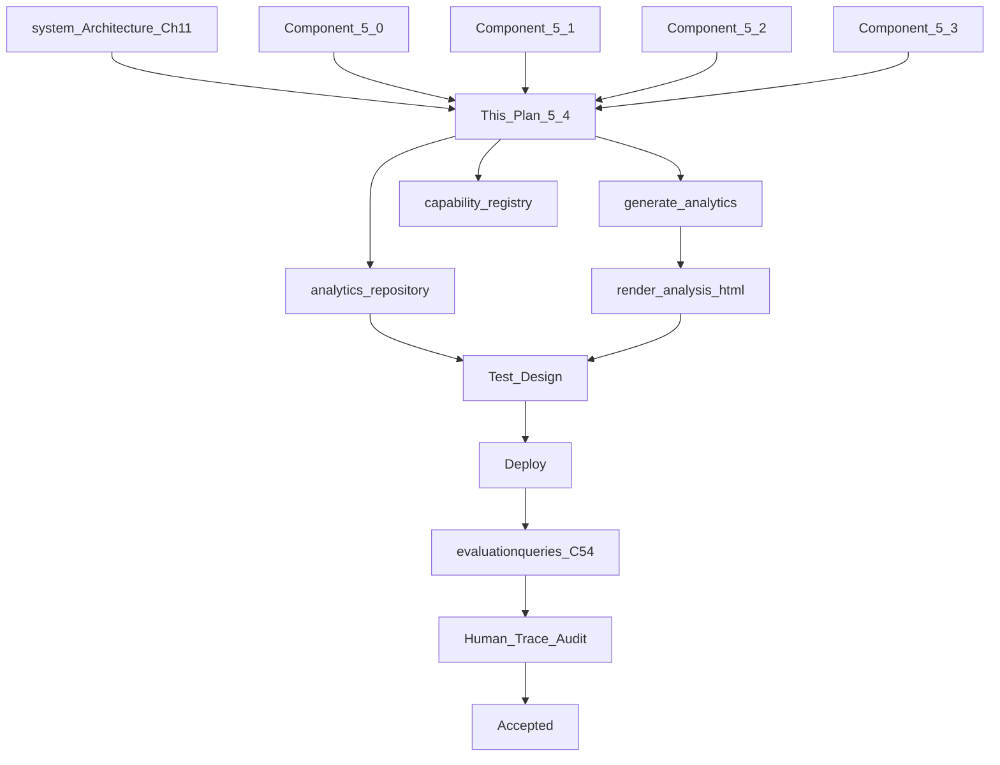
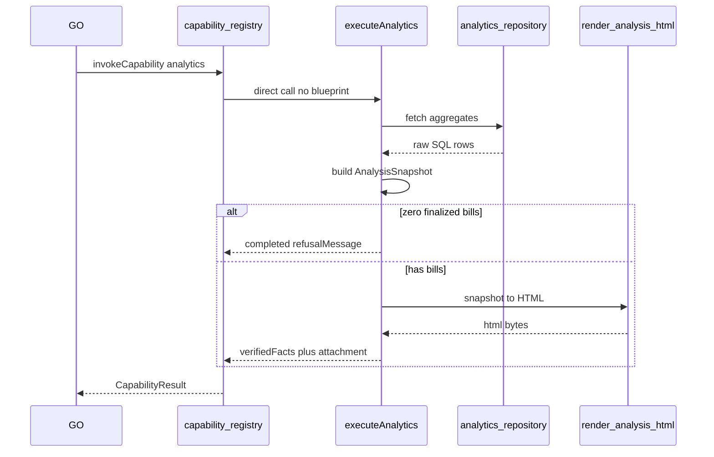

# Component 5.4 — Analytics Business Capability

**This document is the Goal Document for Component 5.4.** The implementing agent implements **this document only** — not chat history.

**Builds on:** [component_5.0_platform_8825a24c.plan.md](.cursor/plans/component_5.0_platform_8825a24c.plan.md) (registry, Capability blueprint, Decision/Response context slices, eval spine, attachment delivery); [component_5.1_inventory_f83e3e32.plan.md](.cursor/plans/component_5.1_inventory_f83e3e32.plan.md) (inventory schema, low-stock, `refusalMessage`); [component_5.2_billing_793dda55.plan.md](.cursor/plans/component_5.2_billing_793dda55.plan.md) (finalized bills/lines, HTML invoice artifact pattern, `artifactsEnabled` — **analytics overrides attachment gate**); [component_5.3_khata_orchestration.plan.md](.cursor/plans/component_5.3_khata_orchestration.plan.md) (khata ledger, `credit_sale` vs `manual_credit`, cross-domain read-only access).

**Architecture references:** [docs/system_Architecture.md](docs/system_Architecture.md) Ch 7 (BC pattern, artifact not a BC), Ch 11 (Analytics — **partially superseded**; see Part 0.3), B.6 (artifact ownership); [docs/Problem_Statement.md](docs/Problem_Statement.md) §3 daily close / analysis deck; [docs/verified-facts-and-grounded-response.md](docs/verified-facts-and-grounded-response.md); [docs/agent-traceability-and-agent-state.md](docs/agent-traceability-and-agent-state.md).

**Explicit non-goals:** PPTX production templates (5.5), `report_type` / period parameters, inner BC tool planner / Gemini inside analytics, analytics-owned SQLite tables, narrowing output by question wording, faithfulness bindings on artifact content, `artifactsEnabled` gate for analytics attachments.

---

## Part 0 — Engineering philosophy

- **Correctness over code elegance.** Acceptance is what traces and SQLite show — not style review.
- **Analytics is the blueprint exception.** Inventory, billing, and khata use [`createCapabilityExecutor`](src/capability-registry/capability-blueprint.ts). Analytics uses a **direct deterministic handler** — no inner LLM tool plan, no parameters, no plan-verify loop inside the BC.
- **Read-only cross-domain access.** Analytics may **read** billing, inventory, and khata tables via shared repositories. It must **never write** any business domain.
- **One output shape always.** Every analytics invocation produces the same complete analysis (six periods + shop-health snapshot). Owner phrasing ("today's sales", "close the day", "weekly deck") only affects GO **routing** to `analytics` — not tool parameters or report scope.
- **Chat is a teaser; artifact is the product.** Telegram text carries a short **daily** summary (~5–6 lines). The HTML attachment carries the full analysis with charts.
- **No LLM inside Analytics.** All numbers from SQL aggregations; all chart geometry from code; optional one-line deterministic callouts in HTML only ("Maggi led sales at ₹X").
- **Premium artifact, lazy routing.** Implementation is intentionally parameterless and always full-scope; the HTML layout must still look deliberate (typography, sectioning, SVG/CSS charts) — not a raw data dump.
- **Agent state vs artifact bytes.** Daily summary scalars go in `verifiedFacts` for faithfulness. Artifact bytes live in `CapabilityResult.attachments` → GO [`collectAttachments`](src/global-orchestrator/index.ts) → `ExecutionResult.attachments`. **Never** put artifact HTML or chart data in Fact Catalog or LLM context slices.
- **Production-first:** deploy → run `evaluationqueries.csv` C54 rows → export traces → human Pass/Fail.



---

## Part 0.1 — Mean / Do not mean (global)

| Mean | Do not mean |
|------|-------------|
| GO planner assigns `analytics` like any capability | Special planner mode or analytics-only GO branch before planning |
| Execution: `capabilityId === "analytics"` → direct `generate_analytics()` | Capability blueprint + inner Gemini tool planner |
| **Zero tool parameters** — objective description ignored for computation | `report_type`, `period`, `generateArtifact` enums |
| **Always full analysis** on every analytics invocation | Narrowing to "just GST" or "just today" in artifact |
| Six IST calendar periods + per-day rows in `current_week` | Rolling 7/30/365-day windows |
| `weekly` = last **complete** Mon–Sun week | Current in-progress week (that is `current_week`) |
| Chat summary = **today only** (~5–6 lines) | Full multi-period prose in Telegram |
| HTML attachment **always** when ≥1 finalized bill exists | Respect `shop_profile.artifactsEnabled` (billing rule does not apply) |
| Zero finalized bills → `completed` + `refusalMessage`, **no attachment** | Empty HTML shell attached |
| Khata outstanding in chat = **total shop udhar now** | Credits recorded today only |
| Faithfulness on daily summary scalars only | Bindings on artifact tables, charts, or weekly/monthly numbers |
| Cross-read via `analytics-repository.ts` | GO objectives to `query_bill` / `query_khata` / `query_inventory` |
| `AnalysisSnapshot` struct shared with 5.5 PPTX | Duplicate metric computation in 5.5 |
| Premium HTML with SVG/CSS charts in 5.4 | PPTX library in 5.4 |
| `refusalMessage` for empty shop | `error` or `clarification_needed` for no data |

---

## Part 0.2 — Reader's guide: what exists today

### 0.2.1 — What the system is

Telegram → Worker → Store Durable Object → GO [`orchestrate()`](src/global-orchestrator/index.ts): Plan → Execute → Decide → Respond. Business capabilities registered in [`capability-registry/index.ts`](src/capability-registry/index.ts).

### 0.2.2 — What Components 5.0–5.3 already built

| Area | Location | Relevance to 5.4 |
|------|----------|------------------|
| Registry | `capability-registry/` | `analytics` stub → `unavailable`; replace with real handler |
| Billing data | `billing_bills`, `billing_bill_lines` | Primary sales/GST/payment metrics |
| Inventory data | `inventory_products`, `reorder_level` | Low-stock health snapshot |
| Khata data | `khata_ledger_entries`, `khata_customers` | Outstanding udhar; period credits by `entry_type` |
| Attachment pipe | GO `collectAttachments`, billing `finalize_bill` | Same pattern for analysis HTML |
| Faithfulness | `*-fact-registry.ts` per BC | Add `analytics-fact-registry.ts` |
| IST / timezone | None in schema today | **Hardcode Asia/Kolkata** in analytics period math |

### 0.2.3 — Superseded architecture (Ch 11)

| Prior architecture text | 5.4 truth |
|---------------------------|-----------|
| "Reporting period must be explicitly identified" | All six periods always computed from generation timestamp |
| Inner agent optional | **No inner agent** — direct executor |
| PPTX from Analytics tool | **HTML in 5.4**; PPTX template in 5.5 using same snapshot |
| Tool parameters for report kind | **No parameters** |

---

## Part 1 — Problem statement

| # | Problem | Evidence today | 5.4 fix |
|---|---------|----------------|---------|
| P1 | Analytics is `unavailable` stub | [`capability-registry/index.ts`](src/capability-registry/index.ts) `analytics` handler | Real direct executor |
| P2 | No sales summary / daily close | Problem Statement §3 | `generate_analytics` with IST period rollups |
| P3 | No analysis artifact | Problem Statement §3 PPTX deck; recording script | Premium HTML attachment (5.5 → PPTX) |
| P4 | Owner cannot get shop-wide metrics | No read path across billing + inventory + khata | `analytics-repository` aggregations |
| P5 | No analytics faithfulness | No `analytics-fact-registry.ts` | Daily summary scalars in Fact Catalog |
| P6 | No C54 eval rows | [`evaluationqueries.csv`](evaluationqueries.csv) ends at C53 | Add C54 walkthroughs |

---

## Part 2 — Locked architectural decisions

### 2.1 — Execution path (blueprint exception)

When [`invokeCapability`](src/capability-registry/index.ts) runs `analytics`:

1. **Do not** call `createCapabilityExecutor` / `planTools` / Gemini.
2. Call `executeAnalytics(objective, ctx, db)` in [`src/analytics/index.ts`](src/analytics/index.ts).
3. `objective.description` is **ignored for computation** (retained only for traces and GO diagnostics).
4. Return `CapabilityResult` directly: `completed` with `verifiedFacts` + optional `attachments`, or `completed` + `refusalMessage` when empty.



### 2.2 — Single tool (exact id)

| Tool id | Parameters | Purpose |
|---------|------------|---------|
| `generate_analytics` | **none** | Fetch all data, compute all periods, render HTML artifact, return daily summary facts |

Register `toolSurface: ["generate_analytics"]` on registry entry for Decision context only. Tool is never LLM-planned.

### 2.3 — Timezone and period windows (IST, calendar)

All boundaries use **Asia/Kolkata**. `finalized_at` on bills is compared after normalizing to IST calendar windows.

| Period id | Window (inclusive start, exclusive end of "now" slice) |
|-----------|--------------------------------------------------------|
| `daily` | Today 00:00:00 IST → generation time |
| `current_week` | This Monday 00:00:00 IST → generation time; includes **per-day sub-rows** for each calendar day Mon…today |
| `weekly` | Last **complete** Mon 00:00 IST → Sun 23:59:59.999 IST (week before current week if today is mid-week) |
| `current_month` | 1st of this month 00:00 IST → generation time |
| `monthly` | 1st 00:00 IST → last day 23:59:59.999 IST of **previous** calendar month |
| `yearly` | Jan 1 this year 00:00 IST → generation time (YTD) |

**Example (Tuesday Aug 5, 2026 IST):**
- `daily` = Aug 5 only
- `current_week` = Aug 4 (Mon) + Aug 5 (Tue) as day rows + week totals
- `weekly` = Jul 28 Mon – Aug 3 Sun (last complete week)
- `current_month` = Aug 1 – Aug 5
- `monthly` = Jul 1 – Jul 31
- `yearly` = Jan 1 – Aug 5

Implement shared helpers: `getIstNow()`, `startOfIstDay()`, `startOfIstWeekMonday()`, `startOfIstMonth()`, `startOfIstYear()`, `previousCompleteWeekRange()`, `previousCompleteMonthRange()`.

### 2.4 — Metrics bundle (per period and per day-row)

Each period block (and each day within `current_week`) includes:

| Metric | Computation |
|--------|-------------|
| `total_sales_paise` | `SUM(grand_total_paise)` from `billing_bills` in window |
| `bill_count` | `COUNT(*)` finalized bills in window |
| `gst_collected_paise` | `SUM(cgst_total_paise + sgst_total_paise)` |
| `payment_cash_paise` / `payment_upi_paise` / `payment_khata_paise` | Group by `payment_method`; include counts |
| `khata_credits_in_period_paise` | Sum ledger **credit** amounts in window; split `credit_sale` vs `manual_credit` by `entry_type` |
| `top_items` | Top **5** by **revenue** (`SUM(line_total_paise)`), from `billing_bill_lines` joined to bills in window |
| `total_outstanding_udhar_paise` | **Point-in-time** shop-wide sum of latest `balance_after_paise` per customer (same value in all period sections — label clearly as "as of report time") |
| `low_stock_products` | Snapshot: active SKUs where `quantity_on_hand <= reorder_level` (not period-scoped) |

**Sales include khata bills:** `payment_method = khata` bills count in revenue and bill_count.

### 2.5 — Empty shop gate

If `COUNT(billing_bills) = 0` (no finalized bills ever):

- Return `status: "completed"` with `refusalMessage` e.g. "No sales recorded yet — nothing to analyze."
- **No** `attachments`, no `verifiedFacts` (or empty facts — prefer empty + `refusalMessage` for Response)
- Do **not** attach khata-only or inventory-only report

### 2.6 — Telegram chat summary (faithfulness scope)

When analysis succeeds, `verifiedFacts` carries **daily period only**:

- `today_total_sales_paise`
- `today_bill_count`
- `today_gst_collected_paise`
- `total_outstanding_udhar_paise` (shop-wide, as-of-now)
- `today_payment_cash_paise`, `today_payment_upi_paise`, `today_payment_khata_paise` (or omit zero modes)
- `analysis_attached: true`

Response generator may add prose: "See attached report for the full analysis." — **not** a separate fact; constitutional instruction in prompt is sufficient.

`refusalMessage` never enters Fact Catalog.

### 2.7 — Artifact policy (analytics-specific)

- **Always attach** HTML when analysis succeeds (bills exist).
- **Ignore** `shop_profile.artifactsEnabled` for analytics (locked override).
- Filename: `shop-analysis-YYYYMMDD-HHmm.html` (IST timestamp).
- `mimeType: "text/html"`; bytes via `TextEncoder` (mirror [`finalize-bill.ts`](src/billing/tools/finalize-bill.ts)).
- Attachment bytes **never** in `verifiedFacts`, agent state L1, or LLM prompts.

### 2.8 — HTML artifact (5.4 deliverable)

- New [`render-analysis-html.ts`](src/analytics/artifact/render-analysis-html.ts).
- Input: `AnalysisSnapshot` + `ShopProfileSnapshot` (shop name on cover).
- Sections: cover, daily, current week (table of days + week totals), weekly, current month, monthly, yearly, stock health, khata summary.
- **Charts (code-generated, no chart LLM):**
  - Payment split pie (SVG) per major period (at minimum: daily, current_week, monthly, yearly)
  - Top-items horizontal bar chart (SVG) for daily and monthly
  - Optional: current_week daily sales mini bar chart across day rows
- Use inline CSS for premium look: clear hierarchy, readable rupee formatting (reuse [`formatPaiseAsRupees`](src/billing/gst.ts) or extract shared formatter).
- `escapeHtml` on all text labels (mirror invoice renderer).

### 2.9 — `AnalysisSnapshot` (5.5 contract)

Locked TypeScript shape in [`src/analytics/types.ts`](src/analytics/types.ts) — **5.5 PPTX template consumes this unchanged**:

```typescript
interface PeriodMetrics {
  periodId: string;
  label: string;           // human label e.g. "Today", "Week of 28 Jul – 3 Aug"
  rangeStartIso: string;
  rangeEndIso: string;
  totalSalesPaise: number;
  billCount: number;
  gstCollectedPaise: number;
  paymentBreakdown: { cash: PaymentSlice; upi: PaymentSlice; khata: PaymentSlice };
  khataCreditsInPeriod: { creditSalePaise: number; manualCreditPaise: number };
  topItems: Array<{ sku: string; productName: string; revenuePaise: number; quantity: number }>;
  totalOutstandingUdharPaise: number; // as-of-now
}

interface DayRowMetrics { dateIso: string; /* same scalar subset as PeriodMetrics without top_items */ }

interface AnalysisSnapshot {
  generatedAtIso: string;
  shopName: string;
  daily: PeriodMetrics;
  currentWeek: PeriodMetrics & { days: DayRowMetrics[] };
  weekly: PeriodMetrics;
  currentMonth: PeriodMetrics;
  monthly: PeriodMetrics;
  yearly: PeriodMetrics;
  lowStockProducts: Array<{ sku: string; productName: string; quantityOnHand: number; reorderLevel: number }>;
}
```

### 2.10 — Registry and Decision context

Update [`capability-registry/index.ts`](src/capability-registry/index.ts):

- `analytics.implemented: true`
- `handler: executeAnalytics`
- `toolSurface: ["generate_analytics"]`
- `faithfulnessBuilder` → `analytics-fact-registry.ts`
- `resolveFaithfulnessBuilder("analytics")` branch

Extend [`getCapabilityContextForDecision`](src/capability-registry/index.ts): `analytics tools: generate_analytics`.

**No** GO planning constitution change beyond existing locked description (already lists daily close / weekly analysis).

### 2.11 — `not_supported` / wrong capability

If GO assigns a non-analytics objective to analytics (should not happen), handler may return `not_supported` — but with zero-parameter direct executor, typical failure is planner mis-route at GO layer. Low priority; document only.

---

## Part 3 — Persistence

### 3.1 — No new tables

Analytics is read-only. All queries against existing tables:

- `billing_bills`, `billing_bill_lines`
- `inventory_products`
- `khata_customers`, `khata_ledger_entries`

### 3.2 — New repository: `analytics-repository.ts`

Location: [`src/store-durable-object/persistence/repositories/analytics-repository.ts`](src/store-durable-object/persistence/repositories/analytics-repository.ts)

| Function | Purpose |
|----------|---------|
| `countFinalizedBills(db)` | Empty-shop gate |
| `aggregateBillsInRange(db, startIso, endIso)` | Sales, GST, bill count, payment breakdown |
| `aggregateTopItemsInRange(db, startIso, endIso, limit)` | Top N by revenue |
| `aggregateKhataCreditsInRange(db, startIso, endIso)` | Split by `entry_type` |
| `getTotalOutstandingUdharPaise(db)` | Latest balance per customer, summed |
| `listLowStockProducts(db)` | `quantity_on_hand <= reorder_level` |
| `aggregateBillsByIstDay(db, startIso, endIso)` | Per-day rows for `current_week` |

Use parameterized SQL / Drizzle queries. `finalized_at` stored as ISO text — filter with IST-normalized bounds (implementer may parse in app layer for clarity).

---

## Part 4 — Module layout

```text
src/analytics/
  index.ts                    # executeAnalytics — registry handler
  types.ts                    # AnalysisSnapshot, PeriodMetrics, DayRowMetrics
  period-boundaries.ts        # IST calendar helpers
  build-analysis-snapshot.ts  # orchestrates repo calls → AnalysisSnapshot
  generate-analytics.ts       # empty check → snapshot → render → CapabilityResult
  artifact/
    render-analysis-html.ts   # snapshot → premium HTML + SVG charts
    chart-helpers.ts          # SVG pie/bar generators from numbers
```

Repositories stay under `persistence/repositories/` per project convention.

---

## Part 5 — Implementation sequence

### 5.1 `period-boundaries.ts`

- Pure functions; unit-test heavily (Tuesday mid-week, month boundary, year boundary, Monday start of week).

### 5.2 `analytics-repository.ts`

- SQL aggregations; no business logic beyond grouping.

### 5.3 `build-analysis-snapshot.ts`

1. Compute all six period ranges from `getIstNow()`.
2. For each period, call repository aggregators.
3. For `current_week`, additionally call `aggregateBillsByIstDay` for Mon…today.
4. Attach `lowStockProducts` snapshot once on snapshot root.
5. `totalOutstandingUdharPaise` from `getTotalOutstandingUdharPaise` — duplicate into each `PeriodMetrics` for template convenience (same number).

### 5.4 `generate-analytics.ts`

1. If `countFinalizedBills === 0` → `{ status: "completed", refusalMessage }`.
2. Build `AnalysisSnapshot`.
3. Render HTML → attachment bytes.
4. Map `snapshot.daily` → `verifiedFacts` (§2.6).
5. Return `{ status: "completed", verifiedFacts, attachments: [{ filename, mimeType, bytes }] }`.

### 5.5 `executeAnalytics` in `index.ts`

- Append trace: `ANALYTICS_GENERATED` with period labels, bill counts, attachment filename (not bytes).
- Delegate to `generate-analytics.ts`.

### 5.6 Registry wiring

- Replace stub; wire faithfulness builder.
- Unit test: `invokeCapability("analytics", …)` does not call Gemini (mock/spy if needed).

---

## Part 6 — Faithfulness

New [`src/global-orchestrator/verified-facts/analytics-fact-registry.ts`](src/global-orchestrator/verified-facts/analytics-fact-registry.ts):

| Field | catalogLabel example |
|-------|---------------------|
| `today_total_sales_paise` | Today's total sales: ₹X |
| `today_bill_count` | Bills today: N |
| `today_gst_collected_paise` | GST collected today: ₹X |
| `total_outstanding_udhar_paise` | Total outstanding udhar: ₹X |
| `today_payment_*_paise` | Payment breakdown today |
| `analysis_attached` | Full analysis report attached |

- Tool name for registry: `generate_analytics`.
- Weekly/monthly/yearly metrics, top items lists, chart data → **not** in Fact Catalog.
- Update [`docs/verified-facts-and-grounded-response.md`](docs/verified-facts-and-grounded-response.md).

---

## Part 7 — Acceptance narratives (walkthroughs)

### W1 — Today's sales (after seeded bills today)

| Step | Expected |
|------|----------|
| Setup | ≥1 bill finalized today (reuse C52 seed path) |
| Owner: "today's sales?" | GO → single `analytics` objective |
| Trace | No BC tool-plan Gemini call; `ANALYTICS_GENERATED` |
| Telegram | Short daily summary + HTML attachment |
| Faithfulness | Bindings only on daily scalars |
| HTML | Open attachment: daily + all six sections present |

### W2 — Close the day (same output as W1)

| Step | Expected |
|------|----------|
| Owner: "close the day" | GO → `analytics` |
| Result | **Identical shape** to W1 — full analysis, not a separate "close" write |

### W3 — Weekly deck request (lazy full analysis)

| Step | Expected |
|------|----------|
| Owner: "make this week's sales analysis deck" | GO → `analytics` |
| Result | Same full HTML (includes weekly + current_week + all periods) |
| Note | No PPTX in 5.4; HTML stands in for deck proof |

### W4 — Empty shop

| Step | Expected |
|------|----------|
| Fresh store, no finalized bills | |
| Owner: "today's sales?" | GO → `analytics` |
| Result | `completed` + `refusalMessage`; **no** attachment |
| Response | Polite no-data message; no invented sales figures |

### W5 — Narrow question still full artifact

| Step | Expected |
|------|----------|
| Owner: "how much GST collected today?" | GO → `analytics` |
| Result | Daily summary in chat includes GST; attachment still full analysis |

---

## Part 8 — Evaluation spine

### 8.1 Add C54 rows to [`evaluationqueries.csv`](evaluationqueries.csv)

| ID | Scenario | Walkthrough | Notes |
|----|----------|-------------|-------|
| C54-001 | Daily sales query | W1 | After billing seed |
| C54-002 | Close the day | W2 | Same artifact shape as C54-001 |
| C54-003 | Weekly deck phrasing | W3 | HTML attachment, not PPTX |
| C54-004 | Empty shop | W4 | No attachment |
| C54-005 | Narrow GST question | W5 | Full artifact despite narrow ask |

### 8.2 Production validation

1. `npm test` green
2. `wrangler deploy`
3. Run C54 rows via eval script
4. Export traces; [`sql/agent-trace.sql`](sql/agent-trace.sql)
5. Human Pass on W1–W5 minimum

### 8.3 Rubric dimensions

- Routing: analytics objective, no inventory/billing conflation
- No inner LLM in analytics trace
- Attachment present when bills exist; absent when empty
- Daily summary grounded; no weekly numbers in chat without facts
- HTML opens in browser; charts render from real bill data
- `artifactsEnabled: false` on shop profile still attaches analytics HTML

---

## Part 9 — Test design

### 9.1 Unit tests (must pass)

| ID | Target |
|----|--------|
| PERIOD-01 | Tuesday IST → `weekly` is prior Mon–Sun, `current_week` includes Mon+Tue days |
| PERIOD-02 | First day of month → `monthly` is previous full month |
| PERIOD-03 | Jan 1 → `yearly` is single day; `monthly` is December |
| REPO-01 | `aggregateBillsInRange` sums match seeded bills |
| REPO-02 | Top items ordered by revenue |
| REPO-03 | Khata credits split `credit_sale` / `manual_credit` |
| REPO-04 | Outstanding udhar = sum of latest balances |
| SNAP-01 | `buildAnalysisSnapshot` populates all six periods |
| GEN-01 | Zero bills → refusal, no attachment |
| GEN-02 | With bills → attachment + daily verifiedFacts |
| GEN-03 | `artifactsEnabled: false` still attaches analytics |
| HTML-01 | Rendered HTML contains escaped product names |
| HTML-02 | SVG charts present when payment breakdown non-zero |
| REG-01 | `invokeCapability("analytics")` returns completed without blueprint |
| FAITH-01 | Fact registry emits daily fields only; no weekly in catalog |

### 9.2 Integration

- End-to-end: GO execute phase lifts analytics attachment to `ExecutionResult` (reuse billing attachment test pattern).

---

## Part 10 — Trace and docs

### 10.1 Trace payloads

- `ANALYTICS_GENERATED`: `generatedAtIso`, period labels, `billCount` per period (summary), `attachmentFilename`, `emptyShop: boolean`
- `CAPABILITY_STEP_COMPLETED` / execution summary: daily facts keys, `analysis_attached`

### 10.2 Docs updates

- [`docs/agent-traceability-and-agent-state.md`](docs/agent-traceability-and-agent-state.md): analytics direct executor diagram; artifact not in agent state
- [`docs/verified-facts-and-grounded-response.md`](docs/verified-facts-and-grounded-response.md): `generate_analytics` daily facts
- README: Component 5.4 eval; analytics attachment overrides `artifactsEnabled`; 5.5 PPTX pointer

---

## Part 11 — Acceptance criteria (stop only when all true)

- [ ] Analytics registry `implemented: true`; stub removed
- [ ] Direct executor — no blueprint / no inner Gemini for analytics
- [ ] `generate_analytics` — zero parameters; always full six-period analysis
- [ ] IST calendar period math with `current_week` day rows
- [ ] `analytics-repository.ts` read-only aggregations
- [ ] `AnalysisSnapshot` type exported for 5.5
- [ ] Premium HTML artifact with SVG/CSS charts
- [ ] Attachment always when bills exist; never when empty
- [ ] `artifactsEnabled` ignored for analytics
- [ ] `analytics-fact-registry.ts` — daily summary only
- [ ] W1–W5 pass in production traces
- [ ] C54 rows human rubric Pass
- [ ] Docs/README updated

---

## Part 12 — Carry forward to 5.5

- **PPTX template** maps `AnalysisSnapshot` → slides (same metrics, premium design).
- Replace `render-analysis-html.ts` with PPTX renderer or add parallel renderer; **do not** duplicate SQL.
- Billing PDF invoice polish remains in 5.5 separately.
- Optional: extract shared `formatPaiseAsRupees` to `src/shared/money.ts` if billing and analytics both need it.

---

## Part 13 — Architecture alignment note (for README)

Component 5.4 intentionally trades Ch 11 parameter flexibility for shipping speed: one deterministic report, always complete, owner finds detail in the attachment. This is a **documented product decision**, not an accidental shortcut.
